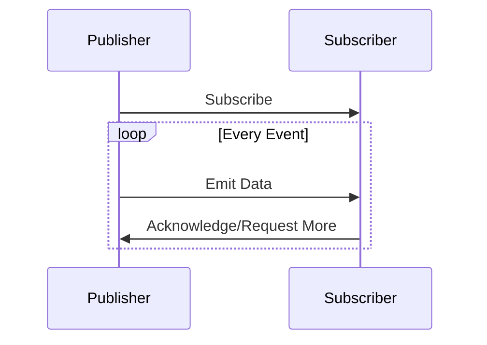

## 10.10.2 Asynchronous Data Streams

### Introduction

In the realm of modern software development, the ability to process data as streams of events is becoming increasingly crucial. Asynchronous data streams are at the heart of reactive programming, offering a paradigm shift from traditional synchronous processing. This section delves into the concept of asynchronous data streams, exploring how they enable efficient data handling and improve application responsiveness. We will examine the publisher-subscriber model, discuss the benefits of asynchronous processing, and provide practical examples using popular libraries like Project Reactor and RxJava.

### Understanding Asynchronous Data Streams

Asynchronous data streams allow applications to process data as it becomes available, rather than waiting for entire datasets to be ready. This approach is particularly beneficial in scenarios where data is generated continuously, such as sensor readings, user interactions, or network requests. By treating data as a stream of events, applications can react to changes in real-time, leading to more responsive and efficient systems.

#### Key Concepts

- **Event Streams**: A sequence of data items that are processed as they arrive. Each item in the stream is an event that can trigger specific actions.
- **Non-blocking I/O**: A mechanism that allows data to be read or written without blocking the execution of a program, enabling other tasks to proceed concurrently.
- **Backpressure**: A strategy to handle situations where the rate of data production exceeds the rate of consumption, preventing resource exhaustion.

### The Publisher-Subscriber Model

The publisher-subscriber model is a core component of asynchronous data streams. In this model, publishers emit data, while subscribers consume it. This decoupling of data production and consumption allows for greater flexibility and scalability.

#### Components

- **Publisher**: An entity that generates and emits data events. It defines the source of the data stream.
- **Subscriber**: An entity that listens for and processes data events emitted by the publisher.
- **Subscription**: A link between a publisher and a subscriber, allowing the subscriber to receive data events.



*Diagram: The interaction between a publisher and a subscriber in the publisher-subscriber model.*

### Implementing Asynchronous Data Streams in Java

Java offers several libraries for implementing asynchronous data streams, with Project Reactor and RxJava being two of the most prominent. These libraries provide powerful abstractions for handling data streams and managing asynchronous workflows.

#### Using Project Reactor

Project Reactor is a reactive programming library for building non-blocking applications on the JVM. It provides a rich set of operators for composing asynchronous data flows.

##### Example: Simple Data Stream with Project Reactor

```java
import reactor.core.publisher.Flux;

public class ReactorExample {
    public static void main(String[] args) {
        Flux<String> dataStream = Flux.just("Event1", "Event2", "Event3");

        dataStream.subscribe(
            data -> System.out.println("Received: " + data),
            error -> System.err.println("Error: " + error),
            () -> System.out.println("Stream completed")
        );
    }
}
```

*Explanation*: This example demonstrates a simple data stream using Project Reactor's `Flux`. The `subscribe` method is used to handle data, errors, and completion events.

#### Using RxJava

RxJava is another popular library for reactive programming in Java. It provides a comprehensive API for creating and managing asynchronous data streams.

##### Example: Simple Data Stream with RxJava

```java
import io.reactivex.rxjava3.core.Observable;

public class RxJavaExample {
    public static void main(String[] args) {
        Observable<String> dataStream = Observable.just("Event1", "Event2", "Event3");

        dataStream.subscribe(
            data -> System.out.println("Received: " + data),
            error -> System.err.println("Error: " + error),
            () -> System.out.println("Stream completed")
        );
    }
}
```

*Explanation*: Similar to the Project Reactor example, this RxJava example creates an `Observable` that emits a sequence of events. The `subscribe` method is used to process the data stream.

### Benefits of Asynchronous Data Streams

Asynchronous data streams offer several advantages over traditional synchronous processing:

- **Improved Resource Utilization**: By processing data as it arrives, applications can make better use of available resources, reducing idle time and increasing throughput.
- **Enhanced Responsiveness**: Applications can respond to events in real-time, providing a more interactive user experience.
- **Scalability**: The decoupled nature of the publisher-subscriber model allows applications to scale more easily, accommodating varying loads without significant architectural changes.

### Real-World Applications

Asynchronous data streams are widely used in various domains, including:

- **IoT Systems**: Processing sensor data in real-time to trigger alerts or actions.
- **Financial Services**: Monitoring stock prices and executing trades based on market events.
- **Web Applications**: Handling user interactions and server responses asynchronously to improve performance.

### Challenges and Considerations

While asynchronous data streams offer numerous benefits, they also present challenges:

- **Complexity**: Designing and debugging asynchronous systems can be more complex than traditional synchronous systems.
- **Error Handling**: Managing errors in asynchronous workflows requires careful consideration to ensure robustness.
- **Backpressure Management**: Implementing effective backpressure strategies is crucial to prevent resource exhaustion.

### Best Practices

To effectively implement asynchronous data streams, consider the following best practices:

- **Use Established Libraries**: Leverage libraries like Project Reactor and RxJava to simplify the implementation of asynchronous data streams.
- **Design for Scalability**: Architect your system to handle varying loads and accommodate future growth.
- **Implement Robust Error Handling**: Ensure that your system can gracefully handle errors and recover from failures.
- **Monitor and Optimize Performance**: Continuously monitor your system's performance and optimize as needed to maintain responsiveness and efficiency.

### Conclusion

Asynchronous data streams are a powerful tool for building responsive, scalable, and efficient applications. By embracing the publisher-subscriber model and leveraging libraries like Project Reactor and RxJava, developers can create systems that process data in real-time, enhancing user experiences and optimizing resource utilization. As you explore the world of asynchronous data streams, consider how these concepts can be applied to your own projects to unlock new levels of performance and scalability.

---

## Test Your Knowledge: Asynchronous Data Streams in Java



### What is the primary advantage of using asynchronous data streams?

- [x] Improved responsiveness and resource utilization
- [ ] Simplified error handling
- [ ] Reduced code complexity
- [ ] Increased data security

> **Explanation:** Asynchronous data streams allow applications to process data as it arrives, improving responsiveness and making better use of resources.

### Which model is central to asynchronous data streams?

- [x] Publisher-Subscriber model
- [ ] Client-Server model
- [ ] Peer-to-Peer model
- [ ] Master-Slave model

> **Explanation:** The publisher-subscriber model is central to asynchronous data streams, allowing for decoupled data production and consumption.

### What is backpressure in the context of asynchronous data streams?

- [x] A strategy to manage data flow when production exceeds consumption
- [ ] A method for encrypting data streams
- [ ] A technique for compressing data
- [ ] A way to prioritize certain data events

> **Explanation:** Backpressure is a strategy used to handle situations where the rate of data production exceeds the rate of consumption, preventing resource exhaustion.

### Which Java library is commonly used for implementing reactive programming?

- [x] Project Reactor
- [ ] Apache Commons
- [ ] JUnit
- [ ] Log4j

> **Explanation:** Project Reactor is a popular library for implementing reactive programming in Java, providing tools for handling asynchronous data streams.

### What is a key benefit of the publisher-subscriber model?

- [x] Decoupling of data production and consumption
- [ ] Simplified data encryption
- [x] Scalability and flexibility
- [ ] Reduced memory usage

> **Explanation:** The publisher-subscriber model decouples data production and consumption, allowing for greater scalability and flexibility.

### Which of the following is a challenge when working with asynchronous data streams?

- [x] Complexity in design and debugging
- [ ] Limited scalability
- [ ] Poor performance
- [ ] Lack of libraries

> **Explanation:** Designing and debugging asynchronous systems can be more complex than traditional synchronous systems.

### How can you handle errors in asynchronous workflows?

- [x] Implement robust error handling strategies
- [ ] Ignore errors to maintain performance
- [x] Use established libraries for error management
- [ ] Rely on synchronous processing

> **Explanation:** Implementing robust error handling strategies and using established libraries can help manage errors in asynchronous workflows.

### What is a common use case for asynchronous data streams?

- [x] Real-time processing of IoT sensor data
- [ ] Batch processing of large datasets
- [ ] Static website hosting
- [ ] Offline data analysis

> **Explanation:** Asynchronous data streams are commonly used for real-time processing of IoT sensor data, allowing for immediate reactions to changes.

### Which method is used to subscribe to a data stream in Project Reactor?

- [x] subscribe()
- [ ] connect()
- [ ] listen()
- [ ] attach()

> **Explanation:** The `subscribe()` method is used in Project Reactor to listen for and process data events in a stream.

### True or False: Asynchronous data streams can improve application scalability.

- [x] True
- [ ] False

> **Explanation:** True. Asynchronous data streams improve application scalability by decoupling data production and consumption, allowing systems to handle varying loads more effectively.


