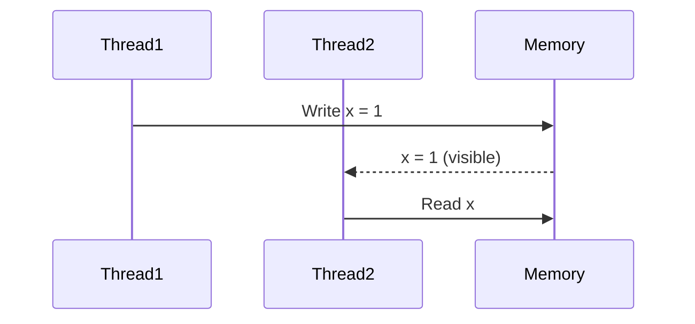
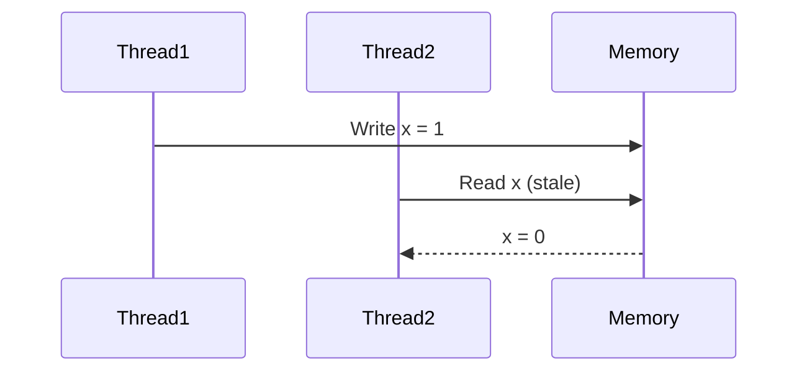

## 10.2 The Java Memory Model and Thread Behavior

### Introduction

The Java Memory Model (JMM) is a critical component of the Java programming language, defining how threads interact with memory. Understanding the JMM is essential for writing correct and efficient concurrent programs. This section delves into the intricacies of the JMM, exploring key concepts such as visibility, atomicity, ordering, and the "happens-before" relationship. We will also examine how constructs like `volatile` variables, `synchronized` blocks, and atomic variables influence thread behavior and memory visibility.

### The Purpose of the Java Memory Model

The JMM provides a framework for understanding how Java threads interact with memory. It specifies the rules by which changes to memory made by one thread become visible to other threads. The JMM is crucial for ensuring that concurrent programs behave predictably and correctly, even on multiprocessor systems where memory operations may not be immediately visible across all processors.

### Key Concepts of the Java Memory Model

#### Visibility

Visibility refers to the ability of one thread to see the effects of another thread's operations on memory. In the absence of proper synchronization, changes made by one thread may not be visible to others, leading to stale data and inconsistent program behavior.

#### Atomicity

Atomicity ensures that a series of operations are completed as a single, indivisible unit. In Java, operations on primitive data types like `int` and `boolean` are atomic, but compound operations (e.g., incrementing a variable) are not. Without atomicity, threads may observe intermediate states, leading to race conditions.

#### Ordering

Ordering dictates the sequence in which operations are executed. The JMM allows certain reordering of instructions for optimization purposes, but it guarantees that certain operations will appear in a specific order to other threads. This is where the "happens-before" relationship comes into play.

#### The "Happens-Before" Relationship

The "happens-before" relationship is a fundamental concept in the JMM, establishing a partial ordering of operations. If one action happens-before another, the first is visible and ordered before the second. This relationship is crucial for reasoning about concurrent programs and ensuring correct synchronization.

### Common Concurrency Bugs

Improper understanding of the JMM can lead to various concurrency bugs, including:

- **Stale Data**: When a thread reads outdated data due to lack of proper synchronization.
- **Race Conditions**: When multiple threads access shared data simultaneously, leading to unpredictable results.
- **Deadlocks**: When two or more threads are blocked forever, waiting for each other to release resources.

### Influencing Thread Behavior and Memory Visibility

#### Volatile Variables

The `volatile` keyword in Java is used to indicate that a variable's value will be modified by different threads. Declaring a variable as `volatile` ensures that its value is always read from and written to main memory, providing visibility guarantees.

```java
public class VolatileExample {
    private volatile boolean flag = false;

    public void writer() {
        flag = true;
    }

    public void reader() {
        if (flag) {
            // Do something
        }
    }
}
```

In this example, the `flag` variable is declared as `volatile`, ensuring that changes made by one thread are immediately visible to others.

#### Synchronized Blocks

The `synchronized` keyword is used to control access to a block of code or an entire method, ensuring that only one thread can execute the synchronized block at a time. This provides both visibility and atomicity guarantees.

```java
public class SynchronizedExample {
    private int count = 0;

    public synchronized void increment() {
        count++;
    }

    public synchronized int getCount() {
        return count;
    }
}
```

Here, the `increment` and `getCount` methods are synchronized, ensuring that updates to the `count` variable are atomic and visible to all threads.

#### Atomic Variables

Java provides a set of classes in the `java.util.concurrent.atomic` package that support lock-free, thread-safe operations on single variables. These classes, such as `AtomicInteger` and `AtomicBoolean`, provide atomic operations without the need for explicit synchronization.

```java
import java.util.concurrent.atomic.AtomicInteger;

public class AtomicExample {
    private AtomicInteger count = new AtomicInteger(0);

    public void increment() {
        count.incrementAndGet();
    }

    public int getCount() {
        return count.get();
    }
}
```

In this example, the `AtomicInteger` class is used to perform atomic increments on the `count` variable.

### Practical Applications and Real-World Scenarios

Understanding the JMM is crucial for developing robust concurrent applications. Consider a scenario where multiple threads are updating a shared counter. Without proper synchronization, threads may read stale values or overwrite each other's updates, leading to incorrect results. By using `volatile` variables, synchronized blocks, or atomic variables, developers can ensure that updates are visible and atomic, preventing concurrency bugs.

### Visualizing Memory Visibility and Thread Interactions

To better understand the concepts discussed, let's visualize memory visibility issues and thread interactions using diagrams.



**Diagram 1**: This sequence diagram illustrates how a write operation by `Thread1` becomes visible to `Thread2` through memory.



**Diagram 2**: This sequence diagram shows a scenario where `Thread2` reads a stale value of `x` due to lack of synchronization.

### Best Practices for Writing Thread-Safe Code

- **Use `volatile` for simple flags**: When a variable is used as a simple flag or state indicator, consider using `volatile` to ensure visibility.
- **Synchronize access to shared resources**: Use synchronized blocks or methods to control access to shared resources and ensure atomicity.
- **Leverage atomic variables**: For single-variable operations, use atomic classes to achieve thread safety without explicit synchronization.
- **Understand the "happens-before" relationship**: Use this relationship to reason about the visibility and ordering of operations in your code.

### Conclusion

The Java Memory Model is a complex but essential aspect of concurrent programming in Java. By understanding the JMM and its key concepts, developers can write thread-safe code that behaves predictably and efficiently. Proper use of `volatile` variables, synchronized blocks, and atomic variables can help prevent common concurrency bugs and ensure that your programs run correctly on modern multiprocessor systems.

### Exercises and Practice Problems

1. **Exercise 1**: Modify the `VolatileExample` class to include a counter that is incremented by multiple threads. Use `volatile` and observe the behavior.
2. **Exercise 2**: Implement a thread-safe counter using synchronized methods and compare its performance with an implementation using `AtomicInteger`.
3. **Exercise 3**: Create a scenario where two threads deadlock each other. Analyze the cause and propose a solution.

### Key Takeaways

- The Java Memory Model defines how threads interact with memory, ensuring visibility, atomicity, and ordering of operations.
- Understanding the JMM is crucial for writing correct and efficient concurrent programs.
- Use `volatile`, synchronized blocks, and atomic variables to influence thread behavior and memory visibility.
- Proper synchronization prevents common concurrency bugs like stale data and race conditions.

### Reflection

Consider how you might apply the concepts of the JMM to your own projects. How can understanding thread behavior and memory visibility improve the reliability and performance of your concurrent applications?

## Test Your Knowledge: Java Memory Model and Thread Behavior Quiz



### What is the primary purpose of the Java Memory Model?

- [x] To define how threads interact with memory
- [ ] To optimize memory usage
- [ ] To manage garbage collection
- [ ] To improve CPU performance

> **Explanation:** The Java Memory Model defines the rules for how threads interact with memory, ensuring visibility and ordering of operations.

### Which keyword ensures that a variable's value is always read from main memory?

- [x] volatile
- [ ] synchronized
- [ ] transient
- [ ] static

> **Explanation:** The `volatile` keyword ensures that a variable's value is always read from and written to main memory, providing visibility guarantees.

### What does the "happens-before" relationship guarantee?

- [x] Visibility and ordering of operations
- [ ] Atomicity of operations
- [ ] Memory allocation
- [ ] Thread priority

> **Explanation:** The "happens-before" relationship guarantees that one operation is visible and ordered before another, ensuring correct synchronization.

### Which of the following is NOT a common concurrency bug?

- [ ] Stale Data
- [x] Memory Leak
- [ ] Race Condition
- [ ] Deadlock

> **Explanation:** A memory leak is not a concurrency bug; it occurs when memory is not properly released.

### How do atomic variables differ from synchronized blocks?

- [x] They provide lock-free thread safety
- [ ] They are slower
- [x] They require explicit locks
- [ ] They are only for primitive types

> **Explanation:** Atomic variables provide lock-free thread safety and do not require explicit locks, unlike synchronized blocks.

### What is the effect of using the `synchronized` keyword?

- [x] It controls access to a block of code or method
- [ ] It makes variables immutable
- [ ] It improves performance
- [ ] It prevents memory leaks

> **Explanation:** The `synchronized` keyword controls access to a block of code or method, ensuring that only one thread can execute it at a time.

### Which package provides classes for atomic operations?

- [x] java.util.concurrent.atomic
- [ ] java.lang
- [ ] java.io
- [ ] java.util

> **Explanation:** The `java.util.concurrent.atomic` package provides classes for atomic operations on single variables.

### What is a race condition?

- [x] When multiple threads access shared data simultaneously
- [ ] When a thread is blocked forever
- [ ] When memory is not released
- [ ] When a variable is not initialized

> **Explanation:** A race condition occurs when multiple threads access shared data simultaneously, leading to unpredictable results.

### Which of the following is a benefit of using `volatile` variables?

- [x] They ensure visibility of changes across threads
- [ ] They improve performance
- [ ] They provide atomicity
- [ ] They prevent deadlocks

> **Explanation:** `Volatile` variables ensure that changes made by one thread are immediately visible to others, providing visibility guarantees.

### True or False: The Java Memory Model allows certain reordering of instructions for optimization.

- [x] True
- [ ] False

> **Explanation:** The Java Memory Model allows certain reordering of instructions for optimization, but it guarantees that certain operations will appear in a specific order to other threads.


