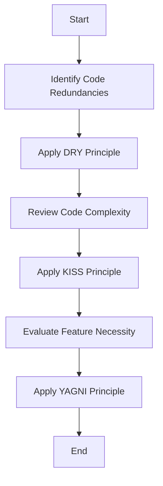

## 10.2 DRY, KISS, and YAGNI

In the realm of software engineering, particularly in Java development, adhering to core principles like DRY (Don't Repeat Yourself), KISS (Keep It Simple, Stupid), and YAGNI (You Aren't Gonna Need It) can significantly enhance code quality. These principles guide developers toward writing more maintainable, efficient, and scalable code. Let's delve into each principle, explore practical implementation strategies, and understand their synergy with design patterns.

### Understanding the Principles

#### DRY (Don't Repeat Yourself)

**Definition**: The DRY principle emphasizes the reduction of repetition within code. It advocates for a single, unambiguous representation of every piece of knowledge within a system.

**Relevance**: By minimizing redundancy, DRY helps prevent inconsistencies and reduces the effort required for code maintenance. It ensures that changes in one part of the system propagate correctly without the need for multiple updates.

**Practical Implementation Tips**:
- **Modularize Code**: Break down code into reusable modules or functions.
- **Use Inheritance and Interfaces**: Leverage Java's object-oriented features to encapsulate common behavior.
- **Centralize Configuration**: Store configuration data in a single location, such as a properties file or environment variables.

**Code Example**:

Before applying DRY:

```java
public class UserService {
    public void createUser(String name, String email) {
        // Database connection setup
        Connection conn = DriverManager.getConnection("jdbc:mysql://localhost:3306/mydb", "user", "password");
        // SQL query execution
        String query = "INSERT INTO users (name, email) VALUES (?, ?)";
        PreparedStatement stmt = conn.prepareStatement(query);
        stmt.setString(1, name);
        stmt.setString(2, email);
        stmt.executeUpdate();
    }

    public void updateUser(int id, String name, String email) {
        // Database connection setup
        Connection conn = DriverManager.getConnection("jdbc:mysql://localhost:3306/mydb", "user", "password");
        // SQL query execution
        String query = "UPDATE users SET name = ?, email = ? WHERE id = ?";
        PreparedStatement stmt = conn.prepareStatement(query);
        stmt.setString(1, name);
        stmt.setString(2, email);
        stmt.setInt(3, id);
        stmt.executeUpdate();
    }
}
```

After applying DRY:

```java
public class UserService {
    private Connection getConnection() throws SQLException {
        return DriverManager.getConnection("jdbc:mysql://localhost:3306/mydb", "user", "password");
    }

    public void createUser(String name, String email) throws SQLException {
        try (Connection conn = getConnection()) {
            String query = "INSERT INTO users (name, email) VALUES (?, ?)";
            PreparedStatement stmt = conn.prepareStatement(query);
            stmt.setString(1, name);
            stmt.setString(2, email);
            stmt.executeUpdate();
        }
    }

    public void updateUser(int id, String name, String email) throws SQLException {
        try (Connection conn = getConnection()) {
            String query = "UPDATE users SET name = ?, email = ? WHERE id = ?";
            PreparedStatement stmt = conn.prepareStatement(query);
            stmt.setString(1, name);
            stmt.setString(2, email);
            stmt.setInt(3, id);
            stmt.executeUpdate();
        }
    }
}
```

**Benefits**: The code is now more maintainable, with the database connection logic centralized in a single method.

#### KISS (Keep It Simple, Stupid)

**Definition**: The KISS principle advocates for simplicity in design and implementation. It suggests that systems work best when they are kept simple rather than made complex.

**Relevance**: Simplicity leads to easier understanding, testing, and maintenance of code. It reduces the likelihood of errors and makes the system more robust.

**Practical Implementation Tips**:
- **Avoid Over-Engineering**: Implement only what is necessary to meet the requirements.
- **Use Clear Naming Conventions**: Choose descriptive names for variables, methods, and classes.
- **Refactor Complex Code**: Break down complex methods into smaller, more manageable pieces.

**Code Example**:

Before applying KISS:

```java
public class Calculator {
    public double calculate(String operation, double a, double b) {
        if (operation.equals("add")) {
            return a + b;
        } else if (operation.equals("subtract")) {
            return a - b;
        } else if (operation.equals("multiply")) {
            return a * b;
        } else if (operation.equals("divide")) {
            if (b != 0) {
                return a / b;
            } else {
                throw new IllegalArgumentException("Cannot divide by zero");
            }
        } else {
            throw new UnsupportedOperationException("Operation not supported");
        }
    }
}
```

After applying KISS:

```java
public class Calculator {
    public double add(double a, double b) {
        return a + b;
    }

    public double subtract(double a, double b) {
        return a - b;
    }

    public double multiply(double a, double b) {
        return a * b;
    }

    public double divide(double a, double b) {
        if (b == 0) {
            throw new IllegalArgumentException("Cannot divide by zero");
        }
        return a / b;
    }
}
```

**Benefits**: The refactored code is simpler, with each operation clearly defined in its own method, making it easier to understand and maintain.

#### YAGNI (You Aren't Gonna Need It)

**Definition**: YAGNI is a principle that advises against implementing features until they are actually needed.

**Relevance**: By avoiding unnecessary features, developers can focus on delivering value and reduce the complexity of the codebase.

**Practical Implementation Tips**:
- **Prioritize Requirements**: Focus on the core functionality required by the user.
- **Iterative Development**: Build and test features incrementally.
- **Avoid Speculative Generality**: Do not add hooks or extensibility points unless there is a clear, immediate need.

**Code Example**:

Before applying YAGNI:

```java
public class ReportGenerator {
    public void generateReport(String type) {
        if (type.equals("PDF")) {
            // Generate PDF report
        } else if (type.equals("Excel")) {
            // Generate Excel report
        } else if (type.equals("HTML")) {
            // Generate HTML report
        } else if (type.equals("XML")) {
            // Generate XML report
        } else {
            throw new UnsupportedOperationException("Report type not supported");
        }
    }
}
```

After applying YAGNI:

```java
public class ReportGenerator {
    public void generateReport(String type) {
        if (type.equals("PDF")) {
            // Generate PDF report
        } else if (type.equals("Excel")) {
            // Generate Excel report
        } else {
            throw new UnsupportedOperationException("Report type not supported");
        }
    }
}
```

**Benefits**: The code is streamlined to support only the necessary report types, reducing complexity and potential maintenance overhead.

### Relationship with Design Patterns

Design patterns can be powerful tools in adhering to DRY, KISS, and YAGNI principles. Let's explore how:

- **DRY and Design Patterns**: Patterns like Singleton, Factory, and Strategy help encapsulate common behavior and promote code reuse, aligning with DRY principles.
- **KISS and Design Patterns**: Patterns such as Facade and Adapter simplify complex systems by providing clear interfaces, adhering to KISS.
- **YAGNI and Design Patterns**: Patterns like Proxy and Decorator allow for extending functionality only when needed, supporting YAGNI.

### Common Misconceptions

1. **DRY Means No Duplication at All**: While DRY aims to reduce redundancy, it doesn't mean eliminating all duplication. Sometimes, a small amount of duplication can improve readability and maintainability.
   
2. **KISS Equals Oversimplification**: KISS is about avoiding unnecessary complexity, not oversimplifying to the point of losing essential functionality.

3. **YAGNI Discourages Planning**: YAGNI doesn't mean avoiding planning. It encourages focusing on current needs while being open to future changes.

### Benefits of Adoption

Adopting DRY, KISS, and YAGNI principles leads to:

- **Improved Readability**: Code is easier to read and understand, facilitating collaboration.
- **Enhanced Maintainability**: Reduced complexity and redundancy make maintaining and updating code simpler.
- **Reduced Technical Debt**: By focusing on essential features and avoiding over-engineering, technical debt is minimized.

### Visualizing the Principles

To better understand the impact of these principles, let's visualize them in a flowchart:



**Diagram Description**: This flowchart illustrates the process of applying DRY, KISS, and YAGNI principles to enhance code quality. Starting with identifying redundancies, it guides through simplifying complexity and evaluating feature necessity.

### Try It Yourself

Experiment with the provided code examples by:

- **Refactoring**: Identify and refactor any redundant code in your projects.
- **Simplifying**: Break down complex methods into smaller, more manageable functions.
- **Evaluating Features**: Review your codebase for unnecessary features and remove them.

### Knowledge Check

- **Question**: How can you apply the DRY principle in a Java project?
- **Challenge**: Refactor a piece of code to reduce redundancy and improve maintainability.

### Embrace the Journey

Remember, mastering these principles is a journey. As you continue to apply DRY, KISS, and YAGNI, you'll find your code becoming more efficient and easier to manage. Keep experimenting, stay curious, and enjoy the process of refining your craft!

## Quiz Time!



### Which principle emphasizes reducing code redundancy?

- [x] DRY
- [ ] KISS
- [ ] YAGNI
- [ ] SOLID

> **Explanation:** DRY stands for "Don't Repeat Yourself" and focuses on reducing redundancy in code.

### What does KISS stand for?

- [x] Keep It Simple, Stupid
- [ ] Keep It Smart, Simple
- [ ] Keep It Safe, Secure
- [ ] Keep It Short, Simple

> **Explanation:** KISS stands for "Keep It Simple, Stupid," emphasizing simplicity in design.

### Which principle advises against implementing features until they are needed?

- [ ] DRY
- [ ] KISS
- [x] YAGNI
- [ ] SOLID

> **Explanation:** YAGNI stands for "You Aren't Gonna Need It," advising against implementing unnecessary features.

### How can design patterns help achieve DRY?

- [x] By encapsulating common behavior
- [ ] By simplifying complex systems
- [ ] By avoiding unnecessary features
- [ ] By planning for future changes

> **Explanation:** Design patterns like Singleton and Factory encapsulate common behavior, promoting code reuse and aligning with DRY.

### What is a common misconception about KISS?

- [x] It leads to oversimplification
- [ ] It encourages complexity
- [ ] It discourages planning
- [ ] It eliminates all duplication

> **Explanation:** A common misconception is that KISS leads to oversimplification, but it actually focuses on avoiding unnecessary complexity.

### Which principle is most closely related to avoiding over-engineering?

- [ ] DRY
- [ ] KISS
- [x] YAGNI
- [ ] SOLID

> **Explanation:** YAGNI advises against implementing features until they are needed, helping to avoid over-engineering.

### What benefit does adopting DRY, KISS, and YAGNI principles provide?

- [x] Improved readability
- [ ] Increased complexity
- [ ] More technical debt
- [ ] Less maintainability

> **Explanation:** Adopting these principles improves code readability, maintainability, and reduces technical debt.

### How can KISS be applied in code?

- [x] By breaking down complex methods
- [ ] By adding more features
- [ ] By duplicating code
- [ ] By ignoring simplicity

> **Explanation:** KISS can be applied by breaking down complex methods into smaller, more manageable functions.

### Which principle focuses on delivering value by avoiding unnecessary features?

- [ ] DRY
- [ ] KISS
- [x] YAGNI
- [ ] SOLID

> **Explanation:** YAGNI focuses on delivering value by avoiding unnecessary features and complexity.

### True or False: DRY means eliminating all duplication in code.

- [ ] True
- [x] False

> **Explanation:** DRY aims to reduce redundancy, but some duplication may be necessary for readability and maintainability.


