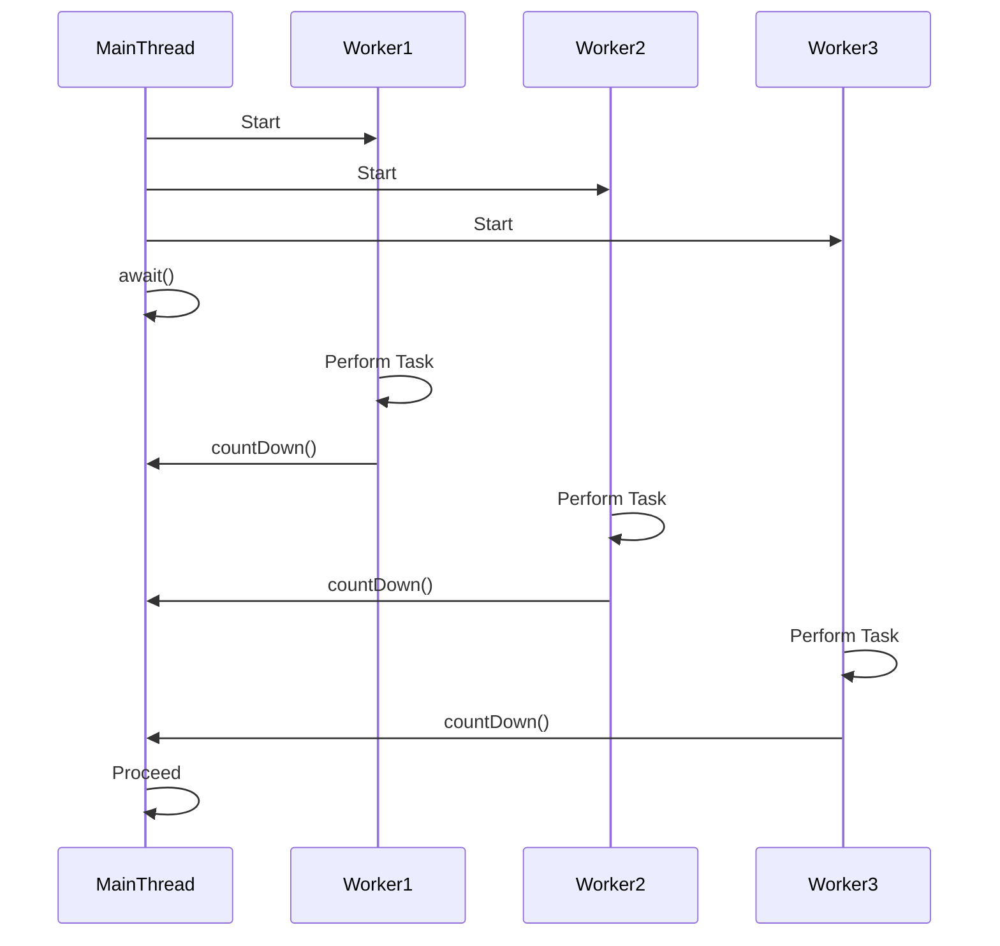

## 10.3.3.1 CountDownLatch

### Introduction to CountDownLatch

In the realm of Java concurrency, the `CountDownLatch` is a powerful synchronization aid that allows one or more threads to wait until a set of operations being performed in other threads completes. This utility is part of the `java.util.concurrent` package, which provides a rich set of tools for managing concurrent programming challenges. Understanding `CountDownLatch` is crucial for developers aiming to build robust, efficient, and thread-safe applications.

### How CountDownLatch Works

The `CountDownLatch` operates by maintaining a count, which is initialized through its constructor. Threads can wait for this count to reach zero by invoking the `await()` method. Meanwhile, other threads can decrease the count by calling the `countDown()` method. Once the count reaches zero, all waiting threads are released and can proceed with their execution.

#### Key Methods

- **`CountDownLatch(int count)`**: Constructs a `CountDownLatch` initialized with the given count.
- **`void await()`**: Causes the current thread to wait until the latch has counted down to zero.
- **`void countDown()`**: Decreases the count of the latch, releasing all waiting threads if the count reaches zero.
- **`long getCount()`**: Returns the current count.

### Typical Use Cases

`CountDownLatch` is particularly useful in scenarios where a thread needs to wait for multiple operations to complete before proceeding. Common use cases include:

- **Starting a service only after all prerequisites are ready**: For instance, a server might wait for multiple configuration files to be loaded before starting.
- **Waiting for multiple threads to complete**: In a testing environment, a main thread might wait for several worker threads to finish processing before aggregating results.
- **Simulating concurrent activities**: Useful in testing scenarios where you need to simulate multiple threads starting at the same time.

### Code Example: Using CountDownLatch

Consider a scenario where a main thread waits for three worker threads to complete their tasks before proceeding.

```java
import java.util.concurrent.CountDownLatch;

public class CountDownLatchExample {
    public static void main(String[] args) {
        final int numberOfWorkers = 3;
        CountDownLatch latch = new CountDownLatch(numberOfWorkers);

        for (int i = 0; i < numberOfWorkers; i++) {
            new Thread(new Worker(latch)).start();
        }

        try {
            System.out.println("Main thread waiting for workers to complete...");
            latch.await(); // Main thread waits here
            System.out.println("All workers have completed. Main thread proceeding.");
        } catch (InterruptedException e) {
            e.printStackTrace();
        }
    }
}

class Worker implements Runnable {
    private final CountDownLatch latch;

    public Worker(CountDownLatch latch) {
        this.latch = latch;
    }

    @Override
    public void run() {
        try {
            // Simulate work
            System.out.println(Thread.currentThread().getName() + " is working...");
            Thread.sleep((long) (Math.random() * 1000));
            System.out.println(Thread.currentThread().getName() + " has finished.");
        } catch (InterruptedException e) {
            e.printStackTrace();
        } finally {
            latch.countDown(); // Decrement the count of the latch
        }
    }
}
```

### Best Practices

- **Ensure the Latch Count Reaches Zero**: Always ensure that the `countDown()` method is called the correct number of times to prevent deadlocks. This is typically done in a `finally` block to ensure it executes even if an exception occurs.
- **Avoid Reusing CountDownLatch**: A `CountDownLatch` is a one-time-use object. Once the count reaches zero, it cannot be reset or reused.
- **Consider Thread Interruption**: Handle `InterruptedException` appropriately, especially when using the `await()` method.

### Differences Between CountDownLatch and Other Synchronization Tools

#### CountDownLatch vs. CyclicBarrier

- **CountDownLatch**: Allows threads to wait for a set of operations to complete. It cannot be reused once the count reaches zero.
- **CyclicBarrier**: Allows a set of threads to wait for each other to reach a common barrier point. It can be reused after the barrier is broken.

#### CountDownLatch vs. Semaphore

- **CountDownLatch**: Used for waiting for a set of operations to complete.
- **Semaphore**: Controls access to a resource by multiple threads, allowing a specified number of threads to access the resource concurrently.

### Visualizing CountDownLatch

To better understand the workflow of `CountDownLatch`, consider the following sequence diagram:



**Diagram Explanation**: The diagram illustrates the main thread starting three worker threads and then waiting for all of them to complete their tasks. Each worker thread performs its task and calls `countDown()`. Once all worker threads have called `countDown()`, the main thread proceeds.

### Sample Use Cases

- **Batch Processing**: In a batch processing system, `CountDownLatch` can be used to ensure that all batch jobs are completed before generating a summary report.
- **Parallel Initialization**: When initializing a complex system, use `CountDownLatch` to ensure all components are initialized before starting the system.

### Related Patterns

- **[6.6 Singleton Pattern]( "Singleton Pattern")**: Often used in conjunction with `CountDownLatch` to ensure a single instance of a resource is initialized after all prerequisites are met.
- **Barrier Synchronization**: Similar to `CyclicBarrier`, which is used when threads must wait for each other at a common point.

### Known Uses

- **Java Concurrency Framework**: The `CountDownLatch` is widely used in Java's concurrency framework for managing thread synchronization.
- **Testing Frameworks**: Often used in testing frameworks to simulate concurrent user actions and wait for all actions to complete before asserting results.

### Conclusion

The `CountDownLatch` is an essential tool in the Java concurrency toolkit, providing a simple yet powerful mechanism for synchronizing threads. By understanding its workings, use cases, and best practices, developers can effectively manage complex multithreading scenarios, ensuring that operations are completed in a controlled and predictable manner.

---

## Test Your Knowledge: CountDownLatch in Java Concurrency



### What is the primary purpose of a CountDownLatch in Java?

- [x] To allow one or more threads to wait until a set of operations completes.
- [ ] To control access to a resource by multiple threads.
- [ ] To synchronize threads at a common barrier point.
- [ ] To manage thread priorities.

> **Explanation:** A `CountDownLatch` is used to make threads wait until a set of operations completes, as indicated by the latch count reaching zero.

### Which method is used to decrease the count of a CountDownLatch?

- [x] countDown()
- [ ] await()
- [ ] release()
- [ ] decrement()

> **Explanation:** The `countDown()` method is used to decrease the count of a `CountDownLatch`.

### What happens when the count of a CountDownLatch reaches zero?

- [x] All waiting threads are released.
- [ ] The latch resets to its initial count.
- [ ] The latch becomes unusable.
- [ ] An exception is thrown.

> **Explanation:** When the count reaches zero, all threads waiting on the latch are released to proceed with their execution.

### Can a CountDownLatch be reused after its count reaches zero?

- [x] No
- [ ] Yes
- [ ] Only if reset manually
- [ ] Only in specific conditions

> **Explanation:** A `CountDownLatch` cannot be reused once its count reaches zero; it is a one-time-use synchronization aid.

### How does CountDownLatch differ from CyclicBarrier?

- [x] CountDownLatch cannot be reused, while CyclicBarrier can.
- [ ] CountDownLatch is for controlling resource access, while CyclicBarrier is not.
- [x] CountDownLatch waits for operations to complete, while CyclicBarrier waits for threads to reach a barrier.
- [ ] CountDownLatch is part of the Java Collections Framework.

> **Explanation:** `CountDownLatch` is a one-time-use tool for waiting for operations to complete, whereas `CyclicBarrier` can be reused and is used for synchronizing threads at a barrier point.

### What is a common use case for CountDownLatch?

- [x] Waiting for multiple threads to complete before proceeding.
- [ ] Managing access to a shared resource.
- [ ] Synchronizing threads at a common point.
- [ ] Prioritizing thread execution.

> **Explanation:** A common use case for `CountDownLatch` is to wait for multiple threads to complete their tasks before allowing a main thread to proceed.

### Which method causes the current thread to wait until the latch has counted down to zero?

- [x] await()
- [ ] countDown()
- [ ] wait()
- [ ] join()

> **Explanation:** The `await()` method causes the current thread to wait until the latch count reaches zero.

### What should be done to prevent deadlocks when using CountDownLatch?

- [x] Ensure the countDown() method is called the correct number of times.
- [ ] Use a timeout with await().
- [ ] Reset the latch manually.
- [ ] Use a different synchronization tool.

> **Explanation:** To prevent deadlocks, ensure that the `countDown()` method is called the correct number of times, typically in a `finally` block.

### In which package is CountDownLatch found?

- [x] java.util.concurrent
- [ ] java.lang
- [ ] java.util
- [ ] java.io

> **Explanation:** `CountDownLatch` is part of the `java.util.concurrent` package.

### True or False: CountDownLatch can be used to control access to a shared resource.

- [ ] True
- [x] False

> **Explanation:** `CountDownLatch` is not used to control access to shared resources; it is used to synchronize threads by waiting for operations to complete.


