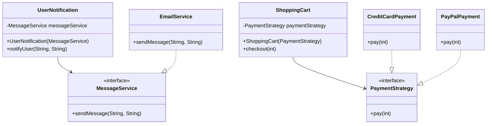

## 10.3 Patterns and Testability

In the realm of software engineering, writing testable code is as crucial as writing functional code. Testability refers to the ease with which software can be tested to ensure it behaves as expected. Design patterns play a pivotal role in enhancing the testability of Java applications by promoting clean architecture and reducing dependencies. In this section, we will delve into the concept of testability, explore design patterns that enhance it, and provide practical Java examples to illustrate these concepts.

### Understanding Testability

**Testability** is a measure of how easily software can be tested. High testability implies that the code is easy to test, which often means it is modular, has clear interfaces, and is free from hidden dependencies. Testable code is essential for:

- **Reliability**: Ensuring that the software behaves correctly under various conditions.
- **Maintainability**: Facilitating easier updates and refactoring without introducing bugs.
- **Efficiency**: Allowing for automated testing, which speeds up the development process.

#### Key Characteristics of Testable Code

1. **Modularity**: Code is divided into independent modules that can be tested in isolation.
2. **Loose Coupling**: Dependencies between modules are minimized, allowing individual components to be tested without requiring the entire system.
3. **Clear Interfaces**: Well-defined interfaces make it easier to understand and test the interactions between components.
4. **Determinism**: Code produces the same output for the same input, making tests predictable and repeatable.
5. **Observability**: The internal state of the system can be easily inspected during testing.

### Patterns that Enhance Testability

Design patterns are proven solutions to common software design problems. They help in structuring code in a way that enhances testability. Let's explore some key patterns that promote testability in Java applications.

#### Dependency Injection Pattern

**Dependency Injection (DI)** is a design pattern that facilitates the injection of dependencies into a class, rather than the class creating them itself. This pattern is crucial for testability as it allows for easy substitution of real dependencies with mocks or stubs during testing.

##### Implementing Dependency Injection in Java

```java
// Service interface
public interface MessageService {
    void sendMessage(String message, String recipient);
}

// Implementation of the service
public class EmailService implements MessageService {
    public void sendMessage(String message, String recipient) {
        // Logic to send email
    }
}

// Client class that uses the service
public class UserNotification {
    private MessageService messageService;

    // Constructor injection
    public UserNotification(MessageService messageService) {
        this.messageService = messageService;
    }

    public void notifyUser(String message, String user) {
        messageService.sendMessage(message, user);
    }
}

// Test class using a mock service
public class UserNotificationTest {
    @Test
    public void testNotifyUser() {
        // Mocking the MessageService
        MessageService mockService = mock(MessageService.class);
        UserNotification notification = new UserNotification(mockService);

        notification.notifyUser("Hello", "user@example.com");

        // Verify that the sendMessage method was called
        verify(mockService).sendMessage("Hello", "user@example.com");
    }
}
```

In this example, the `UserNotification` class depends on the `MessageService` interface. By injecting the dependency through the constructor, we can easily replace `EmailService` with a mock during testing, enhancing testability.

#### Strategy Pattern

The **Strategy Pattern** defines a family of algorithms, encapsulates each one, and makes them interchangeable. This pattern allows the algorithm to vary independently from the clients that use it, facilitating testing by allowing different strategies to be tested in isolation.

##### Implementing Strategy Pattern in Java

```java
// Strategy interface
public interface PaymentStrategy {
    void pay(int amount);
}

// Concrete strategy for credit card payment
public class CreditCardPayment implements PaymentStrategy {
    public void pay(int amount) {
        // Logic for credit card payment
    }
}

// Concrete strategy for PayPal payment
public class PayPalPayment implements PaymentStrategy {
    public void pay(int amount) {
        // Logic for PayPal payment
    }
}

// Context class
public class ShoppingCart {
    private PaymentStrategy paymentStrategy;

    public ShoppingCart(PaymentStrategy paymentStrategy) {
        this.paymentStrategy = paymentStrategy;
    }

    public void checkout(int amount) {
        paymentStrategy.pay(amount);
    }
}

// Test class
public class ShoppingCartTest {
    @Test
    public void testCreditCardPayment() {
        PaymentStrategy mockStrategy = mock(CreditCardPayment.class);
        ShoppingCart cart = new ShoppingCart(mockStrategy);

        cart.checkout(100);

        verify(mockStrategy).pay(100);
    }
}
```

The `ShoppingCart` class uses a `PaymentStrategy` to process payments. By injecting different payment strategies, we can test each strategy independently, improving testability.

### Mocking and Stubbing

Mocking and stubbing are techniques used in testing to simulate the behavior of real objects. They are essential for testing interactions between components without relying on their actual implementations.

#### Using Mocks and Stubs

- **Mocks**: Objects that mimic the behavior of real objects. They are used to verify interactions and ensure that certain methods are called with expected parameters.
- **Stubs**: Objects that return predefined responses to method calls. They are used to simulate the behavior of real objects without executing their actual logic.

Design patterns like Dependency Injection and Strategy facilitate the use of mocks and stubs by decoupling components and defining clear interfaces.

##### Example: Mocking with Mockito

```java
// Mocking a service
MessageService mockService = mock(MessageService.class);

// Stubbing a method
when(mockService.sendMessage(anyString(), anyString())).thenReturn(true);

// Verifying interactions
verify(mockService).sendMessage("Hello", "user@example.com");
```

In this example, we use Mockito to create a mock of the `MessageService` and define a stub for the `sendMessage` method. This allows us to test the `UserNotification` class without relying on the actual implementation of `MessageService`.

### Best Practices for Writing Testable Code

1. **Use Interfaces**: Define interfaces for dependencies to allow easy substitution with mocks or stubs.
2. **Favor Composition Over Inheritance**: Composition allows for more flexible and testable designs by enabling the injection of dependencies.
3. **Avoid Static Methods**: Static methods are difficult to mock and test. Use instance methods and inject dependencies instead.
4. **Minimize Global State**: Global state can lead to unpredictable behavior and make tests unreliable. Use dependency injection to manage state.
5. **Write Small, Focused Methods**: Small methods with a single responsibility are easier to test and understand.
6. **Use Design Patterns**: Apply patterns like Dependency Injection, Strategy, and Observer to enhance modularity and testability.

### Real-World Applications

In complex systems, design patterns significantly improve testability by promoting clean architecture and reducing dependencies. Let's explore a real-world scenario where patterns enhance testability.

#### Case Study: E-Commerce Platform

An e-commerce platform consists of various components like user management, product catalog, order processing, and payment gateways. By applying design patterns, we can improve the testability of each component.

- **Dependency Injection**: Used to inject services like payment gateways and notification services, allowing for easy testing with mocks.
- **Strategy Pattern**: Applied to implement different discount strategies, enabling independent testing of each strategy.
- **Observer Pattern**: Used to notify different components of events like order placement, facilitating testing of event-driven interactions.

By leveraging these patterns, the platform's components become more modular and testable, leading to a more maintainable and reliable system.

### Try It Yourself

Experiment with the code examples provided in this section. Try modifying the `MessageService` implementation to add new features, and see how easily you can test the changes using mocks. Implement a new payment strategy for the `ShoppingCart` and write tests to verify its behavior. These exercises will help reinforce the concepts discussed and demonstrate the power of design patterns in enhancing testability.

### Visualizing Design Patterns and Testability

To better understand how design patterns enhance testability, let's visualize the relationships between components using a class diagram.



This diagram illustrates how the `UserNotification` and `ShoppingCart` classes depend on interfaces (`MessageService` and `PaymentStrategy`), allowing for easy substitution with mocks during testing.

### Knowledge Check

Before we conclude, let's reinforce the key takeaways from this section:

- **Testability** is crucial for reliable and maintainable software.
- **Design Patterns** like Dependency Injection and Strategy enhance testability by promoting modularity and reducing dependencies.
- **Mocks and Stubs** are essential for testing interactions between components without relying on actual implementations.
- **Best Practices** include using interfaces, favoring composition, and minimizing global state.

### Embrace the Journey

Remember, enhancing testability is an ongoing process. As you continue to develop software, keep experimenting with different design patterns and testing techniques. Stay curious, and enjoy the journey of building robust and testable Java applications!

## Quiz Time!



### What is testability in software development?

- [x] The ease with which software can be tested to ensure it behaves as expected.
- [ ] The ability to write code quickly.
- [ ] The process of deploying software.
- [ ] The complexity of the software.

> **Explanation:** Testability refers to how easily software can be tested to ensure it functions correctly.

### Which design pattern is crucial for injecting dependencies into a class?

- [x] Dependency Injection
- [ ] Singleton
- [ ] Factory Method
- [ ] Observer

> **Explanation:** Dependency Injection is a pattern that facilitates injecting dependencies into a class, enhancing testability.

### What is the primary benefit of using the Strategy Pattern?

- [x] It allows algorithms to vary independently from clients that use them.
- [ ] It ensures only one instance of a class exists.
- [ ] It provides a way to create objects.
- [ ] It allows one-to-many dependency between objects.

> **Explanation:** The Strategy Pattern allows different algorithms to be used interchangeably, promoting flexibility and testability.

### How do mocks and stubs differ?

- [x] Mocks verify interactions; stubs return predefined responses.
- [ ] Mocks return predefined responses; stubs verify interactions.
- [ ] Mocks and stubs are the same.
- [ ] Mocks are used for performance testing; stubs for unit testing.

> **Explanation:** Mocks are used to verify interactions, while stubs return predefined responses to simulate behavior.

### Which practice enhances testability by allowing easy substitution of components?

- [x] Using interfaces
- [ ] Using static methods
- [ ] Increasing global state
- [ ] Writing large methods

> **Explanation:** Using interfaces allows components to be easily substituted with mocks or stubs, enhancing testability.

### What is a key characteristic of testable code?

- [x] Modularity
- [ ] Complexity
- [ ] Tight coupling
- [ ] Global state

> **Explanation:** Modularity is a key characteristic of testable code, allowing components to be tested in isolation.

### Which pattern is used to notify components of events like order placement?

- [x] Observer Pattern
- [ ] Singleton Pattern
- [ ] Factory Method Pattern
- [ ] Builder Pattern

> **Explanation:** The Observer Pattern is used to notify components of events, facilitating event-driven interactions.

### Why should static methods be avoided in testable code?

- [x] They are difficult to mock and test.
- [ ] They are slower to execute.
- [ ] They increase code readability.
- [ ] They are deprecated in Java.

> **Explanation:** Static methods are difficult to mock and test, reducing the testability of code.

### What does the Dependency Injection pattern promote?

- [x] Loose coupling
- [ ] Tight coupling
- [ ] Increased complexity
- [ ] Global state

> **Explanation:** Dependency Injection promotes loose coupling by injecting dependencies, enhancing testability.

### True or False: Design patterns can significantly improve the testability of complex systems.

- [x] True
- [ ] False

> **Explanation:** Design patterns promote clean architecture and reduce dependencies, significantly improving testability.


