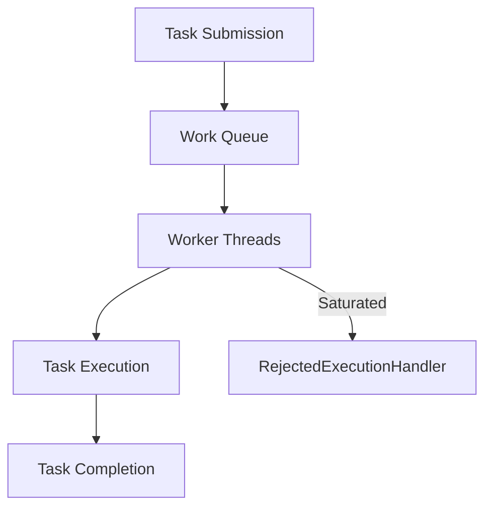

## 10.5.5 ThreadPoolExecutor and Tuning

In the realm of Java concurrency, the `ThreadPoolExecutor` stands as a pivotal component for managing thread pools efficiently. This section delves into the intricacies of tuning `ThreadPoolExecutor` for optimal performance, providing insights into metrics monitoring, parameter adjustments, and queue management. By mastering these aspects, developers can ensure their applications are both responsive and resource-efficient.

### Understanding ThreadPoolExecutor

The `ThreadPoolExecutor` is a flexible and powerful tool for managing a pool of threads. It allows developers to decouple task submission from execution, providing a robust framework for handling concurrent tasks. The executor manages a pool of worker threads, which execute submitted tasks, and uses a queue to hold tasks before they are executed.

#### Key Components

- **Core Pool Size**: The number of threads to keep in the pool, even if they are idle.
- **Maximum Pool Size**: The maximum number of threads allowed in the pool.
- **Keep-Alive Time**: The time that excess idle threads will wait for new tasks before terminating.
- **Work Queue**: A queue that holds tasks before they are executed.
- **RejectedExecutionHandler**: A handler for tasks that cannot be executed by the thread pool.

### Metrics to Monitor

To effectively tune a `ThreadPoolExecutor`, it is crucial to monitor various metrics that provide insights into the executor's performance and behavior.

#### Queue Size

The size of the work queue is a critical metric. A growing queue size may indicate that the executor cannot keep up with the rate of task submission, potentially leading to increased latency.

#### Active Threads

Monitoring the number of active threads helps in understanding how well the thread pool is utilizing its resources. If the number of active threads consistently reaches the maximum pool size, it may be necessary to increase the pool size.

#### Task Completion Rates

The rate at which tasks are completed provides a measure of the executor's throughput. A decline in task completion rates could signal a bottleneck in processing.

### Adjusting Thread Pool Parameters

Tuning the parameters of a `ThreadPoolExecutor` is essential for adapting to different workload characteristics.

#### Core and Maximum Pool Size

- **Core Pool Size**: Set this based on the expected number of concurrent tasks. For CPU-bound tasks, it should be equal to the number of available processors. For I/O-bound tasks, a larger pool size may be beneficial.
- **Maximum Pool Size**: This should be set higher than the core pool size to accommodate bursts of tasks. However, it should not exceed the system's capacity to handle threads efficiently.

#### Keep-Alive Time

Adjust the keep-alive time to balance between resource usage and responsiveness. A shorter keep-alive time can help reduce resource consumption by terminating idle threads more quickly.

### Queue Management

Choosing the right type of queue is crucial for the performance of a `ThreadPoolExecutor`.

#### Bounded vs. Unbounded Queues

- **Bounded Queues**: Limit the number of tasks that can be queued. This can help prevent resource exhaustion but may lead to task rejection if the queue fills up.
- **Unbounded Queues**: Allow an unlimited number of tasks to be queued. This can lead to increased memory usage and latency if the task submission rate exceeds the processing rate.

### Handling Task Rejection

When the thread pool is saturated, tasks may be rejected. The `RejectedExecutionHandler` interface provides a mechanism to handle such scenarios.

#### Common Strategies

- **AbortPolicy**: Throws a `RejectedExecutionException`.
- **CallerRunsPolicy**: Executes the task in the caller's thread.
- **DiscardPolicy**: Silently discards the rejected task.
- **DiscardOldestPolicy**: Discards the oldest unhandled request and retries execution.

### Balancing Resource Usage and Responsiveness

Achieving a balance between resource usage and responsiveness is key to effective thread pool management. Over-provisioning threads can lead to resource contention, while under-provisioning can result in poor responsiveness.

#### Best Practices

- **Monitor and Adjust**: Continuously monitor the executor's performance and adjust parameters as needed.
- **Profile Workloads**: Understand the characteristics of your workloads to make informed tuning decisions.
- **Test Under Load**: Simulate real-world conditions to test the executor's performance and responsiveness.

### Practical Example

Below is a practical example of configuring a `ThreadPoolExecutor` with custom parameters and a `RejectedExecutionHandler`.

```java
import java.util.concurrent.*;

public class ThreadPoolExecutorExample {

    public static void main(String[] args) {
        // Define the core and maximum pool sizes
        int corePoolSize = 4;
        int maximumPoolSize = 10;
        long keepAliveTime = 60L;
        
        // Create a bounded queue with a capacity of 100
        BlockingQueue<Runnable> workQueue = new ArrayBlockingQueue<>(100);
        
        // Define a custom RejectedExecutionHandler
        RejectedExecutionHandler handler = new ThreadPoolExecutor.CallerRunsPolicy();
        
        // Create the ThreadPoolExecutor
        ThreadPoolExecutor executor = new ThreadPoolExecutor(
                corePoolSize,
                maximumPoolSize,
                keepAliveTime,
                TimeUnit.SECONDS,
                workQueue,
                handler
        );
        
        // Submit tasks to the executor
        for (int i = 0; i < 200; i++) {
            executor.execute(new Task(i));
        }
        
        // Shutdown the executor
        executor.shutdown();
    }
}

class Task implements Runnable {
    private final int taskId;

    public Task(int taskId) {
        this.taskId = taskId;
    }

    @Override
    public void run() {
        System.out.println("Executing task " + taskId + " by " + Thread.currentThread().getName());
        try {
            Thread.sleep(1000); // Simulate task execution
        } catch (InterruptedException e) {
            Thread.currentThread().interrupt();
        }
    }
}
```

### Explanation

- **Core and Maximum Pool Size**: The executor is configured with a core pool size of 4 and a maximum pool size of 10, allowing it to handle bursts of tasks.
- **Keep-Alive Time**: Set to 60 seconds, ensuring that excess threads are terminated after being idle for this duration.
- **Work Queue**: A bounded queue with a capacity of 100 is used to prevent resource exhaustion.
- **RejectedExecutionHandler**: The `CallerRunsPolicy` is used to handle rejected tasks by executing them in the caller's thread.

### Encouraging Experimentation

Experiment with different configurations to see how they affect performance. Try increasing the core pool size or using an unbounded queue to observe changes in behavior.

### Visualizing ThreadPoolExecutor

Below is a diagram illustrating the structure and flow of a `ThreadPoolExecutor`.



**Diagram Explanation**: This diagram shows the flow of tasks from submission to execution and completion, with a path for handling rejected tasks when the pool is saturated.

### Conclusion

Tuning a `ThreadPoolExecutor` is a nuanced process that requires careful consideration of workload characteristics and system resources. By monitoring key metrics, adjusting parameters, and selecting appropriate queue types, developers can optimize their thread pools for performance and responsiveness. The use of a `RejectedExecutionHandler` ensures that tasks are handled gracefully even under heavy load.

### Further Reading

For more information on Java concurrency and executors, refer to the [Java Documentation](https://docs.oracle.com/en/java/javase/17/docs/api/java.base/java/util/concurrent/ThreadPoolExecutor.html).

---

## Test Your Knowledge: Java ThreadPoolExecutor Tuning Quiz



### What is the primary purpose of the core pool size in a ThreadPoolExecutor?

- [x] To determine the number of threads to keep in the pool, even if they are idle.
- [ ] To set the maximum number of threads allowed in the pool.
- [ ] To define the time threads should wait before terminating.
- [ ] To specify the size of the work queue.

> **Explanation:** The core pool size defines the number of threads that remain in the pool even when they are idle, ensuring that a minimum number of threads are always available for task execution.

### Which metric is crucial for understanding if a ThreadPoolExecutor is keeping up with task submissions?

- [x] Queue Size
- [ ] Keep-Alive Time
- [ ] Maximum Pool Size
- [ ] Core Pool Size

> **Explanation:** Monitoring the queue size helps determine if the executor is keeping up with task submissions. A growing queue size may indicate that tasks are being submitted faster than they can be processed.

### What is the effect of setting a very high maximum pool size?

- [x] It can lead to resource contention and decreased performance.
- [ ] It ensures that all tasks are executed immediately.
- [ ] It reduces the need for a work queue.
- [ ] It eliminates the need for a RejectedExecutionHandler.

> **Explanation:** A very high maximum pool size can lead to resource contention, as too many threads compete for CPU and memory, potentially decreasing overall performance.

### How does the CallerRunsPolicy handle rejected tasks?

- [x] Executes the task in the caller's thread.
- [ ] Throws a RejectedExecutionException.
- [ ] Silently discards the task.
- [ ] Discards the oldest unhandled request.

> **Explanation:** The CallerRunsPolicy executes the rejected task in the thread that submitted the task, providing a simple way to handle task rejection without losing tasks.

### What is a potential drawback of using an unbounded queue with a ThreadPoolExecutor?

- [x] Increased memory usage and latency.
- [ ] Tasks are rejected more frequently.
- [ ] Threads are terminated too quickly.
- [ ] The pool size is limited to the core pool size.

> **Explanation:** An unbounded queue can lead to increased memory usage and latency if tasks are submitted faster than they can be processed, as the queue can grow indefinitely.

### Why is it important to monitor active threads in a ThreadPoolExecutor?

- [x] To understand how well the pool is utilizing its resources.
- [ ] To determine the size of the work queue.
- [ ] To adjust the keep-alive time.
- [ ] To set the core pool size.

> **Explanation:** Monitoring active threads helps understand resource utilization and whether the pool size is sufficient to handle the workload efficiently.

### What is the role of the RejectedExecutionHandler in a ThreadPoolExecutor?

- [x] To handle tasks that cannot be executed by the thread pool.
- [ ] To manage the size of the work queue.
- [ ] To adjust the keep-alive time.
- [ ] To set the core and maximum pool sizes.

> **Explanation:** The RejectedExecutionHandler provides a mechanism to handle tasks that cannot be executed due to the pool being saturated, ensuring tasks are not lost.

### How can you balance resource usage and responsiveness in a ThreadPoolExecutor?

- [x] By adjusting core and maximum pool sizes based on workload characteristics.
- [ ] By using an unbounded queue.
- [ ] By setting a very high keep-alive time.
- [ ] By ignoring task rejection.

> **Explanation:** Balancing resource usage and responsiveness involves tuning the core and maximum pool sizes to match the workload characteristics, ensuring efficient resource utilization and quick task execution.

### What is the consequence of setting a very short keep-alive time?

- [x] Idle threads are terminated more quickly, reducing resource usage.
- [ ] The work queue size is increased.
- [ ] Tasks are executed more slowly.
- [ ] The core pool size is reduced.

> **Explanation:** A short keep-alive time results in idle threads being terminated more quickly, which can help reduce resource usage when the demand for threads decreases.

### True or False: The ThreadPoolExecutor's maximum pool size should always be set to the number of available processors.

- [ ] True
- [x] False

> **Explanation:** The maximum pool size should be set based on the workload characteristics, not just the number of available processors. For I/O-bound tasks, a larger pool size may be beneficial, while for CPU-bound tasks, it should be closer to the number of processors.



By understanding and applying these concepts, developers can effectively tune their `ThreadPoolExecutor` instances to achieve optimal performance and responsiveness in their Java applications.
