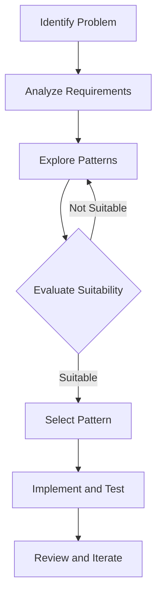

## 10.5 Selecting the Right Pattern

In the realm of software engineering, design patterns serve as time-tested solutions to recurring design problems. However, selecting the appropriate pattern for a given situation is crucial to harnessing their full potential. This section provides a comprehensive guide to selecting the right design pattern in Java, focusing on a decision-making framework, comparison tables, common use cases, pros and cons, guiding questions, and the importance of avoiding overengineering.

### Decision-Making Framework

Selecting the right design pattern involves a systematic approach that begins with understanding the problem at hand and ends with evaluating the chosen pattern's effectiveness. Here's a step-by-step framework to guide you through this process:

#### Step 1: Problem Identification

- **Define the Problem**: Clearly articulate the problem you are trying to solve. Is it related to object creation, structure, or behavior?
- **Identify Constraints**: Consider constraints such as performance, scalability, and maintainability.
- **Determine Stakeholders**: Understand who will be affected by the solution and what their requirements are.

#### Step 2: Requirement Analysis

- **Functional Requirements**: What functionalities must the solution provide?
- **Non-Functional Requirements**: Consider performance, security, and usability.
- **Future Scalability**: Will the solution need to adapt to future changes?

#### Step 3: Pattern Exploration

- **Research Patterns**: Explore patterns that address the identified problem. Use resources like the Gang of Four (GoF) patterns, enterprise patterns, and architectural patterns.
- **Evaluate Suitability**: Assess each pattern's suitability based on your requirements.

#### Step 4: Pattern Selection

- **Compare Patterns**: Use comparison tables to evaluate patterns based on criteria such as complexity, flexibility, and applicability.
- **Prototype and Test**: Implement a prototype to test the pattern's effectiveness in your context.

#### Step 5: Implementation and Review

- **Implement the Pattern**: Integrate the chosen pattern into your solution.
- **Review and Iterate**: Continuously review the implementation to ensure it meets the requirements. Be prepared to iterate if necessary.

### Comparison Tables

To assist in selecting the right pattern, the following tables compare various design patterns based on key criteria:

#### Table 1: Complexity and Flexibility

| Pattern                | Complexity | Flexibility | Use Case Example                  |
|------------------------|------------|-------------|-----------------------------------|
| Singleton              | Low        | Low         | Global configuration management   |
| Factory Method         | Medium     | High        | Object creation with polymorphism |
| Observer               | Medium     | High        | Event-driven systems              |
| Strategy               | Medium     | High        | Algorithm selection at runtime    |
| Decorator              | High       | High        | Dynamic behavior extension        |

#### Table 2: Applicability and Pros/Cons

| Pattern                | Applicability                  | Pros                                         | Cons                                         |
|------------------------|--------------------------------|----------------------------------------------|----------------------------------------------|
| Singleton              | Single instance requirement    | Easy to implement, controlled access         | Difficult to test, potential for misuse      |
| Factory Method         | Object creation variability    | Promotes loose coupling, easy to extend      | Can lead to class explosion                  |
| Observer               | One-to-many dependency         | Decouples subject and observers              | Can lead to performance issues               |
| Strategy               | Algorithm interchangeability   | Promotes open/closed principle               | Can increase the number of classes           |
| Decorator              | Dynamic behavior modification  | Flexible, adheres to open/closed principle   | Can complicate the class hierarchy           |

### Common Use Cases

Understanding common programming problems and the patterns that effectively address them is crucial for making informed decisions. Here are some typical scenarios:

#### Use Case 1: Managing Global State

- **Problem**: You need a single point of access to a global state or configuration.
- **Recommended Pattern**: Singleton
- **Example**: Managing application-wide settings.

```java
public class ConfigurationManager {
    private static ConfigurationManager instance;
    private Properties properties;

    private ConfigurationManager() {
        properties = new Properties();
        // Load properties
    }

    public static synchronized ConfigurationManager getInstance() {
        if (instance == null) {
            instance = new ConfigurationManager();
        }
        return instance;
    }

    public String getProperty(String key) {
        return properties.getProperty(key);
    }
}
```

#### Use Case 2: Creating Objects with Varying Implementations

- **Problem**: You need to create objects without specifying the exact class of object that will be created.
- **Recommended Pattern**: Factory Method
- **Example**: Creating different types of documents in a document editor.

```java
abstract class Document {
    public abstract void open();
}

class WordDocument extends Document {
    public void open() {
        System.out.println("Opening Word document.");
    }
}

class PdfDocument extends Document {
    public void open() {
        System.out.println("Opening PDF document.");
    }
}

abstract class DocumentCreator {
    public abstract Document createDocument();
}

class WordDocumentCreator extends DocumentCreator {
    public Document createDocument() {
        return new WordDocument();
    }
}

class PdfDocumentCreator extends DocumentCreator {
    public Document createDocument() {
        return new PdfDocument();
    }
}
```

#### Use Case 3: Implementing Event Handling

- **Problem**: You need to notify multiple objects when an event occurs.
- **Recommended Pattern**: Observer
- **Example**: GUI components reacting to user actions.

```java
interface Observer {
    void update(String message);
}

class ConcreteObserver implements Observer {
    private String name;

    public ConcreteObserver(String name) {
        this.name = name;
    }

    public void update(String message) {
        System.out.println(name + " received: " + message);
    }
}

class Subject {
    private List<Observer> observers = new ArrayList<>();

    public void addObserver(Observer observer) {
        observers.add(observer);
    }

    public void notifyObservers(String message) {
        for (Observer observer : observers) {
            observer.update(message);
        }
    }
}
```

### Pros and Cons

Understanding the advantages and disadvantages of different patterns in various contexts helps in making informed decisions:

#### Singleton Pattern

- **Pros**: Simplifies access to a single instance, easy to implement.
- **Cons**: Can lead to tightly coupled code, difficult to test in isolation.

#### Factory Method Pattern

- **Pros**: Promotes loose coupling, easy to extend with new product types.
- **Cons**: Can result in a large number of classes, increasing complexity.

#### Observer Pattern

- **Pros**: Decouples the subject from observers, supports dynamic relationships.
- **Cons**: Can lead to performance issues with many observers, difficult to debug.

#### Strategy Pattern

- **Pros**: Supports the open/closed principle, easy to switch algorithms.
- **Cons**: Can increase the number of classes, leading to a more complex design.

#### Decorator Pattern

- **Pros**: Provides flexibility in adding responsibilities, adheres to open/closed principle.
- **Cons**: Can complicate the class hierarchy, making it harder to understand.

### Guiding Questions

When selecting a pattern, consider the following questions to guide your decision-making process:

1. **What is the core problem I am trying to solve?**
2. **What are the key constraints and requirements?**
3. **How will the pattern affect the system's scalability and maintainability?**
4. **Is there a need for future extensibility?**
5. **What are the potential trade-offs in terms of complexity and performance?**
6. **How will the pattern impact testing and debugging?**
7. **Does the pattern align with the team's expertise and project goals?**

### Avoiding Overengineering

While design patterns offer powerful solutions, it's important to avoid overengineering by misusing patterns or adding unnecessary complexity. Here are some tips to prevent overengineering:

- **Keep It Simple**: Favor simplicity over complexity. Use patterns only when they provide clear benefits.
- **Avoid Pattern Fever**: Don't apply patterns for the sake of using them. Ensure they address a real problem.
- **Refactor When Necessary**: Be willing to refactor if a pattern proves to be a poor fit.
- **Balance Flexibility and Complexity**: Strive for a balance between flexibility and simplicity.

### Try It Yourself

To deepen your understanding, try modifying the code examples provided:

- **Singleton**: Implement a thread-safe version using the double-checked locking pattern.
- **Factory Method**: Add a new document type, such as an Excel document, and update the factory method.
- **Observer**: Implement a removeObserver method to allow observers to unsubscribe.

### Visualizing Pattern Selection

To further illustrate the pattern selection process, consider the following flowchart:



This flowchart represents the iterative nature of selecting and implementing design patterns, emphasizing the importance of evaluation and iteration.

### Knowledge Check

Before moving on, take a moment to reflect on the key takeaways:

- **Understand the Problem**: Clearly define the problem and constraints.
- **Evaluate Patterns**: Use comparison tables and guiding questions to assess patterns.
- **Avoid Overengineering**: Keep solutions simple and focused on the problem.

## Quiz Time!



### Which is the first step in selecting a design pattern?

- [x] Problem Identification
- [ ] Requirement Analysis
- [ ] Pattern Exploration
- [ ] Pattern Selection

> **Explanation:** The first step is to clearly define the problem you are trying to solve.

### What is a key advantage of the Factory Method pattern?

- [x] Promotes loose coupling
- [ ] Simplifies access to a single instance
- [ ] Supports dynamic relationships
- [ ] Provides flexibility in adding responsibilities

> **Explanation:** The Factory Method pattern promotes loose coupling by allowing subclasses to decide which class to instantiate.

### Which pattern is recommended for managing global state?

- [x] Singleton
- [ ] Factory Method
- [ ] Observer
- [ ] Strategy

> **Explanation:** The Singleton pattern is used to ensure a class has only one instance, making it suitable for managing global state.

### What is a common disadvantage of the Observer pattern?

- [x] Can lead to performance issues
- [ ] Difficult to implement
- [ ] Increases the number of classes
- [ ] Complicates the class hierarchy

> **Explanation:** The Observer pattern can lead to performance issues when there are many observers.

### Which pattern is suitable for algorithm interchangeability?

- [x] Strategy
- [ ] Singleton
- [x] Factory Method
- [ ] Decorator

> **Explanation:** The Strategy pattern allows for the interchangeability of algorithms by encapsulating them.

### What should you avoid to prevent overengineering?

- [x] Pattern Fever
- [ ] Refactoring
- [ ] Simplicity
- [ ] Evaluation

> **Explanation:** Avoid applying patterns for the sake of using them, known as "Pattern Fever."

### Which question is important when selecting a pattern?

- [x] How will the pattern impact testing?
- [ ] What is the team's favorite pattern?
- [ ] How many patterns can we use?
- [ ] What is the most complex pattern?

> **Explanation:** Considering how the pattern will impact testing is crucial for maintainability.

### What is a benefit of the Decorator pattern?

- [x] Provides flexibility in adding responsibilities
- [ ] Simplifies access to a single instance
- [ ] Supports dynamic relationships
- [ ] Promotes loose coupling

> **Explanation:** The Decorator pattern provides flexibility by allowing responsibilities to be added dynamically.

### Which pattern is used for event handling?

- [x] Observer
- [ ] Singleton
- [ ] Factory Method
- [ ] Strategy

> **Explanation:** The Observer pattern is used for event handling, allowing multiple objects to react to changes.

### True or False: Overengineering is beneficial in software design.

- [ ] True
- [x] False

> **Explanation:** Overengineering adds unnecessary complexity and should be avoided in software design.



Remember, selecting the right design pattern is a journey that involves understanding the problem, evaluating potential solutions, and iterating as necessary. Keep experimenting, stay curious, and enjoy the process of crafting elegant and efficient software solutions!
