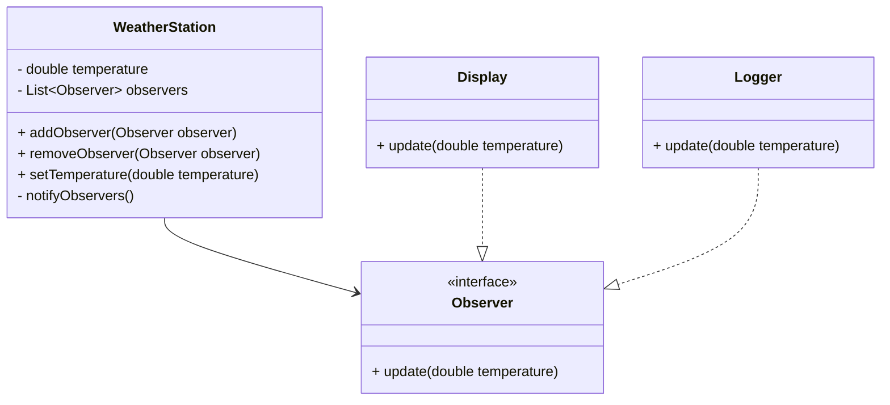

## 10.6 Patterns and Refactoring

In the ever-evolving landscape of software development, maintaining a clean and efficient codebase is crucial. Refactoring, the process of restructuring existing code without changing its external behavior, plays a pivotal role in achieving this goal. By leveraging design patterns during refactoring, we can enhance code structure, improve maintainability, and future-proof our applications. Let's delve into the world of refactoring with design patterns, exploring when and how to apply them effectively.

### Refactoring Concepts

Refactoring is a disciplined technique for improving the design of existing code. It involves making small, incremental changes to the codebase to improve its structure, readability, and maintainability. The primary goal of refactoring is to make the code easier to understand and modify while preserving its functionality.

**Importance of Refactoring:**

- **Improves Code Readability:** Clean code is easier to read and understand, reducing the cognitive load on developers.
- **Enhances Maintainability:** Well-structured code is easier to maintain and extend, reducing the risk of introducing bugs.
- **Facilitates Code Reuse:** By organizing code into reusable components, refactoring promotes code reuse across projects.
- **Supports Agile Development:** Frequent refactoring aligns with agile practices, enabling rapid iteration and adaptation.

### When to Refactor to Patterns

Identifying opportunities to refactor code using design patterns requires a keen eye for recognizing code smells—indications that the code may be suffering from design issues. Here are some common signs that your code might benefit from introducing a design pattern:

- **Duplicated Code:** Repeated code blocks can be consolidated using patterns like Factory or Strategy.
- **Complex Conditional Logic:** Patterns like State or Strategy can simplify complex conditional structures.
- **Tight Coupling:** If classes are too tightly coupled, consider using patterns like Observer or Mediator to decouple them.
- **Lack of Flexibility:** Patterns like Factory or Builder can provide flexibility in object creation.
- **Difficult to Test:** Patterns like Dependency Injection can enhance testability by decoupling components.

### Step-by-Step Refactoring Examples

Let's explore detailed examples of refactoring existing code to implement design patterns, focusing on the Factory and Observer patterns.

#### Refactoring to Factory Pattern

**Scenario:** You have a codebase with multiple classes that instantiate objects directly, leading to duplicated code and tight coupling.

**Before Refactoring:**

```java
public class NotificationService {
    public void sendNotification(String type, String message) {
        if (type.equals("Email")) {
            EmailNotification email = new EmailNotification();
            email.send(message);
        } else if (type.equals("SMS")) {
            SMSNotification sms = new SMSNotification();
            sms.send(message);
        }
    }
}

class EmailNotification {
    public void send(String message) {
        // Send email
    }
}

class SMSNotification {
    public void send(String message) {
        // Send SMS
    }
}
```

**Refactoring Steps:**

1. **Identify the Creation Logic:** Locate the code responsible for creating instances of `EmailNotification` and `SMSNotification`.
2. **Create a Factory Interface:** Define an interface for creating notification objects.

```java
interface NotificationFactory {
    Notification createNotification();
}
```

3. **Implement Concrete Factories:** Create concrete factory classes for each notification type.

```java
class EmailNotificationFactory implements NotificationFactory {
    public Notification createNotification() {
        return new EmailNotification();
    }
}

class SMSNotificationFactory implements NotificationFactory {
    public Notification createNotification() {
        return new SMSNotification();
    }
}
```

4. **Refactor the Client Code:** Modify the `NotificationService` to use the factory interface.

```java
public class NotificationService {
    private NotificationFactory factory;

    public NotificationService(NotificationFactory factory) {
        this.factory = factory;
    }

    public void sendNotification(String message) {
        Notification notification = factory.createNotification();
        notification.send(message);
    }
}
```

5. **Use the Factory:** Instantiate the `NotificationService` with the appropriate factory.

```java
NotificationService emailService = new NotificationService(new EmailNotificationFactory());
emailService.sendNotification("Hello via Email!");

NotificationService smsService = new NotificationService(new SMSNotificationFactory());
smsService.sendNotification("Hello via SMS!");
```

**After Refactoring:**

The refactored code is more flexible and easier to extend with new notification types without modifying existing code.

#### Refactoring to Observer Pattern

**Scenario:** You have a system where multiple components need to be notified of changes in a subject, but the current implementation uses tight coupling.

**Before Refactoring:**

```java
public class WeatherStation {
    private double temperature;

    public void setTemperature(double temperature) {
        this.temperature = temperature;
        displayTemperature();
        logTemperature();
    }

    private void displayTemperature() {
        // Display temperature
    }

    private void logTemperature() {
        // Log temperature
    }
}
```

**Refactoring Steps:**

1. **Identify the Subject:** Determine the class that maintains the state and notifies other components.

2. **Define Observer Interface:** Create an interface for observers.

```java
interface Observer {
    void update(double temperature);
}
```

3. **Implement Concrete Observers:** Implement the observer interface in the classes that need to be notified.

```java
class Display implements Observer {
    public void update(double temperature) {
        // Display updated temperature
    }
}

class Logger implements Observer {
    public void update(double temperature) {
        // Log updated temperature
    }
}
```

4. **Refactor the Subject:** Modify the `WeatherStation` to maintain a list of observers and notify them of changes.

```java
import java.util.ArrayList;
import java.util.List;

public class WeatherStation {
    private double temperature;
    private List<Observer> observers = new ArrayList<>();

    public void addObserver(Observer observer) {
        observers.add(observer);
    }

    public void removeObserver(Observer observer) {
        observers.remove(observer);
    }

    public void setTemperature(double temperature) {
        this.temperature = temperature;
        notifyObservers();
    }

    private void notifyObservers() {
        for (Observer observer : observers) {
            observer.update(temperature);
        }
    }
}
```

5. **Use the Observer Pattern:** Register observers with the subject.

```java
WeatherStation station = new WeatherStation();
station.addObserver(new Display());
station.addObserver(new Logger());

station.setTemperature(25.0);
```

**After Refactoring:**

The refactored code decouples the `WeatherStation` from its observers, making it easier to add new observers without modifying the subject.

### Tools and Techniques

Refactoring can be a daunting task, but modern Integrated Development Environments (IDEs) and tools offer features that simplify the process. Here are some tools and techniques to assist in refactoring:

- **IDEs:** Most modern IDEs like IntelliJ IDEA, Eclipse, and NetBeans offer built-in refactoring tools. These tools can automate common refactoring tasks such as renaming, extracting methods, and introducing interfaces.
- **Code Analysis Tools:** Tools like SonarQube and PMD can identify code smells and suggest refactoring opportunities.
- **Version Control:** Use version control systems like Git to track changes and revert if necessary.
- **Automated Testing:** Ensure you have a robust suite of automated tests to verify that refactoring does not introduce bugs.

### Best Practices

Refactoring requires careful planning and execution to ensure that it maintains code functionality and doesn't introduce bugs. Here are some best practices to follow:

- **Refactor in Small Steps:** Make small, incremental changes to the codebase. This approach reduces the risk of introducing errors and makes it easier to identify the source of any issues.
- **Maintain a Comprehensive Test Suite:** Automated tests are essential for verifying that refactoring does not alter the external behavior of the code. Ensure that your test suite covers all critical paths.
- **Document Changes:** Keep a record of the changes made during refactoring. This documentation can be invaluable for future reference and for onboarding new team members.
- **Review and Collaborate:** Conduct code reviews to catch potential issues early and to benefit from the collective expertise of the team.
- **Prioritize Readability:** Always prioritize code readability and maintainability over clever or complex solutions.

### Impact on Codebase

Refactoring with design patterns can have a profound impact on the codebase:

- **Improved Readability:** Patterns provide a common vocabulary for developers, making the code easier to read and understand.
- **Enhanced Maintainability:** By organizing code into well-defined patterns, refactoring reduces complexity and makes the codebase easier to maintain.
- **Future-Proofing:** Patterns facilitate the addition of new features and functionality, ensuring that the codebase can evolve with changing requirements.
- **Increased Flexibility:** Patterns like Factory and Observer decouple components, allowing for greater flexibility and adaptability.

### Visualizing Refactoring with Patterns

To better understand the transformation process, let's visualize the refactoring of the `WeatherStation` example using a class diagram.



**Diagram Description:**

- **WeatherStation:** Acts as the subject, maintaining a list of observers and notifying them of state changes.
- **Observer Interface:** Defines the contract for observers, ensuring they implement the `update` method.
- **Display and Logger:** Concrete implementations of the `Observer` interface, responding to updates from the `WeatherStation`.

### Try It Yourself

To deepen your understanding, try modifying the refactored examples:

- **Factory Pattern:** Add a new notification type, such as `PushNotification`, and implement the corresponding factory.
- **Observer Pattern:** Introduce a new observer, such as `AlertSystem`, that triggers alerts based on temperature changes.

### Conclusion

Refactoring with design patterns is a powerful technique for enhancing code structure and maintainability. By recognizing opportunities to apply patterns, leveraging tools and techniques, and following best practices, we can transform our codebase into a clean, efficient, and future-proof system. Remember, refactoring is not a one-time task but an ongoing process that aligns with the principles of agile development and continuous improvement.

## Quiz Time!



### What is the primary goal of refactoring?

- [x] Improve code readability and maintainability without changing external behavior.
- [ ] Add new features to the codebase.
- [ ] Fix bugs in the existing code.
- [ ] Optimize code for performance.

> **Explanation:** The primary goal of refactoring is to improve the internal structure of the code without altering its external behavior, making it easier to read and maintain.

### Which design pattern is suitable for simplifying complex conditional logic?

- [ ] Singleton
- [x] Strategy
- [ ] Factory
- [ ] Observer

> **Explanation:** The Strategy pattern is ideal for simplifying complex conditional logic by encapsulating different algorithms or behaviors and making them interchangeable.

### What is a common sign that code might benefit from the Observer pattern?

- [ ] Duplicated code
- [ ] Complex conditional logic
- [x] Tight coupling between components
- [ ] Lack of flexibility

> **Explanation:** Tight coupling between components is a common sign that the Observer pattern might be beneficial, as it helps decouple the subject from its observers.

### Which tool can help automate common refactoring tasks in Java?

- [ ] Git
- [ ] SonarQube
- [x] IntelliJ IDEA
- [ ] Maven

> **Explanation:** IntelliJ IDEA is an IDE that offers built-in refactoring tools to automate common refactoring tasks, such as renaming and extracting methods.

### What is a best practice to follow during refactoring?

- [x] Refactor in small steps
- [ ] Refactor all at once
- [ ] Avoid using automated tests
- [ ] Document changes after refactoring

> **Explanation:** Refactoring in small steps is a best practice as it reduces the risk of introducing errors and makes it easier to identify issues.

### How does refactoring with design patterns impact code readability?

- [x] Improves readability by providing a common vocabulary
- [ ] Decreases readability by adding complexity
- [ ] Has no impact on readability
- [ ] Makes code harder to understand

> **Explanation:** Refactoring with design patterns improves readability by providing a common vocabulary that developers can use to understand the code structure.

### What is the role of the Observer interface in the Observer pattern?

- [ ] To create new observers
- [x] To define the contract for observers
- [ ] To notify observers of changes
- [ ] To manage the state of the subject

> **Explanation:** The Observer interface defines the contract for observers, ensuring they implement the necessary methods to respond to updates from the subject.

### Which pattern is useful for decoupling components in a system?

- [ ] Singleton
- [ ] Factory
- [x] Observer
- [ ] Builder

> **Explanation:** The Observer pattern is useful for decoupling components in a system by allowing observers to register with a subject and be notified of changes without tight coupling.

### What is a benefit of using the Factory pattern?

- [x] Provides flexibility in object creation
- [ ] Simplifies complex conditional logic
- [ ] Enhances testability
- [ ] Reduces code duplication

> **Explanation:** The Factory pattern provides flexibility in object creation by allowing the instantiation of objects through a common interface, making it easier to add new types.

### True or False: Refactoring should only be done when adding new features.

- [ ] True
- [x] False

> **Explanation:** False. Refactoring is an ongoing process that should be done regularly to improve code structure and maintainability, not just when adding new features.


