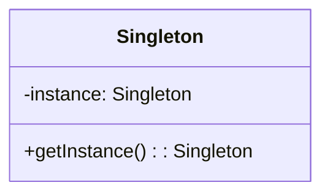
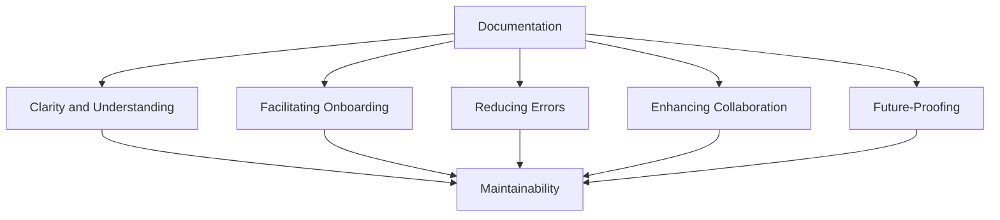

## 10.7 Documentation and Maintainability

In the world of software engineering, especially when dealing with complex systems and design patterns, documentation plays a pivotal role in ensuring code maintainability. Proper documentation not only aids in understanding the code but also facilitates future modifications, debugging, and collaboration among team members. In this section, we will delve into the importance of documentation, best practices for documenting design patterns, and tools that can assist in maintaining comprehensive documentation.

### Importance of Documentation

Documentation is the backbone of any maintainable codebase. It serves as a guide for developers to understand the architecture, design decisions, and implementation details of a system. When design patterns are involved, documentation becomes even more critical because patterns often introduce abstract concepts that may not be immediately clear to someone new to the codebase.

#### Supporting Maintainability

1. **Clarity and Understanding**: Documentation provides clarity on the purpose and functionality of code, making it easier for developers to understand and work with it. This is particularly important in large teams where developers may not be familiar with all parts of the codebase.

2. **Facilitating Onboarding**: New team members can quickly get up to speed with well-documented code, reducing the learning curve and increasing productivity.

3. **Reducing Errors**: Clear documentation helps prevent errors by providing detailed explanations of how the code should be used and what each part is responsible for.

4. **Enhancing Collaboration**: In collaborative environments, documentation ensures that everyone is on the same page, reducing misunderstandings and miscommunications.

5. **Future-Proofing**: As projects evolve, documentation serves as a historical record of design decisions and changes, aiding in future development and maintenance efforts.

### Documenting Patterns Used

When implementing design patterns, it is essential to document their usage to ensure that the rationale behind their selection and implementation is clear. This documentation can take several forms, including UML diagrams, inline comments, and external documentation.

#### Using UML Diagrams

Unified Modeling Language (UML) diagrams are a powerful tool for visualizing the structure and relationships within a codebase. They can be used to represent the implementation of design patterns, making it easier for developers to understand the architecture at a glance.



**Caption:** *A UML class diagram illustrating the Singleton pattern.*

- **Class Diagrams**: Useful for showing the static structure of classes and their relationships.
- **Sequence Diagrams**: Ideal for depicting the flow of control and interaction between objects over time.
- **Activity Diagrams**: Can be used to represent the workflow of a particular process or algorithm.

#### Inline Comments and Annotations

Inline comments and annotations are crucial for explaining complex implementations and design decisions within the code itself. They provide immediate context and clarification, reducing the need to refer to external documentation.

**Best Practices for Inline Comments:**

- **Be Concise**: Comments should be brief but informative, explaining the "why" rather than the "what" of the code.
- **Use Annotations**: Java annotations can be used to provide metadata about the code, such as `@Deprecated`, `@Override`, or custom annotations for specific design patterns.
- **Highlight Key Points**: Use comments to highlight important sections of code, such as the implementation of a design pattern or a critical algorithm.

```java
public class Singleton {
    // Static variable to hold the single instance of Singleton
    private static Singleton instance;

    // Private constructor to prevent instantiation
    private Singleton() {}

    // Method to return the single instance of Singleton
    public static Singleton getInstance() {
        if (instance == null) {
            instance = new Singleton();
        }
        return instance;
    }
}
```

**Caption:** *Java code example demonstrating inline comments in a Singleton pattern implementation.*

### Documentation Tools

Several tools can assist in generating and maintaining documentation for Java codebases. These tools automate the process of creating comprehensive documentation, ensuring consistency and ease of access.

#### Javadoc

Javadoc is a widely used tool for generating API documentation in HTML format from Java source code. It extracts comments and annotations from the code, creating a structured and navigable documentation set.

**Using Javadoc:**

- **Write Javadoc Comments**: Use the `/** ... */` syntax to write comments that Javadoc will process.
- **Include Tags**: Use tags like `@param`, `@return`, and `@throws` to provide detailed information about methods and their behavior.

```java
/**
 * Singleton class to demonstrate the Singleton pattern.
 */
public class Singleton {
    // Static variable to hold the single instance of Singleton
    private static Singleton instance;

    // Private constructor to prevent instantiation
    private Singleton() {}

    /**
     * Returns the single instance of Singleton.
     *
     * @return Singleton instance
     */
    public static Singleton getInstance() {
        if (instance == null) {
            instance = new Singleton();
        }
        return instance;
    }
}
```

**Caption:** *Java code example with Javadoc comments for generating documentation.*

#### Other Documentation Tools

- **Doxygen**: A versatile tool that supports multiple programming languages, including Java, for generating documentation.
- **PlantUML**: Useful for creating UML diagrams that can be embedded in documentation.
- **Asciidoctor**: A text processor for writing documentation in AsciiDoc format, which can be converted to various output formats.

### Team Collaboration

Clear and comprehensive documentation is essential for effective team collaboration. It ensures that all team members have access to the same information, reducing the risk of miscommunication and errors.

#### Facilitating Knowledge Transfer

- **Shared Understanding**: Documentation provides a shared understanding of the codebase, making it easier for team members to collaborate and contribute effectively.
- **Code Reviews**: Well-documented code simplifies the code review process, allowing reviewers to focus on the logic and implementation rather than deciphering the code.
- **Pair Programming**: Documentation can serve as a reference during pair programming sessions, helping both developers stay aligned.

#### Encouraging Consistency

- **Documentation Standards**: Establishing documentation standards ensures consistency across the codebase, making it easier for developers to navigate and understand the code.
- **Regular Updates**: Encourage regular updates to documentation to reflect changes in the codebase, ensuring that it remains accurate and relevant.

### Examples and Templates

Providing examples and templates for effective documentation can serve as a guide for developers, helping them create clear and comprehensive documentation for their code.

#### Documentation Template

**Class Documentation Template:**

```java
/**
 * [Class Name] - [Brief description of the class and its purpose]
 *
 * <p>[Detailed description of the class, its responsibilities, and any design patterns used]</p>
 *
 * @author [Author]
 * @version [Version]
 * @since [Date]
 */
public class ClassName {
    // Class variables and methods
}
```

**Method Documentation Template:**

```java
/**
 * [Method Name] - [Brief description of the method and its purpose]
 *
 * @param [Parameter Name] [Description of the parameter]
 * @return [Description of the return value]
 * @throws [Exception Name] [Description of the exception]
 */
public ReturnType methodName(ParameterType parameterName) {
    // Method implementation
}
```

### Try It Yourself

To reinforce your understanding of documentation and maintainability, try the following exercises:

1. **Document a Design Pattern**: Choose a design pattern you are familiar with and create a UML diagram to represent its structure. Write Javadoc comments for a Java implementation of the pattern.

2. **Review and Improve Documentation**: Take a piece of code from a project you are working on and review its documentation. Identify areas for improvement and update the documentation to make it clearer and more comprehensive.

3. **Experiment with Documentation Tools**: Try using a documentation tool like Javadoc or Doxygen to generate documentation for a small Java project. Explore the features and capabilities of the tool to enhance your documentation.

### Visualizing Documentation and Maintainability

To better understand the relationship between documentation and maintainability, consider the following diagram:



**Caption:** *Flowchart illustrating how documentation contributes to code maintainability.*

### Knowledge Check

To ensure you have grasped the key concepts of documentation and maintainability, consider the following questions:

- How does documentation support code maintainability?
- What are the benefits of using UML diagrams to document design patterns?
- Why are inline comments important in code documentation?
- What tools can assist in generating and maintaining Java documentation?
- How does documentation facilitate team collaboration and knowledge transfer?

### Embrace the Journey

Remember, documentation is not just a task to be completed; it is an integral part of the software development process. By investing time and effort into creating clear and comprehensive documentation, you are setting the foundation for a maintainable and scalable codebase. Keep exploring, experimenting, and refining your documentation practices to enhance your skills as a software engineer.

## Quiz Time!



### How does documentation support code maintainability?

- [x] By providing clarity and understanding of the code
- [ ] By making the code run faster
- [ ] By reducing the number of lines of code
- [ ] By increasing the complexity of the code

> **Explanation:** Documentation provides clarity and understanding, making it easier to maintain and modify the code.


### What is the primary purpose of using UML diagrams in documenting design patterns?

- [x] To visualize the structure and relationships within the codebase
- [ ] To replace inline comments
- [ ] To generate code automatically
- [ ] To increase the size of the documentation

> **Explanation:** UML diagrams help visualize the structure and relationships, aiding in understanding design patterns.


### Why are inline comments important in code documentation?

- [x] They provide immediate context and clarification within the code
- [ ] They replace the need for external documentation
- [ ] They increase the execution speed of the code
- [ ] They reduce the number of bugs in the code

> **Explanation:** Inline comments provide immediate context, explaining complex implementations directly in the code.


### Which tool is commonly used to generate API documentation in Java?

- [x] Javadoc
- [ ] Doxygen
- [ ] PlantUML
- [ ] Asciidoctor

> **Explanation:** Javadoc is a widely used tool for generating API documentation in Java.


### How does documentation facilitate team collaboration?

- [x] By providing a shared understanding of the codebase
- [ ] By reducing the number of team members needed
- [ ] By increasing the complexity of the code
- [ ] By making the code more difficult to understand

> **Explanation:** Documentation provides a shared understanding, enhancing collaboration and reducing misunderstandings.


### What is a benefit of using Javadoc comments?

- [x] They generate structured and navigable documentation
- [ ] They increase the execution speed of the code
- [ ] They replace the need for UML diagrams
- [ ] They reduce the number of lines of code

> **Explanation:** Javadoc comments help generate structured and navigable documentation for Java code.


### Which of the following is a best practice for inline comments?

- [x] Be concise and informative
- [ ] Write comments for every line of code
- [ ] Use comments to explain only the syntax
- [ ] Avoid using comments altogether

> **Explanation:** Inline comments should be concise and informative, explaining the "why" rather than the "what".


### What is the role of documentation in future-proofing a codebase?

- [x] It serves as a historical record of design decisions and changes
- [ ] It increases the execution speed of the code
- [ ] It reduces the number of lines of code
- [ ] It makes the code more complex

> **Explanation:** Documentation serves as a historical record, aiding in future development and maintenance efforts.


### Which tool can be used to create UML diagrams that can be embedded in documentation?

- [x] PlantUML
- [ ] Javadoc
- [ ] Doxygen
- [ ] Asciidoctor

> **Explanation:** PlantUML is a tool used to create UML diagrams that can be embedded in documentation.


### True or False: Documentation is only necessary for large codebases.

- [ ] True
- [x] False

> **Explanation:** Documentation is important for codebases of all sizes to ensure clarity, maintainability, and collaboration.


