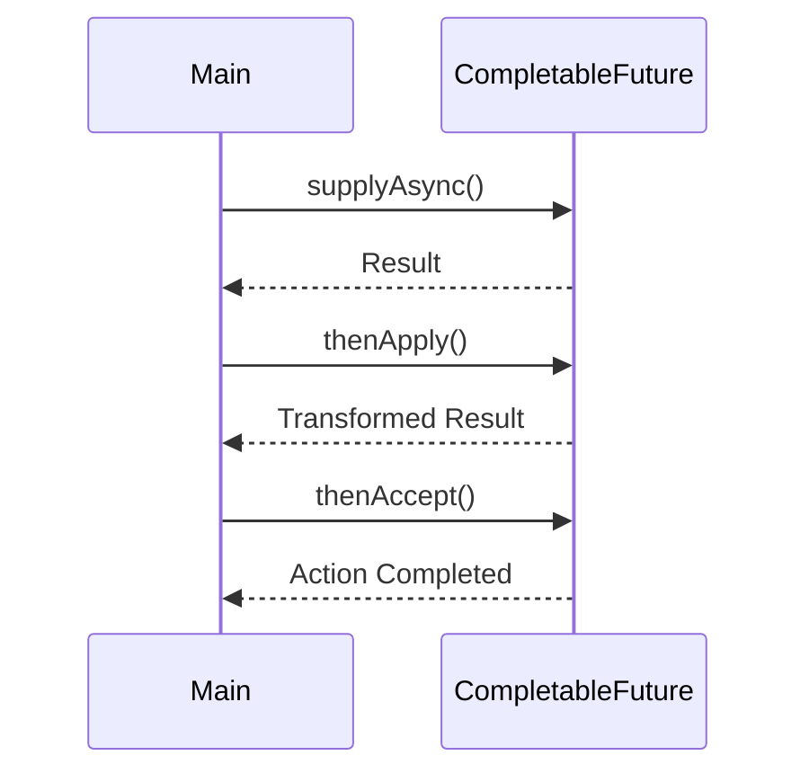

## 10.8.1 Composing Futures

### Introduction to CompletableFuture

In the realm of Java concurrency, `CompletableFuture` represents a significant advancement over the traditional `Future` interface. Introduced in Java 8, `CompletableFuture` is part of the `java.util.concurrent` package and provides a powerful framework for asynchronous programming. Unlike `Future`, which is limited to blocking operations to retrieve results, `CompletableFuture` allows developers to build non-blocking, asynchronous pipelines that can significantly enhance the performance and responsiveness of applications.

### Enhancements Over Future

The `Future` interface in Java provides a way to represent the result of an asynchronous computation. However, it has several limitations:

- **Blocking Nature**: To retrieve the result of a `Future`, one must call the `get()` method, which blocks the calling thread until the computation is complete.
- **Lack of Composition**: `Future` does not provide mechanisms to chain or combine multiple asynchronous tasks.
- **No Exception Handling**: Handling exceptions in `Future` requires additional boilerplate code.

`CompletableFuture` addresses these limitations by offering a rich set of methods for composing asynchronous tasks, handling exceptions, and performing non-blocking operations.

### Chaining Tasks with CompletableFuture

One of the key features of `CompletableFuture` is its ability to chain tasks. This is achieved through methods such as `thenApply`, `thenAccept`, and `thenCompose`. These methods allow developers to create complex asynchronous workflows with ease.

#### Using thenApply

The `thenApply` method is used to transform the result of a `CompletableFuture` once it is complete. It takes a `Function` as an argument and returns a new `CompletableFuture` that holds the transformed result.

```java
CompletableFuture<Integer> future = CompletableFuture.supplyAsync(() -> 5)
    .thenApply(result -> result * 2);

future.thenAccept(result -> System.out.println("Result: " + result));
```

In this example, the initial `CompletableFuture` supplies a value of `5`. The `thenApply` method doubles this value, and the final result is printed to the console.

#### Using thenAccept

The `thenAccept` method is similar to `thenApply`, but it is used when you want to perform an action with the result without returning a new value. It takes a `Consumer` as an argument.

```java
CompletableFuture.supplyAsync(() -> "Hello, World!")
    .thenAccept(message -> System.out.println("Message: " + message));
```

Here, the `thenAccept` method simply prints the message to the console.

#### Using thenCompose

The `thenCompose` method is used to flatten nested `CompletableFuture` instances. It is particularly useful when the next step in the pipeline is itself an asynchronous operation.

```java
CompletableFuture<Integer> future = CompletableFuture.supplyAsync(() -> 5)
    .thenCompose(result -> CompletableFuture.supplyAsync(() -> result * 2));

future.thenAccept(result -> System.out.println("Composed Result: " + result));
```

In this example, `thenCompose` is used to chain another asynchronous task that doubles the result.

### Building Asynchronous Pipelines

`CompletableFuture` enables the creation of complex asynchronous pipelines that can handle multiple tasks in sequence or in parallel. This is achieved through a combination of chaining methods and combining multiple `CompletableFuture` instances.

#### Sequential Execution

Sequential execution can be achieved by chaining multiple `CompletableFuture` instances using methods like `thenApply` and `thenCompose`.

```java
CompletableFuture.supplyAsync(() -> "Step 1")
    .thenApply(step1 -> step1 + " -> Step 2")
    .thenApply(step2 -> step2 + " -> Step 3")
    .thenAccept(finalResult -> System.out.println("Pipeline Result: " + finalResult));
```

This pipeline executes three steps sequentially, passing the result of each step to the next.

#### Parallel Execution

For parallel execution, `CompletableFuture` provides methods like `allOf` and `anyOf`, which allow multiple tasks to be executed concurrently.

```java
CompletableFuture<String> future1 = CompletableFuture.supplyAsync(() -> "Task 1");
CompletableFuture<String> future2 = CompletableFuture.supplyAsync(() -> "Task 2");

CompletableFuture<Void> combinedFuture = CompletableFuture.allOf(future1, future2);

combinedFuture.thenRun(() -> {
    try {
        System.out.println("All tasks completed: " + future1.get() + ", " + future2.get());
    } catch (Exception e) {
        e.printStackTrace();
    }
});
```

In this example, `allOf` is used to wait for both tasks to complete before proceeding.

### Benefits of Non-blocking Asynchronous Programming

Non-blocking asynchronous programming offers several advantages over traditional blocking approaches:

- **Improved Responsiveness**: Applications remain responsive to user interactions while performing background tasks.
- **Better Resource Utilization**: Threads are not blocked, allowing more efficient use of system resources.
- **Scalability**: Asynchronous programming can handle a larger number of concurrent tasks, making it suitable for high-load applications.

### Practical Applications and Real-world Scenarios

`CompletableFuture` is widely used in scenarios where non-blocking operations are essential, such as:

- **Web Services**: Handling multiple client requests concurrently without blocking server threads.
- **Data Processing**: Performing complex data transformations in parallel to improve throughput.
- **User Interfaces**: Keeping UI threads responsive while performing background computations.

### Historical Context and Evolution

The introduction of `CompletableFuture` in Java 8 marked a significant shift towards more expressive and flexible asynchronous programming models. Prior to this, developers relied on the `Future` interface and custom thread management, which often led to complex and error-prone code. `CompletableFuture` simplifies these tasks by providing a comprehensive API for composing and managing asynchronous operations.

### Code Examples and Experimentation

To fully grasp the power of `CompletableFuture`, it is beneficial to experiment with different chaining and combining techniques. Try modifying the code examples provided to explore various scenarios and observe how `CompletableFuture` handles asynchronous workflows.

### Alternative Implementations

While `CompletableFuture` is a powerful tool, Java also offers other concurrency utilities, such as the `ExecutorService` and `ForkJoinPool`. These can be used in conjunction with `CompletableFuture` to create even more robust asynchronous solutions.

### Visualizing CompletableFuture

To better understand the flow of asynchronous tasks, consider the following sequence diagram illustrating a simple `CompletableFuture` pipeline:



**Diagram Caption**: This sequence diagram illustrates the flow of a `CompletableFuture` pipeline, showing the chaining of asynchronous tasks.

### Conclusion

`CompletableFuture` is a versatile and powerful tool for building non-blocking, asynchronous applications in Java. By mastering its capabilities, developers can create efficient and responsive systems that leverage the full potential of modern hardware. As you continue to explore `CompletableFuture`, consider how its features can be applied to your own projects to improve performance and scalability.

### Key Takeaways

- `CompletableFuture` enhances the `Future` interface by providing non-blocking, composable asynchronous operations.
- Chaining methods like `thenApply`, `thenAccept`, and `thenCompose` enable the creation of complex asynchronous pipelines.
- Non-blocking programming improves responsiveness, resource utilization, and scalability.
- Experiment with `CompletableFuture` to discover its full potential in real-world applications.

### Reflection

Consider how you might apply `CompletableFuture` to your current projects. What asynchronous tasks could benefit from non-blocking execution? How can you leverage its chaining capabilities to simplify complex workflows?

### Common Pitfalls and How to Avoid Them

- **Blocking Calls**: Avoid using blocking calls like `get()` within asynchronous pipelines, as they negate the benefits of non-blocking execution.
- **Exception Handling**: Use methods like `exceptionally` and `handle` to manage exceptions gracefully within `CompletableFuture` chains.
- **Thread Management**: Be mindful of thread pool configurations to prevent resource exhaustion in high-load scenarios.

### Exercises and Practice Problems

1. Create a `CompletableFuture` pipeline that fetches data from multiple sources concurrently and combines the results.
2. Implement a non-blocking UI update using `CompletableFuture` to perform background computations.
3. Experiment with exception handling in `CompletableFuture` by simulating errors in asynchronous tasks.

### Related Patterns

- **[6.6 Singleton Pattern]( "Singleton Pattern")**: Explore how `CompletableFuture` can be used in conjunction with the Singleton pattern to manage shared resources asynchronously.

### Known Uses

- **Spring Framework**: Utilizes `CompletableFuture` for asynchronous processing in web applications.
- **JavaFX**: Employs `CompletableFuture` for non-blocking UI updates.

---

## Test Your Knowledge: Mastering CompletableFuture in Java



### What is a key advantage of `CompletableFuture` over `Future`?

- [x] Non-blocking operations
- [ ] Simpler syntax
- [ ] Better exception handling
- [ ] Improved performance

> **Explanation:** `CompletableFuture` provides non-blocking operations, allowing asynchronous tasks to be composed without blocking the calling thread.

### Which method is used to transform the result of a `CompletableFuture`?

- [x] thenApply
- [ ] thenAccept
- [ ] thenCompose
- [ ] thenRun

> **Explanation:** `thenApply` is used to transform the result of a `CompletableFuture` by applying a function to it.

### How can you execute multiple `CompletableFuture` tasks in parallel?

- [x] CompletableFuture.allOf()
- [ ] CompletableFuture.thenApply()
- [ ] CompletableFuture.thenAccept()
- [ ] CompletableFuture.supplyAsync()

> **Explanation:** `CompletableFuture.allOf()` is used to execute multiple tasks in parallel and wait for all of them to complete.

### What is the purpose of the `thenCompose` method?

- [x] To flatten nested `CompletableFuture` instances
- [ ] To handle exceptions
- [ ] To perform an action with the result
- [ ] To run a task asynchronously

> **Explanation:** `thenCompose` is used to flatten nested `CompletableFuture` instances, allowing for chaining of asynchronous tasks.

### Which method should be used to perform an action with the result of a `CompletableFuture` without returning a new value?

- [x] thenAccept
- [ ] thenApply
- [ ] thenCompose
- [ ] thenRun

> **Explanation:** `thenAccept` is used to perform an action with the result of a `CompletableFuture` without returning a new value.

### What is a common pitfall when using `CompletableFuture`?

- [x] Using blocking calls like `get()`
- [ ] Not using enough threads
- [ ] Overusing exception handling
- [ ] Ignoring performance

> **Explanation:** Using blocking calls like `get()` within asynchronous pipelines negates the benefits of non-blocking execution.

### How can exceptions be handled in a `CompletableFuture` chain?

- [x] Using exceptionally or handle methods
- [ ] Using try-catch blocks
- [ ] Using synchronized blocks
- [ ] Using finally blocks

> **Explanation:** Exceptions in a `CompletableFuture` chain can be handled using methods like `exceptionally` or `handle`.

### What is the benefit of non-blocking asynchronous programming?

- [x] Improved responsiveness
- [ ] Simpler code
- [ ] Reduced memory usage
- [ ] Easier debugging

> **Explanation:** Non-blocking asynchronous programming improves responsiveness by allowing applications to remain interactive while performing background tasks.

### Which Java version introduced `CompletableFuture`?

- [x] Java 8
- [ ] Java 7
- [ ] Java 9
- [ ] Java 11

> **Explanation:** `CompletableFuture` was introduced in Java 8 as part of the `java.util.concurrent` package.

### True or False: `CompletableFuture` can only be used for single-threaded applications.

- [ ] True
- [x] False

> **Explanation:** `CompletableFuture` is designed for asynchronous programming and can be used in multi-threaded applications to handle concurrent tasks.



---
