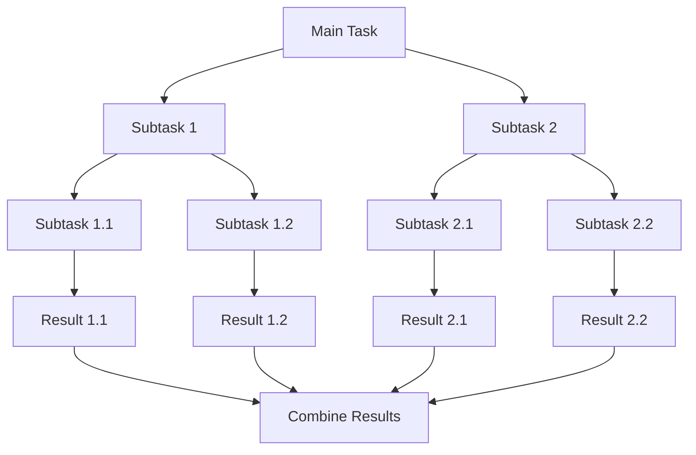

## 10.9.1 Using Parallel Streams

### Introduction to Java Streams

The Java Stream API, introduced in Java 8, revolutionized how developers handle collections of data. It provides a high-level abstraction for processing sequences of elements, allowing developers to write concise and readable code. Streams support operations such as filtering, mapping, and reducing, which can be chained to form complex data processing pipelines.

### Creating Parallel Streams

Parallel streams are a powerful feature of the Stream API that enable parallel processing of data collections. By leveraging multiple CPU cores, parallel streams can significantly reduce the time required to process large datasets. There are two primary ways to create parallel streams in Java:

1. **Using `parallelStream()`**: This method is available on Java collections and creates a parallel stream directly.

    ```java
    List<Integer> numbers = Arrays.asList(1, 2, 3, 4, 5, 6, 7, 8, 9, 10);
    numbers.parallelStream().forEach(System.out::println);
    ```

2. **Using `stream().parallel()`**: This method converts a sequential stream into a parallel stream.

    ```java
    List<Integer> numbers = Arrays.asList(1, 2, 3, 4, 5, 6, 7, 8, 9, 10);
    numbers.stream().parallel().forEach(System.out::println);
    ```

### Benefits of Parallel Streams

Parallel streams can significantly speed up data processing tasks, especially when dealing with large datasets. The key benefits include:

- **Improved Performance**: By distributing tasks across multiple threads, parallel streams can utilize all available CPU cores, leading to faster execution times.
- **Simplified Code**: Parallel streams abstract the complexity of multithreading, allowing developers to focus on the logic of their data processing tasks without worrying about thread management.

### Practical Applications of Parallel Streams

Parallel streams are particularly useful in scenarios where data processing tasks are CPU-bound and can be easily divided into independent subtasks. Some real-world applications include:

- **Data Analysis**: Processing large datasets to compute statistics or generate reports.
- **Image Processing**: Applying filters or transformations to large collections of images.
- **Financial Calculations**: Performing complex calculations on large sets of financial data.

### Example: Parallel Stream for Data Analysis

Consider a scenario where you need to calculate the sum of squares of a large list of numbers. Using a parallel stream can significantly speed up this computation:

```java
import java.util.List;
import java.util.stream.IntStream;

public class ParallelStreamExample {
    public static void main(String[] args) {
        List<Integer> numbers = IntStream.rangeClosed(1, 1000000).boxed().toList();

        long startTime = System.nanoTime();
        int sumOfSquares = numbers.parallelStream()
                                  .mapToInt(n -> n * n)
                                  .sum();
        long endTime = System.nanoTime();

        System.out.println("Sum of squares: " + sumOfSquares);
        System.out.println("Time taken: " + (endTime - startTime) / 1_000_000 + " ms");
    }
}
```

### Understanding the Fork/Join Framework

Parallel streams in Java are built on top of the Fork/Join framework, introduced in Java 7. This framework is designed to efficiently execute tasks that can be broken down into smaller subtasks. It uses a work-stealing algorithm to balance the load across available threads, ensuring optimal utilization of CPU resources.

#### How Fork/Join Works

The Fork/Join framework divides a task into smaller subtasks, which are then executed in parallel. If a subtask is too large, it is further divided into smaller subtasks. Once all subtasks are completed, their results are combined to produce the final result.



*Diagram: Fork/Join Framework Task Division*

### Best Practices for Using Parallel Streams

While parallel streams offer significant performance benefits, they should be used judiciously. Here are some best practices to consider:

- **Assess Task Suitability**: Ensure that the task is CPU-bound and can be divided into independent subtasks.
- **Avoid Shared Mutable State**: Parallel streams work best when tasks do not share mutable state, as this can lead to race conditions and inconsistent results.
- **Monitor Performance**: Use profiling tools to measure the performance of parallel streams and ensure that they provide a tangible benefit over sequential streams.

### Common Pitfalls and How to Avoid Them

1. **Overhead of Parallelism**: For small datasets, the overhead of managing multiple threads can outweigh the benefits of parallelism. Use parallel streams only when processing large datasets.

2. **Thread Safety**: Ensure that operations performed within parallel streams are thread-safe. Avoid modifying shared data structures without proper synchronization.

3. **Order Sensitivity**: Parallel streams may not preserve the order of elements. If order is important, consider using `forEachOrdered()` instead of `forEach()`.

### Exercises and Practice Problems

1. **Exercise**: Modify the example code to calculate the sum of cubes instead of squares. Measure the performance difference between sequential and parallel streams.

2. **Challenge**: Implement a parallel stream to process a large collection of text files and count the frequency of each word. Compare the performance with a sequential stream implementation.

### Summary and Key Takeaways

- Parallel streams provide a simple and effective way to leverage multicore processors for data processing tasks.
- They are built on the Fork/Join framework, which efficiently manages task division and execution.
- Use parallel streams for CPU-bound tasks that can be divided into independent subtasks.
- Avoid shared mutable state and ensure thread safety when using parallel streams.

### Further Reading and Resources

- [Java Streams Documentation](https://docs.oracle.com/javase/8/docs/api/java/util/stream/package-summary.html)
- [Fork/Join Framework Documentation](https://docs.oracle.com/javase/tutorial/essential/concurrency/forkjoin.html)
- [Java Concurrency in Practice](https://www.oreilly.com/library/view/java-concurrency-in/0321349601/)

---

## Test Your Knowledge: Java Parallel Streams Quiz



### What is the primary advantage of using parallel streams in Java?

- [x] They utilize multiple CPU cores for faster data processing.
- [ ] They simplify the syntax of stream operations.
- [ ] They automatically handle exceptions in stream operations.
- [ ] They ensure thread safety in all operations.

> **Explanation:** Parallel streams distribute tasks across multiple CPU cores, leading to faster execution times for large datasets.

### How can you create a parallel stream from a collection in Java?

- [x] Using `parallelStream()`
- [x] Using `stream().parallel()`
- [ ] Using `stream().sequential()`
- [ ] Using `stream().unordered()`

> **Explanation:** Both `parallelStream()` and `stream().parallel()` can be used to create parallel streams from a collection.

### Which framework underlies the implementation of parallel streams in Java?

- [x] Fork/Join Framework
- [ ] Executor Framework
- [ ] Thread Pool Framework
- [ ] Reactive Streams Framework

> **Explanation:** The Fork/Join framework is the underlying mechanism that supports parallel stream execution in Java.

### What is a potential drawback of using parallel streams for small datasets?

- [x] The overhead of managing multiple threads can outweigh performance benefits.
- [ ] They cannot be used with collections.
- [ ] They always consume more memory.
- [ ] They are not compatible with lambda expressions.

> **Explanation:** For small datasets, the overhead of parallelism may negate any performance gains.

### Which method should be used if the order of elements is important in a parallel stream?

- [x] `forEachOrdered()`
- [ ] `forEach()`
- [ ] `collect()`
- [ ] `map()`

> **Explanation:** `forEachOrdered()` ensures that the order of elements is preserved in a parallel stream.

### What type of tasks are best suited for parallel streams?

- [x] CPU-bound tasks
- [ ] I/O-bound tasks
- [ ] Network-bound tasks
- [ ] Memory-bound tasks

> **Explanation:** Parallel streams are most effective for CPU-bound tasks that can be divided into independent subtasks.

### What should be avoided when using parallel streams to prevent race conditions?

- [x] Shared mutable state
- [ ] Immutable objects
- [ ] Stateless operations
- [ ] Pure functions

> **Explanation:** Shared mutable state can lead to race conditions and should be avoided in parallel streams.

### Which Java version introduced the Stream API?

- [x] Java 8
- [ ] Java 7
- [ ] Java 9
- [ ] Java 11

> **Explanation:** The Stream API was introduced in Java 8.

### What is the role of the Fork/Join framework in parallel streams?

- [x] It manages task division and execution across multiple threads.
- [ ] It provides a user interface for stream operations.
- [ ] It ensures data consistency in streams.
- [ ] It handles exceptions in stream operations.

> **Explanation:** The Fork/Join framework efficiently manages the division and execution of tasks in parallel streams.

### True or False: Parallel streams always provide better performance than sequential streams.

- [ ] True
- [x] False

> **Explanation:** Parallel streams can provide better performance for large datasets, but for small datasets, the overhead may negate any performance gains.



---
