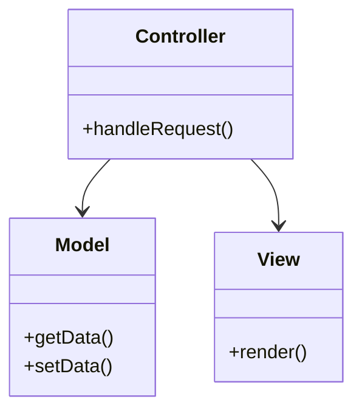
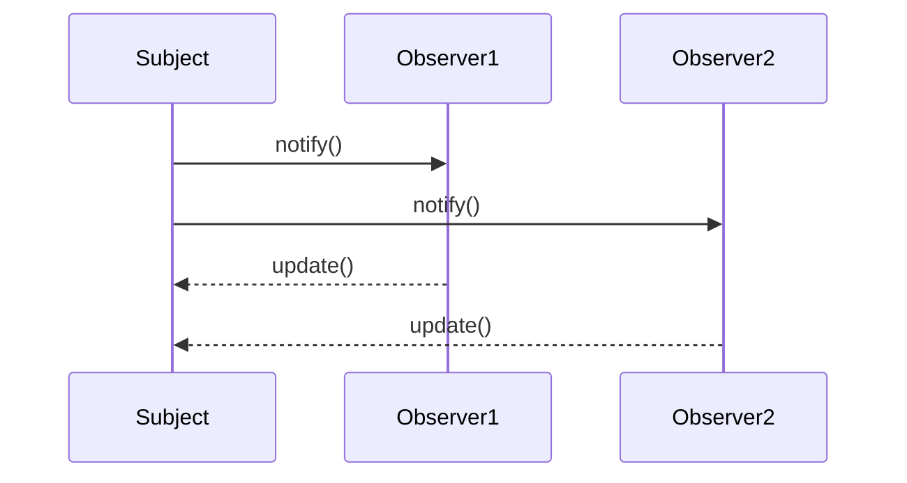
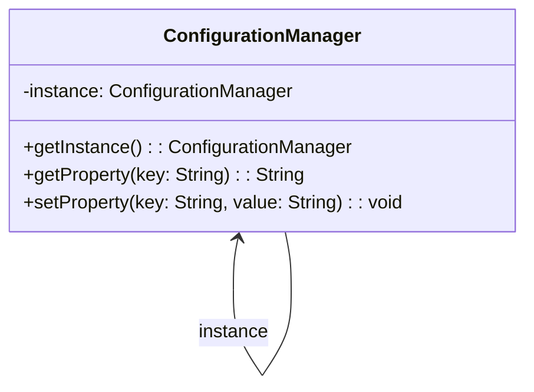

## 11.1 Applying Design Patterns in Java Projects

Design patterns are essential tools in a software engineer's toolkit, offering proven solutions to common problems in software design. In this section, we will delve into real-world Java projects across various domains, demonstrating how design patterns can be effectively applied to enhance software architecture, improve maintainability, and address specific challenges. Through detailed walkthroughs, we'll explore the context, implementation, benefits, and lessons learned from each case study.

### Diverse Case Studies

To illustrate the versatility and effectiveness of design patterns, we have selected projects from different domains, including web development, mobile applications, and desktop software. Each case study highlights specific design patterns and their impact on the project's success.

#### Case Study 1: Web Development with the MVC Pattern

**Project Overview**: A dynamic e-commerce platform built using Java and Spring Framework.

**Context and Problem**: The project required a scalable architecture to handle a large number of users and transactions. The challenge was to separate concerns effectively to facilitate maintenance and future enhancements.

**Design Pattern Applied**: Model-View-Controller (MVC)

**Implementation**:
- **Model**: Represents the application's data and business logic. In this project, Java classes were used to define entities and business rules.
- **View**: Handles the presentation layer. JSP (JavaServer Pages) and Thymeleaf templates were used to render dynamic content.
- **Controller**: Manages user input and updates the model and view. Spring MVC controllers were employed to handle HTTP requests.

```java
@Controller
public class ProductController {

    @Autowired
    private ProductService productService;

    @GetMapping("/products")
    public String listProducts(Model model) {
        model.addAttribute("products", productService.findAll());
        return "productList";
    }

    @PostMapping("/product")
    public String addProduct(@ModelAttribute Product product) {
        productService.save(product);
        return "redirect:/products";
    }
}
```

**Benefits Achieved**:
- **Separation of Concerns**: The MVC pattern clearly delineated responsibilities, making the codebase easier to manage and extend.
- **Scalability**: The architecture supported scaling by allowing independent development and testing of components.
- **Maintainability**: Changes in the presentation layer did not affect business logic, reducing the risk of bugs.

**Challenges and Solutions**:
- **Complexity in Data Binding**: Initially, there were issues with binding complex data structures. This was resolved by using Spring's data binding capabilities and custom converters.
- **Performance Bottlenecks**: As the user base grew, performance issues arose. Caching strategies were implemented to alleviate these bottlenecks.

**Lessons Learned**:
- **Importance of Clear Interfaces**: Defining clear interfaces between the model, view, and controller components was crucial for smooth integration.
- **Regular Refactoring**: Continuous refactoring helped maintain code quality as new features were added.

**Encourage Experimentation**: Try implementing the MVC pattern in your web projects. Start with a simple CRUD application and gradually introduce more complexity.

#### Case Study 2: Mobile Application with the Observer Pattern

**Project Overview**: A real-time weather application for Android devices.

**Context and Problem**: The application needed to update the user interface in response to changes in weather data without blocking the main thread.

**Design Pattern Applied**: Observer Pattern

**Implementation**:
- **Subject**: The weather data provider acted as the subject, notifying observers of any changes.
- **Observers**: Various UI components subscribed to updates from the weather data provider.

```java
public class WeatherData extends Observable {
    private float temperature;
    private float humidity;

    public void measurementsChanged() {
        setChanged();
        notifyObservers();
    }

    public void setMeasurements(float temperature, float humidity) {
        this.temperature = temperature;
        this.humidity = humidity;
        measurementsChanged();
    }
}

public class CurrentConditionsDisplay implements Observer {
    private float temperature;
    private float humidity;

    @Override
    public void update(Observable o, Object arg) {
        if (o instanceof WeatherData) {
            WeatherData weatherData = (WeatherData) o;
            this.temperature = weatherData.getTemperature();
            this.humidity = weatherData.getHumidity();
            display();
        }
    }

    public void display() {
        System.out.println("Current conditions: " + temperature + "F degrees and " + humidity + "% humidity");
    }
}
```

**Benefits Achieved**:
- **Decoupled Components**: The observer pattern decoupled the weather data provider from the UI components, allowing independent development.
- **Responsive UI**: The UI updated in real-time without blocking the main thread, enhancing user experience.

**Challenges and Solutions**:
- **Thread Safety**: Ensuring thread safety was a challenge. This was addressed by using synchronized blocks and Android's `Handler` class for UI updates.
- **Managing Multiple Observers**: As the number of observers grew, managing them became complex. A registry was implemented to handle observer subscriptions efficiently.

**Lessons Learned**:
- **Use of Weak References**: To prevent memory leaks, weak references were used for observer objects.
- **Testing with Mock Data**: Testing the observer pattern with mock data helped identify potential issues early in the development process.

**Encourage Experimentation**: Implement the observer pattern in your mobile applications. Experiment with different types of observers and subjects to see how they interact.

#### Case Study 3: Desktop Software with the Singleton Pattern

**Project Overview**: A desktop application for managing personal finances.

**Context and Problem**: The application required a centralized configuration manager to handle settings and preferences across different modules.

**Design Pattern Applied**: Singleton Pattern

**Implementation**:
- A singleton class was created to manage application settings, ensuring only one instance existed throughout the application lifecycle.

```java
public class ConfigurationManager {

    private static ConfigurationManager instance;
    private Properties properties;

    private ConfigurationManager() {
        properties = new Properties();
        // Load properties from a file or database
    }

    public static synchronized ConfigurationManager getInstance() {
        if (instance == null) {
            instance = new ConfigurationManager();
        }
        return instance;
    }

    public String getProperty(String key) {
        return properties.getProperty(key);
    }

    public void setProperty(String key, String value) {
        properties.setProperty(key, value);
    }
}
```

**Benefits Achieved**:
- **Centralized Configuration**: The singleton pattern provided a single point of access for configuration settings, simplifying management.
- **Consistency**: Ensured consistent configuration across different modules of the application.

**Challenges and Solutions**:
- **Thread Safety**: Initial implementations were not thread-safe. This was resolved by synchronizing the `getInstance` method.
- **Testing**: Testing singleton behavior was challenging. Dependency injection was used to inject mock configurations during testing.

**Lessons Learned**:
- **Lazy Initialization**: Using lazy initialization helped optimize resource usage.
- **Avoiding Overuse**: Singleton should be used judiciously to avoid tight coupling and testing difficulties.

**Encourage Experimentation**: Try implementing a singleton pattern in your desktop applications. Consider different initialization strategies and their impact on performance.

### Visualizing Design Patterns

To further aid understanding, let's visualize the interaction of these patterns using Mermaid.js diagrams.

#### MVC Pattern Diagram



**Description**: This diagram illustrates the interaction between the Model, View, and Controller in the MVC pattern. The Controller handles user input, updates the Model, and triggers the View to render.

#### Observer Pattern Diagram



**Description**: This sequence diagram shows how the Subject notifies multiple Observers of changes, and how Observers update themselves in response.

#### Singleton Pattern Diagram



**Description**: This class diagram depicts the Singleton pattern, highlighting the single instance and its methods for accessing and modifying configuration properties.

### References and Links

For further reading on design patterns and their applications, consider the following resources:

- [Design Patterns: Elements of Reusable Object-Oriented Software](https://en.wikipedia.org/wiki/Design_Patterns) by Erich Gamma et al.
- [Spring Framework Documentation](https://spring.io/projects/spring-framework) for insights on MVC and other patterns in web development.
- [Android Developer Documentation](https://developer.android.com/docs) for implementing patterns in mobile applications.

### Knowledge Check

Before we conclude, let's reinforce what we've learned with a few questions:

1. How does the MVC pattern help in separating concerns in web applications?
2. What are the benefits of using the Observer pattern in mobile applications?
3. Why is thread safety important in Singleton implementations?
4. How can you prevent memory leaks when using the Observer pattern?
5. What are the advantages of using design patterns in software development?

### Embrace the Journey

Remember, applying design patterns is an iterative process. As you gain experience, you'll develop an intuition for recognizing opportunities to use patterns effectively. Keep experimenting, stay curious, and enjoy the journey of mastering design patterns in Java!

## Quiz Time!



### What is the primary benefit of using the MVC pattern in web applications?

- [x] Separation of concerns
- [ ] Improved performance
- [ ] Reduced code size
- [ ] Increased complexity

> **Explanation:** The MVC pattern separates concerns by dividing the application into Model, View, and Controller components, making it easier to manage and extend.

### Which design pattern is most suitable for updating UI components in response to data changes?

- [ ] Singleton
- [x] Observer
- [ ] Factory
- [ ] Strategy

> **Explanation:** The Observer pattern is ideal for updating UI components as it allows objects to subscribe to changes in data and update themselves accordingly.

### In a Singleton pattern, what is a common method to ensure thread safety?

- [ ] Using a static block
- [x] Synchronizing the getInstance method
- [ ] Using multiple instances
- [ ] Avoiding lazy initialization

> **Explanation:** Synchronizing the `getInstance` method ensures that only one thread can access the method at a time, preventing multiple instances from being created.

### How can memory leaks be prevented when using the Observer pattern in mobile applications?

- [x] Using weak references for observers
- [ ] Increasing memory allocation
- [ ] Using strong references for observers
- [ ] Avoiding observer patterns

> **Explanation:** Using weak references for observers prevents memory leaks by allowing the garbage collector to reclaim observer objects when they are no longer in use.

### What is a key advantage of using design patterns in software development?

- [x] Improved maintainability
- [ ] Increased code duplication
- [ ] Reduced flexibility
- [ ] Decreased readability

> **Explanation:** Design patterns improve maintainability by providing structured solutions to common problems, making the code easier to understand and modify.

### Which pattern is used to provide a single point of access to configuration settings?

- [ ] Observer
- [ ] Factory
- [x] Singleton
- [ ] Strategy

> **Explanation:** The Singleton pattern is used to provide a single point of access to configuration settings, ensuring consistency across the application.

### What is a common challenge when implementing the Observer pattern?

- [ ] Ensuring multiple instances
- [x] Managing multiple observers
- [ ] Avoiding data changes
- [ ] Reducing code size

> **Explanation:** Managing multiple observers can be challenging, especially as the number of observers grows, requiring efficient handling of subscriptions and notifications.

### How does the Singleton pattern ensure only one instance is created?

- [x] By using a private constructor and a static method
- [ ] By using multiple constructors
- [ ] By allowing multiple instances
- [ ] By using public constructors

> **Explanation:** The Singleton pattern uses a private constructor and a static method to control the instantiation process, ensuring only one instance is created.

### What is a benefit of using weak references in the Observer pattern?

- [x] Preventing memory leaks
- [ ] Increasing memory usage
- [ ] Ensuring strong references
- [ ] Reducing observer count

> **Explanation:** Weak references help prevent memory leaks by allowing the garbage collector to reclaim observer objects when they are no longer needed.

### True or False: Design patterns are only applicable to web development projects.

- [ ] True
- [x] False

> **Explanation:** Design patterns are applicable across various domains, including web development, mobile applications, desktop software, and more.



By exploring these case studies and applying the concepts in your projects, you'll gain a deeper understanding of how design patterns can transform your software development process. Keep experimenting and refining your skills to become a master of design patterns in Java!
