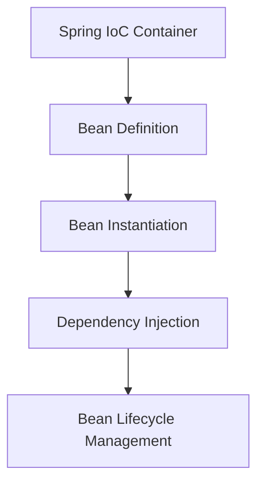
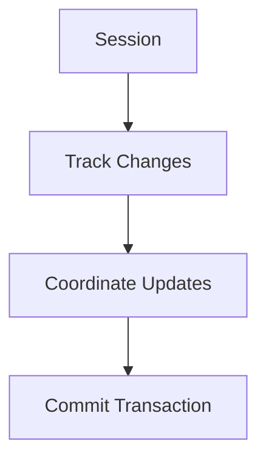

## 11.2 Design Patterns in Popular Java Frameworks

In the realm of Java development, frameworks play a pivotal role in simplifying complex tasks and promoting best practices. These frameworks leverage design patterns to provide robust and flexible solutions, enabling developers to focus on business logic rather than boilerplate code. In this section, we will explore how popular Java frameworks such as Spring, Hibernate, Apache Struts, and JavaServer Faces (JSF) employ design patterns to enhance functionality and extensibility.

### Key Frameworks and Their Primary Purposes

#### Spring Framework

The Spring Framework is a comprehensive framework for enterprise Java development. It provides infrastructure support for developing Java applications, allowing developers to focus on business logic. Spring is renowned for its Inversion of Control (IoC) and Dependency Injection (DI) capabilities, which promote loose coupling and enhance testability.

#### Hibernate

Hibernate is an object-relational mapping (ORM) framework that simplifies database interactions by mapping Java objects to database tables. It abstracts the complexities of database operations, allowing developers to work with high-level object-oriented concepts rather than SQL.

#### Apache Struts

Apache Struts is a framework for building web applications. It follows the Model-View-Controller (MVC) design pattern, which separates the application's logic, user interface, and control flow, promoting organized and maintainable code.

#### JavaServer Faces (JSF)

JSF is a Java specification for building component-based user interfaces for web applications. It simplifies the development integration of web-based user interfaces by providing a set of reusable UI components.

### Pattern Analysis

#### Spring Framework

**Dependency Injection and Inversion of Control**

Spring's core feature is its IoC container, which manages the lifecycle and configuration of application objects. The Dependency Injection pattern is integral to this process, allowing developers to inject dependencies into objects rather than having objects create them.

```java
// Example of Dependency Injection in Spring
@Component
public class UserService {

    private final UserRepository userRepository;

    @Autowired
    public UserService(UserRepository userRepository) {
        this.userRepository = userRepository;
    }

    // Business logic methods
}
```

**Benefits**: This pattern promotes loose coupling, making the application easier to test and maintain. By decoupling the creation of objects from their usage, Spring allows for greater flexibility and configurability.

**Aspect-Oriented Programming (AOP)**

Spring's AOP module allows developers to define cross-cutting concerns such as logging, security, and transaction management separately from the business logic. This is achieved through the use of the Proxy pattern.

```java
// Example of AOP in Spring
@Aspect
public class LoggingAspect {

    @Before("execution(* com.example.service.*.*(..))")
    public void logBefore(JoinPoint joinPoint) {
        System.out.println("Method called: " + joinPoint.getSignature().getName());
    }
}
```

**Benefits**: AOP enables the separation of concerns, improving code modularity and reducing code duplication.

#### Hibernate

**Repository Pattern**

Hibernate uses the Repository pattern to encapsulate data access logic. This pattern provides a collection-like interface for accessing domain objects, abstracting the underlying database interactions.

```java
// Example of a Repository in Hibernate
@Repository
public class UserRepository {

    @PersistenceContext
    private EntityManager entityManager;

    public User findById(Long id) {
        return entityManager.find(User.class, id);
    }

    // Other CRUD operations
}
```

**Benefits**: The Repository pattern simplifies data access by providing a consistent API for CRUD operations, enhancing maintainability and testability.

**Unit of Work Pattern**

Hibernate's session management is an implementation of the Unit of Work pattern. This pattern tracks changes to objects and coordinates the writing of changes to the database in a single transaction.

```java
// Example of Unit of Work in Hibernate
Session session = sessionFactory.openSession();
Transaction transaction = session.beginTransaction();

User user = session.get(User.class, userId);
user.setName("New Name");
session.update(user);

transaction.commit();
session.close();
```

**Benefits**: This pattern ensures data consistency and integrity by managing transactions effectively.

#### Apache Struts

**Model-View-Controller (MVC) Pattern**

Struts follows the MVC pattern, which separates the application into three interconnected components: Model, View, and Controller. This separation promotes organized and maintainable code.

```java
// Example of MVC in Struts
// Action class (Controller)
public class LoginAction extends Action {

    public ActionForward execute(ActionMapping mapping, ActionForm form,
                                 HttpServletRequest request, HttpServletResponse response) {
        LoginForm loginForm = (LoginForm) form;
        // Business logic
        return mapping.findForward("success");
    }
}

// JSP page (View)
<%@ taglib uri="http://struts.apache.org/tags-html" prefix="html" %>
<html:form action="/login">
    <html:text property="username"/>
    <html:password property="password"/>
    <html:submit value="Login"/>
</html:form>
```

**Benefits**: The MVC pattern enhances code organization by separating concerns, making the application easier to manage and scale.

#### JavaServer Faces (JSF)

**Component-Based Architecture**

JSF employs a component-based architecture, where UI components are represented as Java objects. This approach follows the Composite pattern, allowing developers to build complex UIs by composing simple components.

```xml
<!-- Example of JSF component -->
<h:form>
    <h:inputText value="#{userBean.username}" />
    <h:commandButton value="Submit" action="#{userBean.submit}" />
</h:form>
```

**Benefits**: The component-based architecture simplifies UI development by providing reusable components, reducing development time and effort.

### Code Exploration

Let's delve deeper into how these frameworks implement these patterns internally, using code samples and diagrams to illustrate complex concepts.

#### Spring Framework: Dependency Injection

Spring's IoC container uses reflection and configuration metadata to manage object lifecycles and dependencies. The following diagram illustrates the process:



**Explanation**: The IoC container reads bean definitions, instantiates beans, injects dependencies, and manages the bean lifecycle, promoting loose coupling and configurability.

#### Hibernate: Unit of Work

Hibernate's session management tracks changes to objects and coordinates database updates. The following diagram illustrates the Unit of Work pattern:



**Explanation**: The session tracks changes to objects, coordinates updates, and commits them in a single transaction, ensuring data consistency.

### Benefits to Developers

Understanding these patterns can help developers use the frameworks more effectively by:

- **Enhancing Problem-Solving**: Recognizing patterns allows developers to identify and apply solutions to common problems quickly.
- **Facilitating Customization**: Knowledge of patterns enables developers to extend and customize framework components to suit specific needs.
- **Improving Code Quality**: Adhering to patterns promotes best practices, resulting in cleaner, more maintainable code.

### Custom Implementations

Developers can extend or customize framework components using design patterns. Here are some examples:

#### Extending Spring with Custom Beans

Developers can create custom beans and inject them into the Spring context to extend functionality.

```java
// Custom bean
@Component
public class CustomService {

    public void performTask() {
        // Custom logic
    }
}

// Injecting custom bean
@Component
public class TaskManager {

    private final CustomService customService;

    @Autowired
    public TaskManager(CustomService customService) {
        this.customService = customService;
    }

    public void execute() {
        customService.performTask();
    }
}
```

#### Customizing Hibernate with Interceptors

Hibernate allows developers to implement custom interceptors to modify data access behavior.

```java
// Custom interceptor
public class AuditInterceptor extends EmptyInterceptor {

    @Override
    public boolean onSave(Object entity, Serializable id, Object[] state, String[] propertyNames, Type[] types) {
        // Custom audit logic
        return super.onSave(entity, id, state, propertyNames, types);
    }
}

// Configuring interceptor
SessionFactory sessionFactory = new Configuration()
    .setInterceptor(new AuditInterceptor())
    .buildSessionFactory();
```

### Best Practices

To utilize framework features efficiently, developers should:

- **Adhere to Patterns**: Follow the patterns promoted by the framework for consistency and maintainability.
- **Leverage Framework Features**: Use built-in features and components to reduce development time and effort.
- **Stay Updated**: Keep up with framework updates and best practices to leverage new features and improvements.

### Conclusion

Design patterns are integral to the functionality and extensibility of popular Java frameworks. By understanding and applying these patterns, developers can enhance their problem-solving skills, improve code quality, and customize frameworks to meet specific needs. As you continue your journey in Java development, remember to embrace the power of design patterns and leverage them to build robust and maintainable applications.

## Quiz Time!



### Which design pattern is central to the Spring Framework's core functionality?

- [x] Dependency Injection
- [ ] Singleton
- [ ] Factory Method
- [ ] Observer

> **Explanation:** Dependency Injection is central to Spring's core functionality, promoting loose coupling and enhancing testability.

### What pattern does Hibernate use to manage session transactions?

- [ ] Factory Method
- [x] Unit of Work
- [ ] Observer
- [ ] Strategy

> **Explanation:** Hibernate uses the Unit of Work pattern to manage session transactions, ensuring data consistency and integrity.

### Which pattern does Apache Struts primarily follow?

- [ ] Singleton
- [x] Model-View-Controller (MVC)
- [ ] Factory Method
- [ ] Observer

> **Explanation:** Apache Struts primarily follows the MVC pattern, separating application logic, user interface, and control flow.

### In JSF, what pattern is used to represent UI components as Java objects?

- [ ] Singleton
- [ ] Factory Method
- [x] Composite
- [ ] Observer

> **Explanation:** JSF uses the Composite pattern to represent UI components as Java objects, allowing complex UIs to be built by composing simple components.

### How does Spring's AOP module implement cross-cutting concerns?

- [ ] Factory Method
- [ ] Singleton
- [x] Proxy
- [ ] Observer

> **Explanation:** Spring's AOP module uses the Proxy pattern to implement cross-cutting concerns like logging and security.

### What is the primary benefit of using the Repository pattern in Hibernate?

- [ ] Enhancing performance
- [x] Simplifying data access
- [ ] Reducing memory usage
- [ ] Improving security

> **Explanation:** The Repository pattern simplifies data access by providing a consistent API for CRUD operations, enhancing maintainability and testability.

### Which pattern does Spring use to manage object lifecycles and dependencies?

- [x] Dependency Injection
- [ ] Observer
- [ ] Factory Method
- [ ] Singleton

> **Explanation:** Spring uses Dependency Injection to manage object lifecycles and dependencies, promoting loose coupling and configurability.

### What pattern is used in Hibernate to track changes to objects?

- [ ] Singleton
- [x] Unit of Work
- [ ] Observer
- [ ] Strategy

> **Explanation:** Hibernate uses the Unit of Work pattern to track changes to objects and coordinate database updates.

### Which pattern does JSF use to simplify UI development?

- [ ] Singleton
- [ ] Factory Method
- [x] Composite
- [ ] Observer

> **Explanation:** JSF uses the Composite pattern to simplify UI development by providing reusable components.

### True or False: Understanding design patterns in frameworks can help developers customize components more effectively.

- [x] True
- [ ] False

> **Explanation:** Understanding design patterns in frameworks can help developers customize components more effectively by leveraging patterns to solve common problems and extend functionality.


