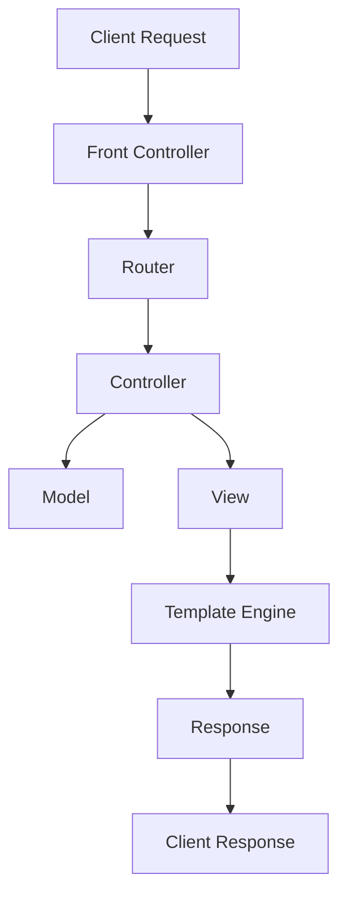

## 11.3 Building a Web Framework Using Design Patterns

In this section, we'll embark on an exciting journey to build a simple web framework from scratch using Java. Our primary goal is to demonstrate the practical utility of design patterns in framework development. By the end of this guide, you'll have a solid understanding of how to leverage design patterns to create a modular, maintainable, and extensible web framework.

### Define Framework Goals

Before we dive into the implementation, let's clearly define the objectives, scope, and features of the mini web framework we aim to develop. Our framework will:

- **Handle HTTP Requests and Responses**: Provide a mechanism to route incoming HTTP requests to appropriate handlers and generate responses.
- **Support MVC Architecture**: Implement the Model-View-Controller pattern to separate concerns and facilitate maintainability.
- **Enable Template Rendering**: Allow dynamic generation of HTML content using templates.
- **Provide a Simple Routing Mechanism**: Map URLs to specific controller actions.
- **Ensure Extensibility**: Design the framework to be easily extendable with additional features.

These goals are achievable within the scope of this educational guide and will provide a solid foundation for understanding web framework development.

### Architectural Overview

To build our web framework, we'll employ several design patterns that are well-suited for this task. Here's a high-level architectural diagram showcasing how different design patterns fit into the framework:



#### Explanation of Design Patterns

- **Front Controller Pattern**: Acts as a single entry point for handling all client requests. It delegates requests to appropriate handlers, reducing the complexity of request processing.
- **Model-View-Controller (MVC) Pattern**: Separates the application into three interconnected components: Model (business logic), View (UI representation), and Controller (handles user input and updates the model).
- **Template Method Pattern**: Defines the skeleton of an algorithm in a method, deferring some steps to subclasses. It allows subclasses to redefine certain steps without changing the algorithm's structure.

### Step-by-Step Implementation

Let's break down the development process into logical steps, each focusing on implementing specific patterns.

#### Step 1: Setting Up the Project

Create a new Java project and set up the necessary directory structure. We'll use Maven for dependency management and build automation.

```bash
mvn archetype:generate -DgroupId=com.example.webframework -DartifactId=webframework -DarchetypeArtifactId=maven-archetype-quickstart -DinteractiveMode=false
```

#### Step 2: Implementing the Front Controller

The Front Controller will serve as the central point for handling all incoming requests. We'll create a `FrontController` class that delegates requests to the appropriate controllers.

```java
// FrontController.java
package com.example.webframework;

import java.util.HashMap;
import java.util.Map;

public class FrontController {
    private Map<String, Controller> routes = new HashMap<>();

    public void registerRoute(String path, Controller controller) {
        routes.put(path, controller);
    }

    public void handleRequest(String path) {
        Controller controller = routes.get(path);
        if (controller != null) {
            controller.execute();
        } else {
            System.out.println("404 Not Found");
        }
    }
}
```

#### Step 3: Defining the Controller Interface

We'll define a `Controller` interface that all controllers will implement. This interface will have an `execute` method that handles the request.

```java
// Controller.java
package com.example.webframework;

public interface Controller {
    void execute();
}
```

#### Step 4: Implementing the MVC Components

Next, we'll implement the MVC components. We'll start with a simple `Model` class that holds data, a `View` class that renders the UI, and a `Controller` class that processes user input.

```java
// Model.java
package com.example.webframework;

public class Model {
    private String data;

    public String getData() {
        return data;
    }

    public void setData(String data) {
        this.data = data;
    }
}

// View.java
package com.example.webframework;

public class View {
    public void render(String data) {
        System.out.println("Rendering view with data: " + data);
    }
}

// SampleController.java
package com.example.webframework;

public class SampleController implements Controller {
    private Model model;
    private View view;

    public SampleController(Model model, View view) {
        this.model = model;
        this.view = view;
    }

    @Override
    public void execute() {
        model.setData("Hello, World!");
        view.render(model.getData());
    }
}
```

#### Step 5: Implementing the Template Engine

The Template Method pattern will be used in our template engine to allow dynamic content generation. We'll create a `TemplateEngine` class that defines the template rendering process.

```java
// TemplateEngine.java
package com.example.webframework;

public abstract class TemplateEngine {
    public final void renderTemplate(String template, Model model) {
        String content = parseTemplate(template, model);
        System.out.println("Rendering template: " + content);
    }

    protected abstract String parseTemplate(String template, Model model);
}

// SimpleTemplateEngine.java
package com.example.webframework;

public class SimpleTemplateEngine extends TemplateEngine {
    @Override
    protected String parseTemplate(String template, Model model) {
        return template.replace("{{data}}", model.getData());
    }
}
```

### Testing and Validation

Testing is crucial to ensure the framework functions correctly. We'll use JUnit for unit testing our components.

```java
// FrontControllerTest.java
package com.example.webframework;

import org.junit.jupiter.api.Test;
import static org.junit.jupiter.api.Assertions.*;

class FrontControllerTest {
    @Test
    void testHandleRequest() {
        FrontController frontController = new FrontController();
        Model model = new Model();
        View view = new View();
        Controller controller = new SampleController(model, view);

        frontController.registerRoute("/hello", controller);
        frontController.handleRequest("/hello");

        assertEquals("Hello, World!", model.getData());
    }
}
```

### Usage Examples

Let's demonstrate how to build a simple web application using our custom framework. We'll create a main class to initialize the framework and handle requests.

```java
// Main.java
package com.example.webframework;

public class Main {
    public static void main(String[] args) {
        FrontController frontController = new FrontController();
        Model model = new Model();
        View view = new View();
        Controller controller = new SampleController(model, view);

        frontController.registerRoute("/hello", controller);
        frontController.handleRequest("/hello");
    }
}
```

### Lessons and Best Practices

Reflecting on the development process, we can highlight several lessons and best practices:

- **Modularity**: By using design patterns, we achieved a modular architecture that separates concerns and facilitates maintainability.
- **Extensibility**: The framework is designed to be easily extendable with additional features, such as more complex routing or advanced template engines.
- **Testing**: Writing tests for each component ensures the framework's reliability and helps catch bugs early in the development process.

### Try It Yourself

Encourage experimentation by suggesting modifications to the code examples. Try adding new routes, implementing more complex controllers, or enhancing the template engine with additional features.

### Quiz Time!



### What is the primary role of the Front Controller pattern in a web framework?

- [x] To act as a single entry point for handling all client requests
- [ ] To separate business logic from presentation
- [ ] To define the skeleton of an algorithm
- [ ] To encapsulate data for transfer

> **Explanation:** The Front Controller pattern serves as a single entry point for handling all client requests, delegating them to appropriate handlers.

### Which design pattern is used to separate the application into Model, View, and Controller components?

- [x] Model-View-Controller (MVC) Pattern
- [ ] Template Method Pattern
- [ ] Front Controller Pattern
- [ ] Singleton Pattern

> **Explanation:** The MVC pattern separates the application into Model, View, and Controller components to facilitate maintainability and separation of concerns.

### What is the purpose of the Template Method pattern in our framework?

- [x] To define the skeleton of an algorithm, deferring some steps to subclasses
- [ ] To provide a simplified interface to a complex subsystem
- [ ] To allow incompatible interfaces to work together
- [ ] To encapsulate a request as an object

> **Explanation:** The Template Method pattern defines the skeleton of an algorithm, allowing subclasses to redefine certain steps without changing the algorithm's structure.

### In the context of our framework, what is the role of the Controller interface?

- [x] To define a contract for all controllers to implement
- [ ] To handle HTTP requests and responses
- [ ] To render the UI representation
- [ ] To store data for the application

> **Explanation:** The Controller interface defines a contract for all controllers to implement, ensuring they have an `execute` method to handle requests.

### How does the SimpleTemplateEngine class use the Template Method pattern?

- [x] By defining a template rendering process and allowing subclasses to implement specific parsing logic
- [ ] By acting as a single entry point for handling requests
- [ ] By separating the application into Model, View, and Controller components
- [ ] By encapsulating data for transfer

> **Explanation:** The SimpleTemplateEngine class uses the Template Method pattern by defining a template rendering process and allowing subclasses to implement specific parsing logic.

### What is the benefit of using design patterns in framework development?

- [x] They provide a modular, maintainable, and extensible architecture
- [ ] They eliminate the need for testing
- [ ] They automatically generate code
- [ ] They reduce the need for documentation

> **Explanation:** Design patterns provide a modular, maintainable, and extensible architecture, making the framework easier to develop and maintain.

### Which component is responsible for rendering the UI representation in the MVC pattern?

- [x] View
- [ ] Model
- [ ] Controller
- [ ] Front Controller

> **Explanation:** In the MVC pattern, the View component is responsible for rendering the UI representation.

### What is the main advantage of using a Front Controller in a web framework?

- [x] It reduces the complexity of request processing by centralizing control
- [ ] It increases the number of entry points for requests
- [ ] It eliminates the need for routing
- [ ] It handles data storage

> **Explanation:** The main advantage of using a Front Controller is that it reduces the complexity of request processing by centralizing control.

### How can the framework be extended with additional features?

- [x] By adding new routes, implementing more complex controllers, or enhancing the template engine
- [ ] By removing existing components
- [ ] By reducing the number of design patterns used
- [ ] By eliminating testing

> **Explanation:** The framework can be extended with additional features by adding new routes, implementing more complex controllers, or enhancing the template engine.

### True or False: The MVC pattern is used to handle HTTP requests and responses.

- [ ] True
- [x] False

> **Explanation:** False. The MVC pattern is used to separate the application into Model, View, and Controller components, not specifically to handle HTTP requests and responses.



Remember, this is just the beginning. As you progress, you'll build more complex and interactive web frameworks. Keep experimenting, stay curious, and enjoy the journey!
