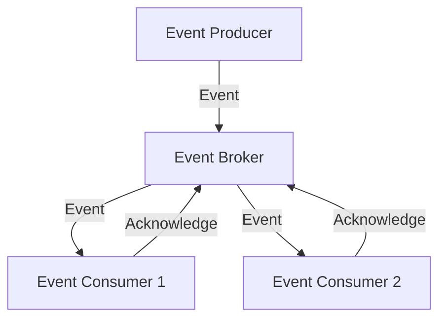

## 11.4 Designing Event-Driven Systems

Event-Driven Architecture (EDA) is a powerful paradigm for building scalable, responsive, and decoupled systems. In Java, designing event-driven systems involves understanding the intricacies of event schemas, versioning, idempotency, and more. This section delves into the best practices for crafting robust event-driven systems, providing insights into the challenges and solutions associated with EDA.

### Importance of Well-Defined Event Schemas and Contracts

In an event-driven system, events are the primary means of communication between components. Therefore, defining clear and consistent event schemas is crucial. An event schema acts as a contract between the producer and consumer, ensuring that both parties understand the structure and semantics of the data being exchanged.

#### Best Practices for Event Schemas

- **Use JSON or Avro for Event Serialization**: JSON is human-readable and widely used, while Avro provides efficient serialization and schema evolution capabilities.
- **Define Clear Event Names and Types**: Use descriptive names and types for events to convey their purpose and context.
- **Include Metadata**: Incorporate metadata such as timestamps, event source, and unique identifiers to provide context and traceability.
- **Version Your Schemas**: Implement versioning to manage changes and ensure backward compatibility.

### Strategies for Event Versioning and Backward Compatibility

Event versioning is essential for evolving your system without disrupting existing consumers. It allows you to introduce changes to event schemas while maintaining compatibility with older versions.

#### Techniques for Event Versioning

- **Schema Evolution**: Use schema evolution features provided by serialization frameworks like Avro to add fields without breaking existing consumers.
- **Versioned Event Types**: Introduce new event types for significant changes, allowing consumers to opt-in to new versions.
- **Deprecation Strategy**: Clearly communicate deprecated fields or event types and provide a timeline for their removal.

### Idempotency and Handling Duplicate Events

Idempotency is the property that ensures that processing an event multiple times has the same effect as processing it once. This is crucial in distributed systems where duplicate events can occur due to retries or network issues.

#### Implementing Idempotency

- **Use Unique Event Identifiers**: Assign a unique identifier to each event to detect duplicates.
- **Maintain State**: Store the state of processed events to prevent reprocessing.
- **Design Idempotent Handlers**: Ensure that event handlers can safely process the same event multiple times without side effects.

### Event Ordering and Eventual Consistency Challenges

Event ordering and eventual consistency are common challenges in event-driven systems. Ensuring that events are processed in the correct order is critical for maintaining data integrity.

#### Addressing Event Ordering

- **Use Partitioning**: Partition events by key (e.g., user ID) to ensure ordering within partitions.
- **Implement Sequence Numbers**: Include sequence numbers in events to detect out-of-order delivery.
- **Leverage Message Brokers**: Use message brokers like Apache Kafka, which provide ordering guarantees within partitions.

#### Managing Eventual Consistency

- **Design for Consistency**: Accept that eventual consistency is a trade-off for scalability and design your system to handle temporary inconsistencies.
- **Implement Compensation Mechanisms**: Use compensating transactions to correct inconsistencies when they are detected.

### Error Handling and Monitoring in Event-Driven Architecture

Effective error handling and monitoring are vital for maintaining the reliability and performance of event-driven systems.

#### Error Handling Strategies

- **Retry Mechanisms**: Implement retry logic with exponential backoff for transient errors.
- **Dead Letter Queues**: Use dead letter queues to capture and analyze failed events.
- **Graceful Degradation**: Design systems to degrade gracefully in the presence of errors, maintaining partial functionality.

#### Monitoring and Observability

- **Centralized Logging**: Use centralized logging solutions to aggregate and analyze logs from all components.
- **Metrics and Alerts**: Collect metrics on event processing times, error rates, and throughput, and set up alerts for anomalies.
- **Distributed Tracing**: Implement distributed tracing to track the flow of events across services and identify bottlenecks.

### Code Example: Implementing an Event-Driven System in Java

Below is a simple example of an event-driven system in Java using Apache Kafka for event streaming.

```java
import org.apache.kafka.clients.consumer.ConsumerConfig;
import org.apache.kafka.clients.consumer.KafkaConsumer;
import org.apache.kafka.clients.consumer.ConsumerRecords;
import org.apache.kafka.clients.consumer.ConsumerRecord;
import org.apache.kafka.clients.producer.KafkaProducer;
import org.apache.kafka.clients.producer.ProducerConfig;
import org.apache.kafka.clients.producer.ProducerRecord;
import org.apache.kafka.common.serialization.StringDeserializer;
import org.apache.kafka.common.serialization.StringSerializer;

import java.util.Collections;
import java.util.Properties;

public class EventDrivenSystem {

    public static void main(String[] args) {
        // Producer configuration
        Properties producerProps = new Properties();
        producerProps.put(ProducerConfig.BOOTSTRAP_SERVERS_CONFIG, "localhost:9092");
        producerProps.put(ProducerConfig.KEY_SERIALIZER_CLASS_CONFIG, StringSerializer.class.getName());
        producerProps.put(ProducerConfig.VALUE_SERIALIZER_CLASS_CONFIG, StringSerializer.class.getName());

        // Create a Kafka producer
        KafkaProducer<String, String> producer = new KafkaProducer<>(producerProps);

        // Send an event
        ProducerRecord<String, String> record = new ProducerRecord<>("events", "eventKey", "eventValue");
        producer.send(record);
        producer.close();

        // Consumer configuration
        Properties consumerProps = new Properties();
        consumerProps.put(ConsumerConfig.BOOTSTRAP_SERVERS_CONFIG, "localhost:9092");
        consumerProps.put(ConsumerConfig.GROUP_ID_CONFIG, "eventGroup");
        consumerProps.put(ConsumerConfig.KEY_DESERIALIZER_CLASS_CONFIG, StringDeserializer.class.getName());
        consumerProps.put(ConsumerConfig.VALUE_DESERIALIZER_CLASS_CONFIG, StringDeserializer.class.getName());

        // Create a Kafka consumer
        KafkaConsumer<String, String> consumer = new KafkaConsumer<>(consumerProps);
        consumer.subscribe(Collections.singletonList("events"));

        // Poll for new events
        while (true) {
            ConsumerRecords<String, String> records = consumer.poll(100);
            for (ConsumerRecord<String, String> record : records) {
                System.out.printf("Consumed event: key = %s, value = %s%n", record.key(), record.value());
            }
        }
    }
}
```

**Explanation**: This example demonstrates a basic producer and consumer setup using Apache Kafka. The producer sends an event to a Kafka topic, and the consumer subscribes to the topic to receive and process events.

### Visualizing Event-Driven Architecture

Below is a diagram illustrating the flow of events in an event-driven system.



**Caption**: This diagram shows the interaction between event producers, brokers, and consumers in an event-driven architecture.

### Conclusion

Designing event-driven systems in Java requires careful consideration of event schemas, versioning, idempotency, and more. By following best practices and leveraging tools like Apache Kafka, developers can build robust, scalable, and maintainable systems. As you implement these concepts, consider how they apply to your specific use cases and explore further optimizations and enhancements.

### References and Further Reading

- [Apache Kafka Documentation](https://kafka.apache.org/documentation/)
- [Java Documentation](https://docs.oracle.com/en/java/)
- [Cloud Design Patterns](https://learn.microsoft.com/en-us/azure/architecture/patterns/)

---

## Test Your Knowledge: Event-Driven Systems in Java Quiz



### What is the primary purpose of an event schema in an event-driven system?

- [x] To define a contract between event producers and consumers
- [ ] To serialize events for storage
- [ ] To provide a user interface for event management
- [ ] To ensure events are processed in order

> **Explanation:** An event schema defines the structure and semantics of the data exchanged between producers and consumers, acting as a contract.

### Which serialization format is known for efficient schema evolution?

- [ ] JSON
- [x] Avro
- [ ] XML
- [ ] YAML

> **Explanation:** Avro provides efficient serialization and supports schema evolution, allowing for backward compatibility.

### How can idempotency be achieved in event processing?

- [x] By using unique event identifiers
- [ ] By processing events in parallel
- [ ] By ignoring duplicate events
- [ ] By storing events in a database

> **Explanation:** Unique event identifiers help detect duplicates and ensure that processing an event multiple times has the same effect as processing it once.

### What is a common strategy for ensuring event ordering?

- [ ] Using JSON serialization
- [ ] Implementing retry logic
- [x] Partitioning events by key
- [ ] Using a database

> **Explanation:** Partitioning events by key ensures that events related to the same entity are processed in order.

### What is the role of a dead letter queue in error handling?

- [x] To capture and analyze failed events
- [ ] To store all processed events
- [ ] To ensure event ordering
- [ ] To serialize events

> **Explanation:** Dead letter queues capture events that cannot be processed, allowing for analysis and corrective actions.

### Which tool can be used for distributed tracing in event-driven systems?

- [ ] JSON
- [ ] Avro
- [x] OpenTelemetry
- [ ] YAML

> **Explanation:** OpenTelemetry is a tool for distributed tracing, helping track the flow of events across services.

### What is a benefit of using centralized logging in event-driven systems?

- [x] Aggregating and analyzing logs from all components
- [ ] Ensuring event ordering
- [ ] Storing events for future processing
- [ ] Providing a user interface for event management

> **Explanation:** Centralized logging aggregates logs from all components, facilitating analysis and troubleshooting.

### How can eventual consistency be managed in event-driven systems?

- [x] By designing for consistency and using compensating transactions
- [ ] By ensuring all events are processed in order
- [ ] By storing events in a database
- [ ] By using JSON serialization

> **Explanation:** Designing for consistency and using compensating transactions help manage eventual consistency in distributed systems.

### What is a key challenge of event-driven architecture?

- [x] Ensuring event ordering and eventual consistency
- [ ] Providing a user interface for event management
- [ ] Storing events in a database
- [ ] Using JSON serialization

> **Explanation:** Ensuring event ordering and eventual consistency are key challenges in event-driven architecture.

### True or False: Event-driven systems are inherently synchronous.

- [ ] True
- [x] False

> **Explanation:** Event-driven systems are inherently asynchronous, allowing components to operate independently and react to events as they occur.



---
