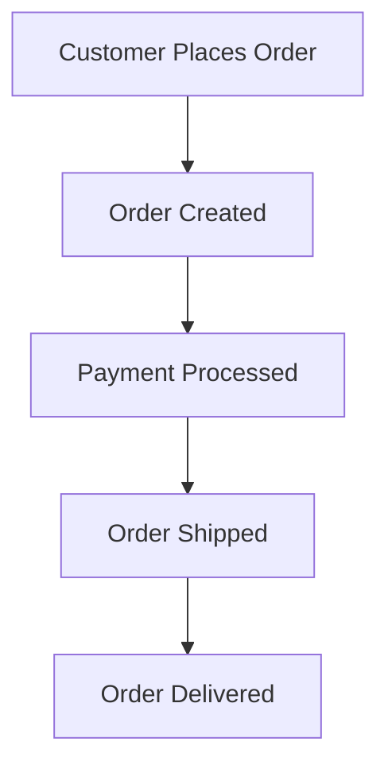

## 11.5 Event Sourcing and Event Storming

In the realm of event-driven architecture, **event sourcing** and **event storming** are pivotal concepts that empower developers and architects to design robust, scalable, and maintainable systems. This section delves into these concepts, providing a comprehensive understanding of their applications, benefits, and implementation strategies in Java.

### Event Sourcing

#### Definition

**Event Sourcing** is a pattern where state changes in a system are captured as a sequence of events. Instead of storing just the current state, every change is recorded as an immutable event. This approach allows the reconstruction of past states by replaying the events.

#### Benefits

1. **Auditability**: Every change is recorded, providing a complete audit trail.
2. **Reconstruct Past States**: The ability to replay events allows the reconstruction of any past state.
3. **Event Replay**: Events can be replayed to debug issues or to populate new systems.
4. **Scalability**: Systems can scale by distributing event processing across multiple services.

#### Implementation in Java

Implementing event sourcing in Java involves several key components:

- **Event Store**: A storage mechanism for events, often implemented using databases like Apache Kafka or EventStoreDB.
- **Event Publisher**: Responsible for publishing events to the event store.
- **Event Processor**: Consumes events and updates the system state or triggers other actions.

##### Example: Implementing Event Sourcing

```java
// Define an Event interface
public interface Event {
    String getEventType();
    LocalDateTime getTimestamp();
}

// Implement a specific event
public class AccountCreatedEvent implements Event {
    private final String accountId;
    private final LocalDateTime timestamp;

    public AccountCreatedEvent(String accountId) {
        this.accountId = accountId;
        this.timestamp = LocalDateTime.now();
    }

    @Override
    public String getEventType() {
        return "AccountCreated";
    }

    @Override
    public LocalDateTime getTimestamp() {
        return timestamp;
    }

    public String getAccountId() {
        return accountId;
    }
}

// Event Store using a simple list (for demonstration)
public class EventStore {
    private final List<Event> events = new ArrayList<>();

    public void saveEvent(Event event) {
        events.add(event);
    }

    public List<Event> getEvents() {
        return Collections.unmodifiableList(events);
    }
}

// Event Publisher
public class EventPublisher {
    private final EventStore eventStore;

    public EventPublisher(EventStore eventStore) {
        this.eventStore = eventStore;
    }

    public void publish(Event event) {
        eventStore.saveEvent(event);
        // Additional logic to notify subscribers
    }
}

// Usage
public class Main {
    public static void main(String[] args) {
        EventStore eventStore = new EventStore();
        EventPublisher publisher = new EventPublisher(eventStore);

        Event event = new AccountCreatedEvent("12345");
        publisher.publish(event);

        eventStore.getEvents().forEach(e -> System.out.println(e.getEventType() + " at " + e.getTimestamp()));
    }
}
```

**Explanation**: This example demonstrates a basic event sourcing setup in Java. The `Event` interface defines the structure of an event, while `AccountCreatedEvent` is a specific implementation. The `EventStore` class stores events, and the `EventPublisher` handles publishing events to the store.

#### Challenges and Considerations

- **Complexity**: Managing a large number of events can become complex.
- **Event Versioning**: Changes to event structures require careful versioning.
- **Consistency**: Ensuring eventual consistency across distributed systems can be challenging.

### Event Storming

#### Definition

**Event Storming** is a collaborative workshop technique used for domain discovery and design. It involves stakeholders from various domains to model complex business processes through events, commands, and aggregates.

#### Benefits

1. **Collaborative Discovery**: Encourages collaboration among domain experts, developers, and stakeholders.
2. **Visual Modeling**: Provides a visual representation of the system's behavior.
3. **Rapid Prototyping**: Facilitates quick iterations and feedback loops.

#### Conducting an Event Storming Workshop

1. **Gather Participants**: Include domain experts, developers, and stakeholders.
2. **Define the Scope**: Clearly outline the boundaries of the system or process being modeled.
3. **Identify Events**: Use sticky notes to identify key events in the process.
4. **Map Commands and Aggregates**: Identify commands that trigger events and aggregates that manage state.
5. **Iterate and Refine**: Continuously refine the model based on feedback.

##### Example: Event Storming for an E-commerce System



**Caption**: This diagram represents a simplified event storming model for an e-commerce system, illustrating the flow from order placement to delivery.

#### Designing Event-Driven Systems

Event storming aids in designing event-driven systems by providing a clear understanding of the interactions and dependencies between different components. It helps identify potential bottlenecks and areas for optimization.

### Practical Applications and Real-World Scenarios

- **Financial Systems**: Event sourcing is used to track transactions and account changes.
- **E-commerce Platforms**: Event storming helps model complex order processing workflows.
- **Microservices Architecture**: Both techniques are integral to designing scalable microservices.

### Conclusion

Event sourcing and event storming are powerful tools in the arsenal of modern software architects and developers. By capturing changes as events and collaboratively modeling systems, these techniques enable the creation of scalable, maintainable, and resilient applications. As you explore these concepts, consider how they can be applied to your projects to enhance system design and collaboration.

### References and Further Reading

- [Java Documentation](https://docs.oracle.com/en/java/)
- [Event Sourcing in Java](https://martinfowler.com/eaaDev/EventSourcing.html)
- [Event Storming Guide](https://www.eventstorming.com/)

---

## Test Your Knowledge: Event Sourcing and Event Storming Quiz



### What is the primary purpose of event sourcing?

- [x] To capture all changes as a sequence of events
- [ ] To store only the current state of the system
- [ ] To improve database performance
- [ ] To simplify data models

> **Explanation:** Event sourcing captures all changes as events, allowing for complete auditability and state reconstruction.

### Which of the following is a benefit of event sourcing?

- [x] Auditability
- [ ] Reduced complexity
- [x] Ability to reconstruct past states
- [ ] Increased data redundancy

> **Explanation:** Event sourcing provides auditability and the ability to reconstruct past states, though it may increase complexity.

### What role does the event store play in event sourcing?

- [x] It stores all events in the system
- [ ] It processes events in real-time
- [ ] It generates new events
- [ ] It deletes old events

> **Explanation:** The event store is responsible for storing all events, providing a historical record of changes.

### In event storming, what is the purpose of identifying events?

- [x] To model key processes in the system
- [ ] To reduce system complexity
- [ ] To eliminate redundant data
- [ ] To improve system performance

> **Explanation:** Identifying events helps model key processes and interactions within the system.

### How does event storming facilitate collaboration?

- [x] By involving stakeholders from various domains
- [ ] By simplifying technical jargon
- [x] By providing a visual representation of processes
- [ ] By reducing the number of meetings

> **Explanation:** Event storming involves stakeholders and provides a visual model, enhancing collaboration and understanding.

### What is a common challenge of event sourcing?

- [x] Managing a large number of events
- [ ] Lack of auditability
- [ ] Inability to reconstruct past states
- [ ] Reduced scalability

> **Explanation:** Managing a large number of events can be complex, requiring careful design and implementation.

### Which tool is often used for storing events in event sourcing?

- [x] Apache Kafka
- [ ] MySQL
- [x] EventStoreDB
- [ ] Redis

> **Explanation:** Apache Kafka and EventStoreDB are commonly used for storing events due to their scalability and reliability.

### What is the outcome of a successful event storming session?

- [x] A clear model of the system's processes
- [ ] A reduction in system complexity
- [ ] An increase in system performance
- [ ] A simplified data model

> **Explanation:** A successful event storming session results in a clear and collaborative model of the system's processes.

### How does event sourcing enhance scalability?

- [x] By distributing event processing across services
- [ ] By reducing data storage requirements
- [ ] By simplifying data models
- [ ] By eliminating redundant processes

> **Explanation:** Event sourcing enhances scalability by allowing event processing to be distributed across multiple services.

### True or False: Event storming is only useful for technical stakeholders.

- [ ] True
- [x] False

> **Explanation:** Event storming is valuable for both technical and non-technical stakeholders, fostering collaboration and understanding.


