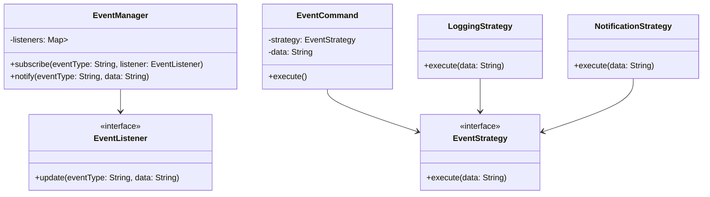

## 11.5 Integrating Multiple Patterns

In the realm of software engineering, especially when dealing with complex systems, relying on a single design pattern often falls short of addressing intricate design challenges. Integrating multiple design patterns can provide a more comprehensive solution, enhancing the system's architecture and maintainability. This section explores the strategies for effectively combining multiple design patterns in Java, demonstrating how this integration can lead to robust and scalable software solutions.

### Complex System Needs

As systems grow in complexity, the limitations of single-pattern solutions become apparent. Complex applications often require a blend of patterns to address various concerns such as object creation, behavior management, and structural organization. Integrating multiple patterns allows developers to leverage the strengths of each pattern, creating a synergistic effect that enhances the overall system design.

#### Why Single Patterns May Not Suffice

Single patterns are designed to solve specific problems. For instance, the Singleton pattern ensures a class has only one instance, while the Observer pattern facilitates communication between objects. However, complex systems often face multifaceted challenges that require a combination of solutions. For example, an event-driven system may need to manage state changes (State pattern), notify observers (Observer pattern), and encapsulate requests (Command pattern). By integrating multiple patterns, we can address these diverse requirements more effectively.

### Pattern Synergy

Certain design patterns naturally complement each other, creating a synergy that enhances system functionality. Understanding these relationships is crucial for effective pattern integration.

#### Complementary Patterns

- **Factory and Singleton**: The Factory pattern can be used alongside Singleton to manage the creation of a single instance of a class. This combination is particularly useful in scenarios where object creation is complex and needs to be controlled.
  
- **Observer and Mediator**: The Observer pattern can work with the Mediator pattern to manage communication between objects. While Observer handles notifications, Mediator centralizes communication, reducing dependencies between objects.
  
- **Strategy and Command**: These patterns can be combined to encapsulate algorithms (Strategy) and requests (Command), providing flexibility in executing different behaviors.

#### Example: Factory and Singleton

Consider a logging system where we want to ensure that only one instance of a logger is used throughout the application. We can use the Singleton pattern to manage the logger's instance and the Factory pattern to handle the creation logic.

```java
public class LoggerFactory {
    private static Logger instance;

    private LoggerFactory() {}

    public static Logger getLogger() {
        if (instance == null) {
            instance = new Logger();
        }
        return instance;
    }
}

class Logger {
    public void log(String message) {
        System.out.println(message);
    }
}
```

In this example, `LoggerFactory` ensures that only one `Logger` instance is created, while the Factory pattern encapsulates the creation logic.

### Integration Approaches

Integrating multiple patterns requires careful planning and execution. Here are some methodologies to consider:

#### Layering Patterns

Layering involves organizing patterns in a hierarchical manner, where each layer addresses specific concerns. This approach helps maintain a clear separation of concerns and enhances system modularity.

- **Example**: In a web application, you might use the MVC pattern for the presentation layer, the DAO pattern for data access, and the Singleton pattern for managing configuration settings.

#### Using One Pattern to Implement Another

Sometimes, one pattern can be used to implement another, providing a more cohesive solution.

- **Example**: The Factory pattern can be used to create instances of Strategy objects, allowing dynamic selection of algorithms at runtime.

#### Maintaining Separation of Concerns

When integrating multiple patterns, it's crucial to maintain a clear separation of concerns. Each pattern should address a specific aspect of the system, and their interactions should be well-defined to avoid tight coupling.

### Examples of Combined Patterns

Let's explore a concrete example where multiple patterns are integrated to solve a complex problem.

#### Event-Driven System with Observer, Strategy, and Command Patterns

Consider an event-driven system where different types of events trigger various actions. We can use the Observer pattern to notify listeners of events, the Strategy pattern to define different handling strategies, and the Command pattern to encapsulate event requests.

```java
// Observer Pattern
interface EventListener {
    void update(String eventType, String data);
}

class EventManager {
    private Map<String, List<EventListener>> listeners = new HashMap<>();

    public void subscribe(String eventType, EventListener listener) {
        listeners.computeIfAbsent(eventType, k -> new ArrayList<>()).add(listener);
    }

    public void notify(String eventType, String data) {
        List<EventListener> users = listeners.get(eventType);
        if (users != null) {
            for (EventListener listener : users) {
                listener.update(eventType, data);
            }
        }
    }
}

// Strategy Pattern
interface EventStrategy {
    void execute(String data);
}

class LoggingStrategy implements EventStrategy {
    public void execute(String data) {
        System.out.println("Logging data: " + data);
    }
}

class NotificationStrategy implements EventStrategy {
    public void execute(String data) {
        System.out.println("Sending notification: " + data);
    }
}

// Command Pattern
class EventCommand {
    private EventStrategy strategy;
    private String data;

    public EventCommand(EventStrategy strategy, String data) {
        this.strategy = strategy;
        this.data = data;
    }

    public void execute() {
        strategy.execute(data);
    }
}

// Integration
public class EventDrivenSystem {
    private EventManager eventManager = new EventManager();

    public EventDrivenSystem() {
        eventManager.subscribe("log", new EventListener() {
            public void update(String eventType, String data) {
                new EventCommand(new LoggingStrategy(), data).execute();
            }
        });

        eventManager.subscribe("notify", new EventListener() {
            public void update(String eventType, String data) {
                new EventCommand(new NotificationStrategy(), data).execute();
            }
        });
    }

    public void triggerEvent(String eventType, String data) {
        eventManager.notify(eventType, data);
    }

    public static void main(String[] args) {
        EventDrivenSystem system = new EventDrivenSystem();
        system.triggerEvent("log", "User logged in");
        system.triggerEvent("notify", "User received a message");
    }
}
```

In this example, the `EventManager` uses the Observer pattern to manage event listeners. The `EventCommand` class encapsulates event requests, and different strategies are used to handle events based on their type.

### UML Diagrams

To better understand how these patterns interact, let's visualize them using UML diagrams.



This UML diagram illustrates the relationships between the `EventManager`, `EventListener`, `EventStrategy`, and `EventCommand` classes, highlighting how the patterns are integrated.

### Code Examples

Let's delve deeper into the code examples to illustrate the combined implementation of multiple patterns.

#### Highlighting Key Interactions

In the event-driven system example, notice how the `EventManager` class manages subscriptions and notifications, while the `EventCommand` class encapsulates the execution logic. The Strategy pattern allows for flexible handling of different event types.

```java
// EventManager manages subscriptions and notifications
eventManager.subscribe("log", new EventListener() {
    public void update(String eventType, String data) {
        new EventCommand(new LoggingStrategy(), data).execute();
    }
});

// EventCommand encapsulates execution logic
public void execute() {
    strategy.execute(data);
}
```

### Best Practices

When integrating multiple patterns, it's essential to manage complexity effectively. Here are some best practices to consider:

#### Managing Complexity

- **Modular Design**: Break down the system into smaller, manageable components. Each component should focus on a specific aspect of the system.
  
- **Clear Interfaces**: Define clear interfaces for each pattern to ensure they interact seamlessly without tight coupling.

- **Documentation**: Thoroughly document the interactions between patterns. This documentation will be invaluable for future maintenance and onboarding new team members.

- **Adherence to Design Principles**: Follow design principles such as SOLID to ensure the system remains flexible and maintainable.

#### Emphasizing Documentation

Documentation plays a crucial role in managing complexity when multiple patterns are in play. It helps developers understand the system's architecture and the rationale behind pattern choices.

### Try It Yourself

To deepen your understanding, try modifying the event-driven system example:

- **Add a New Event Type**: Implement a new event type and strategy, such as an email notification.
- **Extend the EventManager**: Enhance the `EventManager` to support priority-based event handling.
- **Implement a New Pattern**: Integrate an additional pattern, such as the Decorator pattern, to add functionality to event strategies.

### Conclusion

Integrating multiple design patterns in Java is a powerful approach to addressing complex system requirements. By understanding how patterns complement each other and employing effective integration strategies, developers can create robust, scalable, and maintainable software solutions. Remember, the key to successful integration lies in maintaining a clear separation of concerns, adhering to design principles, and thoroughly documenting the system architecture.

## Quiz Time!



### Why might single design patterns be insufficient for complex systems?

- [x] Complex systems often have multifaceted challenges that require a combination of solutions.
- [ ] Single patterns are always sufficient for any system.
- [ ] Single patterns are too complex for simple systems.
- [ ] Single patterns are not reusable.

> **Explanation:** Complex systems often face multifaceted challenges that require a combination of solutions, which single patterns alone cannot address.

### Which two patterns naturally complement each other for managing object creation?

- [x] Factory and Singleton
- [ ] Observer and Mediator
- [ ] Strategy and Command
- [ ] Decorator and Proxy

> **Explanation:** Factory and Singleton patterns complement each other in managing object creation, especially when controlling the instantiation of a single instance.

### What is a key benefit of layering patterns?

- [x] It helps maintain a clear separation of concerns.
- [ ] It increases system coupling.
- [ ] It complicates the system architecture.
- [ ] It reduces system modularity.

> **Explanation:** Layering patterns helps maintain a clear separation of concerns, enhancing system modularity and maintainability.

### In the event-driven system example, which pattern is used to notify listeners of events?

- [x] Observer
- [ ] Strategy
- [ ] Command
- [ ] Singleton

> **Explanation:** The Observer pattern is used to notify listeners of events in the event-driven system example.

### What role does the Command pattern play in the event-driven system example?

- [x] It encapsulates event requests.
- [ ] It manages subscriptions.
- [ ] It defines event strategies.
- [ ] It creates event listeners.

> **Explanation:** The Command pattern encapsulates event requests, allowing for flexible execution of different actions based on event types.

### What is a best practice when integrating multiple patterns?

- [x] Define clear interfaces for each pattern.
- [ ] Avoid documentation to reduce complexity.
- [ ] Increase coupling between patterns.
- [ ] Use as many patterns as possible without consideration.

> **Explanation:** Defining clear interfaces for each pattern ensures they interact seamlessly without tight coupling, which is a best practice when integrating multiple patterns.

### How can documentation help in managing complexity with multiple patterns?

- [x] It helps developers understand the system's architecture and the rationale behind pattern choices.
- [ ] It increases the complexity of the system.
- [ ] It is unnecessary if the code is self-explanatory.
- [ ] It should only be done after the system is complete.

> **Explanation:** Documentation helps developers understand the system's architecture and the rationale behind pattern choices, aiding in managing complexity.

### What is a potential modification you can try in the event-driven system example?

- [x] Add a new event type and strategy.
- [ ] Remove all patterns to simplify the system.
- [ ] Increase the number of event listeners without strategies.
- [ ] Use only the Observer pattern for all functionalities.

> **Explanation:** Adding a new event type and strategy is a potential modification to deepen understanding and extend the system's capabilities.

### What is the importance of maintaining a clear separation of concerns when integrating patterns?

- [x] It ensures the system remains flexible and maintainable.
- [ ] It makes the system more complex.
- [ ] It reduces the need for documentation.
- [ ] It increases coupling between components.

> **Explanation:** Maintaining a clear separation of concerns ensures the system remains flexible and maintainable, which is crucial when integrating patterns.

### True or False: The Strategy pattern can be used to define different handling strategies in an event-driven system.

- [x] True
- [ ] False

> **Explanation:** True. The Strategy pattern can be used to define different handling strategies, providing flexibility in executing various behaviors in an event-driven system.


