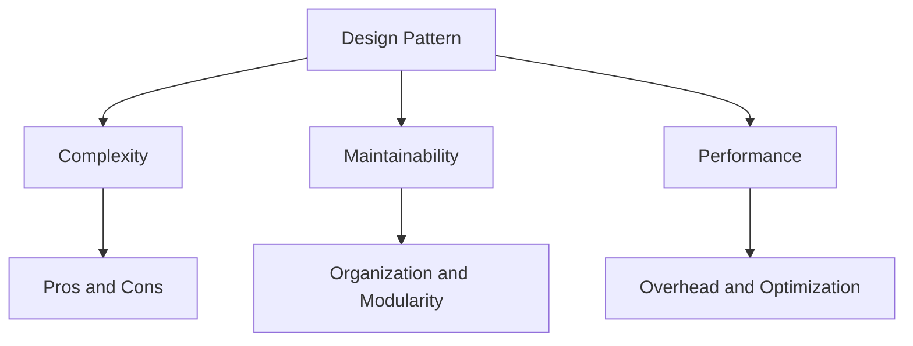

## 11.6 Trade-offs and Considerations

In the realm of software engineering, design patterns serve as invaluable tools that provide reusable solutions to common problems. However, the decision to implement a particular pattern is not always straightforward. It involves weighing the trade-offs between complexity, maintainability, and performance. This section delves into these considerations, offering insights and guidance to help expert developers make informed design decisions.

### Understanding Trade-offs

Every design choice in software development comes with its own set of trade-offs. While design patterns can enhance code organization and flexibility, they can also introduce unnecessary complexity if not applied judiciously. It's crucial to recognize that patterns are not one-size-fits-all solutions. Instead, they should be used as tools to address specific problems within a given context.

#### The Balance of Pros and Cons

When considering a design pattern, it's essential to evaluate both its benefits and potential drawbacks. For instance, while the Singleton pattern ensures a class has only one instance, it can also lead to issues with global state management and testing. Similarly, the Observer pattern facilitates communication between objects but can result in tight coupling if not carefully managed.

### Complexity vs. Simplicity

One of the primary considerations when implementing design patterns is the balance between complexity and simplicity. While patterns can provide elegant solutions, they can also complicate the design if overused or misapplied.

#### When to Favor Simplicity

In some cases, the added complexity of a design pattern may not be justified. For example, if a project is small or has a limited scope, the overhead of implementing a complex pattern may outweigh its benefits. In such scenarios, simplicity should be favored to maintain clarity and ease of understanding.

#### Criteria for Evaluating Complexity

To determine whether the complexity of a pattern is justified, consider the following criteria:

- **Project Size and Scope**: Larger projects with complex requirements may benefit more from patterns than smaller, simpler projects.
- **Team Expertise**: If the development team is well-versed in a particular pattern, the complexity may be more manageable.
- **Future Scalability**: Consider whether the pattern will facilitate future growth and scalability.
- **Code Readability**: Evaluate whether the pattern enhances or detracts from the overall readability of the code.

### Performance Implications

Design patterns can have significant implications for performance. Some patterns, like Decorator or Proxy, may introduce performance overhead due to additional layers of abstraction. Conversely, patterns like Flyweight can enhance performance by optimizing memory usage.

#### Analyzing Performance Overhead

When implementing patterns such as Decorator or Proxy, it's important to be aware of the potential performance overhead. These patterns often involve additional method calls and object creations, which can impact execution speed.

```java
// Example of a Proxy Pattern in Java
public interface Image {
    void display();
}

public class RealImage implements Image {
    private String fileName;

    public RealImage(String fileName) {
        this.fileName = fileName;
        loadFromDisk(fileName);
    }

    private void loadFromDisk(String fileName) {
        System.out.println("Loading " + fileName);
    }

    @Override
    public void display() {
        System.out.println("Displaying " + fileName);
    }
}

public class ProxyImage implements Image {
    private RealImage realImage;
    private String fileName;

    public ProxyImage(String fileName) {
        this.fileName = fileName;
    }

    @Override
    public void display() {
        if (realImage == null) {
            realImage = new RealImage(fileName);
        }
        realImage.display();
    }
}

// Usage
public class ProxyPatternDemo {
    public static void main(String[] args) {
        Image image = new ProxyImage("test_10mb.jpg");
        // Image will be loaded from disk
        image.display();
        // Image will not be loaded from disk
        image.display();
    }
}
```

In this example, the Proxy pattern is used to control access to the `RealImage` object. While this can be beneficial in terms of resource management, it introduces additional method calls that can affect performance.

#### Enhancing Performance with Flyweight

The Flyweight pattern is an excellent example of how design patterns can improve performance by reducing memory usage. By sharing common state among multiple objects, the Flyweight pattern minimizes memory consumption.

```java
// Example of a Flyweight Pattern in Java
import java.util.HashMap;
import java.util.Map;

interface Shape {
    void draw();
}

class Circle implements Shape {
    private String color;
    private int x;
    private int y;
    private int radius;

    public Circle(String color) {
        this.color = color;
    }

    public void setX(int x) {
        this.x = x;
    }

    public void setY(int y) {
        this.y = y;
    }

    public void setRadius(int radius) {
        this.radius = radius;
    }

    @Override
    public void draw() {
        System.out.println("Circle: Draw() [Color : " + color + ", x : " + x + ", y :" + y + ", radius :" + radius);
    }
}

class ShapeFactory {
    private static final Map<String, Circle> circleMap = new HashMap<>();

    public static Circle getCircle(String color) {
        Circle circle = circleMap.get(color);

        if (circle == null) {
            circle = new Circle(color);
            circleMap.put(color, circle);
            System.out.println("Creating circle of color : " + color);
        }
        return circle;
    }
}

// Usage
public class FlyweightPatternDemo {
    private static final String[] colors = {"Red", "Green", "Blue", "White", "Black"};

    public static void main(String[] args) {
        for (int i = 0; i < 20; ++i) {
            Circle circle = ShapeFactory.getCircle(getRandomColor());
            circle.setX(getRandomX());
            circle.setY(getRandomY());
            circle.setRadius(100);
            circle.draw();
        }
    }

    private static String getRandomColor() {
        return colors[(int) (Math.random() * colors.length)];
    }

    private static int getRandomX() {
        return (int) (Math.random() * 100);
    }

    private static int getRandomY() {
        return (int) (Math.random() * 100);
    }
}
```

In this example, the Flyweight pattern is used to share `Circle` objects based on their color. This reduces the number of objects created and optimizes memory usage.

### Maintainability Concerns

Design patterns can significantly improve code maintainability by promoting better organization and modularity. However, overuse of patterns can lead to a codebase that is difficult to understand and maintain.

#### Improving Maintainability with Patterns

Patterns like MVC (Model-View-Controller) and Observer can enhance maintainability by clearly separating concerns and facilitating communication between components.

```java
// Example of an Observer Pattern in Java
import java.util.ArrayList;
import java.util.List;

interface Observer {
    void update(String message);
}

class ConcreteObserver implements Observer {
    private String name;

    public ConcreteObserver(String name) {
        this.name = name;
    }

    @Override
    public void update(String message) {
        System.out.println(name + " received: " + message);
    }
}

class Subject {
    private List<Observer> observers = new ArrayList<>();

    public void addObserver(Observer observer) {
        observers.add(observer);
    }

    public void removeObserver(Observer observer) {
        observers.remove(observer);
    }

    public void notifyObservers(String message) {
        for (Observer observer : observers) {
            observer.update(message);
        }
    }
}

// Usage
public class ObserverPatternDemo {
    public static void main(String[] args) {
        Subject subject = new Subject();

        Observer observer1 = new ConcreteObserver("Observer 1");
        Observer observer2 = new ConcreteObserver("Observer 2");

        subject.addObserver(observer1);
        subject.addObserver(observer2);

        subject.notifyObservers("Hello, Observers!");
    }
}
```

In this example, the Observer pattern is used to notify multiple observers of changes in the subject. This promotes loose coupling and enhances maintainability.

#### Overuse and Its Consequences

While patterns can improve maintainability, overuse can lead to a bloated and complex codebase. It's important to use patterns judiciously and only when they provide clear benefits.

### Decision-Making Framework

To aid in the decision-making process, developers can use a framework or checklist to evaluate whether a design pattern is appropriate for their project.

#### Questions to Consider

- **What problem am I trying to solve?** Clearly define the problem before considering a pattern.
- **Is there a simpler solution?** Evaluate whether a simpler approach could achieve the same result.
- **What are the potential trade-offs?** Consider the complexity, performance, and maintainability implications.
- **Does the team have the necessary expertise?** Ensure the team is comfortable with the pattern before implementation.
- **How will this affect future scalability?** Consider how the pattern will impact the project's ability to scale.

### Case Studies

Examining real-world examples can provide valuable insights into the trade-offs and considerations involved in implementing design patterns.

#### Case Study: Singleton Pattern in a Large-Scale Application

In a large-scale application, the Singleton pattern was used to manage a global configuration object. While this simplified access to configuration data, it also introduced challenges with testing and concurrency. The team addressed these issues by implementing a thread-safe Singleton and using dependency injection to facilitate testing.

#### Case Study: Observer Pattern in a Real-Time System

In a real-time system, the Observer pattern was used to manage communication between components. While this improved modularity and flexibility, it also led to performance issues due to the high volume of notifications. The team optimized performance by implementing a priority-based notification system.

### Recommendations

To achieve a balance between complexity, maintainability, and performance, consider the following recommendations:

- **Start Simple**: Begin with simple solutions and iteratively add complexity only when necessary.
- **Profile and Test**: Use profiling and testing to inform design decisions and identify performance bottlenecks.
- **Document Decisions**: Clearly document design decisions and the rationale behind them to aid future maintenance.
- **Encourage Collaboration**: Foster collaboration and knowledge sharing within the team to ensure a shared understanding of patterns and their implications.

### Try It Yourself

To deepen your understanding of design patterns and their trade-offs, try modifying the provided code examples. For instance, experiment with adding new features to the Proxy pattern or optimizing the Flyweight pattern for a different use case. By actively engaging with the code, you'll gain valuable insights into the practical considerations of design patterns.

### Visualizing Trade-offs

To better understand the trade-offs involved in design patterns, consider the following diagram, which illustrates the balance between complexity, maintainability, and performance.



This diagram highlights the interconnected nature of these considerations and the importance of finding a balance that aligns with project goals.

### Knowledge Check

- **What are the key trade-offs to consider when implementing a design pattern?**
- **How can the complexity of a pattern be evaluated?**
- **What are the performance implications of the Decorator pattern?**
- **How can patterns improve code maintainability?**
- **What questions should be considered when deciding to implement a pattern?**

### Embrace the Journey

Remember, the journey of mastering design patterns is ongoing. As you continue to explore and experiment with different patterns, you'll develop a deeper understanding of their trade-offs and considerations. Stay curious, keep learning, and enjoy the process of refining your skills as a software engineer.

## Quiz Time!



### What is a key consideration when deciding to implement a design pattern?

- [x] Evaluating the trade-offs between complexity, maintainability, and performance.
- [ ] Ensuring the pattern is the most complex solution available.
- [ ] Implementing as many patterns as possible for flexibility.
- [ ] Avoiding any form of documentation.

> **Explanation:** Evaluating the trade-offs between complexity, maintainability, and performance is crucial to ensure the pattern fits the project's needs.

### How can the complexity of a design pattern be justified?

- [x] By considering the project's size, scope, and future scalability.
- [ ] By ensuring the pattern is the latest trend in software design.
- [ ] By implementing it in every project regardless of context.
- [ ] By avoiding any form of testing.

> **Explanation:** Justifying the complexity involves evaluating the project's size, scope, and future scalability to ensure the pattern adds value.

### What is a potential downside of the Proxy pattern?

- [x] Performance overhead due to additional method calls.
- [ ] Lack of flexibility in design.
- [ ] Inability to control access to objects.
- [ ] Difficulty in implementing in Java.

> **Explanation:** The Proxy pattern can introduce performance overhead due to additional method calls and object creations.

### How can design patterns improve maintainability?

- [x] By promoting better organization and modularity.
- [ ] By increasing the number of lines of code.
- [ ] By making the codebase more complex.
- [ ] By reducing the need for documentation.

> **Explanation:** Design patterns improve maintainability by promoting better organization and modularity, making the code easier to understand and modify.

### What question should be considered when deciding to implement a pattern?

- [x] Is there a simpler solution that could achieve the same result?
- [ ] How many patterns can be implemented in the project?
- [ ] Is the pattern the most complex available?
- [ ] Can the pattern be implemented without any testing?

> **Explanation:** Considering whether a simpler solution could achieve the same result helps avoid unnecessary complexity.

### What is the benefit of the Flyweight pattern?

- [x] It enhances performance by optimizing memory usage.
- [ ] It simplifies the codebase by removing all abstractions.
- [ ] It ensures every object is unique and independent.
- [ ] It increases the number of objects created.

> **Explanation:** The Flyweight pattern enhances performance by sharing common state among multiple objects, optimizing memory usage.

### How can overuse of design patterns affect a codebase?

- [x] It can lead to a bloated and complex codebase.
- [ ] It simplifies the codebase by removing all logic.
- [ ] It ensures the codebase is always up-to-date with trends.
- [ ] It eliminates the need for any testing.

> **Explanation:** Overuse of design patterns can lead to a bloated and complex codebase, making it harder to understand and maintain.

### What is a key recommendation for achieving balance in design patterns?

- [x] Start with simple solutions and iteratively add complexity only when necessary.
- [ ] Implement as many patterns as possible from the start.
- [ ] Avoid any form of testing or profiling.
- [ ] Ensure the pattern is the most complex available.

> **Explanation:** Starting with simple solutions and iteratively adding complexity helps achieve balance and maintain clarity.

### How can profiling and testing inform design decisions?

- [x] By identifying performance bottlenecks and guiding optimizations.
- [ ] By ensuring the codebase is as complex as possible.
- [ ] By removing the need for any design patterns.
- [ ] By avoiding any form of documentation.

> **Explanation:** Profiling and testing help identify performance bottlenecks and guide optimizations, informing design decisions.

### True or False: Design patterns should always be used in every project.

- [ ] True
- [x] False

> **Explanation:** Design patterns should be used judiciously and only when they provide clear benefits for the specific project context.


