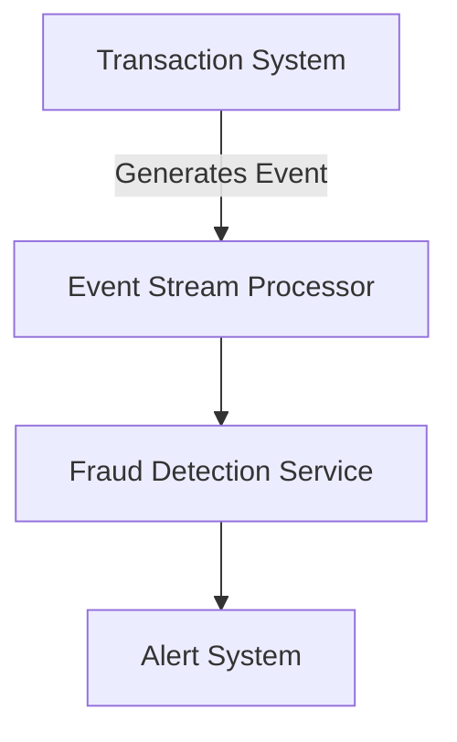

## 11.8 Use Cases and Examples

Event-Driven Architecture (EDA) is a design paradigm that enables systems to respond to events in real-time, making it an ideal choice for applications requiring high scalability, responsiveness, and flexibility. This section delves into practical use cases across various industries, illustrating how EDA can address specific challenges and deliver tangible benefits. We will explore case studies from e-commerce, banking, and the Internet of Things (IoT), highlighting architectural choices, lessons learned, and quantitative benefits such as improved scalability and reduced latency.

### E-Commerce: Real-Time Inventory Management

#### Context and Challenges

In the fast-paced world of e-commerce, managing inventory in real-time is crucial to ensure customer satisfaction and operational efficiency. Traditional batch processing systems often struggle with latency, leading to issues such as overselling or stockouts. An event-driven approach can address these challenges by providing real-time updates and enabling seamless integration with other systems.

#### Architectural Choices

In an event-driven inventory management system, each transaction (e.g., purchase, return, restock) generates an event that is processed in real-time. The architecture typically involves the following components:

- **Event Producers**: Systems or services that generate events, such as order management systems or point-of-sale terminals.
- **Event Brokers**: Middleware that routes events to appropriate consumers. Apache Kafka is a popular choice for its scalability and fault-tolerance.
- **Event Consumers**: Services that process events and update the inventory database accordingly.

```mermaid
graph TD;
    A[Order Management System] -->|Generates Event| B[Event Broker (Kafka)];
    B --> C[Inventory Service];
    C --> D[Database];
```

*Diagram: An event-driven architecture for real-time inventory management in e-commerce.*

#### Implementation and Code Example

Consider a scenario where an order is placed, and the inventory needs to be updated. The following Java code snippet illustrates how an event-driven system might handle this:

```java
import org.apache.kafka.clients.consumer.ConsumerRecord;
import org.apache.kafka.clients.consumer.KafkaConsumer;
import org.apache.kafka.clients.consumer.ConsumerRecords;
import java.util.Collections;
import java.util.Properties;

public class InventoryConsumer {
    public static void main(String[] args) {
        Properties props = new Properties();
        props.put("bootstrap.servers", "localhost:9092");
        props.put("group.id", "inventory-group");
        props.put("enable.auto.commit", "true");
        props.put("key.deserializer", "org.apache.kafka.common.serialization.StringDeserializer");
        props.put("value.deserializer", "org.apache.kafka.common.serialization.StringDeserializer");

        KafkaConsumer<String, String> consumer = new KafkaConsumer<>(props);
        consumer.subscribe(Collections.singletonList("order-events"));

        while (true) {
            ConsumerRecords<String, String> records = consumer.poll(100);
            for (ConsumerRecord<String, String> record : records) {
                System.out.printf("Offset = %d, Key = %s, Value = %s%n", record.offset(), record.key(), record.value());
                // Update inventory based on the event
                updateInventory(record.value());
            }
        }
    }

    private static void updateInventory(String event) {
        // Logic to update inventory
        System.out.println("Inventory updated for event: " + event);
    }
}
```

*Code Explanation: This Java code uses Apache Kafka to consume order events and update the inventory. The `updateInventory` method processes each event, ensuring real-time updates.*

#### Lessons Learned and Benefits

- **Scalability**: By decoupling event producers and consumers, the system can scale independently, handling increased load without performance degradation.
- **Reduced Latency**: Real-time processing ensures immediate updates, reducing the risk of overselling.
- **Flexibility**: New event consumers can be added without disrupting existing services, facilitating easy integration with other systems.

### Banking: Fraud Detection

#### Context and Challenges

Fraud detection in banking requires analyzing vast amounts of data in real-time to identify suspicious activities. Traditional systems often rely on batch processing, which can delay detection and response. An event-driven approach enables real-time analysis and faster decision-making.

#### Architectural Choices

A typical event-driven fraud detection system involves:

- **Event Producers**: Transaction processing systems that generate events for each transaction.
- **Event Stream Processing**: Tools like Apache Flink or Apache Storm that analyze events in real-time.
- **Event Consumers**: Services that trigger alerts or actions based on analysis results.



*Diagram: An event-driven architecture for real-time fraud detection in banking.*

#### Implementation and Code Example

The following Java code snippet demonstrates a simple fraud detection system using Apache Flink:

```java
import org.apache.flink.api.common.functions.MapFunction;
import org.apache.flink.streaming.api.datastream.DataStream;
import org.apache.flink.streaming.api.environment.StreamExecutionEnvironment;

public class FraudDetection {
    public static void main(String[] args) throws Exception {
        StreamExecutionEnvironment env = StreamExecutionEnvironment.getExecutionEnvironment();

        DataStream<String> transactions = env.socketTextStream("localhost", 9999);

        DataStream<String> alerts = transactions.map(new MapFunction<String, String>() {
            @Override
            public String map(String transaction) throws Exception {
                if (isSuspicious(transaction)) {
                    return "ALERT: Suspicious transaction detected: " + transaction;
                }
                return "Transaction OK: " + transaction;
            }
        });

        alerts.print();

        env.execute("Fraud Detection");
    }

    private static boolean isSuspicious(String transaction) {
        // Simple logic to determine if a transaction is suspicious
        return transaction.contains("suspicious");
    }
}
```

*Code Explanation: This Java code uses Apache Flink to process transaction events in real-time, generating alerts for suspicious transactions.*

#### Lessons Learned and Benefits

- **Improved Detection**: Real-time processing allows for immediate detection and response to fraudulent activities.
- **Scalability**: The system can handle large volumes of transactions without performance issues.
- **Adaptability**: New detection algorithms can be deployed without disrupting existing services.

### IoT: Smart Home Automation

#### Context and Challenges

In IoT applications like smart home automation, devices must communicate and respond to events in real-time. Traditional request-response architectures can introduce latency and complexity, making EDA a more suitable choice.

#### Architectural Choices

A smart home automation system using EDA might include:

- **Event Producers**: IoT devices such as sensors and smart appliances.
- **Event Brokers**: Middleware like MQTT or Kafka that routes events.
- **Event Consumers**: Services that automate actions based on events, such as adjusting lighting or temperature.

```mermaid
graph TD;
    A[IoT Device] -->|Generates Event| B[Event Broker (MQTT)];
    B --> C[Automation Service];
    C --> D[Smart Appliance];
```

*Diagram: An event-driven architecture for smart home automation in IoT.*

#### Implementation and Code Example

The following Java code snippet demonstrates a simple smart home automation system using MQTT:

```java
import org.eclipse.paho.client.mqttv3.MqttClient;
import org.eclipse.paho.client.mqttv3.MqttException;
import org.eclipse.paho.client.mqttv3.MqttMessage;

public class SmartHomeAutomation {
    public static void main(String[] args) throws MqttException {
        MqttClient client = new MqttClient("tcp://localhost:1883", "SmartHomeClient");
        client.connect();

        client.subscribe("home/temperature", (topic, msg) -> {
            String message = new String(msg.getPayload());
            System.out.println("Temperature event received: " + message);
            adjustTemperature(message);
        });

        client.subscribe("home/light", (topic, msg) -> {
            String message = new String(msg.getPayload());
            System.out.println("Light event received: " + message);
            adjustLighting(message);
        });
    }

    private static void adjustTemperature(String message) {
        // Logic to adjust temperature
        System.out.println("Adjusting temperature based on event: " + message);
    }

    private static void adjustLighting(String message) {
        // Logic to adjust lighting
        System.out.println("Adjusting lighting based on event: " + message);
    }
}
```

*Code Explanation: This Java code uses MQTT to subscribe to temperature and light events, automating responses in a smart home environment.*

#### Lessons Learned and Benefits

- **Real-Time Responsiveness**: Devices can respond to events instantly, enhancing user experience.
- **Scalability**: The architecture can support a large number of devices and events.
- **Flexibility**: New devices and automation rules can be added without significant changes to the system.

### Conclusion

Event-Driven Architecture offers significant advantages across various industries, enabling systems to be more responsive, scalable, and flexible. By examining these use cases, developers and architects can gain insights into how EDA can be applied to solve real-world challenges, delivering tangible benefits such as improved scalability, reduced latency, and enhanced user experiences.

### Key Takeaways

- **EDA is ideal for applications requiring real-time processing and responsiveness.**
- **Scalability and flexibility are core benefits of adopting EDA.**
- **Real-world use cases demonstrate the practical advantages of EDA in various industries.**

### Encouragement for Further Exploration

Consider how EDA might be applied to your own projects. What challenges could it address, and what benefits might it bring? Experiment with the provided code examples and explore additional tools and frameworks to enhance your understanding of event-driven systems.

---

## Test Your Knowledge: Event-Driven Architecture Quiz



### Which component in an event-driven architecture is responsible for routing events to consumers?

- [ ] Event Producer
- [x] Event Broker
- [ ] Event Consumer
- [ ] Event Processor

> **Explanation:** The Event Broker is responsible for routing events from producers to consumers, ensuring that events are delivered to the appropriate services.

### What is a primary benefit of using Event-Driven Architecture in e-commerce?

- [ ] Increased complexity
- [x] Real-time inventory updates
- [ ] Slower processing times
- [ ] Reduced scalability

> **Explanation:** EDA enables real-time inventory updates, which is crucial for maintaining accurate stock levels and preventing overselling.

### In a banking fraud detection system, what role does the Event Stream Processor play?

- [ ] Generating transaction events
- [ ] Storing transaction data
- [x] Analyzing events in real-time
- [ ] Sending alerts to users

> **Explanation:** The Event Stream Processor analyzes transaction events in real-time to detect potential fraud and trigger alerts.

### Which of the following is a common middleware choice for event brokering in IoT applications?

- [x] MQTT
- [ ] JDBC
- [ ] REST
- [ ] SOAP

> **Explanation:** MQTT is a lightweight messaging protocol commonly used in IoT applications for event brokering.

### What is a key advantage of using EDA in smart home automation?

- [ ] Increased latency
- [x] Real-time responsiveness
- [ ] Reduced device compatibility
- [ ] Increased complexity

> **Explanation:** EDA enables real-time responsiveness, allowing smart home devices to react instantly to events.

### How does EDA improve scalability in systems?

- [x] By decoupling event producers and consumers
- [ ] By increasing the number of servers
- [ ] By reducing the number of events
- [ ] By simplifying the architecture

> **Explanation:** EDA improves scalability by decoupling event producers and consumers, allowing each to scale independently.

### In the provided Java code example for fraud detection, which library is used for stream processing?

- [ ] Apache Kafka
- [x] Apache Flink
- [ ] Apache Storm
- [ ] Apache Hadoop

> **Explanation:** The provided code example uses Apache Flink for stream processing in the fraud detection system.

### What is a common challenge addressed by EDA in e-commerce?

- [ ] Decreased customer satisfaction
- [x] Overselling due to delayed inventory updates
- [ ] Increased operational costs
- [ ] Reduced product variety

> **Explanation:** EDA addresses the challenge of overselling by providing real-time inventory updates, ensuring accurate stock levels.

### Which Java library is used in the smart home automation example for event brokering?

- [x] Eclipse Paho
- [ ] Apache Kafka
- [ ] Spring Boot
- [ ] Hibernate

> **Explanation:** The smart home automation example uses Eclipse Paho for MQTT-based event brokering.

### True or False: Event-Driven Architecture is only suitable for large-scale systems.

- [ ] True
- [x] False

> **Explanation:** EDA is suitable for systems of all sizes, providing benefits such as real-time processing and scalability regardless of scale.



---
