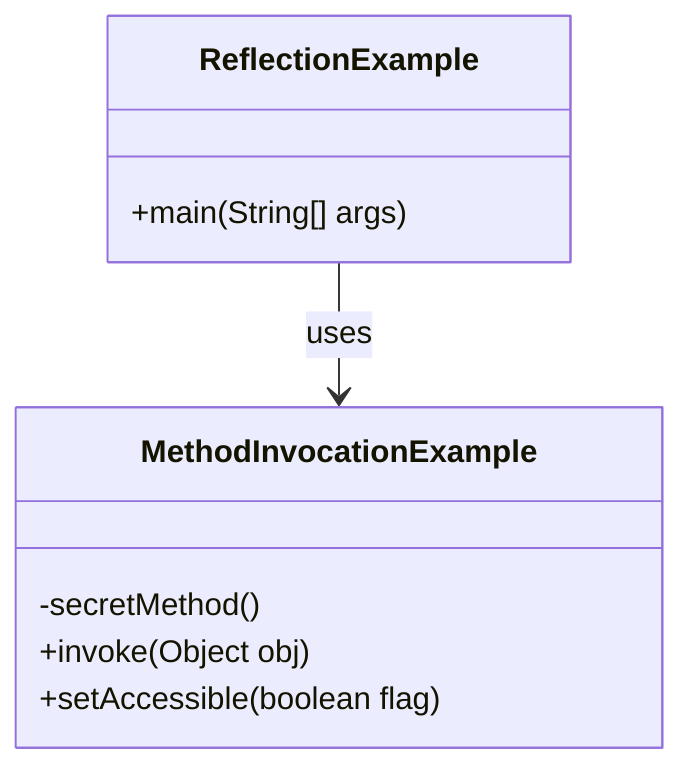

## 13.1.1 Using Reflection in Java

Reflection in Java is a powerful feature that allows developers to inspect and manipulate classes, methods, fields, and other code elements at runtime. This capability enables dynamic behavior and introspection, which are essential for building flexible and adaptable applications. In this section, we will delve into the Java Reflection API, exploring its components, use cases, and best practices.

### Understanding the Java Reflection API

The Java Reflection API is part of the `java.lang.reflect` package and provides the ability to inspect and interact with Java classes and objects at runtime. Reflection is used to:

- **Inspect Class Metadata**: Obtain information about class names, modifiers, inheritance relationships, and more.
- **Access and Manipulate Fields**: Retrieve and modify the values of fields, including private fields.
- **Invoke Methods Dynamically**: Call methods, including private and protected ones, without knowing them at compile time.
- **Create Instances at Runtime**: Instantiate objects using constructors dynamically.
- **Work with Annotations**: Retrieve and process annotation information for classes, methods, and fields.

### Why Use Reflection?

Reflection is particularly useful in scenarios where the code needs to be flexible and adaptable to unknown types at compile time. Some common use cases include:

- **Frameworks and Libraries**: Building frameworks that need to work with user-defined classes and methods.
- **Dependency Injection**: Implementing mechanisms to inject dependencies dynamically.
- **Serialization**: Converting objects to and from different formats without knowing their types in advance.
- **Testing**: Accessing private methods and fields for testing purposes.

### Inspecting Class Metadata

Reflection allows you to inspect various metadata about a class, such as its name, modifiers, and superclass. Here's how you can achieve this:

```java
import java.lang.reflect.Modifier;

public class ReflectionExample {
    public static void main(String[] args) {
        try {
            // Obtain the Class object
            Class<?> clazz = Class.forName("java.util.ArrayList");

            // Get the class name
            System.out.println("Class Name: " + clazz.getName());

            // Get the class modifiers
            int modifiers = clazz.getModifiers();
            System.out.println("Is Public: " + Modifier.isPublic(modifiers));
            System.out.println("Is Abstract: " + Modifier.isAbstract(modifiers));

            // Get the superclass
            Class<?> superclass = clazz.getSuperclass();
            System.out.println("Superclass: " + superclass.getName());

        } catch (ClassNotFoundException e) {
            e.printStackTrace();
        }
    }
}
```

### Accessing and Manipulating Fields

Reflection enables you to access and modify fields, even if they are private. This can be particularly useful for testing or when building frameworks that require access to private data.

```java
import java.lang.reflect.Field;

public class FieldAccessExample {
    private String hiddenField = "Secret";

    public static void main(String[] args) {
        try {
            FieldAccessExample example = new FieldAccessExample();

            // Access the private field
            Field field = FieldAccessExample.class.getDeclaredField("hiddenField");
            field.setAccessible(true); // Bypass the private access modifier

            // Get the field value
            String fieldValue = (String) field.get(example);
            System.out.println("Field Value: " + fieldValue);

            // Set a new value
            field.set(example, "New Secret");
            System.out.println("Updated Field Value: " + field.get(example));

        } catch (NoSuchFieldException | IllegalAccessException e) {
            e.printStackTrace();
        }
    }
}
```

### Invoking Methods Dynamically

Reflection allows you to invoke methods dynamically, which is beneficial when the method to be called is not known at compile time.

```java
import java.lang.reflect.Method;

public class MethodInvocationExample {
    private void secretMethod() {
        System.out.println("Secret method invoked!");
    }

    public static void main(String[] args) {
        try {
            MethodInvocationExample example = new MethodInvocationExample();

            // Access the private method
            Method method = MethodInvocationExample.class.getDeclaredMethod("secretMethod");
            method.setAccessible(true); // Bypass the private access modifier

            // Invoke the method
            method.invoke(example);

        } catch (Exception e) {
            e.printStackTrace();
        }
    }
}
```

### Creating Instances at Runtime

Reflection can be used to create instances of classes at runtime, which is useful for dynamic object creation in frameworks and libraries.

```java
public class InstanceCreationExample {
    public InstanceCreationExample() {
        System.out.println("Instance created!");
    }

    public static void main(String[] args) {
        try {
            // Create an instance using the default constructor
            Class<?> clazz = Class.forName("InstanceCreationExample");
            Object instance = clazz.getDeclaredConstructor().newInstance();

        } catch (Exception e) {
            e.printStackTrace();
        }
    }
}
```

### Working with Annotations

Annotations provide metadata about the program elements. Reflection allows you to retrieve and process this metadata at runtime.

```java
import java.lang.annotation.Retention;
import java.lang.annotation.RetentionPolicy;
import java.lang.reflect.Method;

@Retention(RetentionPolicy.RUNTIME)
@interface MyAnnotation {
    String value();
}

public class AnnotationExample {
    @MyAnnotation(value = "Test Method")
    public void annotatedMethod() {
        System.out.println("Annotated method executed!");
    }

    public static void main(String[] args) {
        try {
            Method method = AnnotationExample.class.getMethod("annotatedMethod");

            // Check if the method has the annotation
            if (method.isAnnotationPresent(MyAnnotation.class)) {
                MyAnnotation annotation = method.getAnnotation(MyAnnotation.class);
                System.out.println("Annotation Value: " + annotation.value());
            }

        } catch (NoSuchMethodException e) {
            e.printStackTrace();
        }
    }
}
```

### Practical Use Cases

#### Building Frameworks and Libraries

Reflection is indispensable for building frameworks that need to work with unknown classes and methods. For instance, a testing framework might use reflection to discover and run test methods annotated with `@Test`.

#### Implementing Dependency Injection

Dependency injection frameworks like Spring use reflection to inject dependencies into classes at runtime. By inspecting constructors and fields, these frameworks can dynamically provide the necessary dependencies.

#### Serialization Mechanisms

Reflection can be used to serialize objects into different formats (e.g., JSON, XML) without knowing their types in advance. This is achieved by inspecting fields and methods to extract data.

### Best Practices for Using Reflection

While reflection is powerful, it should be used judiciously due to potential drawbacks:

- **Performance Impact**: Reflection can be slower than direct code execution because it involves type checking and method lookups at runtime. Use it sparingly in performance-critical code.
- **Security Concerns**: Reflection can bypass access control checks, potentially exposing private data. Ensure proper security measures are in place when using reflection.
- **Maintainability**: Overuse of reflection can lead to code that is difficult to understand and maintain. Use it only when necessary and document its usage clearly.

### Try It Yourself

To deepen your understanding of Java Reflection, try modifying the code examples provided:

- Change the class and method names in the examples to see how reflection adapts to different code structures.
- Experiment with accessing and modifying different types of fields, including static fields.
- Try invoking methods with parameters and handling exceptions that may arise.
- Explore creating instances of parameterized constructors.

### Visualizing Reflection in Java

To better understand how reflection works, let's visualize the process of accessing and invoking a method using a class diagram:



This diagram illustrates the relationship between the `ReflectionExample` class and the `MethodInvocationExample` class, highlighting the use of reflection to invoke a private method.

### References and Links

- [Java Reflection API Documentation](https://docs.oracle.com/javase/8/docs/api/java/lang/reflect/package-summary.html)
- [Oracle's Java Tutorials on Reflection](https://docs.oracle.com/javase/tutorial/reflect/index.html)
- [Effective Java by Joshua Bloch](https://www.oreilly.com/library/view/effective-java-3rd/9780134686097/)

### Knowledge Check

- What are the primary components of the Java Reflection API?
- How can reflection be used to access private fields and methods?
- What are some practical use cases for reflection in Java applications?
- What are the potential drawbacks of using reflection, and how can they be mitigated?

### Embrace the Journey

Remember, mastering reflection is just one step in your journey as a Java expert. Keep experimenting, stay curious, and enjoy the process of learning and growing as a developer!

## Quiz Time!



### What is the primary purpose of the Java Reflection API?

- [x] To inspect and manipulate classes, methods, and fields at runtime.
- [ ] To compile Java code dynamically.
- [ ] To optimize Java code performance.
- [ ] To provide a graphical user interface for Java applications.

> **Explanation:** The Java Reflection API allows developers to inspect and manipulate classes, methods, and fields at runtime, enabling dynamic behavior and introspection.

### Which package contains the Java Reflection API?

- [x] `java.lang.reflect`
- [ ] `java.util`
- [ ] `java.io`
- [ ] `java.net`

> **Explanation:** The Java Reflection API is part of the `java.lang.reflect` package.

### How can you access a private field using reflection?

- [x] By using `Field.setAccessible(true)`
- [ ] By using `Field.getAccessible()`
- [ ] By using `Field.isAccessible()`
- [ ] By using `Field.setPublic()`

> **Explanation:** To access a private field using reflection, you must call `Field.setAccessible(true)` to bypass the access control checks.

### What is a potential drawback of using reflection?

- [x] Performance overhead
- [ ] Increased code readability
- [ ] Enhanced security
- [ ] Simplified code structure

> **Explanation:** Reflection can introduce performance overhead due to runtime type checking and method lookups.

### Which of the following is a practical use case for reflection?

- [x] Building frameworks that work with unknown classes
- [ ] Compiling Java code
- [ ] Rendering graphics
- [ ] Managing network connections

> **Explanation:** Reflection is useful for building frameworks that need to work with user-defined classes and methods.

### How can reflection be used in dependency injection frameworks?

- [x] By inspecting constructors and fields to inject dependencies dynamically
- [ ] By compiling dependencies at runtime
- [ ] By optimizing dependency performance
- [ ] By providing a graphical interface for dependencies

> **Explanation:** Dependency injection frameworks use reflection to inspect constructors and fields, allowing them to inject dependencies dynamically.

### What is the relationship between reflection and annotations?

- [x] Reflection can retrieve and process annotation information at runtime.
- [ ] Reflection can compile annotations into bytecode.
- [ ] Reflection can optimize annotation performance.
- [ ] Reflection can create annotations dynamically.

> **Explanation:** Reflection allows developers to retrieve and process annotation information at runtime, enabling dynamic behavior based on annotations.

### Which method is used to invoke a method dynamically using reflection?

- [x] `Method.invoke(Object obj)`
- [ ] `Method.call(Object obj)`
- [ ] `Method.run(Object obj)`
- [ ] `Method.execute(Object obj)`

> **Explanation:** The `Method.invoke(Object obj)` method is used to dynamically invoke a method using reflection.

### How can reflection affect code maintainability?

- [x] It can make code harder to understand and maintain if overused.
- [ ] It simplifies code structure and readability.
- [ ] It enhances code security and performance.
- [ ] It provides a graphical interface for code management.

> **Explanation:** Overuse of reflection can lead to code that is difficult to understand and maintain, so it should be used judiciously.

### True or False: Reflection can bypass access control checks in Java.

- [x] True
- [ ] False

> **Explanation:** Reflection can bypass access control checks, allowing access to private fields and methods, which can pose security risks if not managed properly.


