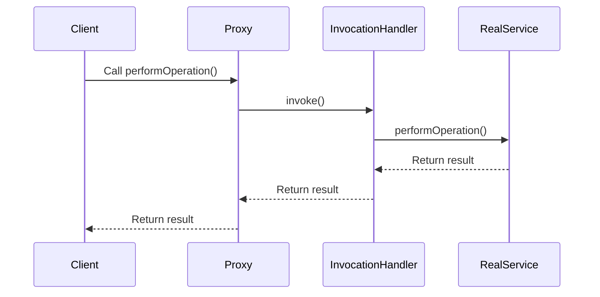

## 13.1.2 Dynamic Proxy Classes

Dynamic proxy classes in Java offer a powerful mechanism to create proxy instances that implement interfaces at runtime. This capability is facilitated by the `java.lang.reflect.Proxy` class, which allows developers to intercept method calls and introduce cross-cutting concerns such as logging, security, and lazy initialization without modifying the original code. In this section, we will delve into the intricacies of dynamic proxies, explore their implementation, and discuss their limitations and alternatives.

### Understanding Dynamic Proxies

Dynamic proxies differ from static proxies in that they are created at runtime rather than being explicitly defined in the source code. This dynamic nature provides flexibility and reduces boilerplate code, as the proxy logic is centralized and can be applied to any interface.

#### Key Differences Between Dynamic and Static Proxies

- **Dynamic Proxies**: Created at runtime using the `Proxy` class. They are flexible and can be applied to any interface without altering the original class.
- **Static Proxies**: Manually coded classes that implement the same interface as the target class. They require more maintenance and are less flexible.

### The Role of `InvocationHandler`

The `InvocationHandler` interface plays a crucial role in dynamic proxies. It defines a single method, `invoke`, which is called whenever a method is invoked on a proxy instance. This method allows you to intercept method calls and define custom behavior.

```java
public interface InvocationHandler {
    Object invoke(Object proxy, Method method, Object[] args) throws Throwable;
}
```

### Step-by-Step Guide to Creating Dynamic Proxies

Let's walk through the process of creating a dynamic proxy in Java.

#### Step 1: Define an Interface to be Proxied

First, define an interface that you want to create a proxy for. This interface will declare the methods that can be intercepted.

```java
public interface Service {
    void performOperation();
}
```

#### Step 2: Implement the `InvocationHandler`

Next, implement the `InvocationHandler` interface to define the behavior that should occur when methods are invoked on the proxy.

```java
import java.lang.reflect.InvocationHandler;
import java.lang.reflect.Method;

public class ServiceInvocationHandler implements InvocationHandler {
    private final Service originalService;

    public ServiceInvocationHandler(Service originalService) {
        this.originalService = originalService;
    }

    @Override
    public Object invoke(Object proxy, Method method, Object[] args) throws Throwable {
        System.out.println("Before method: " + method.getName());
        Object result = method.invoke(originalService, args);
        System.out.println("After method: " + method.getName());
        return result;
    }
}
```

#### Step 3: Use `Proxy.newProxyInstance` to Create a Proxy Instance

Finally, use the `Proxy.newProxyInstance` method to create a proxy instance. This method requires the class loader, the interfaces to proxy, and the invocation handler.

```java
import java.lang.reflect.Proxy;

public class DynamicProxyDemo {
    public static void main(String[] args) {
        Service originalService = new RealService();
        Service proxyService = (Service) Proxy.newProxyInstance(
                originalService.getClass().getClassLoader(),
                new Class[]{Service.class},
                new ServiceInvocationHandler(originalService)
        );

        proxyService.performOperation();
    }
}
```

### Code Examples Demonstrating Dynamic Proxies

#### Example 1: Logging Method Calls

Dynamic proxies can be used to log method calls, providing insights into the execution flow.

```java
public class LoggingInvocationHandler implements InvocationHandler {
    private final Object target;

    public LoggingInvocationHandler(Object target) {
        this.target = target;
    }

    @Override
    public Object invoke(Object proxy, Method method, Object[] args) throws Throwable {
        System.out.println("Invoking method: " + method.getName());
        return method.invoke(target, args);
    }
}
```

#### Example 2: Implementing Lazy Initialization

Lazy initialization can be achieved by deferring the creation of an object until it is needed.

```java
public class LazyInitializationHandler implements InvocationHandler {
    private Object target;
    private final Class<?> targetClass;

    public LazyInitializationHandler(Class<?> targetClass) {
        this.targetClass = targetClass;
    }

    @Override
    public Object invoke(Object proxy, Method method, Object[] args) throws Throwable {
        if (target == null) {
            target = targetClass.getDeclaredConstructor().newInstance();
        }
        return method.invoke(target, args);
    }
}
```

#### Example 3: Applying Security Checks

Security checks can be enforced by validating permissions before method execution.

```java
public class SecurityInvocationHandler implements InvocationHandler {
    private final Object target;

    public SecurityInvocationHandler(Object target) {
        this.target = target;
    }

    @Override
    public Object invoke(Object proxy, Method method, Object[] args) throws Throwable {
        if (!hasPermission(method)) {
            throw new SecurityException("Access denied to method: " + method.getName());
        }
        return method.invoke(target, args);
    }

    private boolean hasPermission(Method method) {
        // Implement permission logic here
        return true;
    }
}
```

### Limitations of Dynamic Proxies

While dynamic proxies are powerful, they come with certain limitations:

- **Interface Requirement**: Dynamic proxies can only proxy interfaces, not concrete classes. This limitation can be circumvented by using third-party libraries like CGLIB, which allow proxying of classes.
- **Complexity**: The use of dynamic proxies can introduce complexity, making the code harder to understand and maintain. It is crucial to document the proxy logic and its purpose clearly.
- **Performance Overhead**: The additional layer of method interception can introduce performance overhead, especially if the proxy logic is complex or the methods are called frequently.

### Alternative Approaches

For scenarios where dynamic proxies are not suitable, consider using third-party libraries:

- **CGLIB**: A popular library that allows for proxying of classes by generating subclass proxies. It is often used in frameworks like Spring for AOP (Aspect-Oriented Programming).
- **Javassist**: A bytecode manipulation library that provides more control over class generation and manipulation.

### Visualizing Dynamic Proxy Creation

Below is a diagram illustrating the process of creating a dynamic proxy in Java:



### Try It Yourself

Experiment with the code examples provided by modifying the `InvocationHandler` implementations. Try adding additional cross-cutting concerns such as caching or transaction management. Observe how these changes affect the behavior of the proxy and the underlying service.

### Knowledge Check

- **What is the primary role of the `InvocationHandler` in dynamic proxies?**
- **How do dynamic proxies differ from static proxies?**
- **What are some limitations of using dynamic proxies?**
- **How can third-party libraries like CGLIB be used in place of dynamic proxies?**

### Embrace the Journey

Remember, mastering dynamic proxies is just one step in your journey as an expert Java developer. Keep exploring, experimenting, and expanding your knowledge. The world of Java is vast, and there are always new techniques and patterns to discover.

## Quiz Time!



### What is a dynamic proxy in Java?

- [x] A proxy created at runtime to implement interfaces
- [ ] A manually coded class that implements an interface
- [ ] A static class that extends another class
- [ ] A type of design pattern unrelated to interfaces

> **Explanation:** Dynamic proxies are created at runtime using the `Proxy` class to implement interfaces dynamically.

### What interface must be implemented to create a dynamic proxy in Java?

- [x] InvocationHandler
- [ ] Runnable
- [ ] Callable
- [ ] Serializable

> **Explanation:** The `InvocationHandler` interface must be implemented to define the behavior of a dynamic proxy.

### Which method is used to create a proxy instance in Java?

- [x] Proxy.newProxyInstance
- [ ] Proxy.createInstance
- [ ] Proxy.getInstance
- [ ] Proxy.newInstance

> **Explanation:** The `Proxy.newProxyInstance` method is used to create a proxy instance in Java.

### What is a limitation of dynamic proxies?

- [x] They can only proxy interfaces, not concrete classes
- [ ] They are slower than static proxies
- [ ] They cannot be used for logging
- [ ] They require a specific Java version

> **Explanation:** Dynamic proxies can only proxy interfaces, which is a limitation compared to libraries like CGLIB that can proxy classes.

### Which library can be used to proxy classes instead of interfaces?

- [x] CGLIB
- [ ] JUnit
- [ ] Mockito
- [ ] SLF4J

> **Explanation:** CGLIB is a library that allows proxying of classes by generating subclass proxies.

### What is the role of the `invoke` method in `InvocationHandler`?

- [x] To intercept method calls on the proxy instance
- [ ] To start a new thread
- [ ] To handle exceptions
- [ ] To serialize objects

> **Explanation:** The `invoke` method is used to intercept and define custom behavior for method calls on the proxy instance.

### How can dynamic proxies be used for security checks?

- [x] By implementing permission logic in the `invoke` method
- [ ] By encrypting method parameters
- [ ] By using a secure class loader
- [ ] By restricting access to the proxy class

> **Explanation:** Security checks can be implemented by adding permission logic in the `invoke` method of the `InvocationHandler`.

### What is an alternative to dynamic proxies for adding cross-cutting concerns?

- [x] Aspect-Oriented Programming (AOP)
- [ ] Object-Oriented Programming (OOP)
- [ ] Functional Programming (FP)
- [ ] Procedural Programming (PP)

> **Explanation:** Aspect-Oriented Programming (AOP) is an alternative approach for adding cross-cutting concerns like logging and security.

### Which method in `Proxy` class is used to check if a class is a proxy class?

- [x] Proxy.isProxyClass
- [ ] Proxy.checkProxyClass
- [ ] Proxy.validateProxyClass
- [ ] Proxy.verifyProxyClass

> **Explanation:** The `Proxy.isProxyClass` method is used to determine if a class is a proxy class.

### True or False: Dynamic proxies can be used to proxy concrete classes.

- [ ] True
- [x] False

> **Explanation:** Dynamic proxies can only be used to proxy interfaces, not concrete classes.




