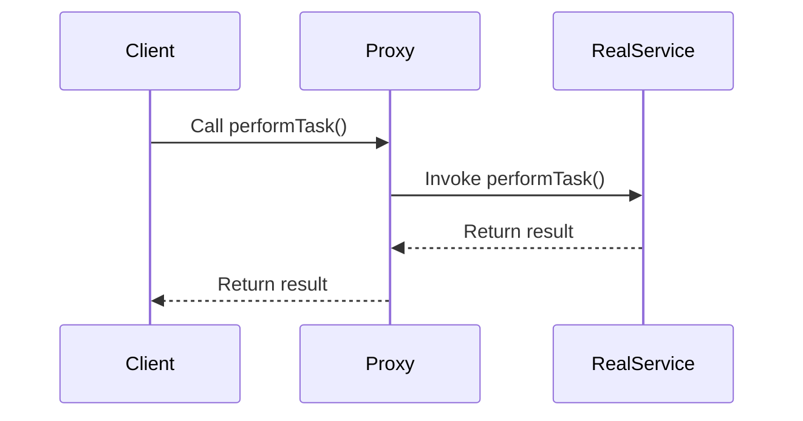

## 13.1.3 Use Cases and Examples

In this section, we delve into the practical applications of reflection and dynamic proxies in Java. These advanced techniques allow developers to write more flexible and dynamic code, enabling powerful features such as logging, method interception, dependency injection, and serialization. Let's explore these use cases with detailed examples and code snippets.

### Logging Framework: Intercepting Method Calls

One of the most common uses of reflection in Java is in logging frameworks. By intercepting method calls, a logging framework can automatically log execution details without requiring changes to the original code. This approach reduces boilerplate code and centralizes logging logic.

#### Implementing a Simple Logging Framework

Let's create a simple logging framework using Java's reflection capabilities. We'll use a dynamic proxy to intercept method calls and log their execution.

```java
import java.lang.reflect.InvocationHandler;
import java.lang.reflect.Method;
import java.lang.reflect.Proxy;

// Define an interface for demonstration
interface Service {
    void performTask();
}

// Implement the interface
class RealService implements Service {
    public void performTask() {
        System.out.println("Executing task...");
    }
}

// Create a dynamic proxy handler
class LoggingHandler implements InvocationHandler {
    private final Object target;

    public LoggingHandler(Object target) {
        this.target = target;
    }

    @Override
    public Object invoke(Object proxy, Method method, Object[] args) throws Throwable {
        System.out.println("Method " + method.getName() + " is called");
        Object result = method.invoke(target, args);
        System.out.println("Method " + method.getName() + " execution finished");
        return result;
    }
}

// Demonstrate the logging framework
public class LoggingExample {
    public static void main(String[] args) {
        Service realService = new RealService();
        Service proxyService = (Service) Proxy.newProxyInstance(
                realService.getClass().getClassLoader(),
                realService.getClass().getInterfaces(),
                new LoggingHandler(realService)
        );

        proxyService.performTask();
    }
}
```

In this example, the `LoggingHandler` class implements `InvocationHandler`, allowing us to intercept method calls on the `Service` interface. The proxy logs the method name before and after execution, demonstrating how reflection can be used to enhance logging without modifying the original `RealService` class.

### Method Interception: Security Checks and Transaction Management

Method interception is another powerful use case for reflection and dynamic proxies. By intercepting method invocations, we can implement security checks or manage transactions transparently.

#### Implementing Security Checks

Consider a scenario where we need to enforce security checks on certain methods. We can achieve this by creating a proxy that intercepts method calls and performs security validation.

```java
import java.lang.reflect.InvocationHandler;
import java.lang.reflect.Method;
import java.lang.reflect.Proxy;

// Define an interface for secured service
interface SecuredService {
    void secureTask();
}

// Implement the interface
class RealSecuredService implements SecuredService {
    public void secureTask() {
        System.out.println("Performing a secure task...");
    }
}

// Create a security handler
class SecurityHandler implements InvocationHandler {
    private final Object target;

    public SecurityHandler(Object target) {
        this.target = target;
    }

    @Override
    public Object invoke(Object proxy, Method method, Object[] args) throws Throwable {
        if (checkSecurity()) {
            return method.invoke(target, args);
        } else {
            throw new SecurityException("Access denied");
        }
    }

    private boolean checkSecurity() {
        // Implement security check logic
        return true; // For demonstration, always return true
    }
}

// Demonstrate method interception with security checks
public class SecurityExample {
    public static void main(String[] args) {
        SecuredService realService = new RealSecuredService();
        SecuredService proxyService = (SecuredService) Proxy.newProxyInstance(
                realService.getClass().getClassLoader(),
                realService.getClass().getInterfaces(),
                new SecurityHandler(realService)
        );

        proxyService.secureTask();
    }
}
```

In this example, the `SecurityHandler` intercepts method calls on the `SecuredService` interface. It performs a security check before invoking the actual method, demonstrating how dynamic proxies can be used to enforce security constraints.

### Dependency Injection Containers

Frameworks like Spring use reflection and dynamic proxies extensively to implement dependency injection (DI). DI allows for the injection of dependencies at runtime, promoting loose coupling and enhancing testability.

#### How Spring Uses Reflection and Proxies

Spring's DI container uses reflection to instantiate beans and inject dependencies. It also employs proxies to implement features like AOP (Aspect-Oriented Programming), where cross-cutting concerns such as logging or transaction management are handled.

```java
import org.springframework.context.ApplicationContext;
import org.springframework.context.annotation.AnnotationConfigApplicationContext;
import org.springframework.stereotype.Component;

// Define a service interface
interface GreetingService {
    void greet(String name);
}

// Implement the service
@Component
class SimpleGreetingService implements GreetingService {
    public void greet(String name) {
        System.out.println("Hello, " + name);
    }
}

// Configuration class
@Configuration
class AppConfig {
    @Bean
    public GreetingService greetingService() {
        return new SimpleGreetingService();
    }
}

// Demonstrate dependency injection
public class SpringDIExample {
    public static void main(String[] args) {
        ApplicationContext context = new AnnotationConfigApplicationContext(AppConfig.class);
        GreetingService service = context.getBean(GreetingService.class);
        service.greet("World");
    }
}
```

In this Spring example, the `ApplicationContext` uses reflection to manage bean lifecycles and inject dependencies. The `@Component` and `@Bean` annotations indicate which classes and methods should be managed by the container.

### Serialization Libraries

Serialization libraries often use reflection to serialize and deserialize objects without requiring explicit code for each class. This approach reduces boilerplate and increases flexibility.

#### Implementing a Simple Serialization Framework

Let's create a simple serialization framework using reflection to convert objects to JSON format.

```java
import java.lang.reflect.Field;
import java.util.HashMap;
import java.util.Map;

// Define a simple object to serialize
class Person {
    private String name;
    private int age;

    public Person(String name, int age) {
        this.name = name;
        this.age = age;
    }
}

// Serialization utility
class JsonSerializer {
    public static String serialize(Object obj) throws IllegalAccessException {
        Map<String, String> jsonElements = new HashMap<>();
        Class<?> objClass = obj.getClass();
        for (Field field : objClass.getDeclaredFields()) {
            field.setAccessible(true);
            jsonElements.put(field.getName(), field.get(obj).toString());
        }
        StringBuilder json = new StringBuilder("{");
        for (Map.Entry<String, String> entry : jsonElements.entrySet()) {
            json.append("\"").append(entry.getKey()).append("\": \"").append(entry.getValue()).append("\", ");
        }
        json.delete(json.length() - 2, json.length()).append("}");
        return json.toString();
    }
}

// Demonstrate serialization
public class SerializationExample {
    public static void main(String[] args) throws IllegalAccessException {
        Person person = new Person("Alice", 30);
        String json = JsonSerializer.serialize(person);
        System.out.println(json);
    }
}
```

In this example, the `JsonSerializer` class uses reflection to access the fields of the `Person` class and convert them into a JSON string. This method allows for serialization without explicitly writing code for each class.

### Advantages and Challenges

Reflection and dynamic proxies offer several advantages, such as reduced boilerplate code, increased flexibility, and the ability to implement cross-cutting concerns. However, they also present challenges, including potential performance overhead and security risks.

#### Advantages

- **Reduced Boilerplate**: Reflection and proxies eliminate the need for repetitive code, making applications more maintainable.
- **Increased Flexibility**: These techniques allow for dynamic behavior changes at runtime, supporting features like DI and AOP.
- **Centralized Logic**: Logging, security, and transaction management can be centralized, improving code organization.

#### Challenges

- **Performance Overhead**: Reflection can be slower than direct method calls, so it's important to use it judiciously.
- **Security Risks**: Reflection can bypass access controls, potentially exposing sensitive data. It's crucial to validate inputs and restrict access where necessary.

### Visualizing Reflection and Proxies

To better understand how reflection and proxies work, let's visualize the process using a sequence diagram.



This diagram illustrates the flow of a method call from the client to the real service via a proxy. The proxy intercepts the call, allowing us to add additional behavior such as logging or security checks.

### Try It Yourself

To deepen your understanding, try modifying the examples provided:

- **Logging Framework**: Add additional logging details, such as method parameters and execution time.
- **Security Checks**: Implement a more complex security check that validates user roles or permissions.
- **Serialization**: Extend the serialization framework to handle nested objects or arrays.

### Knowledge Check

Reflect on the following questions to reinforce your understanding:

- How does reflection enable dynamic behavior in Java applications?
- What are the trade-offs between using reflection and traditional coding techniques?
- How can dynamic proxies be used to implement cross-cutting concerns?

### Embrace the Journey

Remember, mastering advanced techniques like reflection and dynamic proxies is a journey. As you experiment and explore, you'll gain deeper insights into how these tools can enhance your Java applications. Keep pushing the boundaries, stay curious, and enjoy the process!

## Quiz Time!



### What is a common use case for reflection in Java?

- [x] Logging frameworks
- [ ] Sorting algorithms
- [ ] Data compression
- [ ] Image processing

> **Explanation:** Reflection is commonly used in logging frameworks to intercept method calls and log execution details without modifying the original code.


### How do dynamic proxies enhance method interception?

- [x] By allowing method calls to be intercepted and additional behavior to be added
- [ ] By speeding up method execution
- [ ] By reducing the need for method parameters
- [ ] By simplifying method signatures

> **Explanation:** Dynamic proxies enable method interception by allowing method calls to be intercepted and additional behavior, such as logging or security checks, to be added.


### Which Java framework extensively uses reflection for dependency injection?

- [x] Spring
- [ ] Hibernate
- [ ] JUnit
- [ ] Log4j

> **Explanation:** Spring extensively uses reflection for dependency injection, allowing for the injection of dependencies at runtime.


### What is a potential challenge when using reflection in Java?

- [x] Performance overhead
- [ ] Increased code readability
- [ ] Simplified error handling
- [ ] Enhanced security

> **Explanation:** A potential challenge when using reflection is performance overhead, as reflection can be slower than direct method calls.


### How can serialization libraries benefit from reflection?

- [x] By reducing boilerplate code for object serialization
- [ ] By increasing the size of serialized objects
- [ ] By requiring explicit serialization code for each class
- [ ] By limiting serialization to primitive types

> **Explanation:** Serialization libraries benefit from reflection by reducing boilerplate code, allowing objects to be serialized and deserialized without requiring explicit code for each class.


### What is a key advantage of using dynamic proxies for logging?

- [x] Centralized logging logic
- [ ] Faster execution time
- [ ] Reduced memory usage
- [ ] Simplified method signatures

> **Explanation:** A key advantage of using dynamic proxies for logging is centralized logging logic, which improves code organization and maintainability.


### In the context of security checks, what role does a dynamic proxy play?

- [x] It intercepts method calls to perform security validation
- [ ] It encrypts method parameters
- [ ] It compresses method results
- [ ] It simplifies method signatures

> **Explanation:** In the context of security checks, a dynamic proxy intercepts method calls to perform security validation before invoking the actual method.


### What is a common challenge when using reflection for serialization?

- [x] Ensuring performance and security
- [ ] Reducing code readability
- [ ] Simplifying error handling
- [ ] Enhancing security

> **Explanation:** A common challenge when using reflection for serialization is ensuring performance and security, as reflection can introduce overhead and potential security risks.


### How does Spring's DI container use reflection?

- [x] To instantiate beans and inject dependencies
- [ ] To compress data
- [ ] To sort collections
- [ ] To encrypt data

> **Explanation:** Spring's DI container uses reflection to instantiate beans and inject dependencies, promoting loose coupling and enhancing testability.


### True or False: Reflection can bypass access controls in Java.

- [x] True
- [ ] False

> **Explanation:** True. Reflection can bypass access controls, potentially exposing sensitive data, so it's important to validate inputs and restrict access where necessary.


