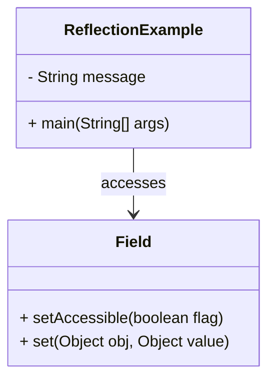

## 13.1 Metaprogramming and Reflection

In the realm of software engineering, metaprogramming stands as a powerful paradigm that allows programs to treat other programs as their data. This capability is particularly significant in Java, where the Reflection API serves as the cornerstone for implementing metaprogramming techniques. Let's delve into the intricacies of metaprogramming and reflection, exploring how they empower developers to create more dynamic and flexible applications.

### What is Metaprogramming?

Metaprogramming is a programming technique where code has the ability to inspect, analyze, and modify itself or other code at runtime. This approach allows developers to write programs that can manipulate other programs or themselves, leading to more adaptable and dynamic software solutions.

#### Significance in Software Development

Metaprogramming offers several advantages in software development:

- **Flexibility**: It enables the creation of highly adaptable systems that can adjust their behavior based on runtime conditions.
- **Code Generation**: Automates repetitive coding tasks, reducing human error and increasing productivity.
- **Dynamic Behavior**: Facilitates the implementation of features like dependency injection, aspect-oriented programming, and dynamic proxies.

### Introduction to Java's Reflection API

Java's Reflection API is the primary tool for metaprogramming in Java. It provides the means to inspect and modify the runtime behavior of applications. With reflection, developers can examine classes, methods, fields, and annotations at runtime, enabling dynamic interaction with Java objects.

#### Core Components of the Reflection API

- **Class**: Represents classes and interfaces in a running Java application.
- **Field**: Provides information about, and dynamic access to, a single field of a class or an interface.
- **Method**: Represents a method of a class or interface.
- **Constructor**: Represents a constructor of a class.
- **Annotation**: Provides information about annotations at runtime.

### Runtime Inspection and Modification

Reflection allows for the inspection and modification of classes, methods, fields, and annotations at runtime. This capability is crucial for applications that require dynamic behavior or need to interact with unknown classes at compile time.

#### Inspecting Classes and Interfaces

Using reflection, you can obtain information about classes and interfaces, such as their methods, fields, constructors, and annotations. Here's a simple example:

```java
import java.lang.reflect.*;

public class ReflectionExample {
    public static void main(String[] args) {
        try {
            // Obtain the Class object for a given class
            Class<?> clazz = Class.forName("java.util.ArrayList");

            // Print the class name
            System.out.println("Class Name: " + clazz.getName());

            // Print all declared methods
            Method[] methods = clazz.getDeclaredMethods();
            for (Method method : methods) {
                System.out.println("Method: " + method.getName());
            }

            // Print all declared fields
            Field[] fields = clazz.getDeclaredFields();
            for (Field field : fields) {
                System.out.println("Field: " + field.getName());
            }
        } catch (ClassNotFoundException e) {
            e.printStackTrace();
        }
    }
}
```

In this example, we use reflection to inspect the `ArrayList` class, printing its methods and fields.

#### Modifying Fields and Methods

Reflection also allows for the modification of fields and invocation of methods at runtime. Consider the following example:

```java
import java.lang.reflect.*;

public class ModifyFieldExample {
    private String message = "Hello, World!";

    public static void main(String[] args) {
        try {
            ModifyFieldExample example = new ModifyFieldExample();

            // Obtain the Class object
            Class<?> clazz = example.getClass();

            // Access the private field
            Field field = clazz.getDeclaredField("message");
            field.setAccessible(true);

            // Modify the field value
            field.set(example, "Hello, Reflection!");

            // Print the modified field value
            System.out.println("Modified Message: " + example.message);
        } catch (NoSuchFieldException | IllegalAccessException e) {
            e.printStackTrace();
        }
    }
}
```

Here, we modify a private field's value using reflection, demonstrating the power and flexibility of this technique.

### Advantages of Metaprogramming and Reflection

Metaprogramming and reflection are advantageous in scenarios where dynamic behavior is required. Some common use cases include:

- **Dependency Injection**: Frameworks like Spring use reflection to inject dependencies at runtime.
- **Aspect-Oriented Programming**: Allows for the separation of cross-cutting concerns such as logging and security.
- **Dynamic Proxies**: Enables the creation of proxy objects that can intercept method calls and add behavior dynamically.

### Potential Risks and Considerations

While powerful, metaprogramming and reflection come with potential risks:

- **Performance Overhead**: Reflection operations are slower than direct method calls due to the additional processing required.
- **Security Concerns**: Reflection can bypass access control checks, potentially exposing sensitive data or functionality.
- **Complexity**: Overuse of reflection can lead to code that is difficult to understand and maintain.

### Visualizing Reflection

To better understand how reflection works, let's visualize the process of inspecting and modifying a class using a class diagram.



In this diagram, the `ReflectionExample` class accesses the `Field` class to modify its private `message` field.

### Summary

Metaprogramming and reflection in Java provide a powerful set of tools for creating dynamic and flexible applications. By leveraging the Reflection API, developers can inspect, analyze, and modify code at runtime, enabling a wide range of advanced programming techniques. However, it's essential to be aware of the potential risks and performance implications associated with these techniques.

### Try It Yourself

Experiment with the provided code examples by modifying class names, methods, or fields to see how reflection can dynamically interact with different parts of your code. Consider creating a simple application that uses reflection to load and execute plugins at runtime, demonstrating the flexibility of metaprogramming.

### Further Reading

For more information on Java's Reflection API and metaprogramming techniques, consider exploring the following resources:

- [Java Reflection API Documentation](https://docs.oracle.com/javase/8/docs/api/java/lang/reflect/package-summary.html)
- [Effective Java by Joshua Bloch](https://www.oreilly.com/library/view/effective-java-3rd/9780134686097/)
- [Java: The Complete Reference by Herbert Schildt](https://www.oreilly.com/library/view/java-the-complete/9781260440249/)

## Quiz Time!



### What is metaprogramming?

- [x] A programming technique where code can inspect, analyze, and modify itself or other code at runtime.
- [ ] A technique for optimizing code performance.
- [ ] A method for writing code in multiple languages.
- [ ] A way to compile code into machine language.

> **Explanation:** Metaprogramming allows programs to treat other programs as their data, enabling runtime inspection and modification.

### What is the primary tool for metaprogramming in Java?

- [x] Reflection API
- [ ] Java Compiler
- [ ] Java Virtual Machine
- [ ] Java Development Kit

> **Explanation:** The Reflection API is the primary tool for implementing metaprogramming techniques in Java.

### Which of the following is NOT a component of the Reflection API?

- [ ] Class
- [ ] Method
- [ ] Field
- [x] Thread

> **Explanation:** Thread is not a component of the Reflection API. The Reflection API includes Class, Method, Field, Constructor, and Annotation.

### What is a potential risk of using reflection?

- [x] Security concerns
- [ ] Increased code readability
- [ ] Improved performance
- [ ] Simplified code structure

> **Explanation:** Reflection can bypass access control checks, potentially exposing sensitive data or functionality.

### Which of the following scenarios is NOT a typical use case for metaprogramming?

- [ ] Dependency Injection
- [ ] Aspect-Oriented Programming
- [ ] Dynamic Proxies
- [x] Static Code Analysis

> **Explanation:** Static code analysis is performed at compile time, not runtime, and does not typically involve metaprogramming.

### How does reflection affect performance?

- [x] It introduces performance overhead due to additional processing.
- [ ] It significantly improves performance by optimizing code execution.
- [ ] It has no impact on performance.
- [ ] It only affects performance in multi-threaded applications.

> **Explanation:** Reflection operations are slower than direct method calls due to the additional processing required.

### What is the purpose of the `setAccessible` method in the Reflection API?

- [x] To allow access to private fields and methods.
- [ ] To optimize the performance of reflection operations.
- [ ] To compile code at runtime.
- [ ] To create new instances of classes.

> **Explanation:** The `setAccessible` method allows access to private fields and methods, bypassing access control checks.

### Which Java framework commonly uses reflection for dependency injection?

- [x] Spring
- [ ] Hibernate
- [ ] Apache Struts
- [ ] JSF

> **Explanation:** Spring uses reflection to inject dependencies at runtime, making it a common framework for dependency injection.

### What is the role of dynamic proxies in Java?

- [x] To intercept method calls and add behavior dynamically.
- [ ] To compile code into machine language.
- [ ] To optimize code execution.
- [ ] To provide static code analysis.

> **Explanation:** Dynamic proxies enable the creation of proxy objects that can intercept method calls and add behavior dynamically.

### True or False: Reflection can modify the behavior of final methods.

- [ ] True
- [x] False

> **Explanation:** Reflection cannot modify the behavior of final methods, as they cannot be overridden.


