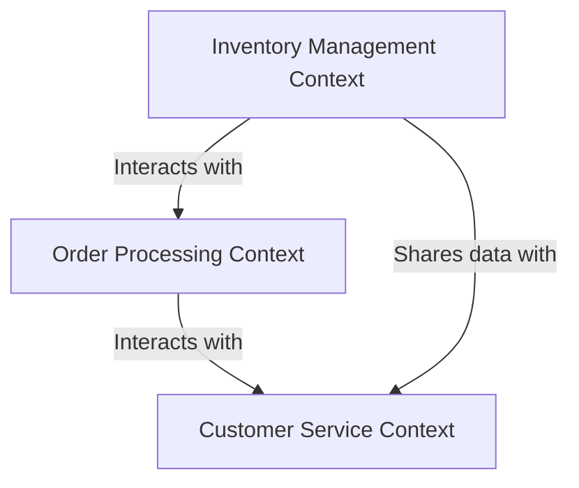

## 13.2.1 Bounded Contexts

In the realm of software architecture, managing complexity is a perennial challenge. Domain-Driven Design (DDD) offers a strategic approach to tackle this issue through the concept of **bounded contexts**. This section delves into the intricacies of bounded contexts, elucidating their role in DDD, their impact on organizing large domains, and strategies for effective implementation.

### Defining Bounded Contexts

**Bounded Contexts** are a fundamental concept in Domain-Driven Design, introduced by Eric Evans in his seminal book "Domain-Driven Design: Tackling Complexity in the Heart of Software." A bounded context defines the boundaries within which a particular domain model is applicable. It encapsulates a specific part of the domain, ensuring that the model and the language used are consistent and cohesive within those boundaries.

#### Role in Domain-Driven Design

Bounded contexts serve as a mechanism to manage complexity by dividing large, intricate models into smaller, more manageable pieces. They provide a clear demarcation of where a particular model applies, preventing the confusion that can arise when different models overlap or when the same term has different meanings in different parts of the system.

### Organizing Large Domains

In large systems, it is common to encounter multiple domains, each with its own set of rules, processes, and terminologies. Bounded contexts help in organizing these domains by:

- **Separating Models**: Each bounded context contains its own model, tailored to the specific needs and language of that context. This separation ensures that changes in one context do not inadvertently affect another.
- **Defining Language**: Within a bounded context, a ubiquitous language is developed, which is shared by all stakeholders involved in that context. This language is consistent and precise, reducing misunderstandings and improving communication.

### Examples of Bounded Contexts

Consider a large e-commerce system that encompasses various domains such as inventory management, order processing, and customer service. Each of these domains can be represented as a bounded context:

- **Inventory Management Context**: This context focuses on managing stock levels, tracking inventory movements, and handling restocking processes. The model here includes entities like `Product`, `StockItem`, and `Warehouse`.

- **Order Processing Context**: This context deals with order creation, payment processing, and order fulfillment. Its model includes entities like `Order`, `Payment`, and `Shipment`.

- **Customer Service Context**: This context is concerned with handling customer inquiries, managing customer accounts, and processing returns. The model includes entities like `Customer`, `SupportTicket`, and `ReturnRequest`.

Each of these contexts operates independently, with its own model and language, yet they may interact with one another through well-defined interfaces.

### Relationships Between Bounded Contexts

Bounded contexts do not exist in isolation; they often need to interact with one another. Understanding and managing these interactions is crucial for maintaining the integrity of each context. Some common relationships include:

- **Shared Kernel**: A shared kernel is a small, shared subset of the domain model that is used by multiple bounded contexts. It requires careful management to ensure that changes do not disrupt the contexts that depend on it.

- **Context Map**: A context map is a tool used to visualize the relationships between bounded contexts. It helps in understanding how contexts interact, where they overlap, and how they are integrated.

- **Customer-Supplier**: In this relationship, one context (the supplier) provides services or data to another context (the customer). The supplier context must ensure that its services meet the needs of the customer context.

- **Conformist**: In a conformist relationship, one context must conform to the model and language of another context. This often occurs when one context is dependent on another and cannot influence its design.

### Importance of Clear Boundaries

Establishing clear boundaries for each context is paramount to prevent model confusion and ensure that each context remains cohesive and consistent. Clear boundaries help in:

- **Avoiding Model Overlap**: By defining precise boundaries, you can prevent different models from overlapping, which can lead to inconsistencies and errors.

- **Maintaining Consistency**: Within a bounded context, the model and language are consistent, reducing the risk of misunderstandings and miscommunication.

- **Facilitating Change**: Clear boundaries make it easier to implement changes within a context without affecting other parts of the system.

### Strategies for Identifying Bounded Contexts

Identifying bounded contexts in a project can be challenging, especially in complex systems. Here are some strategies to help:

- **Domain Analysis**: Conduct a thorough analysis of the domain to identify distinct areas of functionality and responsibility. Look for natural divisions in the domain that can serve as boundaries.

- **Ubiquitous Language**: Develop a ubiquitous language for each potential context. If the language differs significantly between areas, this may indicate separate contexts.

- **Team Structure**: Consider the structure of your development teams. Aligning bounded contexts with team boundaries can improve focus and efficiency.

- **Business Processes**: Examine the business processes and workflows. Different processes may naturally map to different contexts.

### Communication Between Teams

In projects with multiple bounded contexts, effective communication between teams is crucial. Here are some best practices:

- **Regular Meetings**: Hold regular meetings between teams to discuss dependencies, integration points, and potential issues.

- **Shared Documentation**: Maintain shared documentation that outlines the interfaces and interactions between contexts.

- **Cross-Context Workshops**: Organize workshops where teams can collaborate on shared challenges and solutions.

- **Integration Testing**: Implement integration testing to ensure that interactions between contexts function correctly.

### Conclusion

Bounded contexts are a powerful tool in Domain-Driven Design, enabling developers to manage complexity by dividing large domains into smaller, more manageable pieces. By establishing clear boundaries, defining consistent models and languages, and fostering effective communication between teams, bounded contexts help create robust, maintainable, and efficient systems.

### Code Example: Implementing Bounded Contexts in Java

To illustrate the concept of bounded contexts, consider the following Java code example that demonstrates how to define and interact with multiple bounded contexts in an e-commerce system.

```java
// Inventory Management Context
class Product {
    private String productId;
    private String name;
    private int quantity;

    // Constructor, getters, and setters
}

class InventoryService {
    public void addStock(Product product, int quantity) {
        product.setQuantity(product.getQuantity() + quantity);
        // Logic to update inventory
    }

    public void removeStock(Product product, int quantity) {
        if (product.getQuantity() >= quantity) {
            product.setQuantity(product.getQuantity() - quantity);
            // Logic to update inventory
        } else {
            throw new IllegalArgumentException("Insufficient stock");
        }
    }
}

// Order Processing Context
class Order {
    private String orderId;
    private List<Product> products;
    private String status;

    // Constructor, getters, and setters
}

class OrderService {
    public void createOrder(Order order) {
        order.setStatus("Created");
        // Logic to process order
    }

    public void fulfillOrder(Order order) {
        order.setStatus("Fulfilled");
        // Logic to fulfill order
    }
}

// Customer Service Context
class Customer {
    private String customerId;
    private String name;
    private String email;

    // Constructor, getters, and setters
}

class CustomerService {
    public void createCustomer(Customer customer) {
        // Logic to create customer
    }

    public void handleSupportTicket(String ticketId, String issue) {
        // Logic to handle support ticket
    }
}

// Example of interaction between contexts
class ECommerceSystem {
    private InventoryService inventoryService;
    private OrderService orderService;
    private CustomerService customerService;

    public ECommerceSystem() {
        this.inventoryService = new InventoryService();
        this.orderService = new OrderService();
        this.customerService = new CustomerService();
    }

    public void processOrder(Order order) {
        for (Product product : order.getProducts()) {
            inventoryService.removeStock(product, 1);
        }
        orderService.createOrder(order);
    }
}
```

### Explanation

In this example, we define three bounded contexts: Inventory Management, Order Processing, and Customer Service. Each context has its own set of classes and services, encapsulating the logic specific to that context. The `ECommerceSystem` class demonstrates how these contexts can interact, with the `processOrder` method coordinating actions across the Inventory and Order Processing contexts.

### Encouragement for Experimentation

Readers are encouraged to experiment with this code by adding new features or modifying existing ones. For instance, try implementing a `ReturnOrder` method in the Order Processing context or a `RestockNotification` feature in the Inventory Management context.

### Visualizing Bounded Contexts

To further enhance understanding, let's visualize the structure of bounded contexts using a Mermaid.js diagram.



**Diagram Description**: This diagram illustrates the interactions between the Inventory Management, Order Processing, and Customer Service contexts in an e-commerce system. The arrows indicate the flow of data and interactions between the contexts.

### References and Further Reading

- [Domain-Driven Design: Tackling Complexity in the Heart of Software by Eric Evans](https://www.domainlanguage.com/ddd/)
- [Java Documentation](https://docs.oracle.com/en/java/)
- [Cloud Design Patterns](https://learn.microsoft.com/en-us/azure/architecture/patterns/)

### Key Takeaways

- Bounded contexts help manage complexity by dividing large domains into smaller, manageable pieces.
- Clear boundaries and consistent language within contexts prevent model confusion.
- Effective communication between teams is crucial for successful implementation.
- Experimentation and adaptation of bounded contexts can lead to more robust and maintainable systems.

### SEO-Optimized Quiz Title

## Test Your Understanding of Bounded Contexts in Domain-Driven Design



### What is a bounded context in Domain-Driven Design?

- [x] A boundary within which a particular domain model is applicable.
- [ ] A shared subset of the domain model used by multiple contexts.
- [ ] A tool for visualizing relationships between contexts.
- [ ] A method for integrating different contexts.

> **Explanation:** A bounded context defines the boundaries within which a particular domain model applies, ensuring consistency and cohesion.

### How do bounded contexts help manage complexity?

- [x] By dividing large models into smaller, manageable pieces.
- [ ] By merging different models into a single context.
- [ ] By eliminating the need for a ubiquitous language.
- [ ] By reducing the number of domain experts needed.

> **Explanation:** Bounded contexts manage complexity by separating large models into smaller, cohesive units, each with its own model and language.

### What is a shared kernel in the context of bounded contexts?

- [x] A small, shared subset of the domain model used by multiple contexts.
- [ ] A boundary that separates different domain models.
- [ ] A language used within a bounded context.
- [ ] A tool for managing dependencies between contexts.

> **Explanation:** A shared kernel is a shared subset of the domain model that is used by multiple bounded contexts, requiring careful management.

### What is the purpose of a context map?

- [x] To visualize the relationships between bounded contexts.
- [ ] To define the language used within a context.
- [ ] To merge different contexts into a single model.
- [ ] To eliminate the need for communication between teams.

> **Explanation:** A context map is used to visualize and understand the relationships and interactions between different bounded contexts.

### Which strategy can help identify bounded contexts in a project?

- [x] Domain Analysis
- [ ] Code Refactoring
- [ ] Model Merging
- [ ] Language Translation

> **Explanation:** Domain analysis helps identify distinct areas of functionality and responsibility, which can serve as boundaries for bounded contexts.

### Why is it important to have clear boundaries for each bounded context?

- [x] To prevent model confusion and maintain consistency.
- [ ] To allow models to overlap and share language.
- [ ] To eliminate the need for integration testing.
- [ ] To reduce the number of bounded contexts needed.

> **Explanation:** Clear boundaries prevent model overlap and ensure consistency within each context, facilitating easier changes and maintenance.

### How can teams effectively communicate when working on different bounded contexts?

- [x] Regular Meetings
- [ ] Isolated Development
- [ ] Independent Documentation
- [ ] Separate Testing

> **Explanation:** Regular meetings and shared documentation help teams communicate effectively and manage dependencies between contexts.

### What is a customer-supplier relationship in bounded contexts?

- [x] One context provides services or data to another context.
- [ ] Two contexts share the same model and language.
- [ ] One context must conform to another's model.
- [ ] Two contexts operate independently without interaction.

> **Explanation:** In a customer-supplier relationship, one context (the supplier) provides services or data to another context (the customer).

### What is the role of a ubiquitous language in a bounded context?

- [x] To ensure consistent and precise communication within the context.
- [ ] To allow different models to share the same language.
- [ ] To eliminate the need for domain experts.
- [ ] To merge different contexts into a single model.

> **Explanation:** A ubiquitous language ensures consistent and precise communication within a bounded context, reducing misunderstandings.

### True or False: Bounded contexts can help facilitate change within a system.

- [x] True
- [ ] False

> **Explanation:** True. Bounded contexts facilitate change by providing clear boundaries and consistent models, allowing changes to be made within a context without affecting others.



By understanding and implementing bounded contexts, software architects and developers can create systems that are not only robust and maintainable but also adaptable to changing business needs.
