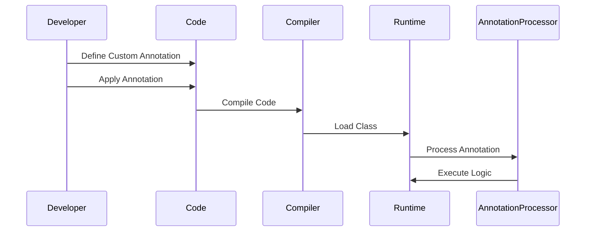

## 13.2.1 Custom Annotations

In the realm of Java programming, annotations serve as a powerful tool for adding metadata to your code. This metadata can be processed at compile-time or runtime to implement custom behaviors, enforce code standards, or simply provide additional information. In this section, we will delve into the creation and utilization of custom annotations, exploring their syntax, application, and practical use cases.

### Understanding Custom Annotations

Annotations in Java are a form of syntactic metadata that can be added to Java code elements such as classes, methods, fields, and more. They are not part of the program itself but can be used by the compiler or at runtime to perform certain operations. Custom annotations allow developers to define their own annotations, tailored to specific needs or frameworks.

#### Why Use Custom Annotations?

Custom annotations can be incredibly useful for a variety of reasons:

- **Code Clarity**: They provide a clear and concise way to convey additional information about code elements.
- **Automation**: Annotations can be used to automate repetitive tasks, such as logging or validation.
- **Configuration**: They can serve as a configuration mechanism, reducing the need for external configuration files.
- **Enforcement**: Annotations can enforce coding standards or design patterns by integrating with tools that process them.

### Creating a Custom Annotation

Creating a custom annotation in Java involves several key steps. Let's explore these steps in detail.

#### Step 1: Define the Annotation Using `@interface`

To create a custom annotation, you use the `@interface` keyword. This defines a new annotation type.

```java
// Define a custom annotation
public @interface MyCustomAnnotation {
    // Annotation elements
}
```

#### Step 2: Add Annotation Elements (Parameters)

Annotations can have elements, which are essentially parameters. These elements can have default values.

```java
// Define a custom annotation with elements
public @interface MyCustomAnnotation {
    String value() default "default value";
    int number() default 0;
}
```

#### Step 3: Specify Retention Policies

Retention policies determine at what point the annotation is discarded. Java provides three retention policies:

- `SOURCE`: The annotation is retained only in the source code and discarded during compilation.
- `CLASS`: The annotation is retained in the class file but not available at runtime.
- `RUNTIME`: The annotation is retained at runtime and can be accessed via reflection.

```java
import java.lang.annotation.Retention;
import java.lang.annotation.RetentionPolicy;

// Define a custom annotation with a retention policy
@Retention(RetentionPolicy.RUNTIME)
public @interface MyCustomAnnotation {
    String value() default "default value";
}
```

#### Step 4: Define Target Elements

Target elements specify where the annotation can be applied. Common targets include:

- `TYPE`: Classes, interfaces, or enums.
- `FIELD`: Fields (including enum constants).
- `METHOD`: Methods.
- `PARAMETER`: Parameters of a method.
- `CONSTRUCTOR`: Constructors.
- `LOCAL_VARIABLE`: Local variables.
- `ANNOTATION_TYPE`: Annotations.
- `PACKAGE`: Packages.

```java
import java.lang.annotation.ElementType;
import java.lang.annotation.Target;

// Define a custom annotation with a target
@Target(ElementType.METHOD)
public @interface MyCustomAnnotation {
    String value() default "default value";
}
```

### Applying Custom Annotations

Once you've defined a custom annotation, you can apply it to various code elements. Let's look at some examples.

#### Applying to a Class

```java
@MyCustomAnnotation(value = "Class Level Annotation")
public class MyClass {
    // Class implementation
}
```

#### Applying to a Method

```java
public class MyClass {

    @MyCustomAnnotation(value = "Method Level Annotation")
    public void myMethod() {
        // Method implementation
    }
}
```

#### Applying to a Field

```java
public class MyClass {

    @MyCustomAnnotation(value = "Field Level Annotation")
    private String myField;

    // Class implementation
}
```

### Use Cases for Custom Annotations

Custom annotations can be used in a variety of scenarios. Here are some common use cases:

#### Marking Methods for Logging or Auditing

Annotations can be used to mark methods that require logging or auditing. A logging framework can then process these annotations to automatically log method calls.

```java
@Retention(RetentionPolicy.RUNTIME)
@Target(ElementType.METHOD)
public @interface Loggable {
    String level() default "INFO";
}
```

#### Specifying Configuration Parameters

Annotations can serve as a configuration mechanism, allowing you to specify configuration parameters directly in your code.

```java
@Retention(RetentionPolicy.RUNTIME)
@Target(ElementType.FIELD)
public @interface ConfigParam {
    String key();
    String defaultValue() default "";
}
```

#### Enforcing Coding Conventions

Annotations can be used to enforce coding conventions or design patterns. For example, you might create an annotation to ensure that certain methods are only called in specific contexts.

```java
@Retention(RetentionPolicy.RUNTIME)
@Target(ElementType.METHOD)
public @interface RequiresAuthentication {
    // No elements needed
}
```

### Best Practices for Custom Annotations

When creating custom annotations, consider the following best practices:

- **Naming**: Use clear and descriptive names for your annotations. Consider using a prefix or suffix to avoid conflicts with other annotations.
- **Documentation**: Provide documentation for your annotations, explaining their purpose and usage.
- **Retention and Target**: Carefully choose the retention policy and target elements to match the intended use of the annotation.
- **Default Values**: Provide default values for annotation elements where appropriate to simplify usage.

### Code Example: Creating and Using a Custom Annotation

Let's put everything together with a comprehensive example. We'll create a custom annotation for logging method execution times.

```java
import java.lang.annotation.ElementType;
import java.lang.annotation.Retention;
import java.lang.annotation.RetentionPolicy;
import java.lang.annotation.Target;

// Define the custom annotation
@Retention(RetentionPolicy.RUNTIME)
@Target(ElementType.METHOD)
public @interface LogExecutionTime {
    // No elements needed
}

// A class using the custom annotation
public class PerformanceTester {

    @LogExecutionTime
    public void performTask() {
        // Simulate task execution
        try {
            Thread.sleep(1000);
        } catch (InterruptedException e) {
            e.printStackTrace();
        }
    }
}
```

To process this annotation, you would typically use reflection. Here's a simple example of how you might do that:

```java
import java.lang.reflect.Method;

public class AnnotationProcessor {

    public static void main(String[] args) throws Exception {
        PerformanceTester tester = new PerformanceTester();
        Method method = tester.getClass().getMethod("performTask");

        if (method.isAnnotationPresent(LogExecutionTime.class)) {
            long startTime = System.currentTimeMillis();
            method.invoke(tester);
            long endTime = System.currentTimeMillis();
            System.out.println("Execution time: " + (endTime - startTime) + "ms");
        }
    }
}
```

### Try It Yourself

Experiment with the code above by modifying the `LogExecutionTime` annotation to include a `String` element for specifying a custom log message. Update the `AnnotationProcessor` to print this message before logging the execution time.

### Visualizing Annotation Processing

To better understand how annotations are processed, let's visualize the flow of annotation processing using a sequence diagram.



**Diagram Description**: This sequence diagram illustrates the lifecycle of a custom annotation from definition and application by the developer, through compilation and runtime processing, to execution by an annotation processor.

### References and Links

For further reading on annotations in Java, consider the following resources:

- [Java Annotations Tutorial](https://docs.oracle.com/javase/tutorial/java/annotations/)
- [Java Reflection API](https://docs.oracle.com/javase/tutorial/reflect/)
- [Effective Java by Joshua Bloch](https://www.oreilly.com/library/view/effective-java/9780134686097/)

### Knowledge Check

- What are the three retention policies available for annotations in Java?
- How can custom annotations be used to enforce coding conventions?
- What is the purpose of the `@interface` keyword in Java?

### Embrace the Journey

Remember, creating custom annotations is just the beginning. As you continue to explore Java's capabilities, you'll find even more ways to leverage annotations to streamline your code and enhance its functionality. Keep experimenting, stay curious, and enjoy the journey!

## Quiz Time!



### What is the primary purpose of custom annotations in Java?

- [x] To add metadata to code elements
- [ ] To replace comments in code
- [ ] To compile code faster
- [ ] To create new data types

> **Explanation:** Custom annotations are used to add metadata to code elements, which can be processed to implement custom behaviors or enforce code standards.

### Which keyword is used to define a custom annotation in Java?

- [x] @interface
- [ ] @annotation
- [ ] @custom
- [ ] @define

> **Explanation:** The `@interface` keyword is used to define a custom annotation in Java.

### What does the `RUNTIME` retention policy imply for an annotation?

- [x] The annotation is retained at runtime and can be accessed via reflection.
- [ ] The annotation is only available in the source code.
- [ ] The annotation is discarded after compilation.
- [ ] The annotation is only used during testing.

> **Explanation:** The `RUNTIME` retention policy means the annotation is retained at runtime and can be accessed via reflection.

### Which of the following is NOT a valid target for an annotation?

- [ ] TYPE
- [ ] METHOD
- [ ] FIELD
- [x] VARIABLE

> **Explanation:** `VARIABLE` is not a valid target for annotations. The correct target for local variables is `LOCAL_VARIABLE`.

### How can custom annotations be used in Java?

- [x] To mark methods for logging
- [x] To specify configuration parameters
- [ ] To change the syntax of Java
- [ ] To replace classes

> **Explanation:** Custom annotations can be used to mark methods for logging, specify configuration parameters, and more, but they do not change Java's syntax or replace classes.

### What is a best practice when naming custom annotations?

- [x] Use clear and descriptive names
- [ ] Use short, cryptic names
- [ ] Use numbers in names
- [ ] Avoid using any prefixes or suffixes

> **Explanation:** It's best to use clear and descriptive names for custom annotations to avoid confusion and ensure clarity.

### What is the role of an annotation processor?

- [x] To process annotations at compile-time or runtime
- [ ] To compile Java code faster
- [ ] To replace deprecated methods
- [ ] To manage memory allocation

> **Explanation:** An annotation processor is responsible for processing annotations at compile-time or runtime to implement custom behaviors.

### What is the purpose of providing default values for annotation elements?

- [x] To simplify usage
- [ ] To make annotations optional
- [ ] To increase compilation speed
- [ ] To prevent runtime errors

> **Explanation:** Providing default values for annotation elements simplifies their usage by allowing developers to omit them if the default is sufficient.

### True or False: Annotations can be used to enforce coding standards.

- [x] True
- [ ] False

> **Explanation:** True. Annotations can be used to enforce coding standards by integrating with tools that process them.

### Which of the following is a valid use case for custom annotations?

- [x] Enforcing coding conventions
- [ ] Changing the Java language syntax
- [ ] Replacing Java classes
- [ ] Compiling code faster

> **Explanation:** Custom annotations can be used for enforcing coding conventions, but they do not change Java's syntax or replace classes.


