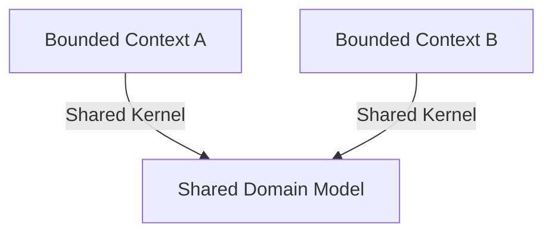
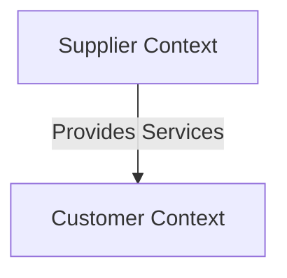
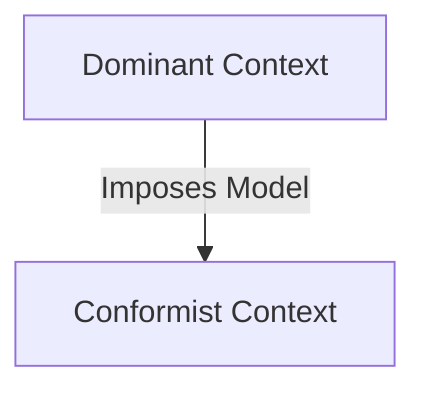
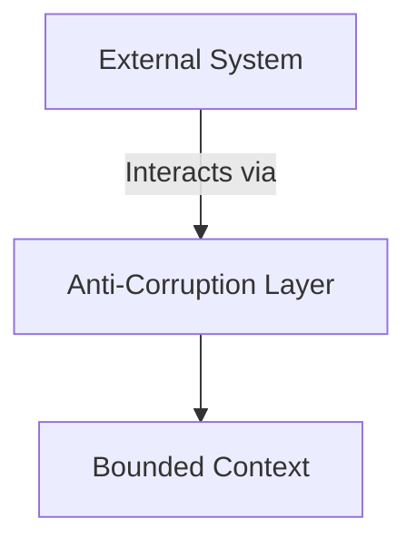

## 13.2.2 Context Mapping

In the realm of Domain-Driven Design (DDD), **context mapping** emerges as a pivotal technique for visualizing and managing the intricate relationships between different bounded contexts and the teams responsible for them. This approach is essential for facilitating effective collaboration and integration strategies across complex software systems. By understanding and applying context mapping, software architects and experienced Java developers can enhance their ability to plan, coordinate, and execute development efforts in a cohesive manner.

### Understanding Context Mapping

**Context mapping** is a strategic pattern within DDD that provides a visual representation of the relationships and interactions between various bounded contexts in a software system. A **bounded context** is a specific boundary within which a particular model is defined and applicable. It represents a distinct area of the application where a particular domain model is consistent and unified.

#### Purpose of Context Mapping

The primary purpose of context mapping is to:

- **Visualize Relationships**: Provide a clear and comprehensive view of how different bounded contexts interact with each other.
- **Manage Dependencies**: Identify and manage dependencies between contexts to ensure smooth integration and communication.
- **Facilitate Collaboration**: Enhance collaboration between teams by clarifying the boundaries and responsibilities of each context.
- **Plan Integration Strategies**: Aid in planning effective integration strategies by understanding the nature of interactions between contexts.

### Types of Context Mappings

Context mapping involves various types of relationships, each serving a specific purpose in the integration and collaboration process. Here are some of the most common types:

#### 1. Shared Kernel

The **Shared Kernel** pattern involves two or more bounded contexts sharing a common subset of the domain model. This shared part is carefully managed to ensure consistency and avoid conflicts.

- **Use Case**: When two teams need to collaborate closely and share a core part of the domain model without duplicating efforts.
- **Challenges**: Requires strong coordination and communication between teams to manage changes in the shared kernel.

*Diagram 1: Shared Kernel - Two bounded contexts sharing a common domain model.*

#### 2. Customer-Supplier

In the **Customer-Supplier** relationship, one bounded context (the supplier) provides services or data to another context (the customer). The customer context depends on the supplier context for certain functionalities.

- **Use Case**: When one team relies on another for specific services or data, and there is a clear upstream-downstream relationship.
- **Challenges**: The supplier must ensure stability and reliability of the services provided to avoid disrupting the customer context.

*Diagram 2: Customer-Supplier - Supplier context providing services to the customer context.*

#### 3. Conformist

The **Conformist** pattern occurs when a bounded context has no choice but to conform to the model of another context due to constraints or lack of influence.

- **Use Case**: When a team must align with an external system or context over which they have no control.
- **Challenges**: Can lead to suboptimal models within the conformist context, as it must adapt to the external model.

*Diagram 3: Conformist - Conformist context adapting to the dominant context's model.*

#### 4. Anti-Corruption Layer

The **Anti-Corruption Layer (ACL)** pattern is used to protect a bounded context from the influence of an external system or context. It acts as a translation layer that converts data and requests between the two contexts.

- **Use Case**: When integrating with legacy systems or external services that have incompatible models.
- **Challenges**: Requires additional development effort to maintain the ACL, but it preserves the integrity of the bounded context.

*Diagram 4: Anti-Corruption Layer - Protecting a bounded context from external influences.*

### Benefits of Context Mapping

Context mapping offers several benefits that contribute to the overall success of software projects:

- **Enhanced Clarity**: Provides a clear understanding of how different parts of the system interact, reducing ambiguity and confusion.
- **Improved Communication**: Facilitates better communication between teams by clearly defining boundaries and responsibilities.
- **Risk Mitigation**: Helps identify potential integration risks and dependencies early in the development process.
- **Strategic Planning**: Aids in strategic planning and decision-making by providing a holistic view of the system architecture.

### Creating Context Maps in Real-World Scenarios

To create effective context maps, follow these steps:

1. **Identify Bounded Contexts**: Begin by identifying the bounded contexts within your system. Each context should have a clear boundary and a distinct domain model.

2. **Define Relationships**: Determine the relationships between the bounded contexts. Identify which contexts share kernels, have customer-supplier relationships, or require anti-corruption layers.

3. **Visualize the Map**: Use diagrams to visualize the context map. Clearly label each context and the type of relationship it has with others.

4. **Analyze Integration Points**: Analyze the integration points and dependencies between contexts. Identify potential challenges and plan strategies to address them.

5. **Collaborate with Teams**: Engage with the teams responsible for each context to ensure alignment and understanding of the context map.

6. **Iterate and Refine**: Context maps are not static. Continuously iterate and refine them as the system evolves and new contexts or relationships emerge.

### Practical Example

Consider a large e-commerce platform with multiple bounded contexts, such as **Order Management**, **Inventory**, **Customer Service**, and **Payment Processing**. Each context has its own domain model and responsibilities.

- **Order Management** and **Inventory** might share a kernel for product data.
- **Payment Processing** acts as a supplier to **Order Management**, providing payment status updates.
- **Customer Service** might conform to the **Order Management** model to access order details.
- An **Anti-Corruption Layer** could be used between **Inventory** and a legacy warehouse management system.

By creating a context map for this platform, the development teams can better understand the interactions and dependencies, leading to more efficient collaboration and integration.

### Conclusion

Context mapping is an invaluable tool in the arsenal of software architects and developers working with Domain-Driven Design. By providing a clear visualization of the relationships between bounded contexts, context maps facilitate better collaboration, integration, and strategic planning. As systems grow in complexity, the ability to manage and understand these relationships becomes increasingly critical to the success of software projects.

### Key Takeaways

- **Context mapping** is essential for visualizing and managing relationships between bounded contexts.
- Different types of context mappings, such as **Shared Kernel**, **Customer-Supplier**, **Conformist**, and **Anti-Corruption Layer**, serve specific purposes in integration strategies.
- **Context maps** enhance clarity, communication, and strategic planning in software development.
- Creating and maintaining context maps requires collaboration and continuous refinement.

### Reflection

Consider how context mapping can be applied to your current projects. What bounded contexts exist, and how do they interact? How can context mapping improve collaboration and integration in your development efforts?

---

## Test Your Knowledge: Context Mapping in Domain-Driven Design



### What is the primary purpose of context mapping in Domain-Driven Design?

- [x] To visualize and manage relationships between bounded contexts.
- [ ] To define the internal structure of a bounded context.
- [ ] To enforce coding standards across teams.
- [ ] To automate deployment processes.

> **Explanation:** Context mapping is used to visualize and manage the relationships between different bounded contexts, facilitating better collaboration and integration strategies.

### Which context mapping type involves sharing a common subset of the domain model?

- [x] Shared Kernel
- [ ] Customer-Supplier
- [ ] Conformist
- [ ] Anti-Corruption Layer

> **Explanation:** The Shared Kernel pattern involves two or more bounded contexts sharing a common subset of the domain model.

### In a Customer-Supplier relationship, what is the role of the supplier context?

- [x] To provide services or data to the customer context.
- [ ] To conform to the customer's model.
- [ ] To act as a translation layer.
- [ ] To share a kernel with the customer.

> **Explanation:** In a Customer-Supplier relationship, the supplier context provides services or data to the customer context.

### What is the main challenge of the Conformist pattern?

- [x] Adapting to an external model can lead to suboptimal models.
- [ ] Managing shared kernels.
- [ ] Ensuring service reliability.
- [ ] Protecting from external influences.

> **Explanation:** The Conformist pattern can lead to suboptimal models within the conformist context, as it must adapt to an external model.

### Which pattern is used to protect a bounded context from external influences?

- [x] Anti-Corruption Layer
- [ ] Shared Kernel
- [ ] Customer-Supplier
- [ ] Conformist

> **Explanation:** The Anti-Corruption Layer pattern is used to protect a bounded context from the influence of an external system or context.

### How does context mapping aid in strategic planning?

- [x] By providing a holistic view of the system architecture.
- [ ] By enforcing coding standards.
- [ ] By automating testing processes.
- [ ] By defining internal structures.

> **Explanation:** Context mapping aids in strategic planning by providing a holistic view of the system architecture, helping identify integration points and dependencies.

### What is a key benefit of using context maps?

- [x] Enhanced clarity and understanding of system interactions.
- [ ] Increased code reuse.
- [ ] Faster deployment times.
- [ ] Reduced need for documentation.

> **Explanation:** Context maps provide enhanced clarity and understanding of how different parts of the system interact, reducing ambiguity and confusion.

### Which context mapping type involves a bounded context adapting to another's model?

- [x] Conformist
- [ ] Shared Kernel
- [ ] Customer-Supplier
- [ ] Anti-Corruption Layer

> **Explanation:** The Conformist pattern occurs when a bounded context adapts to the model of another context due to constraints or lack of influence.

### What is the role of the Anti-Corruption Layer?

- [x] To act as a translation layer between contexts.
- [ ] To share a kernel with another context.
- [ ] To provide services to a customer context.
- [ ] To conform to an external model.

> **Explanation:** The Anti-Corruption Layer acts as a translation layer that converts data and requests between two contexts, protecting one from the influence of the other.

### True or False: Context maps are static and do not require updates.

- [ ] True
- [x] False

> **Explanation:** Context maps are not static; they require continuous iteration and refinement as the system evolves and new contexts or relationships emerge.



---
