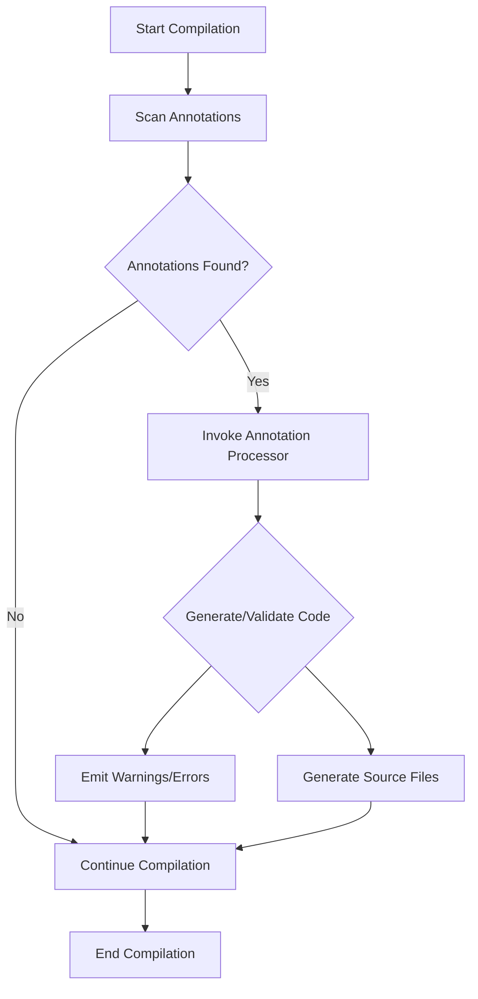

## 13.2.2 Annotation Processors

In the realm of Java programming, annotations have become a powerful tool for adding metadata to code. However, the true potential of annotations is unlocked through the use of annotation processors. These processors can generate source code, validate existing code, and even alter the compilation process based on the presence of annotations. In this section, we will delve into the world of annotation processors, exploring their capabilities, implementation, and practical applications.

### Understanding Annotation Processors

Annotation processors are a part of the Java language that allows developers to process annotations at compile time. They can be used to generate additional source files, validate code, or even modify the compilation process. This capability makes them invaluable for tasks such as code generation, enforcing coding standards, and reducing boilerplate code.

#### The Role of Annotation Processors

Annotation processors serve several key roles in software development:

- **Code Generation**: They can generate new source files based on annotations present in the code. This is useful for creating boilerplate code, such as getters and setters, or for generating complex configurations.
- **Code Validation**: Processors can validate the code against certain rules or standards. For example, they can ensure that certain annotations are used correctly or that required annotations are present.
- **Compilation Enhancement**: By integrating with the Java compilation process, annotation processors can alter the way code is compiled, adding custom logic or checks.

### The Java Annotation Processing Tool (APT)

The Java Annotation Processing Tool (APT) is a framework that provides a standard way to process annotations. It integrates seamlessly with the Java compiler, allowing annotation processors to interact with the compilation process.

#### Integration with the Compilation Process

APT operates during the compile phase, scanning the source code for annotations and invoking the appropriate processors. This integration allows processors to generate new source files, which are then compiled along with the original code. The result is a powerful mechanism for enhancing the capabilities of Java applications without altering the source code directly.

### Creating an Annotation Processor

Creating an annotation processor involves several steps. Let's walk through the process of implementing a custom annotation processor.

#### Step 1: Implementing the `Processor` Interface

To create an annotation processor, you need to implement the `Processor` interface or extend the `AbstractProcessor` class. The latter is more common as it provides default implementations for many methods.

```java
import javax.annotation.processing.AbstractProcessor;
import javax.annotation.processing.Processor;
import javax.annotation.processing.RoundEnvironment;
import javax.annotation.processing.SupportedAnnotationTypes;
import javax.annotation.processing.SupportedSourceVersion;
import javax.lang.model.SourceVersion;
import javax.lang.model.element.TypeElement;
import java.util.Set;

@SupportedAnnotationTypes("com.example.MyAnnotation")
@SupportedSourceVersion(SourceVersion.RELEASE_8)
public class MyAnnotationProcessor extends AbstractProcessor {

    @Override
    public boolean process(Set<? extends TypeElement> annotations, RoundEnvironment roundEnv) {
        // Processing logic goes here
        return true;
    }
}
```

#### Step 2: Specifying Supported Annotation Types and Options

Annotations such as `@SupportedAnnotationTypes` and `@SupportedSourceVersion` are used to specify which annotations the processor can handle and the source version it supports.

- **`@SupportedAnnotationTypes`**: Lists the annotations the processor is interested in.
- **`@SupportedSourceVersion`**: Specifies the Java version the processor supports.

#### Step 3: Using the `ProcessingEnvironment` and `RoundEnvironment`

The `ProcessingEnvironment` provides access to facilities such as file creation and logging. The `RoundEnvironment` gives information about the current processing round, including the elements annotated with the supported annotations.

```java
@Override
public boolean process(Set<? extends TypeElement> annotations, RoundEnvironment roundEnv) {
    for (TypeElement annotation : annotations) {
        // Process each annotation
    }
    return true;
}
```

### Example: Generating Source Code Files Dynamically

Let's explore how to use an annotation processor to generate source code files dynamically.

#### Defining an Annotation

First, define a custom annotation:

```java
package com.example;

import java.lang.annotation.ElementType;
import java.lang.annotation.Retention;
import java.lang.annotation.RetentionPolicy;
import java.lang.annotation.Target;

@Retention(RetentionPolicy.SOURCE)
@Target(ElementType.TYPE)
public @interface AutoGenerate {
    String value();
}
```

#### Implementing the Processor

Next, implement the processor to generate a class based on the annotation:

```java
import javax.annotation.processing.AbstractProcessor;
import javax.annotation.processing.RoundEnvironment;
import javax.annotation.processing.SupportedAnnotationTypes;
import javax.annotation.processing.SupportedSourceVersion;
import javax.lang.model.SourceVersion;
import javax.lang.model.element.Element;
import javax.lang.model.element.TypeElement;
import javax.tools.Diagnostic;
import javax.tools.JavaFileObject;
import java.io.IOException;
import java.io.Writer;
import java.util.Set;

@SupportedAnnotationTypes("com.example.AutoGenerate")
@SupportedSourceVersion(SourceVersion.RELEASE_8)
public class AutoGenerateProcessor extends AbstractProcessor {

    @Override
    public boolean process(Set<? extends TypeElement> annotations, RoundEnvironment roundEnv) {
        for (Element element : roundEnv.getElementsAnnotatedWith(AutoGenerate.class)) {
            AutoGenerate annotation = element.getAnnotation(AutoGenerate.class);
            String className = annotation.value();
            try {
                generateClass(className);
            } catch (IOException e) {
                processingEnv.getMessager().printMessage(Diagnostic.Kind.ERROR, e.toString());
            }
        }
        return true;
    }

    private void generateClass(String className) throws IOException {
        JavaFileObject builderFile = processingEnv.getFiler().createSourceFile("com.example." + className);
        try (Writer writer = builderFile.openWriter()) {
            writer.write("package com.example;\n");
            writer.write("public class " + className + " {\n");
            writer.write("    // Generated class\n");
            writer.write("}\n");
        }
    }
}
```

### Performing Compile-Time Checks

Annotation processors can also be used to perform compile-time checks and emit warnings or errors.

#### Example: Validating Annotations

Consider an annotation that requires a specific field to be present in a class:

```java
package com.example;

import java.lang.annotation.ElementType;
import java.lang.annotation.Retention;
import java.lang.annotation.RetentionPolicy;
import java.lang.annotation.Target;

@Retention(RetentionPolicy.SOURCE)
@Target(ElementType.TYPE)
public @interface RequiresField {
    String fieldName();
}
```

#### Implementing the Validation Processor

```java
import javax.annotation.processing.AbstractProcessor;
import javax.annotation.processing.RoundEnvironment;
import javax.annotation.processing.SupportedAnnotationTypes;
import javax.annotation.processing.SupportedSourceVersion;
import javax.lang.model.SourceVersion;
import javax.lang.model.element.Element;
import javax.lang.model.element.TypeElement;
import javax.lang.model.element.VariableElement;
import javax.lang.model.util.Elements;
import javax.tools.Diagnostic;
import java.util.Set;

@SupportedAnnotationTypes("com.example.RequiresField")
@SupportedSourceVersion(SourceVersion.RELEASE_8)
public class RequiresFieldProcessor extends AbstractProcessor {

    @Override
    public boolean process(Set<? extends TypeElement> annotations, RoundEnvironment roundEnv) {
        for (Element element : roundEnv.getElementsAnnotatedWith(RequiresField.class)) {
            RequiresField annotation = element.getAnnotation(RequiresField.class);
            String requiredField = annotation.fieldName();
            boolean fieldFound = false;

            for (Element enclosed : element.getEnclosedElements()) {
                if (enclosed instanceof VariableElement && enclosed.getSimpleName().toString().equals(requiredField)) {
                    fieldFound = true;
                    break;
                }
            }

            if (!fieldFound) {
                processingEnv.getMessager().printMessage(Diagnostic.Kind.ERROR,
                        "Class " + element.getSimpleName() + " must have a field named " + requiredField);
            }
        }
        return true;
    }
}
```

### Practical Applications of Annotation Processors

Annotation processors have a wide range of applications in software development:

- **Boilerplate Code Generation**: Automatically generate repetitive code, such as getters, setters, or builders, to reduce manual coding and potential errors.
- **Code Validation**: Enforce coding standards and rules by validating annotations and emitting compile-time errors or warnings.
- **Productivity Enhancement**: Streamline development workflows by automating tasks that would otherwise be manual and error-prone.

### Considerations for Annotation Processor Performance

While annotation processors can greatly enhance productivity, it's important to consider their performance and potential side effects:

- **Avoiding Unintended Side Effects**: Ensure that processors do not alter the intended behavior of the code or introduce unexpected dependencies.
- **Maintaining Performance**: Optimize processors to minimize their impact on compilation time. This can be achieved by limiting the scope of processing and efficiently managing resources.

### Visualizing Annotation Processing Workflow

To better understand the workflow of annotation processors, let's visualize the process using a flowchart.



**Diagram Description**: This flowchart illustrates the annotation processing workflow during the Java compilation process. It begins with scanning for annotations, invoking the processor if annotations are found, and then generating or validating code before continuing with the compilation.

### Try It Yourself

To gain hands-on experience with annotation processors, try modifying the examples provided:

- **Experiment with Code Generation**: Modify the `AutoGenerateProcessor` to generate additional methods or fields in the generated class.
- **Enhance Validation**: Extend the `RequiresFieldProcessor` to check for multiple required fields or specific field types.

### Knowledge Check

Before moving on, let's reinforce what we've learned:

- **What are the primary roles of annotation processors?**
- **How does the Java Annotation Processing Tool integrate with the compilation process?**
- **What are some practical applications of annotation processors?**

### Conclusion

Annotation processors are a powerful feature in Java that can significantly enhance the development process by automating code generation and validation. By understanding how to implement and use them effectively, developers can improve productivity, maintain code quality, and reduce errors.

Remember, this is just the beginning. As you progress, you'll discover more advanced techniques and applications for annotation processors. Keep experimenting, stay curious, and enjoy the journey!

## Quiz Time!



### What is the primary role of annotation processors in Java?

- [x] Generate source code and validate existing code
- [ ] Execute code at runtime
- [ ] Manage memory allocation
- [ ] Handle user input

> **Explanation:** Annotation processors are used to generate source code and validate existing code during the compilation process.

### Which interface or class is commonly extended to create an annotation processor?

- [x] AbstractProcessor
- [ ] Runnable
- [ ] Serializable
- [ ] Cloneable

> **Explanation:** The `AbstractProcessor` class is commonly extended to create an annotation processor, as it provides default implementations for many methods.

### What does the `@SupportedAnnotationTypes` annotation specify?

- [x] The annotations the processor can handle
- [ ] The source version the processor supports
- [ ] The runtime environment for the processor
- [ ] The memory usage of the processor

> **Explanation:** The `@SupportedAnnotationTypes` annotation specifies which annotations the processor can handle.

### How can annotation processors enhance productivity?

- [x] By automating repetitive coding tasks
- [ ] By increasing runtime performance
- [ ] By reducing memory usage
- [ ] By managing user sessions

> **Explanation:** Annotation processors enhance productivity by automating repetitive coding tasks, such as generating boilerplate code.

### What is the purpose of the `RoundEnvironment` in annotation processing?

- [x] To provide information about the current processing round
- [ ] To manage memory allocation
- [ ] To handle user input
- [ ] To execute code at runtime

> **Explanation:** The `RoundEnvironment` provides information about the current processing round, including the elements annotated with the supported annotations.

### How can annotation processors perform compile-time checks?

- [x] By validating annotations and emitting warnings or errors
- [ ] By executing code at runtime
- [ ] By managing memory allocation
- [ ] By handling user input

> **Explanation:** Annotation processors can perform compile-time checks by validating annotations and emitting warnings or errors if necessary.

### What is a practical application of annotation processors?

- [x] Automatically generating boilerplate code
- [ ] Executing code at runtime
- [ ] Managing user sessions
- [ ] Handling network requests

> **Explanation:** A practical application of annotation processors is automatically generating boilerplate code, such as getters and setters.

### What should be considered to maintain annotation processor performance?

- [x] Optimize processors to minimize impact on compilation time
- [ ] Increase memory usage
- [ ] Execute code at runtime
- [ ] Handle user input efficiently

> **Explanation:** To maintain annotation processor performance, it's important to optimize processors to minimize their impact on compilation time.

### What is the Java Annotation Processing Tool (APT)?

- [x] A framework for processing annotations during compilation
- [ ] A tool for executing code at runtime
- [ ] A memory management system
- [ ] A user interface library

> **Explanation:** The Java Annotation Processing Tool (APT) is a framework that provides a standard way to process annotations during compilation.

### True or False: Annotation processors can modify existing code structures.

- [x] True
- [ ] False

> **Explanation:** Annotation processors can modify existing code structures by generating new source files or altering the compilation process based on annotations.


