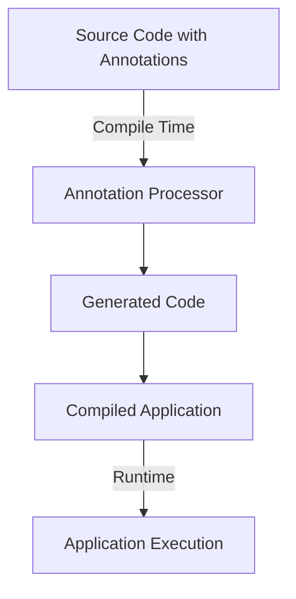

## 13.2.3 Use Cases and Examples

In this section, we delve into the practical applications of annotation processing in Java, focusing on real-world scenarios where annotations and annotation processors significantly enhance application development. We'll explore how annotations are used in dependency injection, serialization, and validation, providing code examples and discussing the benefits and challenges of these approaches.

### Introduction to Annotation Processing

Annotation processing in Java allows developers to define metadata that can be used to generate code, validate data, or perform other compile-time operations. This capability is particularly useful in reducing boilerplate code, enhancing readability, and enforcing certain rules or patterns across an application.

### Use Case 1: Dependency Injection

Dependency injection (DI) is a design pattern that facilitates the decoupling of components by injecting dependencies at runtime or compile-time. Frameworks like Spring and Dagger leverage annotations to simplify the declaration and management of dependencies.

#### Spring Framework Example

Spring is a widely-used framework that utilizes annotations such as `@Autowired`, `@Component`, and `@Service` to manage dependencies.

```java
import org.springframework.beans.factory.annotation.Autowired;
import org.springframework.stereotype.Component;

@Component
public class UserService {

    private final UserRepository userRepository;

    @Autowired
    public UserService(UserRepository userRepository) {
        this.userRepository = userRepository;
    }

    public void performUserOperations() {
        // Business logic here
    }
}
```

**Explanation:**

- **`@Component`**: Marks the class as a Spring-managed component.
- **`@Autowired`**: Instructs Spring to inject the `UserRepository` dependency.

**Benefits:**

- **Reduced Boilerplate**: Annotations eliminate the need for explicit configuration files.
- **Enhanced Readability**: Code is more intuitive and easier to follow.

**Challenges and Solutions:**

- **Complexity in Large Applications**: Managing numerous annotations can become overwhelming. Solution: Use consistent naming conventions and modularize the application.
- **Debugging**: Annotations can obscure the flow of dependency injection. Solution: Utilize Spring's debugging tools and logs.

#### Dagger Example

Dagger is a compile-time DI framework that uses annotations to generate code for dependency injection.

```java
import dagger.Component;
import dagger.Module;
import dagger.Provides;

@Component(modules = UserModule.class)
interface UserComponent {
    UserService getUserService();
}

@Module
class UserModule {

    @Provides
    UserRepository provideUserRepository() {
        return new UserRepository();
    }
}
```

**Explanation:**

- **`@Component`**: Defines the interface for dependency provision.
- **`@Module` and `@Provides`**: Specify how to construct dependencies.

**Benefits:**

- **Compile-Time Safety**: Errors are caught at compile-time, reducing runtime issues.
- **Performance**: Dagger generates optimized code for DI.

**Challenges and Solutions:**

- **Learning Curve**: Understanding Dagger's annotations and generated code can be challenging. Solution: Start with simple examples and gradually increase complexity.

### Use Case 2: Serialization

Serialization involves converting an object into a format that can be easily stored or transmitted. Annotations are used to specify how objects should be serialized or deserialized, as seen in libraries like Jackson and Gson.

#### Jackson Example

Jackson is a popular library for JSON processing in Java, using annotations like `@JsonProperty` and `@JsonIgnore`.

```java
import com.fasterxml.jackson.annotation.JsonProperty;
import com.fasterxml.jackson.databind.ObjectMapper;

public class User {

    @JsonProperty("user_name")
    private String name;

    @JsonProperty("user_age")
    private int age;

    // Getters and setters
}

public class SerializationExample {
    public static void main(String[] args) throws Exception {
        ObjectMapper mapper = new ObjectMapper();
        User user = new User("Alice", 30);
        String jsonString = mapper.writeValueAsString(user);
        System.out.println(jsonString);
    }
}
```

**Explanation:**

- **`@JsonProperty`**: Maps Java fields to JSON keys.

**Benefits:**

- **Flexibility**: Easily customize JSON output.
- **Simplicity**: Annotations make the code concise and clear.

**Challenges and Solutions:**

- **Version Compatibility**: Changes in JSON structure can break compatibility. Solution: Use versioning strategies and backward-compatible changes.

#### Gson Example

Gson is another library for JSON serialization and deserialization, using annotations like `@SerializedName`.

```java
import com.google.gson.annotations.SerializedName;
import com.google.gson.Gson;

public class User {

    @SerializedName("user_name")
    private String name;

    @SerializedName("user_age")
    private int age;

    // Getters and setters
}

public class SerializationExample {
    public static void main(String[] args) {
        Gson gson = new Gson();
        User user = new User("Bob", 25);
        String jsonString = gson.toJson(user);
        System.out.println(jsonString);
    }
}
```

**Explanation:**

- **`@SerializedName`**: Maps Java fields to JSON keys.

**Benefits:**

- **Ease of Use**: Simple API for serialization tasks.
- **Customization**: Annotations allow for precise control over JSON output.

**Challenges and Solutions:**

- **Complex Object Graphs**: Handling nested objects can be tricky. Solution: Use custom serializers and deserializers.

### Use Case 3: Validation

Validation ensures that data conforms to specific rules before processing. The Bean Validation API (JSR 380) uses annotations to enforce validation constraints.

#### Bean Validation Example

Bean Validation provides annotations like `@NotNull`, `@Size`, and `@Email` to validate Java beans.

```java
import javax.validation.constraints.NotNull;
import javax.validation.constraints.Size;
import javax.validation.constraints.Email;
import javax.validation.Validation;
import javax.validation.Validator;
import javax.validation.ValidatorFactory;

public class User {

    @NotNull
    private String name;

    @Size(min = 1, max = 100)
    private String address;

    @Email
    private String email;

    // Getters and setters
}

public class ValidationExample {
    public static void main(String[] args) {
        ValidatorFactory factory = Validation.buildDefaultValidatorFactory();
        Validator validator = factory.getValidator();

        User user = new User();
        Set<ConstraintViolation<User>> violations = validator.validate(user);
        for (ConstraintViolation<User> violation : violations) {
            System.out.println(violation.getMessage());
        }
    }
}
```

**Explanation:**

- **`@NotNull`, `@Size`, `@Email`**: Define validation rules for fields.

**Benefits:**

- **Consistency**: Centralized validation logic.
- **Readability**: Annotations make validation rules explicit.

**Challenges and Solutions:**

- **Complex Validation Logic**: Some rules may require custom validators. Solution: Implement custom constraint annotations.

### Best Practices for Using Annotations

1. **Avoid Overuse**: Use annotations judiciously to prevent clutter and maintain code clarity.
2. **Consistent Naming**: Follow naming conventions for custom annotations to enhance readability.
3. **Documentation**: Document the purpose and usage of annotations to aid understanding.
4. **Testing**: Ensure that annotation-based logic is thoroughly tested to catch errors early.

### Try It Yourself

Experiment with the provided code examples by:

- Modifying the annotations to see how they affect behavior.
- Creating custom annotations and processors for specific use cases.
- Integrating annotations into existing projects to reduce boilerplate code.

### Visualizing Annotation Processing

To better understand how annotation processing works, let's visualize the flow of annotation processing in a typical Java application:



**Diagram Description:** This flowchart illustrates the process of annotation processing, starting from source code with annotations, through the annotation processor, to the generation of additional code, and finally to the compiled application ready for execution.

### Conclusion

Annotation processing is a powerful tool in Java that simplifies and enhances application development. By leveraging annotations for dependency injection, serialization, and validation, developers can reduce boilerplate code, improve readability, and enforce consistent patterns across their applications. However, it's important to use annotations judiciously and follow best practices to maintain code clarity and avoid potential pitfalls.

## Quiz Time!



### Which annotation is used in Spring for dependency injection?

- [x] `@Autowired`
- [ ] `@Inject`
- [ ] `@Resource`
- [ ] `@Qualifier`

> **Explanation:** `@Autowired` is used in Spring to inject dependencies into beans.

### What is the primary benefit of using annotations in serialization?

- [x] Customization of output
- [ ] Faster execution
- [ ] Reduced memory usage
- [ ] Enhanced security

> **Explanation:** Annotations allow for customization of the serialization output, making it easier to control how objects are serialized.

### Which library uses the `@SerializedName` annotation?

- [x] Gson
- [ ] Jackson
- [ ] Hibernate
- [ ] Spring

> **Explanation:** Gson uses the `@SerializedName` annotation to map Java fields to JSON keys.

### What is a challenge when using annotations for dependency injection?

- [x] Debugging complexity
- [ ] Increased boilerplate code
- [ ] Slower performance
- [ ] Lack of flexibility

> **Explanation:** Debugging can be complex because annotations can obscure the flow of dependency injection.

### Which annotation is part of the Bean Validation API?

- [x] `@NotNull`
- [ ] `@JsonProperty`
- [ ] `@Autowired`
- [ ] `@SerializedName`

> **Explanation:** `@NotNull` is part of the Bean Validation API, used to enforce validation constraints.

### What is a best practice when using annotations?

- [x] Avoid overuse
- [ ] Use as many as possible
- [ ] Ignore documentation
- [ ] Avoid testing

> **Explanation:** Avoid overusing annotations to prevent clutter and maintain code clarity.

### Which framework uses `@Component` for dependency injection?

- [x] Spring
- [ ] Dagger
- [ ] Hibernate
- [ ] Gson

> **Explanation:** Spring uses `@Component` to define beans that are managed by the Spring container.

### What is a benefit of using Dagger for dependency injection?

- [x] Compile-time safety
- [ ] Runtime flexibility
- [ ] Reduced memory usage
- [ ] Enhanced security

> **Explanation:** Dagger provides compile-time safety, catching errors at compile-time rather than runtime.

### Which annotation is used to map Java fields to JSON keys in Jackson?

- [x] `@JsonProperty`
- [ ] `@SerializedName`
- [ ] `@NotNull`
- [ ] `@Autowired`

> **Explanation:** `@JsonProperty` is used in Jackson to map Java fields to JSON keys.

### Annotations can be used to enforce validation rules on data models.

- [x] True
- [ ] False

> **Explanation:** Annotations like `@NotNull` and `@Size` are used to enforce validation rules on data models.



Remember, this is just the beginning. As you progress, you'll build more complex and interactive applications using annotation processing. Keep experimenting, stay curious, and enjoy the journey!
