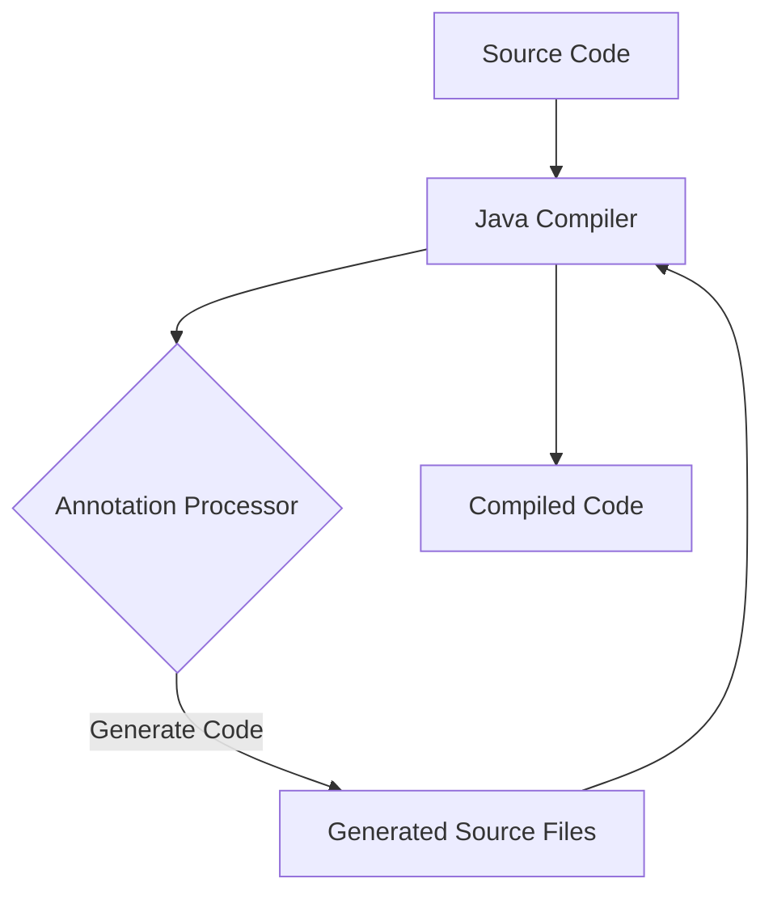

## 13.2 Annotation Processing

In the world of Java programming, annotations play a pivotal role in enhancing the expressiveness and functionality of applications. They provide a way to add metadata to Java code, which can be used to influence program behavior at both compile-time and runtime. In this section, we will delve into the concept of annotation processing, exploring how it works during compilation, the distinction between built-in and custom annotations, and the benefits of using annotations to simplify configuration and promote cleaner code. We will also discuss how annotations can be used in advanced programming techniques, including design patterns and code generation.

### Introduction to Annotations in Java

Annotations in Java are a form of metadata that can be added to Java code elements such as classes, methods, fields, parameters, and even other annotations. They do not directly affect the execution of the code they annotate but can be used by compilers and runtime environments to enforce certain behaviors or generate additional code.

#### Built-in Annotations

Java provides several built-in annotations that are commonly used in everyday programming. These include:

- `@Override`: Indicates that a method is intended to override a method in a superclass.
- `@Deprecated`: Marks a program element as deprecated, indicating that it should not be used and may be removed in future versions.
- `@SuppressWarnings`: Instructs the compiler to suppress specific warnings.
- `@FunctionalInterface`: Used to indicate that an interface is intended to be a functional interface.

#### Custom Annotations

In addition to built-in annotations, developers can define custom annotations to suit their specific needs. Custom annotations are defined using the `@interface` keyword and can include elements that act like method declarations. These elements can have default values, and the annotation can be applied to various program elements.

```java
// Defining a custom annotation
public @interface MyAnnotation {
    String value() default "default value";
    int number() default 0;
}
```

### Annotation Processing

Annotation processing is a powerful feature in Java that allows developers to process annotations at compile-time. This process involves generating additional source files, validating code, and even modifying existing code based on the annotations present.

#### How Annotation Processing Works

Annotation processing is performed by annotation processors, which are special classes that implement the `javax.annotation.processing.Processor` interface. These processors are invoked by the Java compiler during the compilation process. The compiler scans the code for annotations and invokes the appropriate processors to handle them.

```java
@SupportedAnnotationTypes("com.example.MyAnnotation")
@SupportedSourceVersion(SourceVersion.RELEASE_8)
public class MyAnnotationProcessor extends AbstractProcessor {
    @Override
    public boolean process(Set<? extends TypeElement> annotations, RoundEnvironment roundEnv) {
        for (Element element : roundEnv.getElementsAnnotatedWith(MyAnnotation.class)) {
            // Process the annotation
        }
        return true;
    }
}
```

#### Compile-Time vs. Runtime Annotations

Annotations can be processed at different stages of the program lifecycle:

- **Compile-Time Annotations**: These are processed by annotation processors during compilation. They are typically used for code generation, validation, and enforcing coding standards.
- **Runtime Annotations**: These are retained at runtime and can be accessed via reflection. They are often used for configuration, dependency injection, and other runtime behaviors.

### Benefits of Using Annotations

Annotations offer several benefits that make them a valuable tool in Java programming:

1. **Simplifying Configuration**: Annotations can be used to configure frameworks and libraries, reducing the need for external configuration files.
2. **Promoting Cleaner Code**: By embedding metadata directly in the code, annotations can make the code more readable and maintainable.
3. **Facilitating Code Generation**: Annotations can be used to generate boilerplate code, reducing the amount of manual coding required.
4. **Enhancing Expressiveness**: Annotations can convey additional information about the code, such as constraints, dependencies, and behaviors.

### Advanced Programming Techniques with Annotations

Annotations can be leveraged in advanced programming techniques to implement design patterns, facilitate dependency injection, and enable aspect-oriented programming.

#### Design Patterns

Annotations can be used to implement various design patterns, such as:

- **Singleton Pattern**: An annotation can be used to mark a class as a singleton, and an annotation processor can generate the necessary code to enforce the singleton property.
- **Factory Pattern**: Annotations can be used to specify factory methods, and processors can generate the factory implementation.

#### Dependency Injection

Frameworks like Spring use annotations to facilitate dependency injection, allowing developers to declare dependencies directly in the code.

```java
@Component
public class MyService {
    @Autowired
    private MyRepository repository;
}
```

#### Aspect-Oriented Programming

Annotations can be used to define aspects and pointcuts in aspect-oriented programming, enabling cross-cutting concerns to be separated from the main business logic.

### Code Examples

Let's explore some code examples to illustrate the concepts discussed above.

#### Example 1: Custom Annotation and Processor

```java
// Define a custom annotation
@Retention(RetentionPolicy.SOURCE)
@Target(ElementType.TYPE)
public @interface GenerateBuilder {
}

// Annotation processor to generate builder classes
@SupportedAnnotationTypes("GenerateBuilder")
@SupportedSourceVersion(SourceVersion.RELEASE_8)
public class BuilderProcessor extends AbstractProcessor {
    @Override
    public boolean process(Set<? extends TypeElement> annotations, RoundEnvironment roundEnv) {
        for (Element element : roundEnv.getElementsAnnotatedWith(GenerateBuilder.class)) {
            // Generate builder class
        }
        return true;
    }
}
```

#### Example 2: Runtime Annotation and Reflection

```java
// Define a runtime annotation
@Retention(RetentionPolicy.RUNTIME)
@Target(ElementType.METHOD)
public @interface LogExecutionTime {
}

// Use reflection to process the annotation
public class AnnotationProcessor {
    public static void processAnnotations(Object obj) {
        for (Method method : obj.getClass().getDeclaredMethods()) {
            if (method.isAnnotationPresent(LogExecutionTime.class)) {
                // Log execution time
            }
        }
    }
}
```

### Visualizing Annotation Processing

To better understand the flow of annotation processing, let's look at a diagram that illustrates the process from source code to compiled code.



**Diagram Description**: This flowchart shows the annotation processing workflow, where the Java compiler invokes annotation processors to generate additional source files, which are then compiled into the final code.

### Try It Yourself

To get hands-on experience with annotation processing, try modifying the code examples provided above. For instance, you can create a custom annotation that generates a toString method for a class, or experiment with runtime annotations to implement a simple logging framework.

### References and Links

For further reading on Java annotations and annotation processing, consider exploring the following resources:

- [Java Annotations Tutorial](https://www.oracle.com/technical-resources/articles/java/annotations.html)
- [Java Annotation Processing](https://docs.oracle.com/javase/8/docs/api/javax/annotation/processing/package-summary.html)
- [Spring Framework Documentation](https://spring.io/projects/spring-framework)

### Knowledge Check

To reinforce your understanding of annotation processing, consider the following questions:

1. What is the primary purpose of annotations in Java?
2. How do compile-time annotations differ from runtime annotations?
3. What are some benefits of using annotations in Java programming?
4. How can annotations be used to implement design patterns?
5. What role do annotations play in dependency injection frameworks like Spring?

### Embrace the Journey

Remember, mastering annotation processing is just one step in your journey as a Java developer. As you continue to explore and experiment with annotations, you'll discover new ways to enhance your code and streamline your development process. Keep learning, stay curious, and enjoy the journey!

## Quiz Time!



### What is the primary purpose of annotations in Java?

- [x] To provide metadata about the code
- [ ] To execute code at runtime
- [ ] To replace comments in the code
- [ ] To define new data types

> **Explanation:** Annotations provide metadata about the code, which can be used by the compiler and runtime environments to enforce certain behaviors or generate additional code.

### How do compile-time annotations differ from runtime annotations?

- [x] Compile-time annotations are processed during compilation, while runtime annotations are retained at runtime.
- [ ] Compile-time annotations are used for configuration, while runtime annotations are used for code generation.
- [ ] Compile-time annotations are faster than runtime annotations.
- [ ] Compile-time annotations are more secure than runtime annotations.

> **Explanation:** Compile-time annotations are processed by annotation processors during compilation, whereas runtime annotations are retained at runtime and can be accessed via reflection.

### What are some benefits of using annotations in Java programming?

- [x] Simplifying configuration
- [x] Promoting cleaner code
- [ ] Increasing code execution speed
- [x] Facilitating code generation

> **Explanation:** Annotations simplify configuration, promote cleaner code, and facilitate code generation, among other benefits.

### How can annotations be used to implement design patterns?

- [x] By marking classes and methods to generate pattern-specific code
- [ ] By replacing design patterns entirely
- [ ] By defining new data structures
- [ ] By enforcing runtime constraints

> **Explanation:** Annotations can be used to mark classes and methods, allowing annotation processors to generate code that implements specific design patterns.

### What role do annotations play in dependency injection frameworks like Spring?

- [x] They declare dependencies directly in the code.
- [ ] They replace the need for configuration files.
- [ ] They execute dependency injection logic.
- [ ] They define new classes at runtime.

> **Explanation:** Annotations in frameworks like Spring are used to declare dependencies directly in the code, facilitating dependency injection.

### Which of the following is a built-in annotation in Java?

- [x] @Override
- [ ] @MyCustomAnnotation
- [ ] @LogExecutionTime
- [ ] @GenerateBuilder

> **Explanation:** `@Override` is a built-in annotation in Java, used to indicate that a method is intended to override a method in a superclass.

### What is the purpose of the `@interface` keyword in Java?

- [x] To define a custom annotation
- [ ] To create an interface for classes
- [ ] To implement an interface
- [ ] To override a method

> **Explanation:** The `@interface` keyword is used to define a custom annotation in Java.

### What is the role of an annotation processor?

- [x] To process annotations during compilation
- [ ] To execute annotations at runtime
- [ ] To replace annotations with comments
- [ ] To define new annotations

> **Explanation:** An annotation processor is a special class that processes annotations during compilation, generating additional source files or modifying existing code.

### What is the benefit of using `@Retention(RetentionPolicy.RUNTIME)`?

- [x] It allows annotations to be accessed via reflection at runtime.
- [ ] It speeds up the compilation process.
- [ ] It reduces memory usage.
- [ ] It prevents annotations from being used at compile-time.

> **Explanation:** `@Retention(RetentionPolicy.RUNTIME)` allows annotations to be retained at runtime and accessed via reflection.

### True or False: Annotations can be used to replace comments in Java code.

- [ ] True
- [x] False

> **Explanation:** Annotations are not a replacement for comments. They provide metadata about the code that can be used by compilers and runtime environments.


