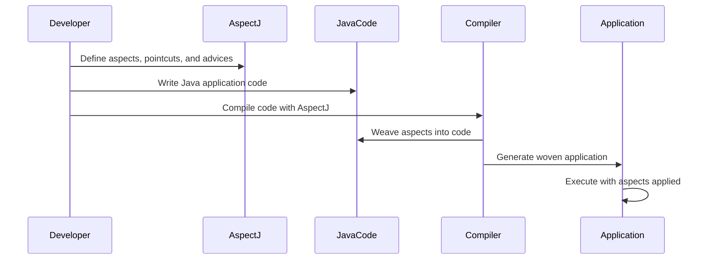

## 13.3.1 Implementing AOP in Java

Aspect-Oriented Programming (AOP) is a programming paradigm that aims to increase modularity by allowing the separation of cross-cutting concerns. In Java, AOP is a powerful tool for handling aspects of a program that affect multiple classes, such as logging, security, and transaction management. This section will guide you through implementing AOP in Java using two major frameworks: AspectJ and Spring AOP.

### Introduction to AOP Frameworks in Java

Java offers several frameworks for implementing AOP, with AspectJ and Spring AOP being the most prominent. Each framework provides unique capabilities and integration methods, making them suitable for different use cases.

- **AspectJ**: A powerful and mature AOP framework that extends Java with additional syntax for defining aspects, pointcuts, and advices. It supports compile-time, load-time, and runtime weaving.
- **Spring AOP**: Part of the Spring Framework, it provides AOP capabilities using proxy-based mechanisms. It is simpler to use within Spring applications but has some limitations compared to AspectJ.

Let's delve into each framework, starting with AspectJ.

### Implementing AOP with AspectJ

AspectJ is a seamless extension to Java that provides a rich set of features for AOP. It allows developers to define aspects, which encapsulate cross-cutting concerns, and apply them to various parts of the application.

#### Setting Up AspectJ in a Java Project

To start using AspectJ, you need to set up your Java project to include the AspectJ tools and libraries. Here are the steps to get started:

1. **Install AspectJ**: Download the AspectJ tools from the [AspectJ website](https://www.eclipse.org/aspectj/). You can also use Maven or Gradle to include AspectJ dependencies in your project.

2. **Configure Your Build Tool**:
   - **Maven**: Add the AspectJ Maven plugin and dependencies to your `pom.xml`.
   - **Gradle**: Include AspectJ dependencies and configure the AspectJ compiler in your `build.gradle`.

3. **Set Up Your IDE**: Most modern IDEs like IntelliJ IDEA and Eclipse support AspectJ. Install the AspectJ plugin for your IDE to enable syntax highlighting and code navigation.

#### Defining Aspects, Pointcuts, and Advices

AspectJ introduces several new concepts to Java programming:

- **Aspect**: A module that encapsulates cross-cutting concerns.
- **Pointcut**: An expression that matches join points (places in the code where aspects can be applied).
- **Advice**: Code that is executed at a join point specified by a pointcut.

Here's a simple example to illustrate these concepts:

```java
// Define an aspect
public aspect LoggingAspect {

    // Define a pointcut
    pointcut methodExecution(): execution(* com.example.service.*.*(..));

    // Define an advice
    before(): methodExecution() {
        System.out.println("Method execution started: " + thisJoinPoint.getSignature());
    }
}
```

In this example, `LoggingAspect` is an aspect that logs method execution in the `com.example.service` package. The `methodExecution` pointcut captures all method executions in the specified package, and the `before` advice logs a message before each method execution.

#### Compile-Time Weaving with AspectJ

AspectJ supports different weaving techniques, with compile-time weaving being the most straightforward. This process integrates aspects into your code during the compilation phase.

To enable compile-time weaving:

1. **Use the AspectJ Compiler (ajc)**: Replace the standard Java compiler with `ajc` to compile your code with aspects.

2. **Configure Your Build Tool**: Ensure your build tool is set up to use `ajc`. For Maven, this involves configuring the AspectJ Maven plugin.

3. **Compile Your Project**: Run the build process to weave aspects into your compiled classes.

Compile-time weaving is efficient and results in no runtime overhead, making it suitable for performance-critical applications.

### Implementing AOP with Spring AOP

Spring AOP is a simpler alternative to AspectJ, designed to work seamlessly with the Spring Framework. It uses proxy-based AOP, which is less powerful than AspectJ but easier to integrate into Spring applications.

#### Configuring Aspects in Spring AOP

Spring AOP can be configured using annotations or XML. Let's explore both methods.

##### Using Annotations

Spring AOP supports annotations to define aspects, pointcuts, and advices. Here's how to set up an aspect using annotations:

1. **Add Spring AOP Dependencies**: Ensure your project includes Spring AOP dependencies. If you're using Maven, add the necessary dependencies to your `pom.xml`.

2. **Enable AspectJ Support**: Annotate your configuration class with `@EnableAspectJAutoProxy` to enable AOP support.

3. **Define an Aspect**: Use the `@Aspect` annotation to define an aspect class.

4. **Define Pointcuts and Advices**: Use annotations like `@Before`, `@After`, and `@Around` to define advices.

Here's an example:

```java
import org.aspectj.lang.annotation.Aspect;
import org.aspectj.lang.annotation.Before;
import org.springframework.stereotype.Component;

@Aspect
@Component
public class LoggingAspect {

    @Before("execution(* com.example.service.*.*(..))")
    public void logBefore() {
        System.out.println("Method execution started.");
    }
}
```

In this example, `LoggingAspect` logs a message before method execution in the `com.example.service` package.

##### Using XML Configuration

Alternatively, you can configure Spring AOP using XML:

1. **Define the Aspect in XML**: Use `<aop:aspect>` to define aspects and `<aop:pointcut>` to specify pointcuts.

2. **Configure Advices**: Use `<aop:before>`, `<aop:after>`, and `<aop:around>` to define advices.

Here's an XML configuration example:

```xml
<aop:config>
    <aop:aspect ref="loggingAspect">
        <aop:pointcut id="methodExecution" expression="execution(* com.example.service.*.*(..))"/>
        <aop:before method="logBefore" pointcut-ref="methodExecution"/>
    </aop:aspect>
</aop:config>
```

#### Limitations of Spring AOP

Spring AOP is limited to method-level interception and works only with Spring beans. It uses proxies, which means it cannot intercept calls to private methods or methods within the same class. For more complex AOP requirements, AspectJ is a better choice.

### Comparing AspectJ and Spring AOP

Both AspectJ and Spring AOP have their strengths and weaknesses:

- **AspectJ**: Offers more powerful AOP capabilities, including compile-time, load-time, and runtime weaving. It can intercept any join point in the code, not just method executions.
- **Spring AOP**: Easier to use within Spring applications, with simpler configuration and integration. However, it is limited to proxy-based AOP and method-level interception.

When choosing between AspectJ and Spring AOP, consider the complexity of your AOP requirements and the level of integration with the Spring Framework.

### Best Practices for Choosing an AOP Framework

When deciding which AOP framework to use, consider the following best practices:

1. **Assess Your Requirements**: Determine the complexity of your cross-cutting concerns and the level of AOP support needed.

2. **Consider Integration**: If you're using the Spring Framework, Spring AOP may be sufficient for your needs. For more complex scenarios, AspectJ is a better choice.

3. **Evaluate Performance**: AspectJ's compile-time weaving offers better performance, while Spring AOP's proxy-based approach is easier to use but may introduce some overhead.

4. **Plan for Maintenance**: Choose a framework that aligns with your team's expertise and the long-term maintainability of your project.

### Try It Yourself

To solidify your understanding of AOP in Java, try modifying the code examples provided:

- **Experiment with Different Pointcuts**: Change the pointcut expressions to target different methods or classes.
- **Add More Advices**: Implement additional advices, such as `@AfterReturning` or `@AfterThrowing`, to handle different scenarios.
- **Test Performance**: Compare the performance of AspectJ and Spring AOP in your application to see which best meets your needs.

### Visualizing AOP Concepts

To better understand how AOP works, let's visualize the process of applying aspects to a Java application using a sequence diagram.



This diagram illustrates the process of defining aspects, weaving them into the code, and executing the application with AOP applied.

### References and Links

For further reading on AOP in Java, consider the following resources:

- [AspectJ Documentation](https://www.eclipse.org/aspectj/doc/released/adk15notebook/index.html)
- [Spring AOP Reference](https://docs.spring.io/spring-framework/docs/current/reference/html/core.html#aop)

### Knowledge Check

Before moving on, consider these questions to test your understanding:

- What are the main differences between AspectJ and Spring AOP?
- How does compile-time weaving differ from runtime weaving?
- What are the limitations of proxy-based AOP in Spring?

### Embrace the Journey

Remember, mastering AOP in Java is a journey. As you continue to explore and experiment with different AOP techniques, you'll gain a deeper understanding of how to effectively modularize cross-cutting concerns in your applications. Keep experimenting, stay curious, and enjoy the journey!

## Quiz Time!



### What is the primary purpose of Aspect-Oriented Programming (AOP)?

- [x] To separate cross-cutting concerns from business logic
- [ ] To improve the performance of Java applications
- [ ] To replace object-oriented programming
- [ ] To simplify database interactions

> **Explanation:** AOP is designed to modularize cross-cutting concerns, such as logging and security, which affect multiple parts of an application.

### Which AOP framework supports compile-time weaving?

- [x] AspectJ
- [ ] Spring AOP
- [ ] Hibernate
- [ ] JPA

> **Explanation:** AspectJ supports compile-time weaving, allowing aspects to be integrated into the code during compilation.

### What is a pointcut in AspectJ?

- [x] An expression that matches join points
- [ ] A method that executes before an aspect
- [ ] A class that defines cross-cutting concerns
- [ ] A tool for compiling Java code

> **Explanation:** A pointcut is an expression that specifies where an aspect should be applied in the code.

### How does Spring AOP implement AOP?

- [x] Using proxy-based mechanisms
- [ ] Through compile-time weaving
- [ ] By modifying the Java Virtual Machine
- [ ] By using reflection

> **Explanation:** Spring AOP uses proxy-based mechanisms to apply aspects to Spring beans.

### Which of the following is a limitation of Spring AOP?

- [x] It cannot intercept private methods
- [ ] It requires a specific IDE
- [ ] It is not compatible with Maven
- [ ] It does not support annotations

> **Explanation:** Spring AOP is limited to method-level interception and cannot intercept private methods or methods within the same class.

### What annotation is used to define an aspect in Spring AOP?

- [x] @Aspect
- [ ] @Service
- [ ] @Component
- [ ] @Repository

> **Explanation:** The `@Aspect` annotation is used to define an aspect in Spring AOP.

### In AspectJ, what is the role of advice?

- [x] Code executed at a join point
- [ ] A method that defines a pointcut
- [ ] A class that contains business logic
- [ ] A tool for debugging applications

> **Explanation:** Advice is the code that is executed at a join point specified by a pointcut.

### What is the benefit of using compile-time weaving in AspectJ?

- [x] No runtime overhead
- [ ] Easier configuration
- [ ] Better integration with Spring
- [ ] Support for annotations

> **Explanation:** Compile-time weaving integrates aspects into the code during compilation, resulting in no runtime overhead.

### Which of the following is true about AspectJ and Spring AOP?

- [x] AspectJ offers more powerful AOP capabilities than Spring AOP
- [ ] Spring AOP supports compile-time weaving
- [ ] AspectJ is limited to Spring applications
- [ ] Spring AOP can intercept any join point

> **Explanation:** AspectJ provides more comprehensive AOP capabilities, including compile-time weaving and the ability to intercept any join point.

### True or False: Spring AOP can be used to intercept method calls within the same class.

- [ ] True
- [x] False

> **Explanation:** Spring AOP uses proxies, which cannot intercept method calls within the same class.


