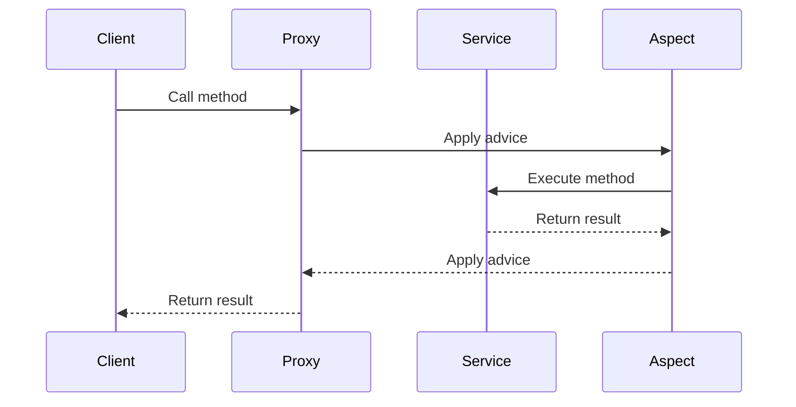

## 13.3.2 Cross-Cutting Concerns

In the realm of software engineering, cross-cutting concerns are aspects of a program that affect multiple modules but do not align with the primary functionality of those modules. These concerns include aspects like logging, security, and transaction management, which are essential for robust application development but can lead to code scattering and tangling when implemented using traditional object-oriented programming (OOP) techniques.

### Defining Cross-Cutting Concerns

Cross-cutting concerns are functionalities that are not confined to a single module or class but are spread across various parts of an application. They are problematic in traditional OOP because they tend to violate the principle of separation of concerns. This leads to:

- **Code Scattering**: The same code is duplicated across multiple modules.
- **Code Tangling**: Business logic gets intertwined with secondary concerns, making the codebase harder to maintain and evolve.

### Examples of Cross-Cutting Concerns

#### Logging

Logging is a fundamental aspect of any application, providing insights into its behavior and assisting in debugging. However, implementing logging directly within business logic can lead to code clutter.

**Example**: Consider a simple service class where logging is interspersed with business logic.

```java
public class OrderService {

    public void placeOrder(Order order) {
        System.out.println("Entering placeOrder method");
        // Business logic for placing an order
        System.out.println("Order placed successfully");
        System.out.println("Exiting placeOrder method");
    }
}
```

#### Security

Security concerns, such as authentication and authorization, often need to be enforced across various methods and classes. Embedding security checks directly within methods can lead to repetitive and hard-to-maintain code.

**Example**: A method that checks user roles before executing business logic.

```java
public class PaymentService {

    public void processPayment(User user, Payment payment) {
        if (!user.hasRole("ADMIN")) {
            throw new SecurityException("User not authorized");
        }
        // Business logic for processing payment
    }
}
```

#### Transaction Management

Transaction management ensures that a series of operations either all succeed or all fail, maintaining data integrity. Managing transactions manually within business logic can make the code cumbersome and error-prone.

**Example**: A method handling transactions explicitly.

```java
public class AccountService {

    public void transferFunds(Account from, Account to, double amount) {
        try {
            beginTransaction();
            // Business logic for transferring funds
            commitTransaction();
        } catch (Exception e) {
            rollbackTransaction();
            throw e;
        }
    }
}
```

### Aspect-Oriented Programming (AOP) to the Rescue

AOP provides a way to modularize cross-cutting concerns, allowing them to be defined separately from the business logic. This separation enhances code maintainability and readability by keeping the core logic clean and focused.

#### Key Concepts in AOP

- **Aspect**: A module that encapsulates a cross-cutting concern.
- **Join Point**: A point in the execution of the program, such as method execution or object instantiation, where an aspect can be applied.
- **Advice**: The action taken by an aspect at a particular join point. Types include `before`, `after`, `around`, etc.
- **Pointcut**: An expression that matches join points, specifying where advice should be applied.
- **Weaving**: The process of applying aspects to a target object to create an advised object.

### Implementing AOP with Spring

Spring Framework provides robust support for AOP, allowing developers to define aspects using annotations or XML configuration. Let's explore how AOP can address the cross-cutting concerns mentioned earlier.

#### Logging with AOP

We can define a logging aspect that automatically logs method entry and exit points without cluttering the business logic.

```java
@Aspect
@Component
public class LoggingAspect {

    @Before("execution(* com.example.service.*.*(..))")
    public void logBefore(JoinPoint joinPoint) {
        System.out.println("Entering: " + joinPoint.getSignature().getName());
    }

    @After("execution(* com.example.service.*.*(..))")
    public void logAfter(JoinPoint joinPoint) {
        System.out.println("Exiting: " + joinPoint.getSignature().getName());
    }
}
```

**Explanation**: The `@Before` and `@After` annotations define advice that runs before and after the execution of any method within the `com.example.service` package.

#### Security with AOP

We can enforce security policies using an aspect that checks user roles before method execution.

```java
@Aspect
@Component
public class SecurityAspect {

    @Before("execution(* com.example.service.*.*(..)) && args(user,..)")
    public void checkSecurity(JoinPoint joinPoint, User user) {
        if (!user.hasRole("ADMIN")) {
            throw new SecurityException("User not authorized");
        }
    }
}
```

**Explanation**: This aspect checks if the user has the required role before executing any method in the specified package. The `args(user,..)` pointcut expression captures the `User` parameter.

#### Transaction Management with AOP

Spring's transaction management can be declaratively handled using AOP, simplifying the code significantly.

```java
@Service
public class AccountService {

    @Transactional
    public void transferFunds(Account from, Account to, double amount) {
        // Business logic for transferring funds
    }
}
```

**Explanation**: The `@Transactional` annotation automatically manages transactions, eliminating the need for explicit transaction handling in the code.

### Impact on Code Maintainability and Readability

By using AOP to handle cross-cutting concerns, we achieve:

- **Separation of Concerns**: Business logic is free from secondary concerns, making it easier to understand and modify.
- **Reduced Code Duplication**: Common functionalities like logging and security checks are defined once in aspects and applied across the application.
- **Improved Maintainability**: Changes to cross-cutting concerns are localized to aspects, reducing the risk of introducing errors in business logic.

### Visualizing AOP in Action

Let's visualize how AOP weaves aspects into the application flow using a sequence diagram.



**Diagram Explanation**: The sequence diagram illustrates the flow of a method call in an AOP-enabled application. The client calls a method on a proxy, which applies the aspect's advice before and after invoking the actual service method.

### Try It Yourself

To gain hands-on experience with AOP, try modifying the code examples to:

- Add additional logging details, such as method parameters and execution time.
- Implement a security aspect that checks for multiple roles.
- Experiment with different types of advice, like `around`, to control method execution flow.

### Knowledge Check

Let's reinforce what we've learned with a few questions:

- What are cross-cutting concerns, and why do they pose a challenge in traditional OOP?
- How does AOP help in separating cross-cutting concerns from business logic?
- What are the key components of AOP, and how do they interact?

### Embrace the Journey

Remember, mastering AOP and effectively managing cross-cutting concerns is a journey. Keep experimenting with different aspects, explore advanced AOP features, and enjoy the process of creating cleaner, more maintainable code.

### References and Links

For further reading, check out the following resources:

- [Spring AOP Documentation](https://docs.spring.io/spring-framework/docs/current/reference/html/core.html#aop)
- [AspectJ Programming Guide](https://www.eclipse.org/aspectj/doc/next/progguide/index.html)
- [Java Transaction Management](https://docs.oracle.com/javaee/7/tutorial/transactions.htm)

## Quiz Time!



### What are cross-cutting concerns?

- [x] Aspects of a program that affect multiple modules but are not aligned with the primary functionality.
- [ ] Core functionalities of a program that are specific to individual modules.
- [ ] Features that are only relevant to the user interface.
- [ ] Concerns that are only applicable to database operations.

> **Explanation:** Cross-cutting concerns are functionalities like logging, security, and transaction management that affect multiple parts of an application but are not central to its primary functionality.

### How does AOP address cross-cutting concerns?

- [x] By modularizing them into separate aspects.
- [ ] By embedding them directly into business logic.
- [ ] By ignoring them completely.
- [ ] By duplicating them across all modules.

> **Explanation:** AOP allows cross-cutting concerns to be encapsulated in separate modules called aspects, which can be applied across the application without cluttering business logic.

### Which of the following is NOT a typical cross-cutting concern?

- [ ] Logging
- [ ] Security
- [ ] Transaction Management
- [x] User Interface Design

> **Explanation:** User Interface Design is typically not considered a cross-cutting concern as it is specific to the presentation layer.

### What is a join point in AOP?

- [x] A point in the execution of the program where an aspect can be applied.
- [ ] A method that is always executed first in a program.
- [ ] A variable that holds the state of an aspect.
- [ ] A class that implements an aspect.

> **Explanation:** A join point is a specific point in the execution of a program, such as method execution or object instantiation, where an aspect can be applied.

### What is the role of advice in AOP?

- [x] To define the action taken by an aspect at a particular join point.
- [ ] To store the state of an aspect.
- [ ] To manage database transactions.
- [ ] To handle user input.

> **Explanation:** Advice is the code that is executed at a join point, defining what an aspect does when it is applied.

### What is the purpose of the `@Transactional` annotation in Spring?

- [x] To manage transactions declaratively.
- [ ] To log method execution.
- [ ] To enforce security policies.
- [ ] To define pointcuts.

> **Explanation:** The `@Transactional` annotation in Spring is used to manage transactions declaratively, eliminating the need for explicit transaction handling in the code.

### How does AOP improve code maintainability?

- [x] By separating cross-cutting concerns from business logic.
- [ ] By embedding all functionalities into a single module.
- [ ] By duplicating code across different modules.
- [ ] By removing all logging and security checks.

> **Explanation:** AOP improves code maintainability by modularizing cross-cutting concerns, keeping business logic clean and focused.

### What is weaving in the context of AOP?

- [x] The process of applying aspects to a target object to create an advised object.
- [ ] The process of compiling Java code.
- [ ] The process of debugging a program.
- [ ] The process of designing user interfaces.

> **Explanation:** Weaving is the process of integrating aspects with the main code to create an advised object, allowing the aspects to be applied at runtime or compile-time.

### What is the benefit of using `around` advice in AOP?

- [x] It allows control over method execution flow.
- [ ] It logs method parameters.
- [ ] It enforces security policies.
- [ ] It manages database connections.

> **Explanation:** `Around` advice allows developers to control the execution flow of a method, including the ability to prevent the method from executing or modify its return value.

### True or False: AOP can only be used for logging purposes.

- [ ] True
- [x] False

> **Explanation:** AOP is versatile and can be used for various cross-cutting concerns, including logging, security, transaction management, and more.




