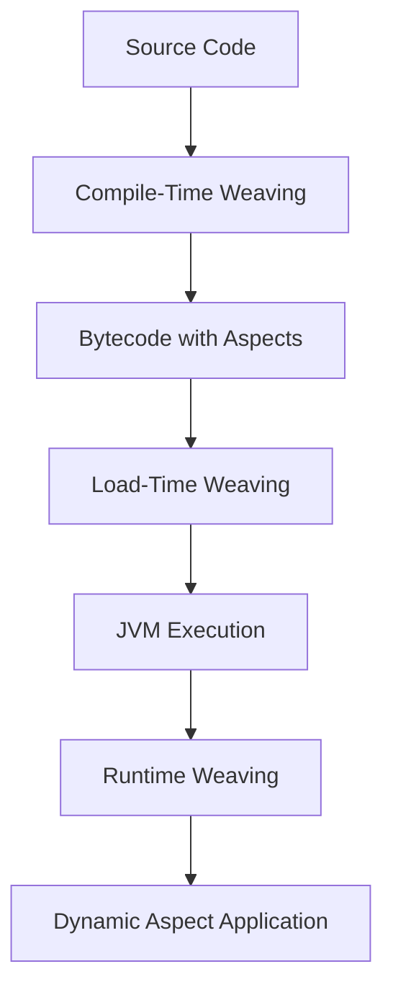
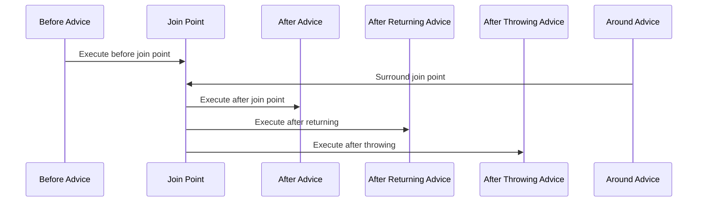

## 13.3.3 Weaving and Advices

Aspect-Oriented Programming (AOP) is a powerful paradigm that allows developers to separate cross-cutting concerns from the main business logic. This section delves into the core concepts of weaving and advices in AOP, providing a comprehensive understanding of how aspects are integrated into code and how different types of advices define aspect behavior.

### Understanding Weaving in AOP

Weaving is the process of integrating aspects into the target code. It is a crucial step in AOP, as it determines how and when aspects are applied to the program. There are three main stages at which weaving can occur:

1. **Compile-Time Weaving**: This occurs when aspects are woven into the code during the compilation process. The AspectJ compiler (ajc) is a common tool used for compile-time weaving. This method provides a static weaving approach, meaning the aspects are permanently integrated into the bytecode.

2. **Load-Time Weaving**: This weaving happens when the classes are loaded into the JVM. It requires a special class loader that modifies the bytecode before it is executed. Load-time weaving offers more flexibility than compile-time weaving, as it allows aspects to be applied to classes without modifying the original source code.

3. **Runtime Weaving**: This is the most dynamic form of weaving, where aspects are applied during the execution of the program. Although less common due to performance overhead, runtime weaving can be useful in scenarios where aspects need to be applied conditionally based on runtime information.

#### Visualizing Weaving Stages



**Diagram Description**: This flowchart illustrates the stages of weaving in AOP, from source code through compile-time, load-time, and runtime weaving, leading to the dynamic application of aspects.

### Types of Advices in AOP

Advices are the actions taken by an aspect at a particular join point. They define the behavior of an aspect and are crucial for implementing cross-cutting concerns. Let's explore the different types of advices available in AOP:

#### 1. Before Advice

Before advice is executed before the join point. It is typically used for tasks such as logging, security checks, or validation.

**Example: Before Advice**

```java
import org.aspectj.lang.annotation.Aspect;
import org.aspectj.lang.annotation.Before;

@Aspect
public class LoggingAspect {

    @Before("execution(* com.example.service.*.*(..))")
    public void logBefore() {
        System.out.println("A method is about to be executed.");
    }
}
```

**Explanation**: In this example, the `logBefore` method is executed before any method in the `com.example.service` package. The pointcut expression `execution(* com.example.service.*.*(..))` specifies the join points where the advice should be applied.

#### 2. After Advice

After advice is executed after a join point, regardless of its outcome. It is useful for cleanup activities or releasing resources.

**Example: After Advice**

```java
import org.aspectj.lang.annotation.Aspect;
import org.aspectj.lang.annotation.After;

@Aspect
public class ResourceAspect {

    @After("execution(* com.example.service.*.*(..))")
    public void releaseResources() {
        System.out.println("Releasing resources after method execution.");
    }
}
```

**Explanation**: The `releaseResources` method is executed after any method in the `com.example.service` package, ensuring that resources are released regardless of whether the method completes successfully or throws an exception.

#### 3. After Returning Advice

After returning advice is executed after a join point completes normally. It is often used to perform actions based on the method's return value.

**Example: After Returning Advice**

```java
import org.aspectj.lang.annotation.Aspect;
import org.aspectj.lang.annotation.AfterReturning;
import org.aspectj.lang.annotation.Pointcut;

@Aspect
public class ResultAspect {

    @Pointcut("execution(* com.example.service.*.*(..))")
    public void serviceMethods() {}

    @AfterReturning(pointcut = "serviceMethods()", returning = "result")
    public void logResult(Object result) {
        System.out.println("Method returned: " + result);
    }
}
```

**Explanation**: Here, the `logResult` method is executed after any method in the `com.example.service` package returns successfully. The `returning` attribute captures the return value of the method.

#### 4. After Throwing Advice

After throwing advice is executed if a method exits by throwing an exception. It is useful for error handling and logging.

**Example: After Throwing Advice**

```java
import org.aspectj.lang.annotation.Aspect;
import org.aspectj.lang.annotation.AfterThrowing;

@Aspect
public class ExceptionAspect {

    @AfterThrowing(pointcut = "execution(* com.example.service.*.*(..))", throwing = "error")
    public void logException(Throwable error) {
        System.out.println("An exception occurred: " + error.getMessage());
    }
}
```

**Explanation**: In this example, the `logException` method is executed if any method in the `com.example.service` package throws an exception. The `throwing` attribute captures the exception object.

#### 5. Around Advice

Around advice surrounds a join point, allowing custom behavior both before and after the method execution. It is the most powerful type of advice and can control whether the method is executed at all.

**Example: Around Advice**

```java
import org.aspectj.lang.ProceedingJoinPoint;
import org.aspectj.lang.annotation.Around;
import org.aspectj.lang.annotation.Aspect;

@Aspect
public class PerformanceAspect {

    @Around("execution(* com.example.service.*.*(..))")
    public Object measureExecutionTime(ProceedingJoinPoint joinPoint) throws Throwable {
        long start = System.currentTimeMillis();
        Object result = joinPoint.proceed(); // Proceed with the method execution
        long elapsedTime = System.currentTimeMillis() - start;
        System.out.println("Execution time: " + elapsedTime + " milliseconds.");
        return result;
    }
}
```

**Explanation**: The `measureExecutionTime` method measures the execution time of any method in the `com.example.service` package. The `ProceedingJoinPoint` allows the advice to control the execution of the method.

### Pointcuts and Their Role in AOP

Pointcuts define where advices are applied. They are expressions that match join points, allowing developers to specify the exact locations in the code where an aspect should intervene.

**Example: Defining Pointcuts**

```java
import org.aspectj.lang.annotation.Pointcut;

@Aspect
public class LoggingAspect {

    @Pointcut("execution(* com.example.service.*.*(..))")
    public void serviceMethods() {}

    @Before("serviceMethods()")
    public void logBefore() {
        System.out.println("A method in the service package is about to be executed.");
    }
}
```

**Explanation**: The `serviceMethods` pointcut captures all methods in the `com.example.service` package. The `logBefore` advice uses this pointcut to apply logging before each method execution.

### Choosing the Appropriate Advice Type

Selecting the right type of advice depends on the specific requirements of the application. Here are some considerations:

- **Before Advice**: Use when you need to perform actions before a method executes, such as validation or logging.
- **After Advice**: Ideal for cleanup activities that must occur regardless of the method's outcome.
- **After Returning Advice**: Suitable for actions that depend on the method's return value.
- **After Throwing Advice**: Use for error handling and logging exceptions.
- **Around Advice**: Best for scenarios where you need complete control over the method execution, such as performance monitoring or transaction management.

### Try It Yourself

To gain a deeper understanding of advices in AOP, try modifying the code examples provided:

- **Experiment with Pointcuts**: Change the pointcut expressions to target different methods or packages.
- **Combine Advices**: Apply multiple types of advices to the same join point and observe the order of execution.
- **Implement Custom Logic**: Add custom logic to the advices to see how they interact with the main application logic.

### Visualizing Advice Execution



**Diagram Description**: This sequence diagram illustrates the execution flow of different types of advices around a join point.

### Key Takeaways

- **Weaving** is the process of integrating aspects into the target code and can occur at different stages: compile-time, load-time, and runtime.
- **Advices** define the behavior of an aspect and include before, after, after returning, after throwing, and around advices.
- **Pointcuts** specify where advices are applied, allowing precise control over aspect application.
- **Choosing the right advice type** is crucial for effectively implementing cross-cutting concerns.

### References and Further Reading

- [AspectJ Documentation](https://www.eclipse.org/aspectj/doc/released/progguide/index.html)
- [Spring AOP Reference](https://docs.spring.io/spring-framework/docs/current/reference/html/core.html#aop)

## Quiz Time!



### What is weaving in AOP?

- [x] The process of integrating aspects into the target code
- [ ] A method of compiling Java code
- [ ] A type of advice in AOP
- [ ] A way to handle exceptions

> **Explanation:** Weaving is the process of integrating aspects into the target code, which can occur at compile-time, load-time, or runtime.

### Which advice is executed before a join point?

- [x] Before Advice
- [ ] After Advice
- [ ] After Returning Advice
- [ ] Around Advice

> **Explanation:** Before advice is executed before a join point, allowing actions to be performed prior to method execution.

### What is the role of pointcuts in AOP?

- [x] To define where advices are applied
- [ ] To execute methods after a join point
- [ ] To handle exceptions in AOP
- [ ] To compile Java code

> **Explanation:** Pointcuts define where advices are applied, specifying the join points that an aspect should target.

### Which advice is executed if a method exits by throwing an exception?

- [x] After Throwing Advice
- [ ] Before Advice
- [ ] After Advice
- [ ] Around Advice

> **Explanation:** After throwing advice is executed if a method exits by throwing an exception, allowing for error handling.

### What is the most powerful type of advice in AOP?

- [x] Around Advice
- [ ] Before Advice
- [ ] After Advice
- [ ] After Returning Advice

> **Explanation:** Around advice is the most powerful type of advice, as it surrounds a join point and can control whether the method is executed.

### Which stage of weaving allows aspects to be applied without modifying the original source code?

- [x] Load-Time Weaving
- [ ] Compile-Time Weaving
- [ ] Runtime Weaving
- [ ] Static Weaving

> **Explanation:** Load-time weaving allows aspects to be applied without modifying the original source code, using a special class loader.

### What is the purpose of after returning advice?

- [x] To execute after a join point completes normally
- [ ] To execute before a join point
- [ ] To handle exceptions
- [ ] To surround a join point

> **Explanation:** After returning advice is executed after a join point completes normally, allowing actions based on the method's return value.

### Which advice is used for cleanup activities regardless of method outcome?

- [x] After Advice
- [ ] Before Advice
- [ ] After Returning Advice
- [ ] Around Advice

> **Explanation:** After advice is used for cleanup activities that must occur regardless of the method's outcome.

### What does the `ProceedingJoinPoint` allow in around advice?

- [x] To control the execution of the method
- [ ] To define pointcuts
- [ ] To handle exceptions
- [ ] To compile Java code

> **Explanation:** The `ProceedingJoinPoint` in around advice allows the advice to control the execution of the method, including whether it proceeds.

### True or False: Runtime weaving is the most common form of weaving in AOP.

- [ ] True
- [x] False

> **Explanation:** False. Compile-time and load-time weaving are more common due to performance considerations, while runtime weaving is less common.



Remember, mastering AOP and its components like weaving and advices can significantly enhance your ability to manage cross-cutting concerns in Java applications. Keep experimenting, stay curious, and enjoy the journey!
