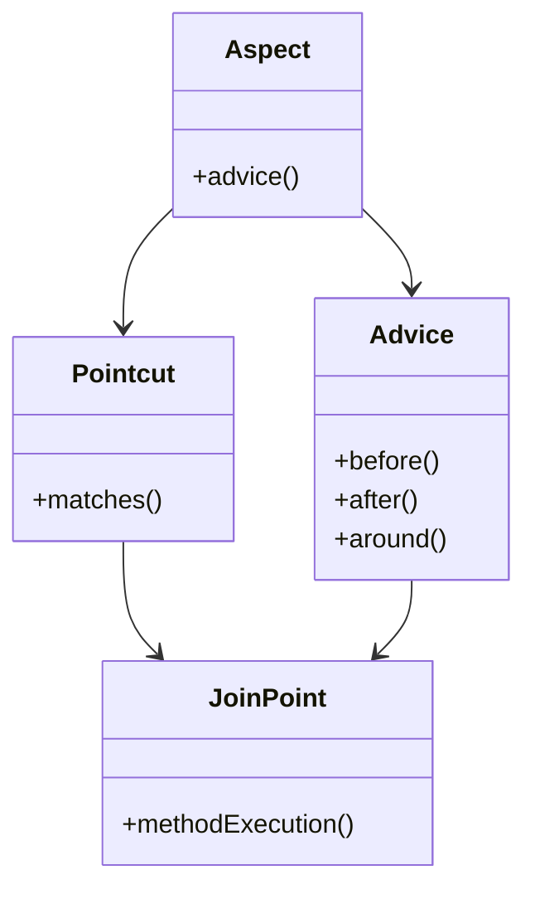

## 13.3 Aspect-Oriented Programming (AOP)

Aspect-Oriented Programming (AOP) is a programming paradigm that aims to increase modularity by allowing the separation of cross-cutting concerns. These concerns are aspects of a program that affect other concerns, such as logging, security, or transaction management, and are typically difficult to decompose from the main business logic in traditional Object-Oriented Programming (OOP). AOP provides a way to encapsulate these concerns into separate modules, known as aspects, leading to cleaner and more maintainable codebases.

### Understanding Cross-Cutting Concerns

In software development, cross-cutting concerns are aspects of a program that affect multiple parts of the system. They are called "cross-cutting" because they intersect with the core functionality of the application, often leading to code duplication and tangled logic. Common examples include:

- **Logging**: Capturing logs across different modules.
- **Security**: Enforcing security policies throughout the application.
- **Transaction Management**: Managing transactions across various operations.
- **Error Handling**: Consistent error handling mechanisms.

These concerns are challenging in OOP because they do not fit neatly into a single class or module. Instead, they spread across multiple classes, leading to code that is difficult to maintain and evolve.

### AOP vs. OOP: Complementary Paradigms

While OOP focuses on encapsulating behavior and data into objects, it often struggles with cross-cutting concerns. AOP complements OOP by providing a mechanism to address these concerns separately, without altering the core business logic. This separation of concerns results in:

- **Improved Modularity**: By isolating cross-cutting concerns, AOP enhances the modularity of the codebase.
- **Cleaner Code**: Reduces code clutter by removing boilerplate code related to cross-cutting concerns from the business logic.
- **Easier Maintenance**: Changes to cross-cutting concerns can be made in one place, reducing the risk of introducing bugs.

### Key Concepts in AOP

To effectively implement AOP in Java, it's essential to understand its core concepts:

#### Aspects

An aspect is a module that encapsulates a cross-cutting concern. It is similar to a class in OOP but focuses on behaviors that affect multiple classes. Aspects can contain methods and fields, just like classes.

#### Join Points

A join point is a point in the execution of the program where an aspect can be applied. In Java, join points are typically method calls or executions, but they can also include object instantiations and field access.

#### Pointcuts

A pointcut is an expression that matches join points. It defines where an aspect's advice should be applied. Pointcuts can be as specific or broad as needed, allowing fine-grained control over where aspects are applied.

#### Advices

Advice is the action taken by an aspect at a particular join point. There are several types of advice in AOP:

- **Before Advice**: Runs before the join point.
- **After Advice**: Runs after the join point, regardless of its outcome.
- **After Returning Advice**: Runs after the join point only if it completes successfully.
- **After Throwing Advice**: Runs if the join point throws an exception.
- **Around Advice**: Surrounds the join point, allowing control over whether the join point executes.

#### Weaving

Weaving is the process of applying aspects to a target object. It can occur at different times:

- **Compile-Time Weaving**: Aspects are woven into the code during compilation.
- **Load-Time Weaving**: Aspects are woven when the class is loaded into the JVM.
- **Runtime Weaving**: Aspects are woven during the execution of the program.

### Implementing AOP in Java

Java supports AOP through various frameworks, with AspectJ being the most popular. AspectJ extends Java with additional syntax to define aspects, join points, and advices. Let's explore how to implement AOP using AspectJ.

#### Setting Up AspectJ

To use AspectJ, you need to include the AspectJ library in your project. If you're using Maven, you can add the following dependency to your `pom.xml`:

```xml
<dependency>
    <groupId>org.aspectj</groupId>
    <artifactId>aspectjrt</artifactId>
    <version>1.9.7</version>
</dependency>
```

Additionally, you'll need the AspectJ compiler for compile-time weaving:

```xml
<plugin>
    <groupId>org.codehaus.mojo</groupId>
    <artifactId>aspectj-maven-plugin</artifactId>
    <version>1.12</version>
    <executions>
        <execution>
            <goals>
                <goal>compile</goal>
                <goal>test-compile</goal>
            </goals>
        </execution>
    </executions>
</plugin>
```

#### Creating an Aspect

Let's create a simple logging aspect that logs method execution times. First, define an aspect class:

```java
import org.aspectj.lang.ProceedingJoinPoint;
import org.aspectj.lang.annotation.Around;
import org.aspectj.lang.annotation.Aspect;

@Aspect
public class LoggingAspect {

    @Around("execution(* com.example.service.*.*(..))")
    public Object logExecutionTime(ProceedingJoinPoint joinPoint) throws Throwable {
        long start = System.currentTimeMillis();
        
        Object proceed = joinPoint.proceed();
        
        long executionTime = System.currentTimeMillis() - start;
        
        System.out.println(joinPoint.getSignature() + " executed in " + executionTime + "ms");
        return proceed;
    }
}
```

**Explanation:**

- **@Aspect**: Marks the class as an aspect.
- **@Around**: Defines an around advice that wraps the method execution.
- **execution(* com.example.service.*.*(..))**: A pointcut expression that matches all methods in the `com.example.service` package.
- **ProceedingJoinPoint**: Represents the current join point, allowing us to control its execution.

#### Applying the Aspect

To apply the aspect, ensure that your application is configured to use AspectJ. If you're using Spring, you can enable AspectJ support with the `@EnableAspectJAutoProxy` annotation:

```java
import org.springframework.context.annotation.Configuration;
import org.springframework.context.annotation.EnableAspectJAutoProxy;

@Configuration
@EnableAspectJAutoProxy
public class AppConfig {
    // Bean definitions
}
```

### Benefits of AOP

AOP offers several advantages that make it a valuable tool in software development:

- **Separation of Concerns**: By isolating cross-cutting concerns, AOP improves the separation of concerns, leading to more focused and cohesive modules.
- **Reduced Code Duplication**: AOP eliminates the need to duplicate code related to cross-cutting concerns across multiple classes.
- **Enhanced Maintainability**: Changes to cross-cutting concerns can be made in one place, simplifying maintenance and reducing the risk of errors.
- **Improved Readability**: By removing boilerplate code from business logic, AOP enhances the readability and clarity of the codebase.

### Visualizing AOP Concepts

To better understand how AOP works, let's visualize the relationship between aspects, join points, pointcuts, and advices using a class diagram.



**Diagram Description**: This diagram illustrates how an `Aspect` contains `Advice` that is applied to `JoinPoints` matched by `Pointcuts`. The `Advice` can be of different types, such as `before`, `after`, or `around`, and it is executed at the specified `JoinPoints`.

### Try It Yourself

To deepen your understanding of AOP, try modifying the logging aspect to include additional information, such as method parameters or return values. Experiment with different types of advice and pointcut expressions to see how they affect the behavior of your application.

### Knowledge Check

- **Question**: What is a cross-cutting concern, and why is it challenging in OOP?
- **Exercise**: Create an aspect that handles transaction management for a set of service methods. Use around advice to begin and commit transactions.

### Conclusion

Aspect-Oriented Programming is a powerful paradigm that complements Object-Oriented Programming by addressing cross-cutting concerns in a modular and maintainable way. By understanding and applying AOP concepts, you can enhance the modularity, readability, and maintainability of your Java applications.

Remember, this is just the beginning. As you progress, you'll discover more advanced techniques and patterns that build upon the foundations of AOP. Keep experimenting, stay curious, and enjoy the journey!

## Quiz Time!



### What is the primary goal of Aspect-Oriented Programming (AOP)?

- [x] To increase modularity by separating cross-cutting concerns
- [ ] To replace Object-Oriented Programming (OOP)
- [ ] To improve performance by optimizing algorithms
- [ ] To simplify user interface design

> **Explanation:** AOP aims to increase modularity by allowing the separation of cross-cutting concerns, which are aspects of a program that affect multiple parts of the system.

### Which of the following is an example of a cross-cutting concern?

- [x] Logging
- [x] Security
- [ ] User interface design
- [ ] Database schema design

> **Explanation:** Logging and security are common cross-cutting concerns that affect multiple parts of an application, whereas user interface design and database schema design are typically more localized.

### In AOP, what is a join point?

- [x] A point in the execution of the program where an aspect can be applied
- [ ] A method that is always executed before any other method
- [ ] A class that contains cross-cutting concerns
- [ ] A data structure used for logging

> **Explanation:** A join point is a specific point in the execution of a program, such as a method call or execution, where an aspect can be applied.

### What is the role of a pointcut in AOP?

- [x] To define where an aspect's advice should be applied
- [ ] To execute business logic
- [ ] To manage database transactions
- [ ] To handle user input

> **Explanation:** A pointcut is an expression that matches join points, defining where an aspect's advice should be applied.

### Which type of advice runs before the join point?

- [x] Before Advice
- [ ] After Advice
- [ ] Around Advice
- [ ] After Returning Advice

> **Explanation:** Before Advice is executed before the join point.

### What is weaving in the context of AOP?

- [x] The process of applying aspects to a target object
- [ ] The act of compiling Java code
- [ ] The method of optimizing database queries
- [ ] The technique for designing user interfaces

> **Explanation:** Weaving is the process of applying aspects to a target object, which can occur at compile-time, load-time, or runtime.

### Which framework is commonly used for AOP in Java?

- [x] AspectJ
- [ ] Hibernate
- [ ] JUnit
- [ ] JDBC

> **Explanation:** AspectJ is a popular framework for implementing AOP in Java.

### What is the benefit of using AOP for logging?

- [x] It centralizes logging logic, reducing code duplication
- [ ] It increases the complexity of logging
- [ ] It requires manual logging at each method
- [ ] It only works with certain types of applications

> **Explanation:** AOP centralizes logging logic, allowing it to be applied consistently across an application without duplicating code.

### How does AOP improve code maintainability?

- [x] By isolating cross-cutting concerns, making it easier to update them
- [ ] By increasing the amount of code needed for each feature
- [ ] By requiring more complex algorithms
- [ ] By making the codebase more monolithic

> **Explanation:** AOP improves maintainability by isolating cross-cutting concerns, allowing changes to be made in one place.

### True or False: AOP can only be used in Java applications.

- [ ] True
- [x] False

> **Explanation:** AOP is a paradigm that can be applied in various programming languages, not just Java.


