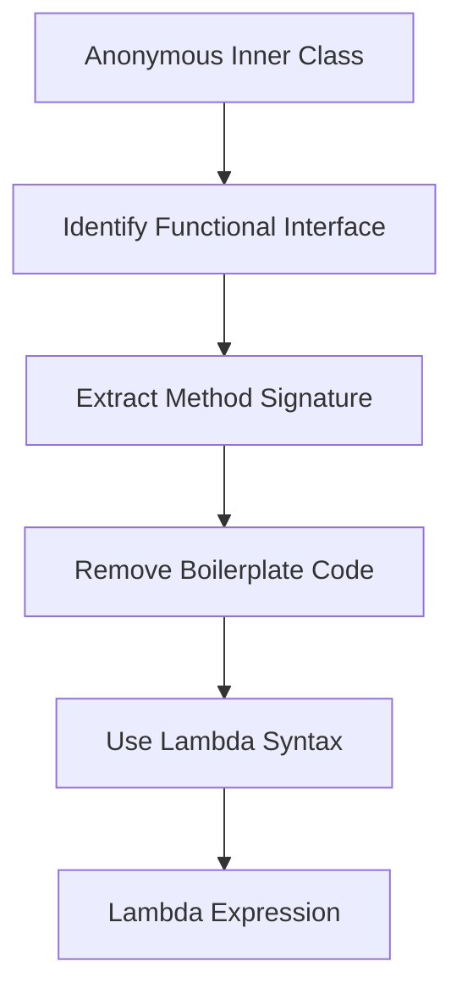

## 13.4.1 Lambda Expressions

Lambda expressions in Java represent a significant shift towards functional programming, enabling developers to write more concise and expressive code. Introduced in Java 8, lambda expressions allow you to create anonymous functions, which can simplify the implementation of functional interfaces. This section will guide you through understanding lambda expressions, their syntax, and their practical applications in Java.

### Understanding Lambda Expressions

Lambda expressions are essentially anonymous functions—functions without a name. They provide a clear and concise way to represent a single method interface using an expression. A lambda expression can be used to define the implementation of a method defined by a functional interface.

#### Syntax of Lambda Expressions

The syntax of a lambda expression is straightforward and consists of three parts:

1. **Parameter List**: Enclosed in parentheses, similar to method parameters.
2. **Arrow Token**: `->` separates the parameter list from the body.
3. **Body**: Contains the expressions or statements.

Here is a basic syntax example:

```java
(parameters) -> expression
```

Or, for a block of statements:

```java
(parameters) -> { statements; }
```

#### Example

Let's look at a simple example of a lambda expression that takes two integers and returns their sum:

```java
(int a, int b) -> a + b
```

In this example, `(int a, int b)` is the parameter list, `->` is the arrow token, and `a + b` is the expression body.

### Lambda Expressions and Functional Interfaces

A functional interface in Java is an interface that contains exactly one abstract method. These interfaces can be implemented using lambda expressions, which provide a more readable and concise way to implement single-method interfaces.

#### Common Functional Interfaces

Java provides several built-in functional interfaces in the `java.util.function` package, such as:

- **Predicate<T>**: Represents a predicate (boolean-valued function) of one argument.
- **Consumer<T>**: Represents an operation that accepts a single input argument and returns no result.
- **Function<T, R>**: Represents a function that accepts one argument and produces a result.
- **Supplier<T>**: Represents a supplier of results.

#### Example: Using a Functional Interface

Consider the `Runnable` interface, which is a functional interface with a single `run` method. Traditionally, you might implement it using an anonymous inner class:

```java
Runnable runnable = new Runnable() {
    @Override
    public void run() {
        System.out.println("Running in a thread");
    }
};
```

With lambda expressions, this can be simplified to:

```java
Runnable runnable = () -> System.out.println("Running in a thread");
```

### Converting Anonymous Inner Classes to Lambda Expressions

Lambda expressions can replace anonymous inner classes for interfaces with a single abstract method. This conversion not only reduces boilerplate code but also enhances readability.

#### Example: Comparator

Consider a `Comparator` for sorting strings by length:

```java
Comparator<String> comparator = new Comparator<String>() {
    @Override
    public int compare(String s1, String s2) {
        return Integer.compare(s1.length(), s2.length());
    }
};
```

This can be converted to a lambda expression:

```java
Comparator<String> comparator = (s1, s2) -> Integer.compare(s1.length(), s2.length());
```

### Use Cases for Lambda Expressions

Lambda expressions are particularly useful in scenarios where you need to pass behavior as a parameter, such as event handling, implementing callbacks, or processing collections.

#### Event Handling

In GUI applications, lambda expressions can simplify event handling. For example, handling a button click:

```java
button.setOnAction(event -> System.out.println("Button clicked!"));
```

#### Implementing Callbacks

Lambda expressions can be used to implement callbacks, making the code more readable and maintainable. For instance, a simple callback interface:

```java
interface Callback {
    void call();
}

public void registerCallback(Callback callback) {
    callback.call();
}

// Using lambda expression
registerCallback(() -> System.out.println("Callback executed"));
```

### Type Inference in Lambda Expressions

Java's type inference capabilities allow you to omit the parameter types in lambda expressions, making them even more concise. The compiler infers the types from the context.

#### Example

For a `BiFunction<Integer, Integer, Integer>`, you can write:

```java
BiFunction<Integer, Integer, Integer> add = (a, b) -> a + b;
```

Here, the types of `a` and `b` are inferred from the `BiFunction` interface.

### Limitations and Considerations

While lambda expressions offer many benefits, there are some limitations and considerations to keep in mind:

- **Readability**: Overusing lambdas, especially in complex expressions, can reduce readability.
- **Debugging**: Debugging lambda expressions can be challenging because they do not have a name or a stack trace.
- **Serialization**: Lambda expressions are not serializable by default.
- **Scope**: Lambdas have access to `final` or effectively `final` variables from the enclosing scope.

### Try It Yourself

To get hands-on experience with lambda expressions, try converting the following anonymous inner class to a lambda expression:

```java
List<String> names = Arrays.asList("Alice", "Bob", "Charlie");
Collections.sort(names, new Comparator<String>() {
    @Override
    public int compare(String s1, String s2) {
        return s1.compareTo(s2);
    }
});
```

**Challenge**: Modify the lambda expression to sort the names in reverse order.

### Visualizing Lambda Expressions

To better understand how lambda expressions work, let's visualize the process of converting an anonymous inner class to a lambda expression:



This diagram illustrates the transformation process, highlighting the simplification of code.

### References and Links

For more information on lambda expressions and functional interfaces, consider the following resources:

- [Oracle's Java Documentation on Lambda Expressions](https://docs.oracle.com/javase/tutorial/java/javaOO/lambdaexpressions.html)
- [Java Functional Interfaces](https://docs.oracle.com/javase/8/docs/api/java/util/function/package-summary.html)

### Knowledge Check

To reinforce your understanding of lambda expressions, consider the following questions:

- What is the primary purpose of lambda expressions in Java?
- How do lambda expressions relate to functional interfaces?
- What are some common use cases for lambda expressions?

### Embrace the Journey

Remember, mastering lambda expressions is a journey. As you continue to explore functional programming in Java, you'll discover new ways to write cleaner, more efficient code. Keep experimenting, stay curious, and enjoy the journey!

---

## Quiz Time!



### What is a lambda expression in Java?

- [x] An anonymous function that can be used to implement a method defined by a functional interface.
- [ ] A named function that can be used to implement multiple methods.
- [ ] A class that implements multiple interfaces.
- [ ] A method that can be called without parameters.

> **Explanation:** A lambda expression is an anonymous function that provides a clear and concise way to implement a method defined by a functional interface.

### Which of the following is a correct syntax for a lambda expression?

- [x] `(parameters) -> expression`
- [ ] `parameters -> expression`
- [ ] `(parameters) => expression`
- [ ] `expression -> (parameters)`

> **Explanation:** The correct syntax for a lambda expression is `(parameters) -> expression`.

### How does Java infer the types of parameters in a lambda expression?

- [x] From the context in which the lambda expression is used.
- [ ] By explicitly specifying the types in the lambda expression.
- [ ] By using a default type for all parameters.
- [ ] By analyzing the return type of the lambda expression.

> **Explanation:** Java infers the types of parameters in a lambda expression from the context, such as the type of the functional interface being implemented.

### What is a functional interface?

- [x] An interface with exactly one abstract method.
- [ ] An interface with multiple abstract methods.
- [ ] A class with exactly one method.
- [ ] A class with multiple methods.

> **Explanation:** A functional interface is an interface with exactly one abstract method, which can be implemented using a lambda expression.

### Which of the following is a common use case for lambda expressions?

- [x] Event handling
- [ ] Class inheritance
- [x] Implementing callbacks
- [ ] Creating abstract classes

> **Explanation:** Lambda expressions are commonly used for event handling and implementing callbacks, as they allow passing behavior as parameters.

### What is a limitation of lambda expressions?

- [x] They are not serializable by default.
- [ ] They cannot access variables from the enclosing scope.
- [ ] They must have a name.
- [ ] They cannot be used with functional interfaces.

> **Explanation:** Lambda expressions are not serializable by default, which can be a limitation in certain scenarios.

### How can lambda expressions improve code readability?

- [x] By reducing boilerplate code
- [ ] By increasing the number of lines of code
- [x] By providing a concise way to implement functional interfaces
- [ ] By requiring explicit type declarations

> **Explanation:** Lambda expressions improve readability by reducing boilerplate code and providing a concise way to implement functional interfaces.

### What is a potential challenge when debugging lambda expressions?

- [x] They do not have a name or a stack trace.
- [ ] They require explicit type declarations.
- [ ] They cannot be used with functional interfaces.
- [ ] They increase the number of lines of code.

> **Explanation:** Debugging lambda expressions can be challenging because they do not have a name or a stack trace.

### Can lambda expressions access final or effectively final variables from the enclosing scope?

- [x] Yes
- [ ] No

> **Explanation:** Lambda expressions can access final or effectively final variables from the enclosing scope.

### True or False: Lambda expressions can be used to implement multiple methods in a functional interface.

- [ ] True
- [x] False

> **Explanation:** Lambda expressions can only be used to implement a single method in a functional interface, as functional interfaces have exactly one abstract method.


