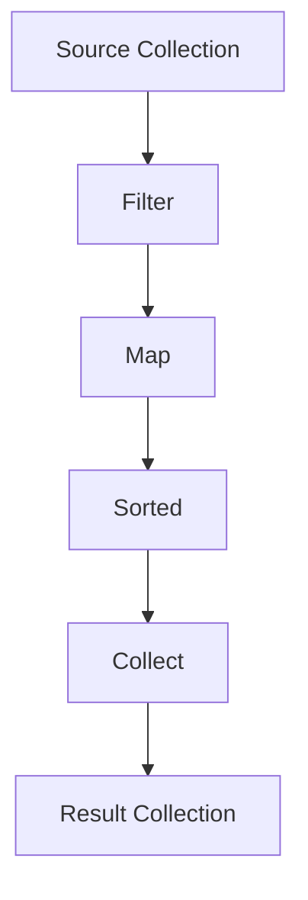

## 13.4.2 Streams API

In this section, we delve into the Java Streams API, a cornerstone of functional programming in Java. Introduced in Java 8, the Streams API provides a modern approach to processing collections of data. By embracing a functional style, it allows developers to write more concise, readable, and efficient code. Let's explore the Streams API, understand its operations, and see how it can transform the way we handle data in Java applications.

### Introduction to the Streams API

The Streams API is a part of the `java.util.stream` package and is designed to process sequences of elements, such as collections, in a functional manner. Unlike traditional iteration, streams allow you to focus on what you want to achieve rather than how to achieve it. This abstraction enables developers to perform complex data processing tasks with ease and clarity.

#### Difference Between Collections and Streams

Before diving into the Streams API, it's crucial to understand the distinction between collections and streams:

- **Collections**: These are in-memory data structures that store elements. They are designed for efficient data storage and retrieval. Examples include `List`, `Set`, and `Map`.

- **Streams**: These are not data structures but rather convey elements from a source (such as a collection) through a pipeline of operations. Streams are designed for processing sequences of elements and support operations such as filtering, mapping, and reducing.

**Key Differences:**

- **Storage**: Collections store data, while streams do not. Streams are a view over the data.
- **Laziness**: Streams are lazy, meaning they do not compute results until necessary. This allows for optimization and efficient processing.
- **Immutability**: Streams do not modify the underlying data structure. Instead, they produce new streams with the desired transformations.

### Key Stream Operations

Streams support two types of operations: intermediate and terminal. Intermediate operations are lazy and return a new stream, allowing for method chaining. Terminal operations trigger the processing of the stream and produce a result or side effect.

#### Intermediate Operations

Intermediate operations transform a stream into another stream. They are lazy, meaning they are not executed until a terminal operation is invoked.

1. **map**: Transforms each element of the stream using a given function.

   ```java
   List<String> names = Arrays.asList("Alice", "Bob", "Charlie");
   List<String> upperCaseNames = names.stream()
                                      .map(String::toUpperCase)
                                      .collect(Collectors.toList());
   ```

   *Explanation*: The `map` operation applies the `toUpperCase` function to each element, transforming the names to uppercase.

2. **filter**: Selects elements that match a given predicate.

   ```java
   List<Integer> numbers = Arrays.asList(1, 2, 3, 4, 5);
   List<Integer> evenNumbers = numbers.stream()
                                      .filter(n -> n % 2 == 0)
                                      .collect(Collectors.toList());
   ```

   *Explanation*: The `filter` operation retains only the even numbers from the list.

3. **sorted**: Sorts the elements of the stream.

   ```java
   List<String> fruits = Arrays.asList("banana", "apple", "orange");
   List<String> sortedFruits = fruits.stream()
                                     .sorted()
                                     .collect(Collectors.toList());
   ```

   *Explanation*: The `sorted` operation arranges the fruits in alphabetical order.

4. **distinct**: Removes duplicate elements from the stream.

   ```java
   List<Integer> numbers = Arrays.asList(1, 2, 2, 3, 4, 4, 5);
   List<Integer> distinctNumbers = numbers.stream()
                                          .distinct()
                                          .collect(Collectors.toList());
   ```

   *Explanation*: The `distinct` operation eliminates duplicate numbers from the list.

#### Terminal Operations

Terminal operations produce a result or side effect and terminate the stream pipeline.

1. **collect**: Accumulates the elements of the stream into a collection or other data structure.

   ```java
   List<String> names = Arrays.asList("Alice", "Bob", "Charlie");
   Set<String> nameSet = names.stream()
                              .collect(Collectors.toSet());
   ```

   *Explanation*: The `collect` operation gathers the stream elements into a `Set`.

2. **forEach**: Performs an action for each element of the stream.

   ```java
   List<String> names = Arrays.asList("Alice", "Bob", "Charlie");
   names.stream().forEach(System.out::println);
   ```

   *Explanation*: The `forEach` operation prints each name to the console.

3. **reduce**: Combines the elements of the stream into a single result using an associative accumulation function.

   ```java
   List<Integer> numbers = Arrays.asList(1, 2, 3, 4, 5);
   int sum = numbers.stream()
                    .reduce(0, Integer::sum);
   ```

   *Explanation*: The `reduce` operation calculates the sum of the numbers.

### Transforming Data Collections

The Streams API excels at transforming data collections. By chaining intermediate operations, you can perform complex transformations concisely.

```java
List<String> names = Arrays.asList("Alice", "Bob", "Charlie", "David");
List<String> transformedNames = names.stream()
                                     .filter(name -> name.length() > 3)
                                     .map(String::toUpperCase)
                                     .sorted()
                                     .collect(Collectors.toList());
```

*Explanation*: This example filters names longer than three characters, converts them to uppercase, sorts them, and collects the results into a list.

### Filtering and Aggregating Data

Streams make it easy to filter and aggregate data, enabling powerful data processing capabilities.

```java
List<Transaction> transactions = getTransactions();
double totalValue = transactions.stream()
                                .filter(t -> t.getType() == TransactionType.DEPOSIT)
                                .mapToDouble(Transaction::getAmount)
                                .sum();
```

*Explanation*: This example filters deposit transactions, extracts their amounts, and calculates the total value.

### Parallel Stream Processing

One of the significant advantages of the Streams API is its support for parallel processing. By using parallel streams, you can leverage multi-core processors to improve performance.

```java
List<Integer> numbers = Arrays.asList(1, 2, 3, 4, 5, 6, 7, 8, 9, 10);
int sum = numbers.parallelStream()
                 .reduce(0, Integer::sum);
```

*Explanation*: The `parallelStream` method processes the stream in parallel, potentially improving performance for large datasets.

**Caution**: Parallel streams can lead to issues if not used correctly. Ensure that operations are stateless and avoid shared mutable state.

### Benefits of the Streams API

The Streams API offers several benefits:

- **Improved Readability**: Streams enable a declarative style of programming, making code easier to read and understand.
- **Conciseness**: Streams reduce boilerplate code, allowing you to express complex operations succinctly.
- **Parallelism**: Streams provide built-in support for parallel processing, enabling performance improvements on multi-core systems.

### Best Practices and Potential Pitfalls

To make the most of the Streams API, consider the following best practices and be aware of potential pitfalls:

- **Avoid Shared Mutability**: Ensure that operations do not modify shared state to prevent concurrency issues.
- **Use Method References**: Prefer method references over lambda expressions for cleaner code.
- **Be Mindful of Performance**: While streams can improve performance, they can also introduce overhead. Profile your code to ensure optimal performance.
- **Understand Stream Lifecycles**: Streams can only be consumed once. Attempting to reuse a stream will result in an `IllegalStateException`.

### Try It Yourself

Experiment with the Streams API by modifying the code examples provided. Try different intermediate and terminal operations, and observe how they affect the output. Consider creating your own data processing tasks to deepen your understanding.

### Visualizing Stream Processing

To better understand how streams process data, let's visualize a simple stream pipeline using a flowchart:



*Description*: This flowchart illustrates a stream pipeline that starts with a source collection, applies a series of intermediate operations (filter, map, sorted), and ends with a terminal operation (collect) to produce a result collection.

### References and Further Reading

- [Java Streams API Documentation](https://docs.oracle.com/javase/8/docs/api/java/util/stream/package-summary.html)
- [Java 8 in Action: Lambdas, Streams, and Functional-Style Programming](https://www.manning.com/books/java-8-in-action)
- [Effective Java, Third Edition by Joshua Bloch](https://www.oreilly.com/library/view/effective-java-3rd/9780134686097/)

### Knowledge Check

To reinforce your understanding of the Streams API, consider the following questions:

- What is the difference between a collection and a stream?
- How do intermediate operations differ from terminal operations?
- What are the benefits of using parallel streams, and what precautions should you take?
- How can you avoid shared mutability when using streams?

Remember, mastering the Streams API is a journey. Keep experimenting, stay curious, and enjoy the process of learning and applying functional programming in Java!

## Quiz Time!



### What is the primary difference between collections and streams in Java?

- [x] Collections store data, while streams process data.
- [ ] Collections are lazy, while streams are eager.
- [ ] Collections are immutable, while streams are mutable.
- [ ] Collections are always parallel, while streams are always sequential.

> **Explanation:** Collections are in-memory data structures that store elements, whereas streams are used to process sequences of elements.

### Which operation is an intermediate operation in the Streams API?

- [x] map
- [ ] collect
- [ ] forEach
- [ ] reduce

> **Explanation:** The `map` operation is an intermediate operation that transforms each element of the stream.

### What is a terminal operation in the Streams API?

- [ ] map
- [ ] filter
- [x] collect
- [ ] sorted

> **Explanation:** The `collect` operation is a terminal operation that accumulates the elements of the stream into a collection or other data structure.

### How does the `filter` operation work in the Streams API?

- [x] It selects elements that match a given predicate.
- [ ] It transforms each element using a function.
- [ ] It sorts the elements of the stream.
- [ ] It removes duplicate elements.

> **Explanation:** The `filter` operation retains only the elements that satisfy the given predicate.

### What is a potential pitfall of using parallel streams?

- [x] Shared mutable state can lead to concurrency issues.
- [ ] Parallel streams always improve performance.
- [ ] Parallel streams require more memory.
- [ ] Parallel streams cannot be used with terminal operations.

> **Explanation:** Parallel streams can lead to issues if operations modify shared mutable state, causing concurrency problems.

### Which method is used to create a parallel stream from a collection?

- [ ] stream()
- [x] parallelStream()
- [ ] collect()
- [ ] reduce()

> **Explanation:** The `parallelStream()` method is used to create a parallel stream from a collection.

### What is the benefit of using method references in streams?

- [x] They provide cleaner and more readable code.
- [ ] They improve performance.
- [ ] They allow streams to be reused.
- [ ] They enable parallel processing.

> **Explanation:** Method references provide a cleaner and more concise way to express lambda expressions, improving code readability.

### Which operation would you use to remove duplicates from a stream?

- [ ] map
- [ ] filter
- [ ] sorted
- [x] distinct

> **Explanation:** The `distinct` operation removes duplicate elements from the stream.

### What happens if you try to reuse a stream after a terminal operation?

- [ ] The stream will continue processing.
- [ ] The stream will reset to its initial state.
- [x] An IllegalStateException will be thrown.
- [ ] The stream will convert to a collection.

> **Explanation:** Streams can only be consumed once. Attempting to reuse a stream will result in an `IllegalStateException`.

### True or False: Streams modify the underlying data structure.

- [ ] True
- [x] False

> **Explanation:** Streams do not modify the underlying data structure. They produce new streams with the desired transformations.


