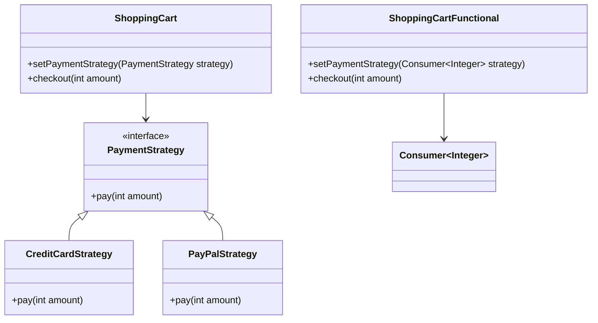

## 13.4.3 Functional Interfaces and Patterns

In the realm of modern Java development, functional programming has emerged as a powerful paradigm that complements object-oriented programming. This section delves into the concept of functional interfaces and their application in implementing design patterns, demonstrating how they can simplify code, reduce boilerplate, and enhance expressiveness.

### Understanding Functional Interfaces

Functional interfaces are a cornerstone of functional programming in Java. They are interfaces with a single abstract method (SAM), which makes them ideal for lambda expressions and method references. The introduction of functional interfaces in Java 8 marked a significant shift towards functional programming, allowing developers to write more concise and readable code.

#### Key Functional Interfaces

Java provides several built-in functional interfaces in the `java.util.function` package, each serving a specific purpose:

- **Predicate<T>**: Represents a boolean-valued function of one argument. It is often used for filtering or conditional checks.

  ```java
  Predicate<String> isLongerThanFive = s -> s.length() > 5;
  ```

- **Function<T, R>**: Represents a function that takes an argument of type T and returns a result of type R. It is useful for transforming data.

  ```java
  Function<String, Integer> stringLength = String::length;
  ```

- **Consumer<T>**: Represents an operation that takes a single input argument and returns no result. It is typically used for performing actions.

  ```java
  Consumer<String> print = System.out::println;
  ```

- **Supplier<T>**: Represents a supplier of results, providing a way to generate or supply values without taking any input.

  ```java
  Supplier<Double> randomValue = Math::random;
  ```

- **BiFunction<T, U, R>**: Similar to `Function`, but takes two arguments.

  ```java
  BiFunction<Integer, Integer, Integer> add = (a, b) -> a + b;
  ```

These interfaces enable higher-order functions, which are functions that can take other functions as arguments or return them as results. This capability is crucial for implementing various design patterns in a functional style.

### Implementing Design Patterns with Functional Interfaces

Functional programming can simplify the implementation of several design patterns by reducing boilerplate code and enhancing code readability. Let's explore how functional interfaces can be utilized to implement some common design patterns.

#### Strategy Pattern

The Strategy Pattern is a behavioral design pattern that enables selecting an algorithm's behavior at runtime. Traditionally, this pattern involves creating a family of algorithms, encapsulating each one, and making them interchangeable.

##### Traditional Implementation

In a traditional object-oriented approach, the Strategy Pattern requires creating an interface for the strategy and multiple classes implementing this interface.

```java
interface PaymentStrategy {
    void pay(int amount);
}

class CreditCardStrategy implements PaymentStrategy {
    public void pay(int amount) {
        System.out.println("Paid " + amount + " using Credit Card.");
    }
}

class PayPalStrategy implements PaymentStrategy {
    public void pay(int amount) {
        System.out.println("Paid " + amount + " using PayPal.");
    }
}

class ShoppingCart {
    private PaymentStrategy paymentStrategy;

    public void setPaymentStrategy(PaymentStrategy paymentStrategy) {
        this.paymentStrategy = paymentStrategy;
    }

    public void checkout(int amount) {
        paymentStrategy.pay(amount);
    }
}
```

##### Functional Implementation

With functional interfaces, we can use lambdas to define strategies, eliminating the need for concrete strategy classes.

```java
import java.util.function.Consumer;

class ShoppingCart {
    private Consumer<Integer> paymentStrategy;

    public void setPaymentStrategy(Consumer<Integer> paymentStrategy) {
        this.paymentStrategy = paymentStrategy;
    }

    public void checkout(int amount) {
        paymentStrategy.accept(amount);
    }
}

// Usage
ShoppingCart cart = new ShoppingCart();
cart.setPaymentStrategy(amount -> System.out.println("Paid " + amount + " using Credit Card."));
cart.checkout(100);

cart.setPaymentStrategy(amount -> System.out.println("Paid " + amount + " using PayPal."));
cart.checkout(200);
```

In this functional approach, we use `Consumer<Integer>` to represent the payment strategy, allowing us to pass different behaviors as lambda expressions. This results in more concise and flexible code.

#### Command Pattern

The Command Pattern is a behavioral design pattern that encapsulates a request as an object, thereby allowing for parameterization of clients with queues, requests, and operations.

##### Traditional Implementation

Traditionally, the Command Pattern involves creating a command interface and multiple command classes implementing this interface.

```java
interface Command {
    void execute();
}

class LightOnCommand implements Command {
    private Light light;

    public LightOnCommand(Light light) {
        this.light = light;
    }

    public void execute() {
        light.on();
    }
}

class Light {
    public void on() {
        System.out.println("Light is on");
    }
}

class RemoteControl {
    private Command command;

    public void setCommand(Command command) {
        this.command = command;
    }

    public void pressButton() {
        command.execute();
    }
}
```

##### Functional Implementation

Using functional interfaces, we can represent commands as functions, simplifying the implementation.

```java
import java.util.function.Supplier;

class RemoteControl {
    private Supplier<Void> command;

    public void setCommand(Supplier<Void> command) {
        this.command = command;
    }

    public void pressButton() {
        command.get();
    }
}

// Usage
Light light = new Light();
RemoteControl remote = new RemoteControl();
remote.setCommand(() -> {
    light.on();
    return null;
});
remote.pressButton();
```

In this implementation, we use `Supplier<Void>` to represent the command, allowing us to define the command logic inline using a lambda expression.

#### Observer Pattern

The Observer Pattern is a behavioral design pattern that defines a one-to-many dependency between objects so that when one object changes state, all its dependents are notified.

##### Traditional Implementation

In a traditional implementation, the Observer Pattern involves creating a subject interface and observer interface, along with concrete implementations.

```java
import java.util.ArrayList;
import java.util.List;

interface Observer {
    void update(String message);
}

class ConcreteObserver implements Observer {
    private String name;

    public ConcreteObserver(String name) {
        this.name = name;
    }

    public void update(String message) {
        System.out.println(name + " received: " + message);
    }
}

class Subject {
    private List<Observer> observers = new ArrayList<>();

    public void addObserver(Observer observer) {
        observers.add(observer);
    }

    public void notifyObservers(String message) {
        for (Observer observer : observers) {
            observer.update(message);
        }
    }
}
```

##### Functional Implementation

With functional interfaces, we can use `Consumer<String>` to represent observers, simplifying the pattern.

```java
import java.util.ArrayList;
import java.util.List;
import java.util.function.Consumer;

class Subject {
    private List<Consumer<String>> observers = new ArrayList<>();

    public void addObserver(Consumer<String> observer) {
        observers.add(observer);
    }

    public void notifyObservers(String message) {
        observers.forEach(observer -> observer.accept(message));
    }
}

// Usage
Subject subject = new Subject();
subject.addObserver(message -> System.out.println("Observer 1 received: " + message));
subject.addObserver(message -> System.out.println("Observer 2 received: " + message));
subject.notifyObservers("Hello, Observers!");
```

In this functional approach, we use `Consumer<String>` to represent observers, allowing us to define observer behavior inline using lambda expressions.

### Benefits of Functional Programming in Design Patterns

Functional programming offers several advantages when implementing design patterns:

- **Conciseness**: Functional interfaces and lambda expressions reduce the need for boilerplate code, resulting in more concise implementations.
- **Expressiveness**: Functional programming allows for more expressive code, making it easier to understand and maintain.
- **Flexibility**: Higher-order functions enable dynamic behavior changes at runtime, enhancing flexibility.
- **Immutability**: Functional programming encourages immutability, leading to safer and more predictable code.

### Visualizing Functional Interfaces in Design Patterns

To better understand how functional interfaces integrate into design patterns, let's visualize the transformation of a traditional Strategy Pattern into a functional one.



In this diagram, we see the transition from a traditional class-based strategy implementation to a functional one using `Consumer<Integer>`. The functional approach eliminates the need for concrete strategy classes, simplifying the design.

### Try It Yourself

To deepen your understanding, try modifying the code examples provided:

- **Strategy Pattern**: Add a new payment method using a lambda expression.
- **Command Pattern**: Implement a new command that turns off the light.
- **Observer Pattern**: Add a third observer and customize its behavior.

### References and Further Reading

- [Java Functional Interfaces](https://docs.oracle.com/javase/8/docs/api/java/util/function/package-summary.html)
- [Oracle's Java Tutorials on Lambda Expressions](https://docs.oracle.com/javase/tutorial/java/javaOO/lambdaexpressions.html)
- [Effective Java by Joshua Bloch](https://www.oreilly.com/library/view/effective-java-3rd/9780134686097/)

### Knowledge Check

Before moving on, let's summarize the key takeaways:

- Functional interfaces are interfaces with a single abstract method, enabling lambda expressions and method references.
- They simplify the implementation of design patterns by reducing boilerplate code and enhancing expressiveness.
- The Strategy, Command, and Observer patterns can be effectively implemented using functional programming techniques.

## Quiz Time!



### What is a functional interface in Java?

- [x] An interface with a single abstract method
- [ ] An interface with multiple abstract methods
- [ ] An interface that extends another interface
- [ ] An interface with no methods

> **Explanation:** A functional interface is defined as an interface with a single abstract method, which allows it to be used with lambda expressions.

### Which functional interface represents a boolean-valued function of one argument?

- [x] Predicate<T>
- [ ] Function<T, R>
- [ ] Consumer<T>
- [ ] Supplier<T>

> **Explanation:** `Predicate<T>` is a functional interface that represents a boolean-valued function of one argument, commonly used for filtering.

### How does functional programming enhance the Strategy Pattern?

- [x] By allowing behaviors to be passed as lambda expressions
- [ ] By requiring more classes to implement strategies
- [ ] By making the pattern more complex
- [ ] By eliminating the need for interfaces

> **Explanation:** Functional programming enhances the Strategy Pattern by allowing behaviors to be passed as lambda expressions, reducing the need for concrete strategy classes.

### Which functional interface is used to represent a command in the Command Pattern?

- [x] Supplier<Void>
- [ ] Predicate<T>
- [ ] Function<T, R>
- [ ] Consumer<T>

> **Explanation:** `Supplier<Void>` can be used to represent a command in the Command Pattern, allowing the command logic to be defined inline using a lambda expression.

### What is a key benefit of using functional programming in design patterns?

- [x] Conciseness and expressiveness
- [ ] Increased boilerplate code
- [ ] Reduced flexibility
- [ ] More complex implementations

> **Explanation:** Functional programming offers conciseness and expressiveness, reducing boilerplate code and making implementations easier to understand and maintain.

### How can the Observer Pattern be implemented using functional interfaces?

- [x] By using Consumer<String> to represent observers
- [ ] By creating multiple concrete observer classes
- [ ] By using Supplier<T> to notify observers
- [ ] By eliminating the need for a subject

> **Explanation:** The Observer Pattern can be implemented using `Consumer<String>` to represent observers, allowing observer behavior to be defined inline with lambda expressions.

### Which of the following is NOT a built-in functional interface in Java?

- [x] Executor<T>
- [ ] Predicate<T>
- [ ] Function<T, R>
- [ ] Consumer<T>

> **Explanation:** `Executor<T>` is not a built-in functional interface in Java. The other options are part of the `java.util.function` package.

### What is the role of higher-order functions in functional programming?

- [x] To take other functions as arguments or return them as results
- [ ] To increase the number of classes in a program
- [ ] To make code less readable
- [ ] To eliminate the need for interfaces

> **Explanation:** Higher-order functions are functions that can take other functions as arguments or return them as results, enabling more flexible and dynamic code.

### How does functional programming promote immutability?

- [x] By encouraging the use of immutable data structures
- [ ] By requiring mutable objects
- [ ] By increasing the complexity of code
- [ ] By eliminating the need for variables

> **Explanation:** Functional programming promotes immutability by encouraging the use of immutable data structures, leading to safer and more predictable code.

### True or False: Functional interfaces can only be used with lambda expressions.

- [x] False
- [ ] True

> **Explanation:** Functional interfaces can be used with both lambda expressions and method references, providing flexibility in how they are implemented.



Remember, this is just the beginning. As you progress, you'll build more complex and interactive applications using functional programming. Keep experimenting, stay curious, and enjoy the journey!
