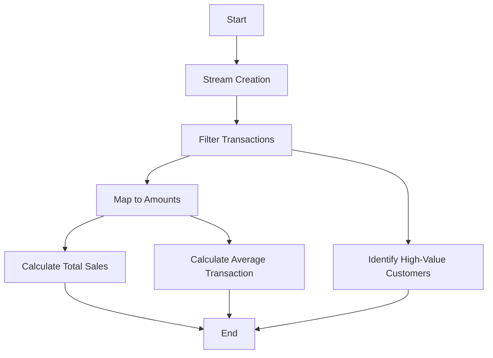

## 13.4.4 Use Cases and Examples

In this section, we delve into the practical applications of functional programming in Java, focusing on how it can enhance application development. We will explore three key areas: data processing pipelines, event handling systems, and asynchronous computations. By leveraging functional programming paradigms, we can achieve more efficient, maintainable, and scalable code. Let's explore these use cases in detail, complete with code examples and discussions on the benefits and challenges of adopting functional programming.

### Data Processing Pipelines

Data processing is a critical aspect of many applications, especially those dealing with large datasets. Functional programming in Java, facilitated by the Streams API, provides a powerful way to build data processing pipelines that are both efficient and expressive.

#### Building a Data Processing Pipeline

Consider a scenario where we need to process a large dataset of customer transactions to extract insights such as total sales, average transaction value, and identify high-value customers. Using Java Streams, we can construct a pipeline that processes this data in a declarative manner.

```java
import java.util.*;
import java.util.stream.*;

public class DataProcessingExample {
    public static void main(String[] args) {
        List<Transaction> transactions = Arrays.asList(
            new Transaction("Alice", 150.0),
            new Transaction("Bob", 200.0),
            new Transaction("Charlie", 50.0),
            new Transaction("Alice", 300.0)
        );

        // Calculate total sales
        double totalSales = transactions.stream()
            .mapToDouble(Transaction::getAmount)
            .sum();

        // Calculate average transaction value
        double averageTransaction = transactions.stream()
            .mapToDouble(Transaction::getAmount)
            .average()
            .orElse(0.0);

        // Identify high-value customers
        List<String> highValueCustomers = transactions.stream()
            .filter(t -> t.getAmount() > 100)
            .map(Transaction::getCustomer)
            .distinct()
            .collect(Collectors.toList());

        System.out.println("Total Sales: " + totalSales);
        System.out.println("Average Transaction: " + averageTransaction);
        System.out.println("High-Value Customers: " + highValueCustomers);
    }
}

class Transaction {
    private String customer;
    private double amount;

    public Transaction(String customer, double amount) {
        this.customer = customer;
        this.amount = amount;
    }

    public String getCustomer() {
        return customer;
    }

    public double getAmount() {
        return amount;
    }
}
```

**Key Points:**

- **Declarative Code**: The use of streams allows us to express the data processing logic in a high-level, declarative manner, making the code more readable and maintainable.
- **Efficiency**: Streams process data lazily, meaning operations are only performed when necessary, which can lead to performance improvements, especially with large datasets.
- **Parallel Processing**: Java Streams can be easily parallelized by using `parallelStream()`, enabling efficient use of multi-core processors.

#### Benefits and Challenges

**Benefits:**

- **Reduced Code Complexity**: Functional programming reduces boilerplate code, making the logic more concise and easier to understand.
- **Improved Performance**: Lazy evaluation and parallel processing capabilities can significantly enhance performance.
- **Enhanced Maintainability**: The declarative nature of functional programming leads to code that is easier to maintain and extend.

**Challenges:**

- **Learning Curve**: Developers accustomed to imperative programming may find the functional paradigm challenging to adopt initially.
- **Debugging**: Debugging functional code can be more complex due to its declarative nature and the use of lambda expressions.

### Event Handling Systems

Event-driven architectures are prevalent in modern applications, where systems need to react to various events efficiently. Functional programming, with its support for lambda expressions and method references, provides an elegant way to implement reactive event handlers.

#### Implementing Reactive Event Handlers

Let's consider an example where we build a simple event handling system for a GUI application. We will use lambda expressions to handle button click events.

```java
import java.awt.*;
import java.awt.event.*;
import javax.swing.*;

public class EventHandlingExample {
    public static void main(String[] args) {
        JFrame frame = new JFrame("Event Handling Example");
        JButton button = new JButton("Click Me");

        // Using lambda expression for event handling
        button.addActionListener(e -> System.out.println("Button clicked!"));

        frame.setLayout(new FlowLayout());
        frame.add(button);
        frame.setSize(300, 200);
        frame.setDefaultCloseOperation(JFrame.EXIT_ON_CLOSE);
        frame.setVisible(true);
    }
}
```

**Key Points:**

- **Conciseness**: Lambda expressions allow us to define event handlers in a concise manner, reducing boilerplate code.
- **Flexibility**: Functional interfaces enable the use of different event handling strategies without changing the underlying logic.
- **Reactivity**: The functional approach aligns well with reactive programming paradigms, enabling systems to respond to events in a non-blocking manner.

#### Benefits and Challenges

**Benefits:**

- **Simplified Code**: Using lambdas and method references simplifies event handling code, making it more readable.
- **Improved Responsiveness**: Functional programming supports non-blocking operations, enhancing the responsiveness of event-driven systems.

**Challenges:**

- **Complexity in Large Systems**: Managing event handlers in large systems can become complex, requiring careful design to maintain clarity.
- **State Management**: Functional programming emphasizes immutability, which can complicate state management in event-driven systems.

### Asynchronous Computations

Asynchronous programming is essential for building responsive applications that perform non-blocking operations. Java's `CompletableFuture` class, combined with functional programming, provides a robust framework for handling asynchronous computations.

#### Using CompletableFuture for Non-Blocking Operations

Consider a scenario where we need to fetch data from multiple remote services asynchronously and process the results. We can use `CompletableFuture` to achieve this in a non-blocking manner.

```java
import java.util.concurrent.*;

public class AsynchronousExample {
    public static void main(String[] args) {
        ExecutorService executor = Executors.newFixedThreadPool(3);

        // Asynchronous task 1
        CompletableFuture<String> future1 = CompletableFuture.supplyAsync(() -> {
            simulateDelay();
            return "Result from Service 1";
        }, executor);

        // Asynchronous task 2
        CompletableFuture<String> future2 = CompletableFuture.supplyAsync(() -> {
            simulateDelay();
            return "Result from Service 2";
        }, executor);

        // Combine results
        CompletableFuture<Void> combinedFuture = CompletableFuture.allOf(future1, future2)
            .thenRun(() -> {
                try {
                    System.out.println(future1.get());
                    System.out.println(future2.get());
                } catch (InterruptedException | ExecutionException e) {
                    e.printStackTrace();
                }
            });

        combinedFuture.join(); // Wait for all tasks to complete
        executor.shutdown();
    }

    private static void simulateDelay() {
        try {
            Thread.sleep(1000);
        } catch (InterruptedException e) {
            Thread.currentThread().interrupt();
        }
    }
}
```

**Key Points:**

- **Non-Blocking**: `CompletableFuture` allows tasks to be executed asynchronously, freeing up the main thread for other operations.
- **Composability**: Functional programming enables the composition of multiple asynchronous tasks, making it easier to build complex workflows.
- **Error Handling**: `CompletableFuture` provides mechanisms for handling exceptions, improving the robustness of asynchronous code.

#### Benefits and Challenges

**Benefits:**

- **Enhanced Responsiveness**: Asynchronous computations improve application responsiveness by avoiding blocking operations.
- **Scalability**: Non-blocking operations enable applications to handle more concurrent tasks, improving scalability.

**Challenges:**

- **Complexity**: Asynchronous programming can introduce complexity, especially in error handling and task coordination.
- **Debugging**: Debugging asynchronous code can be challenging due to the non-linear execution flow.

### Overcoming Challenges in Functional Programming

Adopting functional programming in Java comes with its set of challenges. Here are some strategies to overcome them:

- **Gradual Adoption**: Introduce functional programming concepts gradually, starting with simple use cases and progressively tackling more complex scenarios.
- **Education and Training**: Invest in training and resources to help developers become proficient in functional programming paradigms.
- **Tooling Support**: Leverage IDE features and tools that support functional programming, such as lambda debugging and stream analysis.
- **Community and Resources**: Engage with the developer community and utilize online resources to stay updated on best practices and new developments in functional programming.

### Try It Yourself

Experiment with the code examples provided in this section. Here are some suggestions for modifications:

- **Data Processing Pipelines**: Extend the pipeline to include additional operations, such as grouping transactions by customer and calculating total sales per customer.
- **Event Handling Systems**: Add more buttons to the GUI and implement different event handling strategies using method references.
- **Asynchronous Computations**: Introduce additional asynchronous tasks and explore different ways to combine and process their results.

### Visualizing Functional Programming Concepts

To better understand the flow of data and control in functional programming, let's visualize the data processing pipeline using a flowchart.



**Diagram Description**: This flowchart illustrates the data processing pipeline for customer transactions. It shows the sequence of operations performed on the data, from stream creation to filtering, mapping, and calculating results.

### References and Links

For further reading on functional programming in Java, consider the following resources:

- [Java Streams API Documentation](https://docs.oracle.com/javase/8/docs/api/java/util/stream/package-summary.html)
- [CompletableFuture in Java](https://docs.oracle.com/javase/8/docs/api/java/util/concurrent/CompletableFuture.html)
- [Reactive Programming with Java](https://www.reactive-streams.org/)

### Knowledge Check

Before moving on, consider the following questions to reinforce your understanding:

- How does functional programming improve the readability and maintainability of code?
- What are the benefits of using Java Streams for data processing?
- How can `CompletableFuture` enhance the responsiveness of an application?
- What strategies can be employed to manage state in event-driven systems using functional programming?

### Embrace the Journey

Remember, adopting functional programming is a journey. As you explore these concepts and apply them to your projects, you'll discover new ways to write cleaner, more efficient code. Keep experimenting, stay curious, and enjoy the journey!

## Quiz Time!



### What is a key benefit of using Java Streams in data processing?

- [x] Lazy evaluation for performance optimization
- [ ] Increased code verbosity
- [ ] Mandatory parallel processing
- [ ] Simplified debugging

> **Explanation:** Java Streams use lazy evaluation, which can optimize performance by only processing data when necessary.

### Which Java feature allows for concise event handling in GUI applications?

- [x] Lambda expressions
- [ ] Synchronized blocks
- [ ] Static methods
- [ ] Abstract classes

> **Explanation:** Lambda expressions provide a concise way to implement functional interfaces, making event handling more straightforward.

### What is a primary advantage of using `CompletableFuture` for asynchronous computations?

- [x] Non-blocking operations
- [ ] Guaranteed sequential execution
- [ ] Reduced code readability
- [ ] Increased memory usage

> **Explanation:** `CompletableFuture` allows for non-blocking operations, enhancing application responsiveness.

### What challenge might developers face when adopting functional programming?

- [x] Steep learning curve
- [ ] Increased boilerplate code
- [ ] Lack of expressiveness
- [ ] Reduced performance

> **Explanation:** Developers may find the transition to functional programming challenging due to its different paradigm compared to imperative programming.

### How can functional programming improve event-driven systems?

- [x] By supporting non-blocking operations
- [ ] By increasing state mutability
- [ ] By enforcing synchronous processing
- [ ] By reducing event types

> **Explanation:** Functional programming supports non-blocking operations, which can enhance the responsiveness of event-driven systems.

### What is a common strategy to overcome the challenges of functional programming?

- [x] Gradual adoption of concepts
- [ ] Avoiding lambda expressions
- [ ] Using only imperative code
- [ ] Ignoring community resources

> **Explanation:** Gradually adopting functional programming concepts can help developers become more comfortable with the paradigm.

### Which of the following is a benefit of using lambda expressions in Java?

- [x] Reduced boilerplate code
- [ ] Mandatory use of `synchronized`
- [ ] Increased code complexity
- [ ] Decreased performance

> **Explanation:** Lambda expressions reduce boilerplate code, making Java code more concise and readable.

### What does `CompletableFuture.allOf()` do?

- [x] Combines multiple `CompletableFuture` instances
- [ ] Executes tasks sequentially
- [ ] Blocks the main thread
- [ ] Reduces error handling

> **Explanation:** `CompletableFuture.allOf()` is used to combine multiple `CompletableFuture` instances, allowing them to be processed together.

### Why might debugging functional code be more challenging?

- [x] Due to its declarative nature
- [ ] Because of increased verbosity
- [ ] Because it lacks expressiveness
- [ ] Due to mandatory parallelism

> **Explanation:** The declarative nature of functional programming can make it harder to trace the flow of execution, complicating debugging.

### True or False: Functional programming in Java can lead to improved scalability.

- [x] True
- [ ] False

> **Explanation:** Functional programming, with its support for non-blocking operations and parallel processing, can enhance the scalability of applications.


