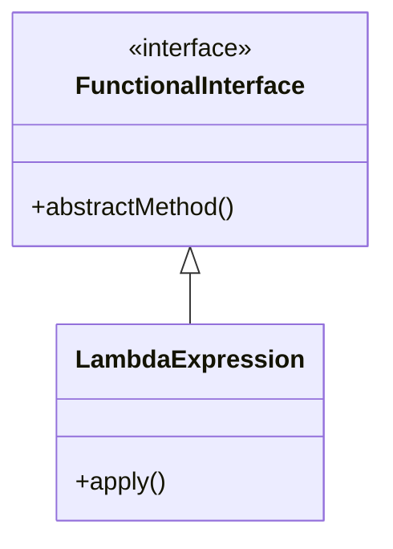

## 13.4 Functional Programming in Java

Functional programming has been a transformative paradigm in software development, emphasizing immutability, stateless computations, and higher-order functions. With the introduction of Java 8, Java embraced functional programming principles, offering developers tools to write more concise, readable, and maintainable code. In this section, we will explore the functional programming features introduced in Java 8 and beyond, focusing on lambda expressions and the Streams API, and discuss how these features can be integrated with object-oriented programming (OOP) to enhance code quality.

### The Shift Towards Functional Programming in Java

Java has traditionally been an object-oriented language, but the demands of modern software development have necessitated a shift towards functional programming paradigms. This shift is driven by the need for more expressive code, better concurrency handling, and the ability to easily process large data sets. Functional programming offers solutions to these challenges through its emphasis on immutability and stateless computations.

#### Benefits of Functional Programming

1. **Immutability**: Functional programming encourages the use of immutable data structures, which can lead to safer code by avoiding side effects and making it easier to reason about program behavior.

2. **Stateless Computations**: By avoiding shared state, functional programming reduces the complexity of concurrent programming, as there are no race conditions or deadlocks to manage.

3. **Higher-Order Functions**: Functions can be passed as arguments, returned from other functions, and assigned to variables, allowing for more flexible and reusable code.

4. **Conciseness and Readability**: Functional programming often leads to more concise code, as operations can be expressed in a more declarative style.

5. **Enhanced Testability**: Pure functions, which do not rely on external state, are easier to test and debug.

### Key Features Enabling Functional Programming in Java

Java 8 introduced several key features that enable functional programming:

#### Lambda Expressions

Lambda expressions provide a clear and concise way to represent one method interface using an expression. They enable you to treat functionality as a method argument, or code as data.

```java
// Traditional way of implementing a Runnable
Runnable runnable = new Runnable() {
    @Override
    public void run() {
        System.out.println("Hello, World!");
    }
};

// Using a lambda expression
Runnable lambdaRunnable = () -> System.out.println("Hello, World!");
```

In the example above, the lambda expression `() -> System.out.println("Hello, World!")` is a more concise way to implement the `Runnable` interface.

#### Streams API

The Streams API allows you to process sequences of elements in a functional style. It provides operations like `map`, `filter`, and `reduce`, which can be chained to perform complex data processing tasks.

```java
import java.util.Arrays;
import java.util.List;

public class StreamExample {
    public static void main(String[] args) {
        List<String> names = Arrays.asList("Alice", "Bob", "Charlie", "David");

        // Using Streams to filter and print names
        names.stream()
             .filter(name -> name.startsWith("A"))
             .forEach(System.out::println);
    }
}
```

In this example, the `stream()` method converts the list into a stream, `filter()` is used to select names starting with "A", and `forEach()` is used to print each name.

#### Functional Interfaces

A functional interface is an interface with a single abstract method, and it can be implemented using lambda expressions. Java 8 introduced several built-in functional interfaces, such as `Predicate`, `Function`, and `Consumer`.

```java
import java.util.function.Predicate;

public class PredicateExample {
    public static void main(String[] args) {
        Predicate<String> isLongerThanFive = s -> s.length() > 5;
        System.out.println(isLongerThanFive.test("Hello")); // false
        System.out.println(isLongerThanFive.test("Hello, World!")); // true
    }
}
```

Here, `Predicate<String>` is a functional interface that takes a `String` and returns a `boolean`.

### Combining Functional Programming with OOP

Functional programming and OOP are not mutually exclusive; they can be combined to create more robust and flexible code. By leveraging the strengths of both paradigms, developers can write code that is both modular and expressive.

#### Enhancing Code Quality

1. **Modularity**: Functional programming encourages the decomposition of problems into smaller, reusable functions. When combined with OOP, this can lead to highly modular code.

2. **Expressiveness**: Functional constructs like lambda expressions and streams allow for more expressive code, which can be easier to read and maintain.

3. **Concurrency**: The stateless nature of functional programming makes it easier to write concurrent code, as there are fewer concerns about shared state.

4. **Testability**: Pure functions are easier to test, and when combined with OOP, they can lead to more testable codebases.

### Relevance of Functional Programming in Modern Java Development

Functional programming is increasingly relevant in modern Java development due to the growing complexity of software systems and the need for efficient data processing. The ability to write concise, expressive code that is easy to test and maintain is invaluable in today's fast-paced development environment.

#### Use Cases

1. **Data Processing**: The Streams API is particularly useful for processing large data sets, as it allows for parallel processing and efficient data manipulation.

2. **Concurrency**: Functional programming's emphasis on immutability and stateless computations makes it well-suited for concurrent programming.

3. **Microservices**: The modular nature of functional programming aligns well with the microservices architecture, where services are small, independent, and reusable.

### Visualizing Functional Programming Concepts

To better understand how functional programming fits into Java, let's visualize some of the key concepts using Mermaid.js diagrams.

#### Lambda Expressions and Functional Interfaces



*Diagram 1: Relationship between functional interfaces and lambda expressions.*

#### Streams API Workflow

```mermaid
flowchart TD
    A[Collection] -->|stream()| B[Stream]
    B -->|filter()| C[Filtered Stream]
    C -->|map()| D[Mapped Stream]
    D -->|reduce()| E[Result]
```

*Diagram 2: Workflow of processing a collection using the Streams API.*

### Try It Yourself

To deepen your understanding of functional programming in Java, try modifying the code examples provided:

1. **Experiment with Lambda Expressions**: Create a lambda expression that takes two integers and returns their sum. Test it with different inputs.

2. **Explore the Streams API**: Modify the `StreamExample` to sort the names alphabetically before printing them.

3. **Create Custom Functional Interfaces**: Define a custom functional interface that takes a string and returns its length. Implement it using a lambda expression.

### Knowledge Check

Before we conclude, let's reinforce what we've learned:

- **What are the benefits of functional programming?**
- **How do lambda expressions enhance code readability?**
- **What is the role of functional interfaces in Java?**
- **How does the Streams API facilitate data processing?**

### Conclusion

Functional programming in Java offers powerful tools for writing concise, readable, and maintainable code. By embracing lambda expressions, the Streams API, and functional interfaces, developers can enhance their codebases with modular, testable, and efficient solutions. As Java continues to evolve, the integration of functional programming principles will remain a crucial aspect of modern Java development.

## Quiz Time!



### What is a primary benefit of using functional programming in Java?

- [x] Immutability
- [ ] Increased code complexity
- [ ] More verbose code
- [ ] Increased reliance on global state

> **Explanation:** Immutability is a key benefit of functional programming, leading to safer and more predictable code.

### Which Java feature allows you to treat functionality as a method argument?

- [x] Lambda Expressions
- [ ] Abstract Classes
- [ ] Interfaces
- [ ] Annotations

> **Explanation:** Lambda expressions enable you to treat functionality as a method argument, making code more concise.

### What is a functional interface in Java?

- [x] An interface with a single abstract method
- [ ] An interface with multiple abstract methods
- [ ] A class that implements multiple interfaces
- [ ] A class with no methods

> **Explanation:** A functional interface in Java is defined as having a single abstract method, which can be implemented using a lambda expression.

### How does the Streams API improve data processing?

- [x] By providing a functional approach to processing sequences of elements
- [ ] By increasing the complexity of data operations
- [ ] By requiring manual iteration over collections
- [ ] By enforcing immutability on all data

> **Explanation:** The Streams API allows for a functional approach to data processing, enabling operations like map, filter, and reduce.

### What is the relationship between lambda expressions and functional interfaces?

- [x] Lambda expressions implement functional interfaces
- [ ] Lambda expressions are a type of functional interface
- [ ] Functional interfaces are implemented by classes only
- [ ] Lambda expressions cannot be used with functional interfaces

> **Explanation:** Lambda expressions provide a concise way to implement functional interfaces, which have a single abstract method.

### Which of the following is NOT a benefit of functional programming?

- [ ] Immutability
- [ ] Stateless computations
- [x] Increased reliance on shared state
- [ ] Higher-order functions

> **Explanation:** Functional programming reduces reliance on shared state, promoting immutability and stateless computations.

### What is a key advantage of combining functional programming with OOP?

- [x] Enhanced code quality through modularity and expressiveness
- [ ] Increased code verbosity
- [ ] More complex inheritance hierarchies
- [ ] Reduced testability

> **Explanation:** Combining functional programming with OOP enhances code quality by promoting modularity and expressiveness.

### How does functional programming improve concurrency?

- [x] By reducing concerns about shared state
- [ ] By increasing reliance on global variables
- [ ] By requiring complex locking mechanisms
- [ ] By enforcing single-threaded execution

> **Explanation:** Functional programming's emphasis on immutability and stateless computations reduces concerns about shared state, improving concurrency.

### Which Java version introduced lambda expressions and the Streams API?

- [x] Java 8
- [ ] Java 7
- [ ] Java 9
- [ ] Java 11

> **Explanation:** Java 8 introduced lambda expressions and the Streams API, marking a significant shift towards functional programming.

### True or False: Functional programming and OOP cannot be combined in Java.

- [ ] True
- [x] False

> **Explanation:** Functional programming and OOP can be combined in Java to create robust, modular, and expressive code.


