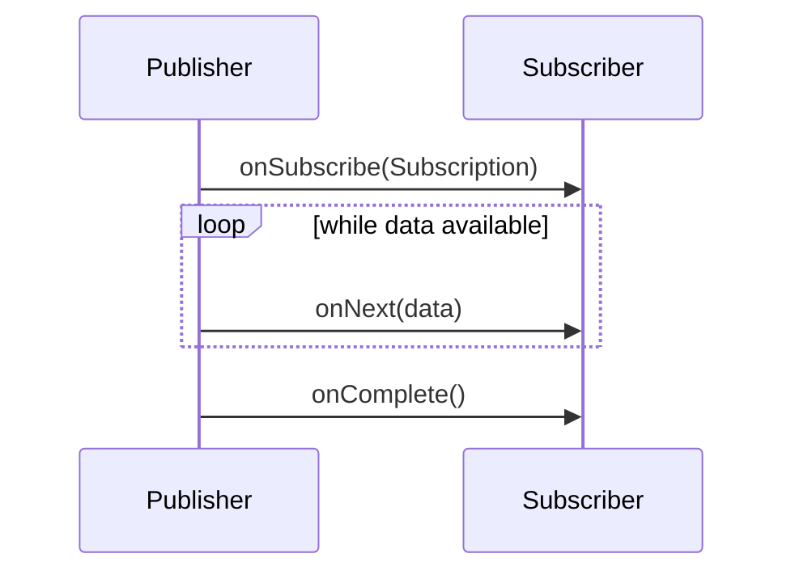

## 13.5.1 Implementing Reactive Streams

In the realm of modern software development, **Reactive Streams** have emerged as a powerful paradigm for handling asynchronous data processing with non-blocking backpressure. This section delves into the intricacies of implementing reactive streams in Java, leveraging popular libraries like **Project Reactor** and **RxJava**. We will explore their features, differences, and provide step-by-step instructions for setting up a reactive programming environment, creating publishers and subscribers, and implementing common reactive operators.

### Introduction to Reactive Streams

Reactive Streams is a specification designed to provide a standard for asynchronous stream processing with non-blocking backpressure. The primary goal is to allow different libraries to interoperate seamlessly while handling data streams efficiently. Reactive Streams aim to:

- **Asynchronously process data**: Handle data streams without blocking the executing thread.
- **Manage backpressure**: Control the flow of data between producers and consumers to prevent overwhelming the system.
- **Ensure interoperability**: Provide a common API that different libraries can implement, ensuring compatibility.

### Overview of Project Reactor and RxJava

#### Project Reactor

**Project Reactor** is a reactive library built on the Reactive Streams specification. It provides a rich set of operators and utilities for building reactive applications. Key features include:

- **Mono and Flux**: Core types representing 0-1 and 0-N elements, respectively.
- **Backpressure support**: Built-in mechanisms to handle backpressure.
- **Integration with Java 8+**: Seamless integration with Java's functional programming features.

#### RxJava

**RxJava** is another popular library for reactive programming in Java, inspired by Reactive Extensions (Rx) for .NET. It offers:

- **Observable and Flowable**: Core types for representing data streams, with Flowable specifically designed for backpressure handling.
- **Rich operator set**: Extensive collection of operators for transforming and manipulating data streams.
- **Cross-platform support**: Part of a larger ecosystem with implementations in various languages.

### Setting Up a Reactive Programming Environment

To get started with reactive programming in Java, you need to set up your development environment with either Project Reactor or RxJava.

#### Using Project Reactor

1. **Add Dependency**: Include Project Reactor in your `pom.xml` if you're using Maven:

   ```xml
   <dependency>
       <groupId>io.projectreactor</groupId>
       <artifactId>reactor-core</artifactId>
       <version>3.4.0</version>
   </dependency>
   ```

2. **Initialize Project**: Create a new Java project and ensure your IDE recognizes the dependencies.

#### Using RxJava

1. **Add Dependency**: Include RxJava in your `pom.xml`:

   ```xml
   <dependency>
       <groupId>io.reactivex.rxjava3</groupId>
       <artifactId>rxjava</artifactId>
       <version>3.0.0</version>
   </dependency>
   ```

2. **Initialize Project**: Similar to Project Reactor, set up your Java project and verify the dependencies.

### Creating Publishers and Subscribers

In reactive programming, **publishers** emit data, while **subscribers** consume it. Let's explore how to create these components using both Project Reactor and RxJava.

#### Project Reactor: Mono and Flux

- **Mono**: Represents a stream of 0 or 1 item.

  ```java
  import reactor.core.publisher.Mono;

  public class MonoExample {
      public static void main(String[] args) {
          Mono<String> mono = Mono.just("Hello, Reactive World!");
          mono.subscribe(System.out::println);
      }
  }
  ```

- **Flux**: Represents a stream of 0 to N items.

  ```java
  import reactor.core.publisher.Flux;

  public class FluxExample {
      public static void main(String[] args) {
          Flux<String> flux = Flux.just("Hello", "Reactive", "World");
          flux.subscribe(System.out::println);
      }
  }
  ```

#### RxJava: Observable and Flowable

- **Observable**: Suitable for streams without backpressure concerns.

  ```java
  import io.reactivex.rxjava3.core.Observable;

  public class ObservableExample {
      public static void main(String[] args) {
          Observable<String> observable = Observable.just("Hello", "RxJava", "World");
          observable.subscribe(System.out::println);
      }
  }
  ```

- **Flowable**: Designed for backpressure handling.

  ```java
  import io.reactivex.rxjava3.core.Flowable;

  public class FlowableExample {
      public static void main(String[] args) {
          Flowable<String> flowable = Flowable.just("Hello", "RxJava", "World");
          flowable.subscribe(System.out::println);
      }
  }
  ```

### Implementing Common Reactive Operators

Reactive libraries provide a plethora of operators to transform and manipulate data streams. Let's explore some common operators and their usage.

#### Map Operator

Transforms each item emitted by a publisher.

- **Project Reactor**:

  ```java
  Flux<Integer> numbers = Flux.just(1, 2, 3, 4);
  Flux<Integer> squares = numbers.map(n -> n * n);
  squares.subscribe(System.out::println);
  ```

- **RxJava**:

  ```java
  Observable<Integer> numbers = Observable.just(1, 2, 3, 4);
  Observable<Integer> squares = numbers.map(n -> n * n);
  squares.subscribe(System.out::println);
  ```

#### FlatMap Operator

Transforms each item into a publisher and flattens the results.

- **Project Reactor**:

  ```java
  Flux<String> words = Flux.just("Hello", "World");
  Flux<String> letters = words.flatMap(word -> Flux.fromArray(word.split("")));
  letters.subscribe(System.out::println);
  ```

- **RxJava**:

  ```java
  Observable<String> words = Observable.just("Hello", "World");
  Observable<String> letters = words.flatMap(word -> Observable.fromArray(word.split("")));
  letters.subscribe(System.out::println);
  ```

#### Filter Operator

Filters items emitted by a publisher based on a predicate.

- **Project Reactor**:

  ```java
  Flux<Integer> numbers = Flux.range(1, 10);
  Flux<Integer> evenNumbers = numbers.filter(n -> n % 2 == 0);
  evenNumbers.subscribe(System.out::println);
  ```

- **RxJava**:

  ```java
  Observable<Integer> numbers = Observable.range(1, 10);
  Observable<Integer> evenNumbers = numbers.filter(n -> n % 2 == 0);
  evenNumbers.subscribe(System.out::println);
  ```

### Handling Data Streams Asynchronously

Reactive programming excels at handling asynchronous data streams. Let's explore how to manage asynchronous operations using Project Reactor and RxJava.

#### Asynchronous Processing

- **Project Reactor**:

  ```java
  Mono<String> asyncMono = Mono.fromCallable(() -> {
      Thread.sleep(1000);
      return "Async Result";
  });

  asyncMono.subscribe(System.out::println);
  ```

- **RxJava**:

  ```java
  Observable<String> asyncObservable = Observable.fromCallable(() -> {
      Thread.sleep(1000);
      return "Async Result";
  });

  asyncObservable.subscribe(System.out::println);
  ```

### Managing Backpressure and Control Flow

Backpressure is a critical aspect of reactive programming, ensuring that consumers are not overwhelmed by data producers.

#### Backpressure Strategies

- **Project Reactor**: Handles backpressure internally with Flux and Mono.

- **RxJava**: Offers several strategies for backpressure management, such as `BUFFER`, `DROP`, `LATEST`, and `ERROR`.

  ```java
  Flowable<Integer> flowable = Flowable.range(1, 1000)
      .onBackpressureBuffer(); // Buffer strategy

  flowable.subscribe(System.out::println);
  ```

### Handling Errors and Retries

Error handling is crucial in reactive programming to ensure robustness and resilience.

#### Error Handling

- **Project Reactor**:

  ```java
  Flux<String> flux = Flux.just("1", "2", "a", "3")
      .map(Integer::parseInt)
      .onErrorResume(e -> Flux.just(0)); // Fallback on error

  flux.subscribe(System.out::println);
  ```

- **RxJava**:

  ```java
  Observable<String> observable = Observable.just("1", "2", "a", "3")
      .map(Integer::parseInt)
      .onErrorResumeNext(Observable.just(0)); // Fallback on error

  observable.subscribe(System.out::println);
  ```

#### Retry Mechanism

- **Project Reactor**:

  ```java
  Flux<String> flux = Flux.just("1", "2", "a", "3")
      .map(Integer::parseInt)
      .retry(2); // Retry twice on error

  flux.subscribe(System.out::println);
  ```

- **RxJava**:

  ```java
  Observable<String> observable = Observable.just("1", "2", "a", "3")
      .map(Integer::parseInt)
      .retry(2); // Retry twice on error

  observable.subscribe(System.out::println);
  ```

### Best Practices for Using Reactive Libraries

To effectively utilize reactive libraries, consider the following best practices:

- **Understand Backpressure**: Ensure your system can handle backpressure to prevent data loss or system crashes.
- **Use the Right Operators**: Familiarize yourself with the available operators to transform and manipulate data streams effectively.
- **Handle Errors Gracefully**: Implement robust error handling and retry mechanisms to ensure system resilience.
- **Optimize Performance**: Profile your reactive applications to identify bottlenecks and optimize performance.
- **Stay Updated**: Keep up with the latest developments in reactive libraries and the Reactive Streams specification.

### Visualizing Reactive Streams

To better understand the flow of data in reactive streams, let's visualize the process using a sequence diagram.



**Diagram Description**: This sequence diagram illustrates the interaction between a publisher and a subscriber in a reactive stream. The publisher sends an `onSubscribe` signal to the subscriber, followed by `onNext` signals for each data item. Once all data is emitted, the publisher sends an `onComplete` signal.

### Try It Yourself

To deepen your understanding of reactive streams, try modifying the code examples provided:

- **Experiment with Different Operators**: Use operators like `reduce`, `collect`, and `merge` to see how they affect data streams.
- **Implement Custom Backpressure Strategies**: Create a custom backpressure strategy in RxJava and observe its impact on data flow.
- **Handle Complex Error Scenarios**: Introduce errors at different stages of the stream and implement advanced error handling techniques.

### Knowledge Check

To reinforce your learning, consider the following questions:

- How do reactive streams manage backpressure?
- What are the differences between Project Reactor's Mono and Flux?
- How can you handle errors in a reactive stream?

### Embrace the Journey

Remember, mastering reactive streams is a journey. As you progress, you'll build more complex and efficient reactive applications. Keep experimenting, stay curious, and enjoy the journey!

## Quiz Time!



### What is the primary goal of Reactive Streams?

- [x] To provide a standard for asynchronous stream processing with non-blocking backpressure.
- [ ] To replace all existing Java I/O libraries.
- [ ] To simplify synchronous programming.
- [ ] To eliminate the need for error handling in Java.

> **Explanation:** Reactive Streams aim to handle asynchronous data processing with non-blocking backpressure, ensuring efficient data flow and interoperability between libraries.

### Which core types does Project Reactor provide for reactive programming?

- [x] Mono and Flux
- [ ] Observable and Flowable
- [ ] Stream and ParallelStream
- [ ] CompletableFuture and Future

> **Explanation:** Project Reactor uses Mono for 0-1 element streams and Flux for 0-N element streams, aligning with the Reactive Streams specification.

### How does RxJava handle backpressure?

- [x] Using Flowable with strategies like BUFFER, DROP, LATEST, and ERROR.
- [ ] By automatically slowing down the producer.
- [ ] By increasing the buffer size indefinitely.
- [ ] By ignoring backpressure concerns.

> **Explanation:** RxJava provides Flowable for handling backpressure, offering various strategies to manage data flow between producers and consumers.

### What operator would you use to transform each item emitted by a publisher in Project Reactor?

- [x] map
- [ ] flatMap
- [ ] filter
- [ ] reduce

> **Explanation:** The `map` operator is used to transform each item emitted by a publisher, applying a function to each element.

### What is the purpose of the `flatMap` operator in reactive programming?

- [x] To transform each item into a publisher and flatten the results.
- [ ] To filter items based on a predicate.
- [ ] To reduce a stream to a single value.
- [ ] To collect items into a list.

> **Explanation:** `flatMap` transforms each item into a publisher and merges the resulting streams, allowing for complex transformations.

### Which library provides the `Mono` and `Flux` types?

- [x] Project Reactor
- [ ] RxJava
- [ ] Java Streams API
- [ ] Apache Commons

> **Explanation:** Project Reactor provides Mono and Flux as core types for reactive programming, representing 0-1 and 0-N element streams, respectively.

### What is a key feature of reactive programming?

- [x] Asynchronous data processing with non-blocking backpressure.
- [ ] Synchronous data processing with blocking I/O.
- [ ] Simplified error handling through exceptions.
- [ ] Elimination of all concurrency issues.

> **Explanation:** Reactive programming focuses on asynchronous data processing, allowing systems to handle data streams efficiently without blocking.

### How can you handle errors in a reactive stream using Project Reactor?

- [x] Using operators like `onErrorResume` and `retry`.
- [ ] By ignoring them and continuing the stream.
- [ ] By converting them to exceptions.
- [ ] By logging them and terminating the stream.

> **Explanation:** Project Reactor provides operators like `onErrorResume` and `retry` to handle errors gracefully and ensure stream resilience.

### What is the function of the `filter` operator in reactive programming?

- [x] To filter items emitted by a publisher based on a predicate.
- [ ] To transform each item into a publisher.
- [ ] To reduce a stream to a single value.
- [ ] To collect items into a list.

> **Explanation:** The `filter` operator allows you to selectively pass items through the stream based on a specified condition.

### True or False: Reactive Streams are designed to provide a standard for synchronous stream processing.

- [ ] True
- [x] False

> **Explanation:** Reactive Streams are designed for asynchronous stream processing, focusing on non-blocking backpressure and efficient data handling.


