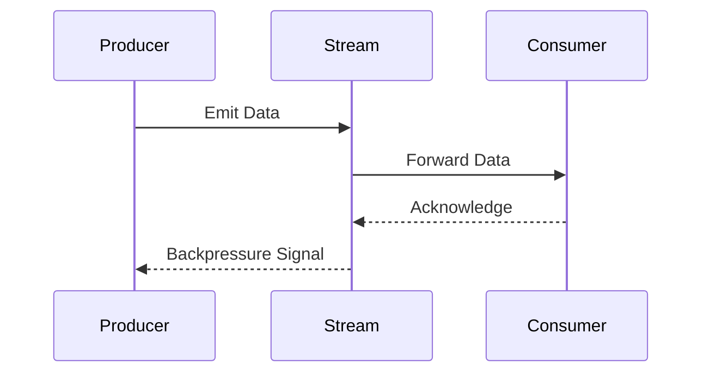

## 13.5.2 Asynchronous Data Streams

In the realm of modern software engineering, the ability to handle data efficiently and responsively is paramount. Asynchronous data streams form the backbone of reactive programming, allowing applications to process events as they occur without blocking threads. This approach significantly enhances scalability and resource utilization, making it a critical skill for expert Java developers.

### Understanding Asynchronous Data Streams

#### What Are Asynchronous Data Streams?

Asynchronous data streams are sequences of data that are produced and consumed independently of the main program flow. Unlike traditional synchronous processing, where operations are executed in a strict sequence, asynchronous streams allow for non-blocking operations, enabling applications to handle multiple tasks concurrently.

**Key Characteristics:**
- **Non-blocking:** Operations do not block the execution of other tasks, allowing for more efficient use of resources.
- **Event-driven:** Actions are triggered by events, such as data availability or user interactions.
- **Scalable:** Easily handle varying loads by processing data as it arrives.

#### Synchronous vs. Asynchronous Processing

In synchronous processing, tasks are executed one after another, with each task waiting for the previous one to complete. This can lead to inefficiencies, especially when tasks involve I/O operations or waiting for external resources.

**Example of Synchronous Processing:**

```java
public void processDataSynchronously() {
    String data = fetchDataFromDatabase(); // Blocking call
    String processedData = processData(data);
    saveDataToDisk(processedData); // Blocking call
}
```

In contrast, asynchronous processing allows tasks to run independently, improving responsiveness and throughput.

**Example of Asynchronous Processing:**

```java
public void processDataAsynchronously() {
    CompletableFuture.supplyAsync(this::fetchDataFromDatabase)
        .thenApplyAsync(this::processData)
        .thenAcceptAsync(this::saveDataToDisk);
}
```

### Non-blocking I/O and Event-driven Architectures

#### Non-blocking I/O

Non-blocking I/O is a key enabler of asynchronous data streams. It allows applications to initiate I/O operations and continue executing other tasks without waiting for the I/O to complete. Java's NIO (New I/O) package provides the foundation for non-blocking I/O operations.

**Example of Non-blocking I/O:**

```java
try (SocketChannel socketChannel = SocketChannel.open()) {
    socketChannel.configureBlocking(false);
    socketChannel.connect(new InetSocketAddress("example.com", 80));

    while (!socketChannel.finishConnect()) {
        // Do something else while connecting
    }

    ByteBuffer buffer = ByteBuffer.allocate(1024);
    socketChannel.read(buffer);
    // Process data in buffer
}
```

#### Event-driven Architectures

Event-driven architectures rely on events to trigger actions within the system. This approach decouples components, allowing them to react to changes or inputs asynchronously. Reactive frameworks like Project Reactor and RxJava leverage this architecture to provide powerful tools for handling asynchronous data streams.

**Example of Event-driven Architecture:**

```java
Flux<String> dataStream = Flux.just("data1", "data2", "data3")
    .map(data -> processData(data))
    .doOnNext(processedData -> saveData(processedData));

dataStream.subscribe();
```

### Creating and Consuming Asynchronous Streams

#### Creating Asynchronous Streams

Asynchronous streams can be created using reactive libraries such as Project Reactor or RxJava. These libraries provide abstractions like `Flux` and `Mono` (in Reactor) or `Observable` and `Single` (in RxJava) to represent streams of data.

**Example with Project Reactor:**

```java
Flux<String> dataStream = Flux.create(emitter -> {
    emitter.next("data1");
    emitter.next("data2");
    emitter.complete();
});
```

**Example with RxJava:**

```java
Observable<String> dataStream = Observable.create(emitter -> {
    emitter.onNext("data1");
    emitter.onNext("data2");
    emitter.onComplete();
});
```

#### Consuming Asynchronous Streams

Consuming asynchronous streams involves subscribing to the stream and defining actions to be taken when data is emitted, an error occurs, or the stream completes.

**Example with Project Reactor:**

```java
dataStream.subscribe(
    data -> System.out.println("Received: " + data),
    error -> System.err.println("Error: " + error),
    () -> System.out.println("Stream completed")
);
```

**Example with RxJava:**

```java
dataStream.subscribe(
    data -> System.out.println("Received: " + data),
    error -> System.err.println("Error: " + error),
    () -> System.out.println("Stream completed")
);
```

### The Importance of Backpressure

Backpressure is a mechanism to handle situations where the rate of data production exceeds the rate of consumption. Without backpressure, systems can become overwhelmed, leading to performance degradation or crashes.

#### Implementing Backpressure

Reactive libraries provide built-in support for backpressure, allowing consumers to signal their capacity to producers.

**Example with Project Reactor:**

```java
Flux.range(1, 100)
    .onBackpressureBuffer(10)
    .subscribe(data -> {
        // Process data
        Thread.sleep(100); // Simulate slow consumer
    });
```

**Example with RxJava:**

```java
Flowable.range(1, 100)
    .onBackpressureBuffer(10)
    .subscribe(data -> {
        // Process data
        Thread.sleep(100); // Simulate slow consumer
    });
```

### Combining Multiple Data Streams

Combining multiple data streams is a common requirement in reactive systems. This can be achieved using operators like `merge`, `zip`, or `combineLatest`.

**Example of Merging Streams:**

```java
Flux<String> stream1 = Flux.just("A", "B", "C");
Flux<String> stream2 = Flux.just("1", "2", "3");

Flux<String> mergedStream = Flux.merge(stream1, stream2);
mergedStream.subscribe(System.out::println);
```

**Example of Zipping Streams:**

```java
Flux<String> letters = Flux.just("A", "B", "C");
Flux<Integer> numbers = Flux.just(1, 2, 3);

Flux<String> zippedStream = Flux.zip(letters, numbers, (letter, number) -> letter + number);
zippedStream.subscribe(System.out::println);
```

### Handling Concurrency Safely

Concurrency in reactive systems is managed through schedulers, which control the execution context of streams. This allows for safe and efficient parallel processing.

**Example of Using Schedulers:**

```java
Flux.range(1, 10)
    .parallel()
    .runOn(Schedulers.parallel())
    .map(i -> i * 2)
    .sequential()
    .subscribe(System.out::println);
```

### Testing and Debugging Reactive Code

Testing and debugging reactive code can be challenging due to its asynchronous nature. However, with the right tools and techniques, it can be managed effectively.

#### Strategies for Testing

1. **Use Test Schedulers:** Simulate time and control the execution of reactive streams.
2. **Assert Stream Behavior:** Verify the sequence of emitted items, errors, and completion signals.
3. **Mock Dependencies:** Isolate the code under test by mocking external dependencies.

**Example of Testing with Test Schedulers:**

```java
@Test
public void testReactiveStream() {
    TestScheduler scheduler = Schedulers.test();
    Flux<String> stream = Flux.just("A", "B", "C").delayElements(Duration.ofMillis(100), scheduler);

    StepVerifier.withVirtualTime(() -> stream)
        .expectSubscription()
        .expectNoEvent(Duration.ofMillis(100))
        .expectNext("A", "B", "C")
        .verifyComplete();
}
```

#### Debugging Techniques

1. **Use Logging:** Add logging to track the flow of data through the stream.
2. **Visualize Streams:** Use tools like Reactor's `Debug` mode to visualize the stream's execution path.
3. **Handle Errors Gracefully:** Implement error handling strategies to capture and log exceptions.

**Example of Debugging with Logging:**

```java
Flux<String> stream = Flux.just("A", "B", "C")
    .log()
    .map(data -> {
        if ("B".equals(data)) throw new RuntimeException("Error processing B");
        return data;
    });

stream.subscribe(
    data -> System.out.println("Received: " + data),
    error -> System.err.println("Error: " + error),
    () -> System.out.println("Stream completed")
);
```

### Try It Yourself

To deepen your understanding of asynchronous data streams, try modifying the examples provided:

- **Experiment with Backpressure:** Change the buffer size and observe how it affects the stream's behavior.
- **Combine Streams Differently:** Use different operators like `combineLatest` or `concat` to see how they merge data.
- **Test with Different Schedulers:** Use various schedulers to control the execution context and observe the impact on concurrency.

### Visualizing Asynchronous Data Streams

To better understand the flow of data in asynchronous streams, let's visualize a simple reactive system using a sequence diagram.



**Diagram Explanation:** This sequence diagram illustrates the interaction between a producer, a stream, and a consumer. The producer emits data to the stream, which forwards it to the consumer. The consumer acknowledges receipt, and the stream signals backpressure to the producer if needed.

### Conclusion

Asynchronous data streams are a powerful tool for building responsive, scalable applications in Java. By leveraging non-blocking I/O, event-driven architectures, and reactive libraries, you can create systems that efficiently handle data flow and concurrency. Remember, mastering these concepts requires practice and experimentation. Keep exploring, stay curious, and enjoy the journey!

## Quiz Time!



### What is a key characteristic of asynchronous data streams?

- [x] Non-blocking operations
- [ ] Synchronous execution
- [ ] Sequential processing
- [ ] Single-threaded execution

> **Explanation:** Asynchronous data streams are characterized by non-blocking operations, allowing tasks to run concurrently without waiting for each other to complete.

### Which Java package provides the foundation for non-blocking I/O operations?

- [ ] java.io
- [x] java.nio
- [ ] java.util
- [ ] java.concurrent

> **Explanation:** The `java.nio` package provides the foundation for non-blocking I/O operations in Java.

### What is the purpose of backpressure in reactive systems?

- [ ] To increase data production rate
- [x] To manage data flow when production exceeds consumption
- [ ] To block data processing
- [ ] To synchronize data streams

> **Explanation:** Backpressure is used to manage data flow when the rate of data production exceeds the rate of consumption, preventing system overload.

### Which operator can be used to combine multiple data streams in Project Reactor?

- [ ] filter
- [ ] map
- [x] merge
- [ ] delay

> **Explanation:** The `merge` operator can be used to combine multiple data streams in Project Reactor.

### How can concurrency be safely managed in reactive systems?

- [ ] By using synchronized blocks
- [x] By using schedulers
- [ ] By using locks
- [ ] By using semaphores

> **Explanation:** Concurrency in reactive systems is managed through schedulers, which control the execution context of streams.

### What tool can be used to simulate time in reactive stream tests?

- [ ] StepVerifier
- [x] Test Scheduler
- [ ] Debugger
- [ ] Logger

> **Explanation:** A Test Scheduler can be used to simulate time and control the execution of reactive streams during testing.

### Which method in Project Reactor can be used to log the flow of data through a stream?

- [ ] debug()
- [x] log()
- [ ] trace()
- [ ] print()

> **Explanation:** The `log()` method in Project Reactor can be used to log the flow of data through a stream.

### What is a common strategy for handling errors in reactive streams?

- [ ] Ignoring errors
- [ ] Retrying indefinitely
- [x] Implementing error handling strategies
- [ ] Stopping the stream

> **Explanation:** Implementing error handling strategies is a common approach to managing exceptions in reactive streams.

### Which reactive library provides the `Flux` and `Mono` abstractions?

- [ ] RxJava
- [x] Project Reactor
- [ ] Java Streams
- [ ] JavaFX

> **Explanation:** Project Reactor provides the `Flux` and `Mono` abstractions for handling asynchronous data streams.

### True or False: Asynchronous data streams improve resource utilization by blocking threads.

- [ ] True
- [x] False

> **Explanation:** Asynchronous data streams improve resource utilization by allowing non-blocking operations, enabling tasks to run concurrently without blocking threads.


