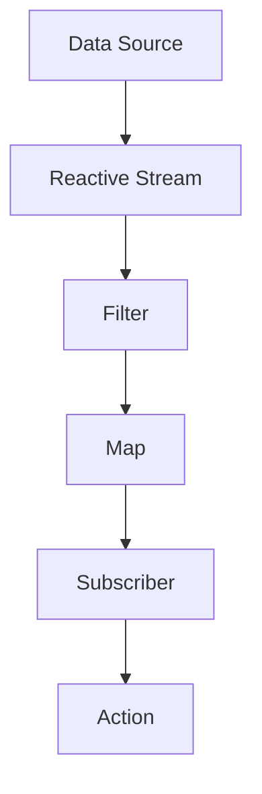

## 13.5.3 Use Cases and Examples

Reactive programming has become a cornerstone in modern software development, offering a paradigm shift in how we handle asynchronous data streams and events. In this section, we will delve into practical examples where reactive programming is particularly advantageous, such as real-time analytics, web applications, and microservices communication. We will provide code snippets to illustrate these concepts and discuss the benefits and challenges associated with adopting reactive approaches.

### Real-Time Analytics

Real-time analytics involves processing data as it arrives, enabling immediate insights and actions. This is crucial in scenarios like monitoring sensor data, tracking user interactions, or analyzing financial market trends.

#### Example: Sensor Data Processing

Imagine a network of IoT sensors deployed in a smart city, continuously sending data about traffic conditions, air quality, and energy consumption. A reactive system can process this data in real-time, providing valuable insights for decision-making.

```java
import reactor.core.publisher.Flux;

public class SensorDataProcessor {

    public static void main(String[] args) {
        Flux<String> sensorDataStream = Flux.just("Temperature: 22°C", "Humidity: 45%", "CO2: 400ppm")
                .repeat();

        sensorDataStream
                .filter(data -> data.contains("Temperature"))
                .map(data -> data.replace("Temperature: ", ""))
                .map(Double::parseDouble)
                .filter(temp -> temp > 25)
                .subscribe(temp -> System.out.println("High temperature alert: " + temp + "°C"));
    }
}
```

**Explanation:**

- **Flux**: Represents a reactive stream of data, which can be infinite.
- **Filter and Map Operations**: Used to process and transform the data stream.
- **Subscribe**: Consumes the processed data, triggering actions like alerts.

**Benefits:**

- **Scalability**: Can handle large volumes of data efficiently.
- **Responsiveness**: Provides immediate feedback and alerts.

**Challenges and Mitigation:**

- **Learning Curve**: Understanding reactive paradigms can be challenging. Mitigate by starting with simple examples and gradually increasing complexity.
- **Complexity**: Managing backpressure and error handling requires careful design. Use libraries like Project Reactor to simplify these tasks.

### Web Applications

Reactive programming enhances web applications by enabling responsive UIs that react to user inputs and server-side events. This is particularly useful in applications requiring real-time updates, such as collaborative tools or live dashboards.

#### Example: Reactive Chat Application

Consider a chat application where messages are instantly delivered to all participants without refreshing the page.

```java
import org.springframework.web.reactive.function.server.ServerResponse;
import reactor.core.publisher.Flux;
import reactor.core.publisher.Sinks;

public class ChatService {

    private final Sinks.Many<String> chatSink = Sinks.many().multicast().onBackpressureBuffer();

    public void sendMessage(String message) {
        chatSink.tryEmitNext(message);
    }

    public Flux<String> receiveMessages() {
        return chatSink.asFlux();
    }

    public static void main(String[] args) {
        ChatService chatService = new ChatService();

        chatService.receiveMessages().subscribe(System.out::println);

        chatService.sendMessage("Hello, World!");
        chatService.sendMessage("Reactive programming is powerful!");
    }
}
```

**Explanation:**

- **Sinks**: Used to emit messages into the reactive stream.
- **Flux**: Represents the stream of chat messages.
- **Subscribe**: Listens for new messages and displays them in real-time.

**Benefits:**

- **Responsiveness**: Users experience immediate updates without page reloads.
- **Scalability**: Efficiently handles multiple concurrent users.

**Challenges and Mitigation:**

- **Concurrency**: Managing concurrent updates can be complex. Use reactive libraries to handle concurrency gracefully.
- **State Management**: Ensure consistent state across clients. Consider using state management libraries or frameworks.

### Microservices Communication

In microservices architectures, reactive programming facilitates inter-service communication with backpressure support, ensuring that services can handle varying loads without overwhelming each other.

#### Example: Reactive Microservices with Backpressure

Suppose we have a microservice architecture where a data processing service consumes data from a producer service. Reactive streams can manage the flow of data between these services.

```java
import reactor.core.publisher.Flux;
import reactor.core.publisher.Mono;

public class DataProcessingService {

    public Mono<Void> processData(Flux<String> dataStream) {
        return dataStream
                .onBackpressureBuffer()
                .flatMap(this::processDataItem)
                .then();
    }

    private Mono<Void> processDataItem(String data) {
        return Mono.fromRunnable(() -> System.out.println("Processing: " + data));
    }

    public static void main(String[] args) {
        DataProcessingService service = new DataProcessingService();
        Flux<String> dataStream = Flux.just("Data1", "Data2", "Data3").repeat();

        service.processData(dataStream).subscribe();
    }
}
```

**Explanation:**

- **Flux and Mono**: Used to represent streams and single data items, respectively.
- **Backpressure**: Managed using `onBackpressureBuffer` to prevent overwhelming the consumer.
- **FlatMap**: Processes each data item asynchronously.

**Benefits:**

- **Scalability**: Handles varying loads without service degradation.
- **Resilience**: Prevents service crashes due to overload.

**Challenges and Mitigation:**

- **Complexity**: Designing backpressure strategies can be complex. Use built-in mechanisms provided by reactive libraries.
- **Debugging**: Reactive systems can be harder to debug. Use logging and monitoring tools to gain insights into system behavior.

### Visualizing Reactive Systems

To better understand the flow of data in reactive systems, let's visualize a simple reactive pipeline using Mermaid.js.



**Description:**

- **Data Source**: Represents the origin of data, such as sensors or user inputs.
- **Reactive Stream**: The flow of data through the system.
- **Filter, Map, Subscriber, Action**: Stages in the reactive pipeline, each transforming or consuming the data.

### Try It Yourself

Experiment with the provided code examples by:

- Modifying the data sources to simulate different types of input.
- Adding additional processing stages, such as error handling or data enrichment.
- Implementing your own reactive components, such as custom subscribers or operators.

### References and Further Reading

- [Project Reactor Documentation](https://projectreactor.io/docs/core/release/reference/)
- [Spring WebFlux Guide](https://docs.spring.io/spring-framework/docs/current/reference/html/web-reactive.html)
- [Reactive Streams Specification](https://www.reactive-streams.org/)

### Knowledge Check

- What are the key benefits of using reactive programming in real-time analytics?
- How does reactive programming enhance web application responsiveness?
- What role does backpressure play in microservices communication?

### Embrace the Journey

Remember, adopting reactive programming is a journey. Start small, experiment with different patterns, and gradually build more complex systems. Stay curious, keep learning, and enjoy the process of creating responsive, scalable applications.

## Quiz Time!



### What is a primary benefit of using reactive programming in real-time analytics?

- [x] Scalability and immediate feedback
- [ ] Simplified code structure
- [ ] Reduced memory usage
- [ ] Easier debugging

> **Explanation:** Reactive programming allows systems to handle large volumes of data efficiently and provide immediate feedback, which is crucial for real-time analytics.

### In a reactive chat application, what does the `Sinks` class represent?

- [x] A mechanism to emit messages into the reactive stream
- [ ] A way to store chat history
- [ ] A method to filter messages
- [ ] A tool for managing user sessions

> **Explanation:** The `Sinks` class is used to emit messages into the reactive stream, allowing them to be processed and delivered in real-time.

### How does backpressure benefit microservices communication?

- [x] It prevents overwhelming the consumer service
- [ ] It speeds up data processing
- [ ] It simplifies service deployment
- [ ] It reduces network latency

> **Explanation:** Backpressure ensures that the consumer service is not overwhelmed by the data flow, maintaining system stability and performance.

### What is a challenge associated with reactive programming?

- [x] Complexity in managing concurrency and backpressure
- [ ] Lack of library support
- [ ] Incompatibility with modern architectures
- [ ] High memory consumption

> **Explanation:** Reactive programming introduces complexity in managing concurrency and backpressure, requiring careful design and use of appropriate libraries.

### Which of the following is a reactive programming library in Java?

- [x] Project Reactor
- [ ] JUnit
- [x] RxJava
- [ ] Log4j

> **Explanation:** Project Reactor and RxJava are popular libraries for implementing reactive programming in Java.

### What does the `Flux` class represent in reactive programming?

- [x] A stream of data that can be infinite
- [ ] A single data item
- [ ] A blocking collection
- [ ] A synchronous data processor

> **Explanation:** The `Flux` class represents a reactive stream of data, which can be finite or infinite, allowing for asynchronous processing.

### In the context of reactive programming, what is a `Subscriber`?

- [x] An entity that consumes data from a reactive stream
- [ ] A data source
- [x] A component that processes data
- [ ] A tool for managing backpressure

> **Explanation:** A `Subscriber` is an entity that consumes data from a reactive stream, processing it as it arrives.

### What is a common use case for reactive programming in web applications?

- [x] Building responsive UIs with real-time updates
- [ ] Simplifying database access
- [ ] Enhancing security features
- [ ] Reducing server load

> **Explanation:** Reactive programming is commonly used to build responsive UIs that provide real-time updates to users without page reloads.

### How can the learning curve of reactive programming be mitigated?

- [x] Starting with simple examples and gradually increasing complexity
- [ ] Avoiding the use of libraries
- [ ] Focusing solely on theoretical concepts
- [ ] Using traditional synchronous programming techniques

> **Explanation:** To mitigate the learning curve, it's beneficial to start with simple examples and gradually increase complexity, leveraging libraries and tools to simplify implementation.

### Reactive programming is particularly useful in scenarios with high concurrency and data flow. 

- [x] True
- [ ] False

> **Explanation:** Reactive programming excels in scenarios with high concurrency and data flow, providing efficient and responsive data processing capabilities.


