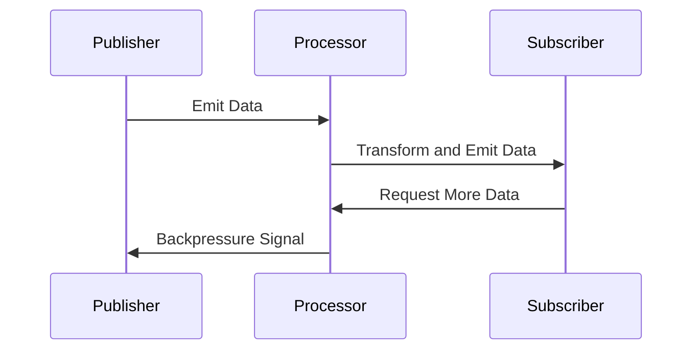

## 13.5 Reactive Programming Patterns

In today's fast-paced digital world, applications need to be more responsive, resilient, and scalable than ever before. Reactive programming is a paradigm that addresses these needs by handling asynchronous data streams and events in a non-blocking manner. This section delves into the core principles of reactive programming, its advantages over traditional synchronous programming, and its application in building high-performance and real-time systems.

### Understanding Reactive Programming

Reactive programming is a programming paradigm oriented around data flows and the propagation of change. It enables developers to build systems that are responsive, resilient, elastic, and message-driven. Let's break down these principles:

- **Responsiveness**: Systems should respond in a timely manner, ensuring a positive user experience. Reactive systems aim to provide consistent response times, even under varying load conditions.

- **Resilience**: Reactive systems remain responsive in the face of failure. This is achieved through replication, containment, isolation, and delegation. Failures are contained within each component, isolating them and ensuring that parts of the system can fail without affecting the whole.

- **Elasticity**: Reactive systems can scale up or down as needed to accommodate changes in the workload. This is achieved by distributing tasks across multiple nodes or threads, allowing the system to handle varying loads efficiently.

- **Message-Driven**: Reactive systems rely on asynchronous message-passing to establish a boundary between components, ensuring loose coupling and isolation. This allows for more flexible and maintainable systems.

### Reactive Programming vs. Traditional Synchronous Programming

Traditional synchronous programming often leads to blocking operations, where a thread waits for a task to complete before proceeding. This can result in inefficient resource utilization and poor scalability, especially in distributed applications. Reactive programming addresses these limitations by:

- **Non-Blocking Operations**: Reactive programming uses non-blocking operations, allowing threads to perform other tasks while waiting for a response. This improves resource utilization and system throughput.

- **Asynchronous Data Streams**: Reactive programming handles data as streams, allowing for real-time processing and transformation. This is particularly useful in applications that require continuous data processing, such as real-time analytics and monitoring systems.

- **Backpressure Handling**: Reactive systems manage data flow using backpressure, which ensures that producers do not overwhelm consumers with data. This is crucial in maintaining system stability and preventing resource exhaustion.

### Reactive Streams and Backpressure

Reactive Streams is a standard for asynchronous stream processing with non-blocking backpressure. It provides a set of interfaces and methods to handle data flow control, ensuring that systems remain responsive under varying load conditions.

#### Key Components of Reactive Streams

- **Publisher**: The source of data, which emits items to subscribers. It is responsible for respecting backpressure signals from subscribers.

- **Subscriber**: The consumer of data, which processes items emitted by the publisher. It can request a specific number of items from the publisher, allowing for controlled data flow.

- **Subscription**: Represents the relationship between a publisher and a subscriber. It allows the subscriber to request data and cancel the subscription if needed.

- **Processor**: A component that acts as both a subscriber and a publisher, transforming data as it flows through the stream.

#### Implementing Reactive Streams in Java

Java provides several libraries for implementing reactive streams, such as Project Reactor and RxJava. These libraries offer a rich set of operators for composing asynchronous and event-driven programs using observable sequences.

Here's a simple example using Project Reactor:

```java
import reactor.core.publisher.Flux;

public class ReactiveExample {
    public static void main(String[] args) {
        Flux<Integer> numbers = Flux.range(1, 10)
            .map(i -> i * 2)
            .filter(i -> i % 3 == 0);

        numbers.subscribe(
            System.out::println,
            error -> System.err.println("Error: " + error),
            () -> System.out.println("Completed")
        );
    }
}
```

In this example, we create a `Flux` that emits a range of numbers, transforms them by doubling, filters them to retain only multiples of three, and subscribes to the resulting stream to print each number.

### Relevance of Reactive Programming in High-Performance and Real-Time Applications

Reactive programming is particularly relevant in high-performance and real-time applications due to its ability to handle large volumes of data efficiently. Some common use cases include:

- **Real-Time Data Processing**: Reactive systems can process data as it arrives, making them ideal for applications like financial trading platforms and real-time analytics.

- **IoT Applications**: Internet of Things (IoT) applications often involve processing data from numerous sensors and devices. Reactive programming allows for efficient handling of these data streams.

- **Microservices Architecture**: Reactive programming supports the development of microservices by enabling asynchronous communication between services, improving scalability and fault tolerance.

- **User Interfaces**: Reactive programming can be used to build responsive user interfaces that update in real-time based on user interactions or external data changes.

### Visualizing Reactive Programming Concepts

To better understand the flow of data in reactive programming, let's visualize the interaction between publishers, subscribers, and processors using a sequence diagram.



This diagram illustrates how data flows from the publisher to the processor, which transforms the data and emits it to the subscriber. The subscriber can request more data, and the processor communicates backpressure signals to the publisher to control the data flow.

### Try It Yourself

To deepen your understanding of reactive programming, try modifying the code example provided earlier. Experiment with different operators, such as `flatMap`, `reduce`, or `buffer`, and observe how they affect the data flow and processing.

### Knowledge Check

- **Question**: What are the four core principles of reactive programming?
- **Exercise**: Implement a reactive stream that processes a list of strings, converts them to uppercase, and filters out those that do not start with the letter 'A'.

### Conclusion

Reactive programming offers a powerful paradigm for building responsive, resilient, and scalable applications. By leveraging asynchronous data streams and non-blocking operations, developers can create systems that handle high loads and real-time data processing efficiently. As you continue to explore reactive programming, remember to experiment with different patterns and libraries to find the best fit for your application's needs.

## Quiz Time!



### What is one of the core principles of reactive programming?

- [x] Responsiveness
- [ ] Synchronous execution
- [ ] Blocking operations
- [ ] Monolithic architecture

> **Explanation:** Responsiveness is a core principle of reactive programming, ensuring systems respond in a timely manner.

### How does reactive programming handle data flow control?

- [x] Using backpressure
- [ ] By blocking threads
- [ ] Through synchronous processing
- [ ] By using monolithic designs

> **Explanation:** Reactive programming uses backpressure to manage data flow control, preventing producers from overwhelming consumers.

### What is the role of a Publisher in reactive streams?

- [x] It emits data to subscribers
- [ ] It processes data from subscribers
- [ ] It requests data from subscribers
- [ ] It cancels subscriptions

> **Explanation:** A Publisher is responsible for emitting data to subscribers in reactive streams.

### Which Java library is commonly used for reactive programming?

- [x] Project Reactor
- [ ] JavaFX
- [ ] Swing
- [ ] AWT

> **Explanation:** Project Reactor is a popular Java library for implementing reactive programming.

### What is the purpose of a Processor in reactive streams?

- [x] To transform data as it flows through the stream
- [ ] To cancel subscriptions
- [ ] To emit data to subscribers
- [ ] To request data from publishers

> **Explanation:** A Processor acts as both a subscriber and a publisher, transforming data as it flows through the stream.

### Which of the following is a benefit of reactive programming?

- [x] Improved scalability
- [ ] Increased blocking operations
- [ ] Synchronous data processing
- [ ] Monolithic architecture

> **Explanation:** Reactive programming improves scalability by handling asynchronous data streams efficiently.

### What is backpressure in reactive programming?

- [x] A mechanism to control data flow
- [ ] A method for synchronous processing
- [ ] A way to block threads
- [ ] A type of monolithic architecture

> **Explanation:** Backpressure is a mechanism in reactive programming to control data flow and prevent resource exhaustion.

### How does reactive programming differ from traditional synchronous programming?

- [x] It uses non-blocking operations
- [ ] It relies on blocking threads
- [ ] It processes data synchronously
- [ ] It uses monolithic designs

> **Explanation:** Reactive programming uses non-blocking operations, unlike traditional synchronous programming.

### What is a common use case for reactive programming?

- [x] Real-time data processing
- [ ] Monolithic applications
- [ ] Synchronous data handling
- [ ] Blocking operations

> **Explanation:** Reactive programming is commonly used for real-time data processing due to its ability to handle asynchronous data streams.

### Reactive programming is particularly useful in which type of applications?

- [x] High-performance and real-time applications
- [ ] Monolithic desktop applications
- [ ] Single-threaded applications
- [ ] Synchronous batch processing

> **Explanation:** Reactive programming is particularly useful in high-performance and real-time applications due to its non-blocking nature.


