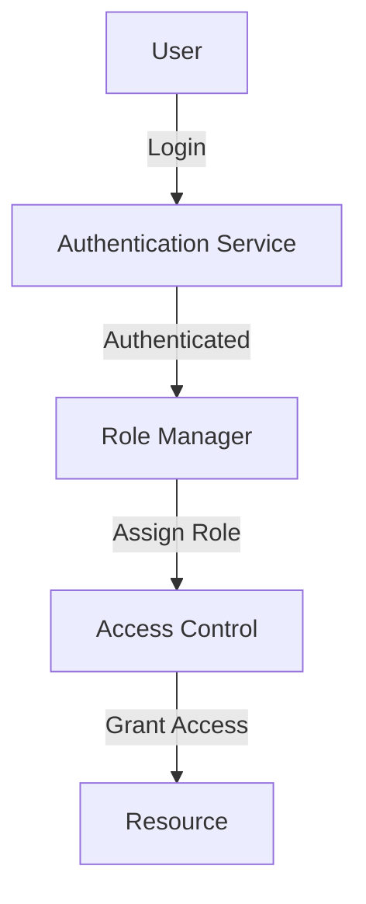

## 13.6.1 Authorization and Authentication Patterns

In the realm of software engineering, particularly when developing enterprise-level applications, ensuring secure access control is paramount. This involves two critical processes: **authentication** and **authorization**. While often used interchangeably, these terms refer to distinct concepts. Authentication is the process of verifying who a user is, while authorization determines what a user can do. In this section, we will explore various design patterns that aid in implementing these processes effectively in Java applications.

### Understanding Authentication and Authorization

Before diving into the patterns, let's clarify the difference between authentication and authorization:

- **Authentication**: This is the process of verifying the identity of a user. It answers the question, "Who are you?" Common methods include passwords, biometrics, and two-factor authentication.

- **Authorization**: Once authenticated, authorization determines what resources the user can access and what actions they can perform. It answers the question, "What are you allowed to do?"

### Patterns for Secure Access Control

To implement secure access controls, we can leverage several design patterns. Here, we'll discuss the **Secure Factory Pattern**, **Role-Based Access Control (RBAC)**, and **Single Sign-On (SSO)**.

#### Secure Factory Pattern

The Secure Factory Pattern ensures that only authenticated users can create certain objects. This pattern is particularly useful when object creation should be restricted based on user identity or credentials.

**Implementation in Java:**

Let's consider a scenario where we have a `Document` class that should only be created by authenticated users.

```java
// Step 1: Define the Document class
public class Document {
    private String content;

    public Document(String content) {
        this.content = content;
    }

    public String getContent() {
        return content;
    }
}

// Step 2: Create an interface for authentication
public interface Authenticator {
    boolean authenticate(String username, String password);
}

// Step 3: Implement the SecureDocumentFactory
public class SecureDocumentFactory {
    private Authenticator authenticator;

    public SecureDocumentFactory(Authenticator authenticator) {
        this.authenticator = authenticator;
    }

    public Document createDocument(String username, String password, String content) {
        if (authenticator.authenticate(username, password)) {
            return new Document(content);
        } else {
            throw new SecurityException("User not authenticated");
        }
    }
}

// Step 4: Implement a simple authenticator
public class SimpleAuthenticator implements Authenticator {
    @Override
    public boolean authenticate(String username, String password) {
        // In a real application, this would check against a database or external service
        return "admin".equals(username) && "password".equals(password);
    }
}

// Step 5: Demonstrate usage
public class Main {
    public static void main(String[] args) {
        Authenticator authenticator = new SimpleAuthenticator();
        SecureDocumentFactory factory = new SecureDocumentFactory(authenticator);

        try {
            Document doc = factory.createDocument("admin", "password", "This is a secure document.");
            System.out.println("Document created with content: " + doc.getContent());
        } catch (SecurityException e) {
            System.out.println("Failed to create document: " + e.getMessage());
        }
    }
}
```

**Key Points:**

- The `SecureDocumentFactory` uses an `Authenticator` to verify user credentials before creating a `Document`.
- This pattern encapsulates the authentication logic, making it reusable and easy to maintain.

#### Role-Based Access Control (RBAC)

RBAC is a widely used pattern for managing permissions based on user roles. Instead of assigning permissions to individual users, roles are created, and permissions are assigned to these roles. Users are then assigned roles, simplifying permission management.

**Implementation in Java:**

Consider an application where users can have roles like `Admin`, `Editor`, and `Viewer`.

```java
import java.util.HashMap;
import java.util.HashSet;
import java.util.Map;
import java.util.Set;

// Step 1: Define roles and permissions
enum Role {
    ADMIN, EDITOR, VIEWER
}

enum Permission {
    READ, WRITE, DELETE
}

// Step 2: Create a RoleManager to manage roles and permissions
public class RoleManager {
    private Map<Role, Set<Permission>> rolePermissions = new HashMap<>();

    public RoleManager() {
        // Initialize roles with permissions
        rolePermissions.put(Role.ADMIN, Set.of(Permission.READ, Permission.WRITE, Permission.DELETE));
        rolePermissions.put(Role.EDITOR, Set.of(Permission.READ, Permission.WRITE));
        rolePermissions.put(Role.VIEWER, Set.of(Permission.READ));
    }

    public boolean hasPermission(Role role, Permission permission) {
        return rolePermissions.getOrDefault(role, new HashSet<>()).contains(permission);
    }
}

// Step 3: Demonstrate usage
public class Main {
    public static void main(String[] args) {
        RoleManager roleManager = new RoleManager();

        Role userRole = Role.EDITOR;

        System.out.println("User has READ permission: " + roleManager.hasPermission(userRole, Permission.READ));
        System.out.println("User has DELETE permission: " + roleManager.hasPermission(userRole, Permission.DELETE));
    }
}
```

**Key Points:**

- RBAC simplifies permission management by associating permissions with roles rather than individual users.
- The `RoleManager` class manages the mapping between roles and permissions.

#### Single Sign-On (SSO)

SSO allows users to log in once to access multiple applications. This pattern enhances user experience by reducing the need to remember multiple credentials and improves security by centralizing authentication.

**Implementation in Java:**

Implementing SSO typically involves integrating with an identity provider (IdP) like OAuth2, OpenID Connect, or SAML. Here, we'll outline a simplified example using OAuth2.

```java
// Step 1: Define a User class
public class User {
    private String username;
    private String token;

    public User(String username, String token) {
        this.username = username;
        this.token = token;
    }

    public String getUsername() {
        return username;
    }

    public String getToken() {
        return token;
    }
}

// Step 2: Create an OAuthService to handle authentication
public class OAuthService {
    public User authenticate(String authCode) {
        // In a real application, this would involve exchanging the auth code for an access token
        // Here, we simulate this process
        String token = "access_token_" + authCode;
        return new User("user@example.com", token);
    }
}

// Step 3: Demonstrate usage
public class Main {
    public static void main(String[] args) {
        OAuthService oauthService = new OAuthService();

        // Simulate obtaining an auth code from an IdP
        String authCode = "123456";

        User user = oauthService.authenticate(authCode);
        System.out.println("User authenticated: " + user.getUsername());
        System.out.println("Access token: " + user.getToken());
    }
}
```

**Key Points:**

- SSO reduces the number of credentials users need to manage.
- The `OAuthService` simulates the process of exchanging an authorization code for an access token.

### Best Practices for Secure Access Control

Implementing secure access control involves more than just choosing the right patterns. Here are some best practices to consider:

1. **Securely Handle User Credentials**: 
   - Never store passwords in plain text. Use strong hashing algorithms like bcrypt or Argon2.
   - Implement multi-factor authentication (MFA) for an added layer of security.

2. **Session Management**:
   - Use secure, HTTP-only cookies for session tokens.
   - Implement session timeouts and automatic logout for inactive sessions.
   - Regularly rotate session tokens to minimize risk.

3. **Avoid Hardcoding Credentials**:
   - Store sensitive information like API keys and database credentials in environment variables or secure vaults.
   - Use configuration management tools to manage secrets securely.

4. **Implement Least Privilege**:
   - Grant users the minimum permissions necessary to perform their tasks.
   - Regularly review and update permissions as roles and responsibilities change.

5. **Monitor and Audit Access**:
   - Log authentication and authorization events for audit purposes.
   - Implement anomaly detection to identify suspicious access patterns.

### Common Pitfalls to Avoid

When implementing authentication and authorization, be mindful of these common pitfalls:

- **Improper Session Handling**: Failing to secure session tokens can lead to session hijacking. Always use secure cookies and implement token rotation.
- **Inadequate Password Policies**: Weak password policies can lead to compromised accounts. Enforce strong password requirements and regular password changes.
- **Ignoring Security Updates**: Regularly update libraries and frameworks to patch known vulnerabilities.
- **Overlooking User Experience**: While security is crucial, ensure that authentication and authorization processes do not hinder user experience. Strive for a balance between security and usability.

### Visualizing Access Control Patterns

To better understand the flow of these patterns, let's visualize the interaction between components in a typical RBAC implementation.



**Diagram Description**: This diagram illustrates the flow of a user logging in, being authenticated by the authentication service, having a role assigned by the role manager, and finally being granted access to a resource based on their role.

### Try It Yourself

Experiment with the provided code examples by:

- Modifying the `SimpleAuthenticator` to integrate with a real authentication service.
- Extending the `RoleManager` to support dynamic role and permission management.
- Implementing a full-fledged OAuth2 flow for the SSO example.

### Knowledge Check

- What is the primary difference between authentication and authorization?
- How does the Secure Factory Pattern enhance security in object creation?
- What are the benefits of using RBAC over individual user permissions?
- Why is session management critical in secure access control?
- What are some common pitfalls to avoid in authentication and authorization?

### Embrace the Journey

Remember, implementing secure access control is an ongoing process. As threats evolve, so must your security measures. Keep learning, stay vigilant, and enjoy the journey of building secure applications!

## Quiz Time!



### What is the primary purpose of authentication?

- [x] Verifying the identity of a user
- [ ] Granting access to resources
- [ ] Managing user roles
- [ ] Logging user activities

> **Explanation:** Authentication is the process of verifying who a user is.

### What does the Secure Factory Pattern ensure?

- [x] Only authenticated users can create certain objects
- [ ] All users have access to all objects
- [ ] Objects are created without any authentication
- [ ] Objects are created with default settings

> **Explanation:** The Secure Factory Pattern restricts object creation to authenticated users.

### In RBAC, what are permissions associated with?

- [x] Roles
- [ ] Individual users
- [ ] Resources
- [ ] Sessions

> **Explanation:** In RBAC, permissions are associated with roles, not individual users.

### What is a key benefit of Single Sign-On (SSO)?

- [x] Users log in once to access multiple applications
- [ ] Users have to remember multiple passwords
- [ ] Users need to authenticate for each application
- [ ] Users are automatically logged out after each session

> **Explanation:** SSO allows users to log in once and access multiple applications.

### Which of the following is a best practice for handling user credentials?

- [x] Use strong hashing algorithms
- [ ] Store passwords in plain text
- [ ] Hardcode credentials in the application
- [ ] Share credentials across users

> **Explanation:** Using strong hashing algorithms is a best practice for handling user credentials securely.

### What is a common pitfall in session management?

- [x] Failing to secure session tokens
- [ ] Using secure cookies
- [ ] Implementing session timeouts
- [ ] Regularly rotating session tokens

> **Explanation:** Failing to secure session tokens can lead to session hijacking.

### What is the least privilege principle?

- [x] Granting users the minimum permissions necessary
- [ ] Granting all users full access
- [ ] Denying all permissions by default
- [ ] Allowing users to choose their permissions

> **Explanation:** The least privilege principle involves granting users only the permissions they need.

### Why is monitoring and auditing access important?

- [x] To identify suspicious access patterns
- [ ] To grant additional permissions
- [ ] To simplify user experience
- [ ] To reduce authentication steps

> **Explanation:** Monitoring and auditing help identify suspicious access patterns and enhance security.

### What is a key consideration when implementing SSO?

- [x] Integrating with an identity provider
- [ ] Hardcoding user credentials
- [ ] Using multiple authentication methods
- [ ] Avoiding token-based authentication

> **Explanation:** Integrating with an identity provider is crucial for implementing SSO.

### True or False: Authorization determines what a user can do after they are authenticated.

- [x] True
- [ ] False

> **Explanation:** Authorization determines the actions a user can perform after being authenticated.


