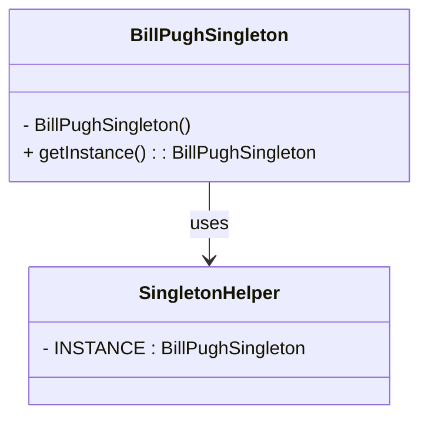

## 13.6.2 Secure Singleton Implementations

In the realm of software design patterns, the Singleton pattern stands out for its simplicity and utility. However, traditional Singleton implementations can introduce security vulnerabilities, such as unauthorized access or instance compromise. In this section, we will delve into the potential security issues associated with Singleton patterns and explore robust strategies to secure them effectively.

### Understanding the Singleton Pattern

The Singleton pattern ensures that a class has only one instance and provides a global point of access to it. This is particularly useful in scenarios where a single instance of a class is needed to coordinate actions across a system, such as a configuration manager or a connection pool.

#### Basic Singleton Implementation

Let's begin with a basic implementation of the Singleton pattern in Java:

```java
public class BasicSingleton {
    private static BasicSingleton instance;

    private BasicSingleton() {
        // Private constructor to prevent instantiation
    }

    public static BasicSingleton getInstance() {
        if (instance == null) {
            instance = new BasicSingleton();
        }
        return instance;
    }
}
```

In this implementation, the constructor is private, ensuring that the class cannot be instantiated from outside. The `getInstance` method provides a way to access the single instance of the class.

### Potential Security Issues with Singleton

While the basic Singleton implementation is straightforward, it is susceptible to several security vulnerabilities:

1. **Reflection Attacks**: Reflection can be used to access private constructors, potentially creating multiple instances of the Singleton class.
2. **Serialization Attacks**: Serialization and deserialization can lead to the creation of multiple instances.
3. **Thread Safety**: In a multithreaded environment, the basic implementation is not thread-safe, which can lead to multiple instances being created.

### Securing Singleton Implementations

To mitigate these vulnerabilities, we can employ several strategies:

#### 1. Using Enums for Singleton

Java enums provide a robust solution for implementing Singletons. Enums inherently prevent multiple instantiation and are immune to reflection and serialization attacks.

```java
public enum EnumSingleton {
    INSTANCE;

    public void someMethod() {
        // Method implementation
    }
}
```

**Advantages of Enum Singleton**:
- **Serialization Safety**: Java ensures that enum constants are serialized correctly.
- **Reflection Safety**: Enums cannot be instantiated via reflection.
- **Thread Safety**: Enum singletons are inherently thread-safe.

#### 2. Preventing Reflection Attacks

To prevent reflection attacks, we can modify the constructor to throw an exception if an instance already exists.

```java
public class SecureSingleton {
    private static SecureSingleton instance;
    private static boolean instanceCreated = false;

    private SecureSingleton() {
        if (instanceCreated) {
            throw new RuntimeException("Use getInstance() method to create");
        }
        instanceCreated = true;
    }

    public static SecureSingleton getInstance() {
        if (instance == null) {
            instance = new SecureSingleton();
        }
        return instance;
    }
}
```

#### 3. Serialization and Deserialization

To prevent multiple instances during deserialization, implement the `readResolve` method.

```java
public class SerializableSingleton implements java.io.Serializable {
    private static final long serialVersionUID = 1L;
    private static SerializableSingleton instance;

    private SerializableSingleton() {}

    public static SerializableSingleton getInstance() {
        if (instance == null) {
            instance = new SerializableSingleton();
        }
        return instance;
    }

    // Ensure that the singleton property is maintained during deserialization
    protected Object readResolve() {
        return getInstance();
    }
}
```

### Thread-Safe Singleton Implementations

In multithreaded environments, ensuring that only one instance is created is crucial. Here are some strategies to achieve thread safety:

#### 1. Synchronized Method

Using a synchronized method ensures that only one thread can access the method at a time.

```java
public class ThreadSafeSingleton {
    private static ThreadSafeSingleton instance;

    private ThreadSafeSingleton() {}

    public static synchronized ThreadSafeSingleton getInstance() {
        if (instance == null) {
            instance = new ThreadSafeSingleton();
        }
        return instance;
    }
}
```

#### 2. Double-Checked Locking

Double-checked locking reduces the overhead of acquiring a lock by first checking the instance without synchronization.

```java
public class DoubleCheckedLockingSingleton {
    private static volatile DoubleCheckedLockingSingleton instance;

    private DoubleCheckedLockingSingleton() {}

    public static DoubleCheckedLockingSingleton getInstance() {
        if (instance == null) {
            synchronized (DoubleCheckedLockingSingleton.class) {
                if (instance == null) {
                    instance = new DoubleCheckedLockingSingleton();
                }
            }
        }
        return instance;
    }
}
```

**Key Points**:
- **Volatile Keyword**: Ensures visibility of changes to variables across threads.
- **Performance**: Reduces synchronization overhead.

#### 3. Bill Pugh Singleton Design

This approach uses a static inner class to hold the Singleton instance, ensuring lazy initialization and thread safety.

```java
public class BillPughSingleton {
    private BillPughSingleton() {}

    private static class SingletonHelper {
        private static final BillPughSingleton INSTANCE = new BillPughSingleton();
    }

    public static BillPughSingleton getInstance() {
        return SingletonHelper.INSTANCE;
    }
}
```

**Advantages**:
- **Lazy Initialization**: The instance is created only when needed.
- **Thread Safety**: The class loader mechanism ensures that the instance is created in a thread-safe manner.

### Try It Yourself

To deepen your understanding, try modifying the code examples:

- Implement a Singleton using an enum and add methods to demonstrate its usage.
- Experiment with the `readResolve` method by serializing and deserializing a Singleton instance.
- Test the thread-safe Singleton implementations by simulating concurrent access.

### Visualizing Singleton Security

Here is a diagram illustrating the secure Singleton implementation using the Bill Pugh method:



### Knowledge Check

- **What are the potential vulnerabilities of a basic Singleton implementation?**
- **How does using an enum provide a secure Singleton implementation?**
- **What role does the `readResolve` method play in serialization?**
- **Explain the concept of double-checked locking in Singleton implementations.**

### Conclusion

Securing Singleton implementations is essential to prevent unauthorized access and ensure thread safety. By employing strategies such as using enums, preventing reflection attacks, and implementing thread-safe techniques, we can create robust and secure Singleton patterns. Remember, this is just the beginning. As you progress, you'll build more complex and secure applications. Keep experimenting, stay curious, and enjoy the journey!

## Quiz Time!



### What is a potential vulnerability of a basic Singleton implementation?

- [x] Reflection attacks
- [ ] Enum usage
- [ ] Thread safety
- [ ] Lazy initialization

> **Explanation:** Reflection attacks can be used to access private constructors and create multiple instances of the Singleton class.

### How does using an enum provide a secure Singleton implementation?

- [x] It prevents multiple instantiation and is immune to reflection and serialization attacks.
- [ ] It allows for lazy initialization.
- [ ] It requires synchronization.
- [ ] It uses double-checked locking.

> **Explanation:** Enums in Java inherently prevent multiple instantiation and are immune to reflection and serialization attacks, making them a secure choice for Singleton implementation.

### What is the purpose of the `readResolve` method in a Singleton class?

- [x] To prevent multiple instances during deserialization
- [ ] To ensure thread safety
- [ ] To handle reflection attacks
- [ ] To enable lazy initialization

> **Explanation:** The `readResolve` method is used to ensure that the Singleton property is maintained during deserialization, preventing multiple instances.

### Which keyword is essential for the double-checked locking pattern?

- [x] volatile
- [ ] synchronized
- [ ] transient
- [ ] static

> **Explanation:** The `volatile` keyword is essential in the double-checked locking pattern to ensure visibility of changes to variables across threads.

### What is an advantage of the Bill Pugh Singleton design?

- [x] Lazy initialization and thread safety
- [ ] Requires synchronization
- [ ] Uses reflection
- [ ] Serialization safety

> **Explanation:** The Bill Pugh Singleton design uses a static inner class to ensure lazy initialization and thread safety without requiring synchronization.

### Which method can be used to prevent reflection attacks in a Singleton class?

- [x] Throwing an exception in the constructor if an instance already exists
- [ ] Using double-checked locking
- [ ] Implementing `readResolve`
- [ ] Using a synchronized method

> **Explanation:** Throwing an exception in the constructor if an instance already exists can prevent reflection attacks by ensuring that only one instance is created.

### What is a disadvantage of using a synchronized method for Singleton implementation?

- [x] It can lead to performance overhead due to locking.
- [ ] It is not thread-safe.
- [ ] It allows multiple instances.
- [ ] It requires the `volatile` keyword.

> **Explanation:** Using a synchronized method can lead to performance overhead due to locking, as only one thread can access the method at a time.

### How does the Bill Pugh Singleton design ensure thread safety?

- [x] By using a static inner class
- [ ] By using synchronized methods
- [ ] By using the `volatile` keyword
- [ ] By implementing `readResolve`

> **Explanation:** The Bill Pugh Singleton design ensures thread safety by using a static inner class, which is loaded only when the `getInstance` method is called.

### Which Singleton implementation is inherently thread-safe?

- [x] Enum Singleton
- [ ] Basic Singleton
- [ ] Double-checked locking Singleton
- [ ] Synchronized method Singleton

> **Explanation:** Enum Singleton is inherently thread-safe due to the way Java handles enum constants.

### True or False: The `readResolve` method is used to prevent reflection attacks.

- [ ] True
- [x] False

> **Explanation:** The `readResolve` method is used to prevent multiple instances during deserialization, not to prevent reflection attacks.


