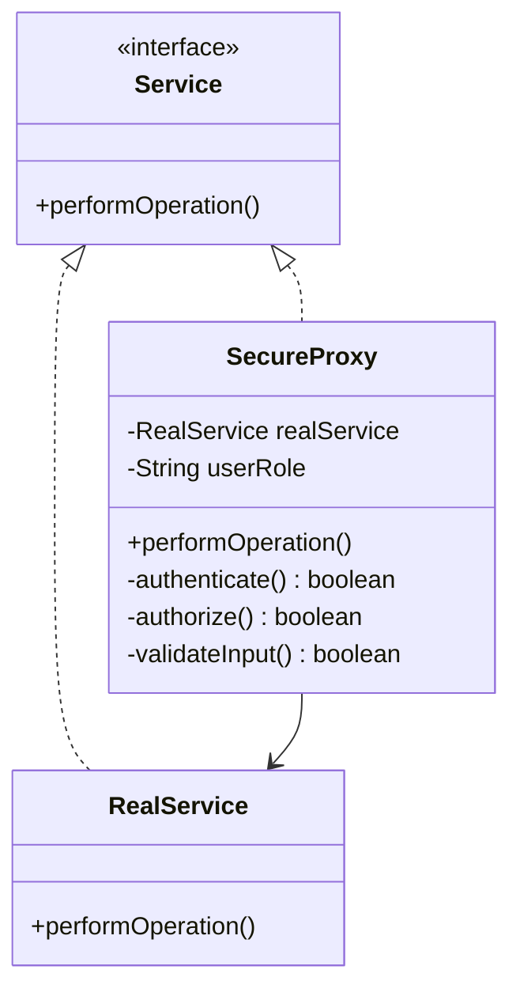

## 13.6.3 Secure Proxy Pattern

In the realm of software engineering, security is paramount. The Secure Proxy Pattern is a powerful design pattern that acts as a gatekeeper to control access to sensitive resources. By incorporating security checks, it ensures that only authorized requests are processed, thereby enhancing the overall security of the application. In this section, we will explore how the Proxy pattern can be leveraged to bolster security, provide examples of implementing security proxies, and discuss the benefits and considerations of centralizing security logic in proxies.

### Understanding the Proxy Pattern

The Proxy Pattern is a structural design pattern that provides a surrogate or placeholder for another object to control access to it. The proxy object acts as an intermediary between the client and the real object, allowing for additional functionality such as access control, logging, or lazy initialization.

#### Key Components of the Proxy Pattern

1. **Subject Interface**: This defines the common interface for both the RealSubject and the Proxy, allowing the Proxy to be used wherever the RealSubject is expected.

2. **RealSubject**: This is the actual object that the Proxy represents. It contains the core functionality that the client wants to access.

3. **Proxy**: This acts as an intermediary, controlling access to the RealSubject. It can perform additional operations such as access control, logging, or caching.

### Enhancing Security with the Secure Proxy Pattern

The Secure Proxy Pattern extends the basic Proxy Pattern by incorporating security checks. It acts as a gatekeeper, ensuring that only authorized requests are processed. This is achieved by implementing authentication, authorization, and input validation within the proxy.

#### Authentication

Authentication is the process of verifying the identity of a user or system. In the context of the Secure Proxy Pattern, the proxy can authenticate requests before forwarding them to the RealSubject.

```java
public interface Service {
    void performOperation();
}

public class RealService implements Service {
    @Override
    public void performOperation() {
        System.out.println("Performing operation in RealService");
    }
}

public class SecureProxy implements Service {
    private RealService realService;
    private String userRole;

    public SecureProxy(String userRole) {
        this.realService = new RealService();
        this.userRole = userRole;
    }

    @Override
    public void performOperation() {
        if (authenticate()) {
            realService.performOperation();
        } else {
            System.out.println("Authentication failed. Access denied.");
        }
    }

    private boolean authenticate() {
        // Simulate authentication logic
        return "ADMIN".equals(userRole);
    }
}
```

In this example, the `SecureProxy` checks the user's role before allowing access to the `RealService`. Only users with the "ADMIN" role are authenticated.

#### Authorization

Authorization determines whether an authenticated user has permission to perform a specific action. The Secure Proxy Pattern can enforce authorization policies by checking user permissions before forwarding requests.

```java
public class SecureProxy implements Service {
    private RealService realService;
    private String userRole;

    public SecureProxy(String userRole) {
        this.realService = new RealService();
        this.userRole = userRole;
    }

    @Override
    public void performOperation() {
        if (authenticate() && authorize()) {
            realService.performOperation();
        } else {
            System.out.println("Authorization failed. Access denied.");
        }
    }

    private boolean authenticate() {
        return "USER".equals(userRole) || "ADMIN".equals(userRole);
    }

    private boolean authorize() {
        return "ADMIN".equals(userRole);
    }
}
```

Here, the `SecureProxy` first authenticates the user and then checks if the user has the "ADMIN" role to authorize the operation.

#### Input Validation

Input validation is crucial for preventing security vulnerabilities such as SQL injection or cross-site scripting (XSS). The Secure Proxy Pattern can validate input data before forwarding requests to the RealSubject.

```java
public class SecureProxy implements Service {
    private RealService realService;
    private String userRole;

    public SecureProxy(String userRole) {
        this.realService = new RealService();
        this.userRole = userRole;
    }

    @Override
    public void performOperation() {
        if (authenticate() && authorize() && validateInput()) {
            realService.performOperation();
        } else {
            System.out.println("Input validation failed. Access denied.");
        }
    }

    private boolean authenticate() {
        return "USER".equals(userRole) || "ADMIN".equals(userRole);
    }

    private boolean authorize() {
        return "ADMIN".equals(userRole);
    }

    private boolean validateInput() {
        // Simulate input validation logic
        return true; // Assume input is valid for demonstration
    }
}
```

In this example, the `SecureProxy` includes an additional `validateInput` method to ensure that input data meets certain criteria before proceeding.

### Benefits of Centralizing Security Logic in Proxies

Centralizing security logic in proxies offers several advantages:

1. **Separation of Concerns**: By encapsulating security checks within the proxy, the RealSubject remains focused on its core functionality, adhering to the Single Responsibility Principle.

2. **Reusability**: The security logic can be reused across multiple RealSubjects, reducing code duplication and improving maintainability.

3. **Consistency**: Centralized security logic ensures consistent enforcement of security policies across the application.

4. **Scalability**: As security requirements evolve, changes can be made in the proxy without affecting the RealSubject, making it easier to scale security measures.

### Considerations for Performance and Potential Bottlenecks

While the Secure Proxy Pattern enhances security, it is important to consider potential performance implications:

- **Overhead**: Security checks introduce additional processing overhead. It is crucial to optimize these checks to minimize latency.

- **Bottlenecks**: The proxy can become a bottleneck if it handles a large volume of requests. Implementing caching or load balancing strategies can help mitigate this issue.

- **Complexity**: Centralizing security logic can increase complexity. It is important to maintain clear documentation and modularize the proxy to manage complexity effectively.

### Visualizing the Secure Proxy Pattern

Let's visualize the Secure Proxy Pattern using a class diagram to better understand the relationships between components.



**Diagram Description**: This class diagram illustrates the Secure Proxy Pattern. The `Service` interface is implemented by both `RealService` and `SecureProxy`. The `SecureProxy` contains a reference to `RealService` and includes methods for authentication, authorization, and input validation.

### Try It Yourself

To deepen your understanding of the Secure Proxy Pattern, try modifying the code examples provided:

- **Experiment with Different Roles**: Add more user roles and corresponding authorization logic to see how the proxy handles different scenarios.
- **Enhance Input Validation**: Implement more complex input validation logic to simulate real-world use cases.
- **Measure Performance**: Use Java's `System.nanoTime()` to measure the performance impact of security checks in the proxy.

### References and Links

For further reading on the Proxy Pattern and its applications, consider the following resources:

- [Oracle Java Documentation](https://docs.oracle.com/javase/tutorial/)
- [Design Patterns: Elements of Reusable Object-Oriented Software](https://en.wikipedia.org/wiki/Design_Patterns) by Erich Gamma, Richard Helm, Ralph Johnson, and John Vlissides
- [Effective Java](https://www.oreilly.com/library/view/effective-java/9780134686097/) by Joshua Bloch

### Knowledge Check

Before we conclude, let's reinforce the key concepts covered in this section:

- **What is the primary role of the Secure Proxy Pattern?**
- **How does the Secure Proxy Pattern enhance security?**
- **What are the benefits of centralizing security logic in proxies?**

### Embrace the Journey

Remember, mastering design patterns is a journey. As you continue to explore and implement these patterns, you'll gain a deeper understanding of their nuances and applications. Keep experimenting, stay curious, and enjoy the journey!

## Quiz Time!



### What is the primary role of the Secure Proxy Pattern?

- [x] To control access to sensitive resources by acting as a gatekeeper.
- [ ] To improve the performance of resource access.
- [ ] To simplify the interface of a complex subsystem.
- [ ] To provide a default behavior when a real object is not available.

> **Explanation:** The Secure Proxy Pattern acts as a gatekeeper to control access to sensitive resources, ensuring that only authorized requests are processed.

### Which of the following is NOT a component of the Proxy Pattern?

- [ ] Subject Interface
- [ ] RealSubject
- [x] Observer
- [ ] Proxy

> **Explanation:** The Observer is not a component of the Proxy Pattern. The Proxy Pattern consists of the Subject Interface, RealSubject, and Proxy.

### How does the Secure Proxy Pattern enhance security?

- [x] By incorporating authentication, authorization, and input validation.
- [ ] By caching frequently accessed resources.
- [ ] By logging all access requests.
- [ ] By encrypting data before transmission.

> **Explanation:** The Secure Proxy Pattern enhances security by incorporating authentication, authorization, and input validation to ensure only authorized requests are processed.

### What is a benefit of centralizing security logic in proxies?

- [x] Consistent enforcement of security policies across the application.
- [ ] Increased complexity in the RealSubject.
- [ ] Reduced performance due to additional checks.
- [ ] Duplication of security logic across multiple components.

> **Explanation:** Centralizing security logic in proxies ensures consistent enforcement of security policies across the application, improving maintainability and scalability.

### What potential issue should be considered when using the Secure Proxy Pattern?

- [x] Performance overhead due to security checks.
- [ ] Lack of separation of concerns.
- [ ] Difficulty in implementing caching strategies.
- [ ] Inability to handle multiple user roles.

> **Explanation:** The Secure Proxy Pattern can introduce performance overhead due to security checks, which should be optimized to minimize latency.

### Which method in the Secure Proxy Pattern is responsible for verifying user identity?

- [ ] authorize()
- [x] authenticate()
- [ ] validateInput()
- [ ] performOperation()

> **Explanation:** The `authenticate()` method is responsible for verifying the user's identity before allowing access to the RealSubject.

### What is the purpose of the `authorize()` method in the Secure Proxy Pattern?

- [x] To determine if the authenticated user has permission to perform a specific action.
- [ ] To verify the user's identity.
- [ ] To validate input data.
- [ ] To perform the core operation of the RealSubject.

> **Explanation:** The `authorize()` method determines if the authenticated user has permission to perform a specific action, enforcing authorization policies.

### How can the Secure Proxy Pattern help with scalability?

- [x] By allowing security measures to be scaled independently of the RealSubject.
- [ ] By reducing the number of user roles.
- [ ] By simplifying the interface of the RealSubject.
- [ ] By eliminating the need for input validation.

> **Explanation:** The Secure Proxy Pattern allows security measures to be scaled independently of the RealSubject, making it easier to adapt to evolving security requirements.

### What is a potential bottleneck when using the Secure Proxy Pattern?

- [x] The proxy can become a bottleneck if it handles a large volume of requests.
- [ ] The RealSubject can become overloaded with requests.
- [ ] The Subject Interface can become too complex.
- [ ] The Observer can slow down the system.

> **Explanation:** The proxy can become a bottleneck if it handles a large volume of requests, which can be mitigated by implementing caching or load balancing strategies.

### True or False: The Secure Proxy Pattern can be used to enforce input validation.

- [x] True
- [ ] False

> **Explanation:** True. The Secure Proxy Pattern can include input validation to ensure that data meets certain criteria before forwarding requests to the RealSubject.


