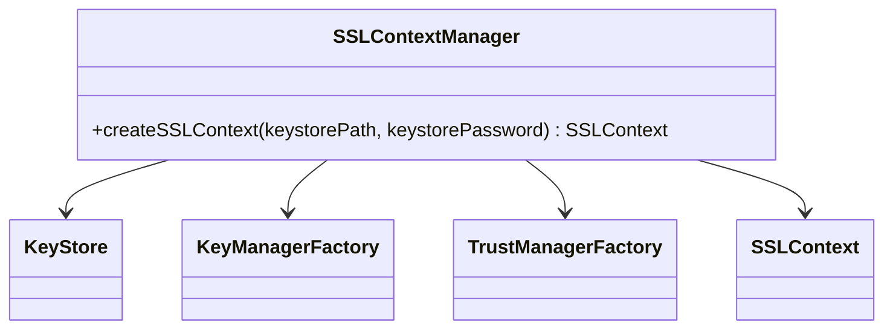
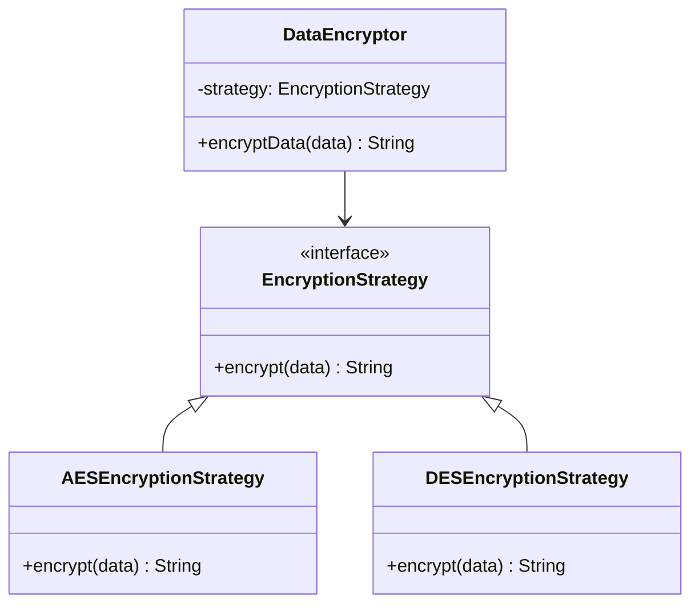

## 13.6.4 Use Cases and Examples

In the realm of software engineering, security design patterns play a pivotal role in safeguarding applications against a myriad of threats. This section delves into practical applications of these patterns, focusing on secure communications, data protection, and audit trails. We will explore real-world scenarios where these patterns are indispensable, providing code examples and explanations to illustrate their implementation.

### Secure Communication

Secure communication is paramount in today's digital landscape, where data breaches and cyber threats are prevalent. Implementing SSL/TLS for data transmission is a fundamental practice, and design patterns can help manage encryption keys and certificates effectively.

#### Implementing SSL/TLS for Data Transmission

SSL (Secure Sockets Layer) and TLS (Transport Layer Security) are protocols that provide a secure channel over an insecure network. They are essential for protecting data in transit, ensuring confidentiality, integrity, and authenticity.

**Key Management Pattern**

Managing encryption keys and certificates is crucial for maintaining secure communications. The Key Management pattern provides a structured approach to handle keys securely.

```java
import javax.net.ssl.*;
import java.security.KeyStore;
import java.io.FileInputStream;

public class SSLContextManager {

    public static SSLContext createSSLContext(String keystorePath, String keystorePassword) throws Exception {
        KeyStore keyStore = KeyStore.getInstance("JKS");
        try (FileInputStream keyStoreFile = new FileInputStream(keystorePath)) {
            keyStore.load(keyStoreFile, keystorePassword.toCharArray());
        }

        KeyManagerFactory keyManagerFactory = KeyManagerFactory.getInstance(KeyManagerFactory.getDefaultAlgorithm());
        keyManagerFactory.init(keyStore, keystorePassword.toCharArray());

        TrustManagerFactory trustManagerFactory = TrustManagerFactory.getInstance(TrustManagerFactory.getDefaultAlgorithm());
        trustManagerFactory.init(keyStore);

        SSLContext sslContext = SSLContext.getInstance("TLS");
        sslContext.init(keyManagerFactory.getKeyManagers(), trustManagerFactory.getTrustManagers(), null);

        return sslContext;
    }
}
```

**Explanation:**

- **KeyStore**: A repository for storing cryptographic keys and certificates.
- **KeyManagerFactory**: Manages the keys used for authentication.
- **TrustManagerFactory**: Manages the trust material that is used to verify the remote server's certificate.
- **SSLContext**: Represents the environment for secure socket communication.

**Try It Yourself**: Modify the `createSSLContext` method to load different types of keystores, such as PKCS12, and observe how it affects the SSL/TLS setup.

#### Addressing Security Threats

By using the Key Management pattern, we mitigate risks associated with key exposure and unauthorized access. This pattern ensures that keys are stored securely and accessed only by authorized components, reducing the likelihood of man-in-the-middle attacks.

### Data Protection

Data protection involves securing sensitive information both at rest and in transit. Encryption is a key strategy in achieving this, and design patterns can streamline the process.

#### Encrypting Sensitive Data

Encrypting data at rest and in transit is essential for protecting sensitive information from unauthorized access.

**Encryption Strategy Pattern**

The Encryption Strategy pattern allows for flexible encryption methods, enabling the selection of appropriate algorithms based on specific requirements.

```java
interface EncryptionStrategy {
    String encrypt(String data);
}

class AESEncryptionStrategy implements EncryptionStrategy {
    @Override
    public String encrypt(String data) {
        // Implement AES encryption logic
        return "AES Encrypted Data";
    }
}

class DESEncryptionStrategy implements EncryptionStrategy {
    @Override
    public String encrypt(String data) {
        // Implement DES encryption logic
        return "DES Encrypted Data";
    }
}

class DataEncryptor {
    private EncryptionStrategy strategy;

    public DataEncryptor(EncryptionStrategy strategy) {
        this.strategy = strategy;
    }

    public String encryptData(String data) {
        return strategy.encrypt(data);
    }
}

public class EncryptionDemo {
    public static void main(String[] args) {
        DataEncryptor aesEncryptor = new DataEncryptor(new AESEncryptionStrategy());
        System.out.println(aesEncryptor.encryptData("Sensitive Data"));

        DataEncryptor desEncryptor = new DataEncryptor(new DESEncryptionStrategy());
        System.out.println(desEncryptor.encryptData("Sensitive Data"));
    }
}
```

**Explanation:**

- **EncryptionStrategy**: An interface defining the contract for encryption algorithms.
- **AESEncryptionStrategy** and **DESEncryptionStrategy**: Concrete implementations of the encryption strategy.
- **DataEncryptor**: Context class that uses a strategy to encrypt data.

**Try It Yourself**: Implement additional encryption strategies, such as RSA, and test them with the `DataEncryptor` class.

#### Addressing Security Threats

The Encryption Strategy pattern allows for the selection of strong encryption algorithms, reducing the risk of data breaches. By abstracting the encryption logic, it also facilitates updates to encryption methods as new threats emerge.

### Audit Trails

Audit trails are critical for tracking access and actions within an application, providing a means to detect and respond to security incidents.

#### Ensuring Secure Logging

Secure logging involves capturing and storing logs in a manner that prevents tampering and unauthorized access.

**Audit Trail Pattern**

The Audit Trail pattern ensures that all access and actions are logged securely, providing a reliable record for auditing purposes.

```java
import java.util.logging.*;

public class AuditLogger {

    private static final Logger logger = Logger.getLogger(AuditLogger.class.getName());

    static {
        try {
            LogManager.getLogManager().readConfiguration(AuditLogger.class.getResourceAsStream("/logging.properties"));
        } catch (Exception e) {
            e.printStackTrace();
        }
    }

    public static void logAccess(String user, String action) {
        logger.info("User: " + user + ", Action: " + action);
    }
}

public class AuditDemo {
    public static void main(String[] args) {
        AuditLogger.logAccess("admin", "login");
        AuditLogger.logAccess("user1", "viewed report");
    }
}
```

**Explanation:**

- **Logger**: Used to log messages for auditing purposes.
- **LogManager**: Configures the logging framework based on a properties file.

**Try It Yourself**: Enhance the `AuditLogger` to include additional information, such as timestamps and IP addresses, in the log entries.

#### Addressing Security Threats

The Audit Trail pattern provides a mechanism for detecting unauthorized access and suspicious activities. By maintaining a comprehensive log of actions, it aids in forensic analysis and compliance with regulatory requirements.

### Staying Updated with Security Best Practices

Security is an ever-evolving field, and staying updated with best practices and standards is crucial for maintaining robust protection.

#### Continuous Learning and Adaptation

- **Monitor Security Bulletins**: Regularly review security bulletins and advisories from reputable sources, such as [NIST](https://www.nist.gov/) and [OWASP](https://owasp.org/).
- **Participate in Security Communities**: Engage with security communities and forums to stay informed about emerging threats and solutions.
- **Implement Security Updates**: Apply security updates and patches promptly to address vulnerabilities.

### Visualizing Security Design Patterns

To better understand the relationships and interactions within security design patterns, let's visualize the Key Management and Encryption Strategy patterns.



**Diagram Description**: This diagram illustrates the components involved in managing SSL/TLS contexts, highlighting the interactions between the `SSLContextManager`, `KeyStore`, `KeyManagerFactory`, `TrustManagerFactory`, and `SSLContext`.



**Diagram Description**: This diagram depicts the Encryption Strategy pattern, showing the relationship between the `EncryptionStrategy` interface, its concrete implementations (`AESEncryptionStrategy` and `DESEncryptionStrategy`), and the `DataEncryptor` class.

### Knowledge Check

- **Question**: How does the Key Management pattern help in secure communications?
- **Exercise**: Implement a new encryption strategy using a different algorithm and integrate it with the `DataEncryptor` class.

### Conclusion

Security design patterns are indispensable tools for safeguarding applications against threats. By implementing patterns for secure communication, data protection, and audit trails, we can enhance the security posture of our applications. Remember, security is an ongoing journey, and staying informed about best practices and emerging threats is crucial for maintaining robust defenses.

## Quiz Time!



### Which pattern is used to manage encryption keys and certificates in secure communication?

- [x] Key Management Pattern
- [ ] Encryption Strategy Pattern
- [ ] Audit Trail Pattern
- [ ] Singleton Pattern

> **Explanation:** The Key Management Pattern is specifically designed to handle encryption keys and certificates securely.

### What is the primary purpose of the Encryption Strategy pattern?

- [x] To allow flexible selection of encryption algorithms
- [ ] To manage encryption keys
- [ ] To log access and actions
- [ ] To create SSL/TLS contexts

> **Explanation:** The Encryption Strategy pattern enables the selection of different encryption algorithms based on specific requirements.

### Which Java class is used to configure the logging framework?

- [x] LogManager
- [ ] Logger
- [ ] SSLContext
- [ ] KeyStore

> **Explanation:** LogManager is responsible for configuring the logging framework in Java.

### What does the Audit Trail pattern help detect?

- [x] Unauthorized access and suspicious activities
- [ ] Encryption algorithm selection
- [ ] Key management issues
- [ ] SSL/TLS setup errors

> **Explanation:** The Audit Trail pattern provides a mechanism for detecting unauthorized access and suspicious activities through comprehensive logging.

### Which of the following is a benefit of using the Key Management pattern?

- [x] Reduces the likelihood of man-in-the-middle attacks
- [ ] Enhances logging capabilities
- [ ] Simplifies encryption algorithm selection
- [ ] Provides a unified interface for data encryption

> **Explanation:** The Key Management pattern helps secure encryption keys, reducing the risk of man-in-the-middle attacks.

### What should you regularly review to stay updated with security best practices?

- [x] Security bulletins and advisories
- [ ] Encryption algorithms
- [ ] Logging configurations
- [ ] SSL/TLS certificates

> **Explanation:** Regularly reviewing security bulletins and advisories helps stay informed about emerging threats and solutions.

### Which pattern is used to encapsulate different encryption methods?

- [x] Encryption Strategy Pattern
- [ ] Key Management Pattern
- [ ] Audit Trail Pattern
- [ ] Proxy Pattern

> **Explanation:** The Encryption Strategy Pattern encapsulates different encryption methods, allowing for flexible selection.

### What is the role of the `SSLContext` class in Java?

- [x] Represents the environment for secure socket communication
- [ ] Manages encryption keys
- [ ] Configures logging
- [ ] Provides a unified interface for data encryption

> **Explanation:** The `SSLContext` class represents the environment for secure socket communication in Java.

### How does the Audit Trail pattern aid in compliance?

- [x] By maintaining a comprehensive log of actions
- [ ] By selecting strong encryption algorithms
- [ ] By managing encryption keys securely
- [ ] By configuring SSL/TLS contexts

> **Explanation:** The Audit Trail pattern aids in compliance by maintaining a comprehensive log of actions, which is useful for audits and regulatory requirements.

### True or False: The Encryption Strategy pattern can be used to implement different encryption algorithms without changing the client code.

- [x] True
- [ ] False

> **Explanation:** True. The Encryption Strategy pattern allows for the implementation of different encryption algorithms without altering the client code, providing flexibility and ease of maintenance.


