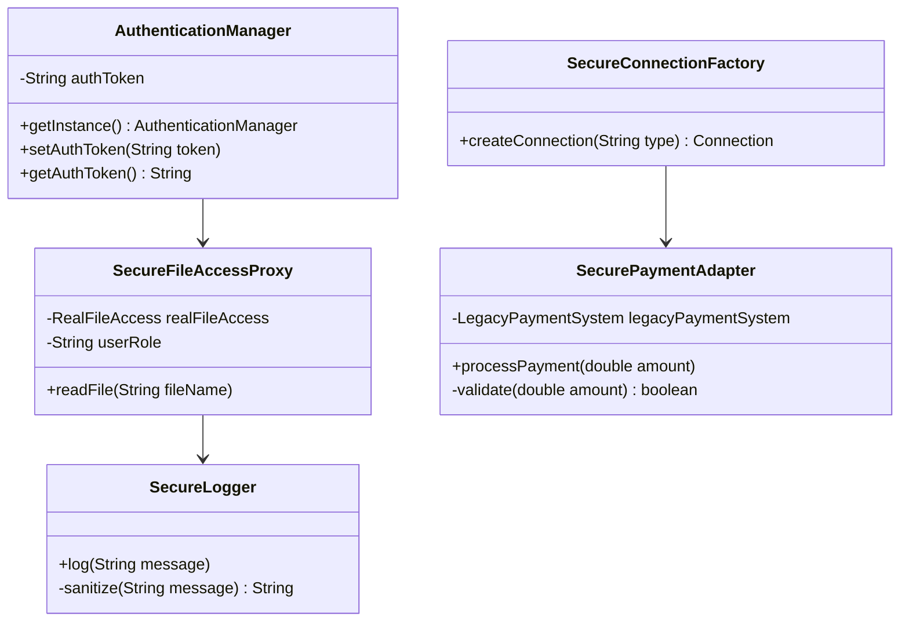

## 13.6 Security Design Patterns

In today's digital landscape, security is paramount. As software engineers, integrating security into the design phase is not just a best practice but a necessity. Security design patterns play a crucial role in promoting secure coding practices by providing reusable solutions to common security challenges. This section delves into the importance of security design patterns, common threats, and how these patterns can mitigate vulnerabilities.

### Importance of Security in Software Design

Security should be a foundational aspect of software design, not an afterthought. By incorporating security considerations early in the design phase, developers can prevent vulnerabilities that could be exploited by malicious actors. This proactive approach not only protects sensitive data but also enhances the overall robustness of the application.

### Role of Design Patterns in Secure Coding

Design patterns offer a structured approach to solving recurring design problems. When applied to security, these patterns help developers implement robust security measures consistently across applications. They provide a blueprint for addressing specific security concerns, such as authentication, authorization, and data protection, ensuring that security is an integral part of the software design process.

### Overview of Common Security Threats

Before exploring security design patterns, it's essential to understand the common threats that applications face:

- **Injection Attacks**: These occur when untrusted data is sent to an interpreter as part of a command or query, leading to unauthorized execution of commands.
- **Cross-Site Scripting (XSS)**: This involves injecting malicious scripts into web pages viewed by other users.
- **Cross-Site Request Forgery (CSRF)**: This attack tricks a user into executing unwanted actions on a different website where they are authenticated.
- **Data Breaches**: Unauthorized access to sensitive data, often due to poor encryption or inadequate access controls.
- **Denial of Service (DoS)**: Attacks that aim to make a service unavailable to its intended users.

Security design patterns can mitigate these threats by providing structured solutions that address specific vulnerabilities.

### Security Design Patterns Overview

Security design patterns are categorized based on the type of security concern they address. Let's explore some of the most common patterns and how they enhance application security.

#### 1. Authorization and Authentication Patterns

**Authentication** verifies the identity of a user, while **authorization** determines what an authenticated user is allowed to do. These patterns ensure that users are who they claim to be and have the appropriate permissions.

**Example: Secure Singleton for Authentication**

The Singleton pattern can be adapted to manage authentication tokens or sessions securely. By ensuring that only one instance of the authentication manager exists, we can centralize and control access to authentication data.

```java
public class AuthenticationManager {
    private static volatile AuthenticationManager instance;
    private String authToken;

    private AuthenticationManager() {
        // Private constructor to prevent instantiation
    }

    public static AuthenticationManager getInstance() {
        if (instance == null) {
            synchronized (AuthenticationManager.class) {
                if (instance == null) {
                    instance = new AuthenticationManager();
                }
            }
        }
        return instance;
    }

    public synchronized void setAuthToken(String token) {
        this.authToken = token;
    }

    public synchronized String getAuthToken() {
        return authToken;
    }
}
```

**Try It Yourself**: Modify the `AuthenticationManager` to include expiration logic for the authentication token, enhancing security by ensuring tokens are only valid for a limited time.

#### 2. Secure Proxy Pattern

The Proxy pattern can be used to control access to sensitive resources. By acting as an intermediary, the proxy can enforce access controls and logging, ensuring that only authorized users can perform certain actions.

```java
public interface FileAccess {
    void readFile(String fileName);
}

public class RealFileAccess implements FileAccess {
    @Override
    public void readFile(String fileName) {
        System.out.println("Reading file: " + fileName);
    }
}

public class SecureFileAccessProxy implements FileAccess {
    private RealFileAccess realFileAccess;
    private String userRole;

    public SecureFileAccessProxy(String userRole) {
        this.userRole = userRole;
        this.realFileAccess = new RealFileAccess();
    }

    @Override
    public void readFile(String fileName) {
        if ("ADMIN".equals(userRole)) {
            realFileAccess.readFile(fileName);
        } else {
            System.out.println("Access denied: insufficient permissions.");
        }
    }
}
```

**Try It Yourself**: Extend the `SecureFileAccessProxy` to include logging of access attempts, whether successful or denied.

#### 3. Secure Logger Pattern

Logging is crucial for security monitoring and auditing. However, it must be done securely to prevent sensitive information leakage. The Secure Logger pattern ensures that logs are sanitized and stored securely.

```java
public class SecureLogger {
    private static final Logger logger = Logger.getLogger(SecureLogger.class.getName());

    public static void log(String message) {
        // Sanitize message to prevent injection attacks
        String sanitizedMessage = sanitize(message);
        logger.info(sanitizedMessage);
    }

    private static String sanitize(String message) {
        // Implement sanitization logic
        return message.replaceAll("[^a-zA-Z0-9]", "");
    }
}
```

**Try It Yourself**: Implement additional sanitization rules to handle different types of input, ensuring comprehensive protection against injection attacks.

#### 4. Secure Factory Pattern

The Factory pattern can be adapted to create objects with security considerations in mind. By centralizing object creation, we can enforce security policies and ensure that objects are initialized securely.

```java
public class SecureConnectionFactory {
    public static Connection createConnection(String type) {
        if ("SECURE".equals(type)) {
            return new SecureConnection();
        } else {
            throw new IllegalArgumentException("Unsupported connection type");
        }
    }
}

class SecureConnection implements Connection {
    public SecureConnection() {
        // Initialize secure connection
    }
}
```

**Try It Yourself**: Extend the `SecureConnectionFactory` to support different security protocols, such as SSL/TLS, based on configuration.

#### 5. Secure Adapter Pattern

The Adapter pattern can be used to integrate legacy systems securely. By wrapping legacy components, we can add security features such as input validation and encryption.

```java
public interface SecurePayment {
    void processPayment(double amount);
}

public class LegacyPaymentSystem {
    public void makePayment(double amount) {
        System.out.println("Processing payment of: " + amount);
    }
}

public class SecurePaymentAdapter implements SecurePayment {
    private LegacyPaymentSystem legacyPaymentSystem;

    public SecurePaymentAdapter() {
        this.legacyPaymentSystem = new LegacyPaymentSystem();
    }

    @Override
    public void processPayment(double amount) {
        if (validate(amount)) {
            legacyPaymentSystem.makePayment(amount);
        } else {
            System.out.println("Invalid payment amount.");
        }
    }

    private boolean validate(double amount) {
        // Implement validation logic
        return amount > 0;
    }
}
```

**Try It Yourself**: Enhance the `SecurePaymentAdapter` to include encryption of payment details before processing.

### Holistic Approach to Security

Security design patterns are a vital tool in the developer's arsenal, but they are not a panacea. A holistic approach to security involves multiple layers of defense, including:

- **Regular Security Audits**: Conducting regular audits to identify and address vulnerabilities.
- **Secure Coding Practices**: Following best practices for secure coding, such as input validation and error handling.
- **Security Training**: Ensuring that all team members are trained in security awareness and best practices.
- **Incident Response Planning**: Preparing for potential security incidents with a well-defined response plan.

### Visualizing Security Design Patterns

To better understand how these patterns fit into a secure application architecture, let's visualize their interactions using a class diagram.



**Diagram Description**: This class diagram illustrates the relationships between various security design patterns. The `AuthenticationManager` interacts with the `SecureFileAccessProxy`, which logs access attempts using the `SecureLogger`. The `SecureConnectionFactory` creates secure connections, while the `SecurePaymentAdapter` integrates legacy payment systems securely.

### References and Further Reading

For more information on security design patterns and secure coding practices, consider exploring the following resources:

- [OWASP Foundation](https://owasp.org/): A non-profit organization focused on improving software security.
- [Java Secure Coding Guidelines](https://www.oracle.com/java/technologies/javase/seccodeguide.html): Official guidelines from Oracle for secure Java coding.
- [Design Patterns: Elements of Reusable Object-Oriented Software](https://www.amazon.com/Design-Patterns-Elements-Reusable-Object-Oriented/dp/0201633612): A foundational book on design patterns.

### Knowledge Check

To reinforce your understanding of security design patterns, try answering the following questions:

## Quiz Time!



### Which design pattern is used to control access to sensitive resources?

- [x] Proxy Pattern
- [ ] Singleton Pattern
- [ ] Factory Pattern
- [ ] Adapter Pattern

> **Explanation:** The Proxy Pattern acts as an intermediary to control access to sensitive resources.

### What is the primary purpose of the Secure Logger pattern?

- [x] To sanitize logs and prevent information leakage
- [ ] To enhance performance by caching logs
- [ ] To encrypt logs for storage
- [ ] To format logs for readability

> **Explanation:** The Secure Logger pattern focuses on sanitizing logs to prevent sensitive information leakage.

### How does the Secure Factory pattern enhance security?

- [x] By centralizing object creation and enforcing security policies
- [ ] By improving performance through caching
- [ ] By simplifying object creation
- [ ] By reducing memory usage

> **Explanation:** The Secure Factory pattern centralizes object creation, allowing for the enforcement of security policies.

### What does the Secure Adapter pattern primarily address?

- [x] Integration of legacy systems with added security features
- [ ] Creation of secure connections
- [ ] Logging of secure transactions
- [ ] Management of authentication tokens

> **Explanation:** The Secure Adapter pattern is used to integrate legacy systems securely, adding features like input validation and encryption.

### Which of the following is NOT a common security threat?

- [ ] Injection Attacks
- [ ] Cross-Site Scripting (XSS)
- [ ] Data Breaches
- [x] Singleton Pattern

> **Explanation:** The Singleton Pattern is a design pattern, not a security threat.

### What is a key benefit of using security design patterns?

- [x] They provide reusable solutions to common security challenges.
- [ ] They simplify code readability.
- [ ] They enhance application performance.
- [ ] They reduce the need for documentation.

> **Explanation:** Security design patterns offer reusable solutions to address common security challenges.

### Which pattern can be used to manage authentication tokens securely?

- [x] Singleton Pattern
- [ ] Proxy Pattern
- [ ] Factory Pattern
- [ ] Adapter Pattern

> **Explanation:** The Singleton Pattern can be adapted to manage authentication tokens securely by ensuring a single instance controls access.

### What is the role of the `SecurePaymentAdapter` in the provided example?

- [x] To validate and process payments securely
- [ ] To log payment transactions
- [ ] To create secure connections
- [ ] To manage authentication tokens

> **Explanation:** The `SecurePaymentAdapter` validates and processes payments securely, integrating with a legacy system.

### How can the `SecureFileAccessProxy` be enhanced?

- [x] By adding logging of access attempts
- [ ] By caching file reads
- [ ] By encrypting file contents
- [ ] By reducing file access time

> **Explanation:** Enhancing the `SecureFileAccessProxy` with logging can provide an audit trail of access attempts.

### True or False: Security design patterns alone are sufficient for application security.

- [ ] True
- [x] False

> **Explanation:** Security design patterns are a tool in a broader security strategy, which should include regular audits, secure coding practices, and incident response planning.



Remember, integrating security design patterns into your development process is just the beginning. As you continue to build and refine your applications, keep security at the forefront of your design considerations. Stay curious, keep learning, and embrace the journey towards creating secure, robust software solutions.
