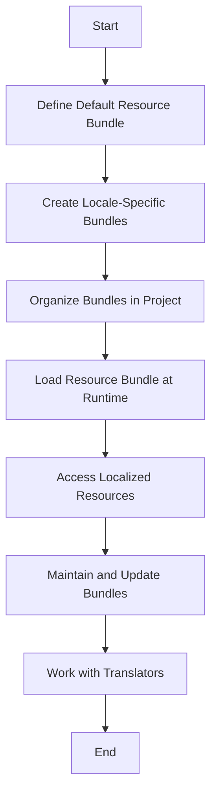

## 13.7.1 Resource Bundles

In today's globalized world, software applications need to cater to users from diverse linguistic and cultural backgrounds. Java provides a robust mechanism for internationalization (i18n) through resource bundles, which allow developers to manage localized resources like strings and messages efficiently. This section delves into the concept of resource bundles, their creation, organization, and usage in Java applications.

### Understanding Resource Bundles

Resource bundles in Java are a way to store locale-specific objects. They are used to separate the language-dependent parts of your application from the code, making it easier to adapt the application for different languages and regions. A resource bundle is essentially a set of key-value pairs, where keys are strings and values are the localized text or resources.

#### Key Concepts

- **Locale**: Represents a specific geographical, political, or cultural region. In Java, it's represented by the `Locale` class.
- **ResourceBundle**: An abstract class in Java used to load locale-specific resources.
- **Properties File**: A common format for resource bundles, using `.properties` files to store key-value pairs.

### Creating ResourceBundle Files

To create a resource bundle, you typically use properties files. Each file corresponds to a specific locale and contains key-value pairs for that locale.

#### Step-by-Step Guide

1. **Define the Default Resource Bundle**: Create a base properties file without locale suffixes. This file acts as the default resource bundle.
   
   Example: `Messages.properties`

   ```properties
   greeting=Hello
   farewell=Goodbye
   ```

2. **Create Locale-Specific Resource Bundles**: For each supported locale, create a properties file with the locale suffix.

   Example: `Messages_en_US.properties`

   ```properties
   greeting=Hello
   farewell=Goodbye
   ```

   Example: `Messages_fr_FR.properties`

   ```properties
   greeting=Bonjour
   farewell=Au revoir
   ```

3. **Organize Resource Bundles**: Store these files in a directory structure that reflects your application's package structure.

### Loading and Accessing Resources

Java provides the `ResourceBundle` class to load and access resources at runtime based on the user's locale.

#### Loading Resource Bundles

To load a resource bundle, use the `ResourceBundle.getBundle()` method, passing the base name of the bundle and the desired `Locale`.

```java
import java.util.Locale;
import java.util.ResourceBundle;

public class ResourceBundleExample {
    public static void main(String[] args) {
        Locale locale = new Locale("fr", "FR");
        ResourceBundle bundle = ResourceBundle.getBundle("Messages", locale);

        String greeting = bundle.getString("greeting");
        String farewell = bundle.getString("farewell");

        System.out.println(greeting); // Output: Bonjour
        System.out.println(farewell); // Output: Au revoir
    }
}
```

#### Accessing Resources

Once loaded, access the resources using the `getString()` method with the appropriate key. If a key is not found in the specified locale, Java falls back to the default resource bundle.

### Strategies for Maintaining and Updating Resource Bundles

Maintaining resource bundles is crucial for ensuring that your application remains up-to-date with language changes and new features.

#### Best Practices

1. **Consistent Key Naming**: Use a consistent naming convention for keys to make them easy to understand and manage.
2. **Centralized Management**: Keep all resource bundles in a central location within your project.
3. **Version Control**: Use version control systems to track changes to resource bundles.
4. **Automated Testing**: Implement tests to verify that all keys are present and correctly mapped in each locale.

#### Working with Translators

Collaborating with translators is essential for accurate localization. Here are some tips:

- **Provide Context**: Include comments in properties files to give translators context about where and how the text is used.
- **Use Translation Management Tools**: Tools like Crowdin or Transifex can streamline the translation process.
- **Regular Updates**: Schedule regular updates and reviews of translations to ensure accuracy.

### Tools and Practices for Resource Bundles

Several tools and practices can help manage and update resource bundles effectively:

- **IDE Support**: Many IDEs offer plugins for managing resource bundles, providing features like key validation and translation suggestions.
- **Continuous Integration**: Integrate resource bundle validation into your CI/CD pipeline to catch errors early.
- **Localization Frameworks**: Consider using frameworks like `gettext` or `Java ResourceBundle Editor` for advanced localization needs.

### Visualizing Resource Bundle Workflow

To better understand how resource bundles fit into the internationalization process, let's visualize the workflow:



This diagram illustrates the steps involved in creating, organizing, and using resource bundles in a Java application.

### Try It Yourself

Experiment with the following modifications to the code example:

- **Add a New Locale**: Create a `Messages_es_ES.properties` file for Spanish and update the code to load this locale.
- **Handle Missing Keys**: Modify the code to handle cases where a key is missing in the resource bundle.
- **Dynamic Locale Switching**: Implement a mechanism to switch locales at runtime based on user input.

### Knowledge Check

- **What is a resource bundle in Java?**
- **How do you create a locale-specific resource bundle?**
- **What method is used to load a resource bundle in Java?**
- **Why is it important to maintain resource bundles?**

### Embrace the Journey

Remember, mastering resource bundles is just one step in creating globally accessible applications. As you continue to explore internationalization, you'll discover more techniques and tools to enhance your applications' reach. Keep experimenting, stay curious, and enjoy the journey!

## Quiz Time!



### What is a resource bundle in Java?

- [x] A set of key-value pairs for managing localized resources.
- [ ] A Java class for handling network connections.
- [ ] A tool for compiling Java code.
- [ ] A method for optimizing performance.

> **Explanation:** A resource bundle is a set of key-value pairs used to manage localized resources in Java applications.

### How do you create a locale-specific resource bundle?

- [x] By creating a properties file with a locale suffix.
- [ ] By writing a Java class with localization methods.
- [ ] By using a database to store translations.
- [ ] By configuring a web server.

> **Explanation:** Locale-specific resource bundles are created by naming properties files with locale suffixes, such as `Messages_fr_FR.properties`.

### Which method is used to load a resource bundle in Java?

- [x] ResourceBundle.getBundle()
- [ ] Locale.getDefault()
- [ ] Properties.load()
- [ ] FileReader.read()

> **Explanation:** The `ResourceBundle.getBundle()` method is used to load a resource bundle for a specific locale.

### Why is it important to maintain resource bundles?

- [x] To ensure accurate and up-to-date translations.
- [ ] To improve application performance.
- [ ] To reduce memory usage.
- [ ] To enhance security.

> **Explanation:** Maintaining resource bundles ensures that translations are accurate and reflect any changes in the application.

### What is the fallback mechanism in resource bundles?

- [x] Using the default resource bundle if a key is missing in a specific locale.
- [ ] Loading resources from a database.
- [ ] Using hardcoded strings in the code.
- [ ] Ignoring missing keys and continuing execution.

> **Explanation:** If a key is missing in a specific locale, Java falls back to the default resource bundle.

### How can you provide context to translators in properties files?

- [x] By including comments in the properties files.
- [ ] By writing documentation in a separate file.
- [ ] By using a different file format.
- [ ] By translating the keys themselves.

> **Explanation:** Comments in properties files can provide translators with context about the usage of each key.

### What is a common tool for managing translations?

- [x] Crowdin
- [ ] GitHub
- [ ] Jenkins
- [ ] Docker

> **Explanation:** Crowdin is a popular tool for managing translations and collaborating with translators.

### What does the `Locale` class represent in Java?

- [x] A specific geographical, political, or cultural region.
- [ ] A Java package for handling files.
- [ ] A method for parsing strings.
- [ ] A tool for debugging applications.

> **Explanation:** The `Locale` class represents a specific geographical, political, or cultural region in Java.

### How can you handle missing keys in a resource bundle?

- [x] By providing default values or logging warnings.
- [ ] By terminating the application.
- [ ] By ignoring the issue.
- [ ] By using a different programming language.

> **Explanation:** Handling missing keys can involve providing default values or logging warnings to alert developers.

### True or False: Resource bundles can only store strings.

- [ ] True
- [x] False

> **Explanation:** Resource bundles can store various types of objects, not just strings.


