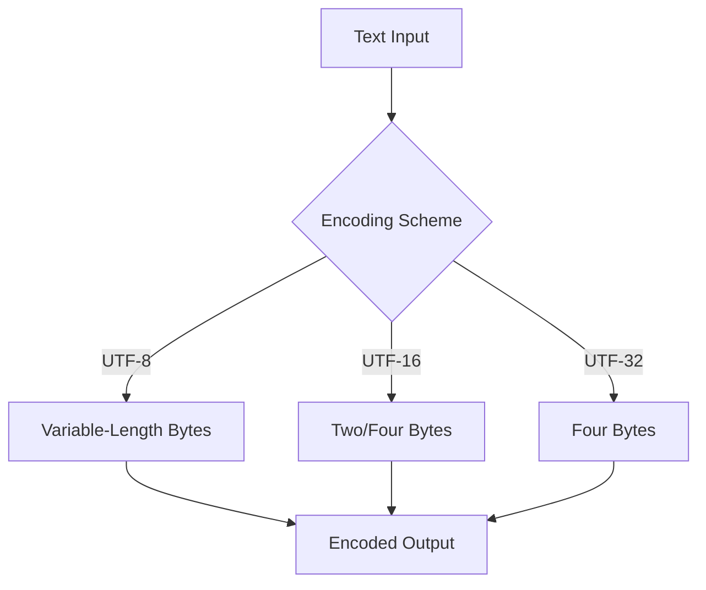

## 13.7.2 Unicode and Character Encoding

In today's globalized world, software applications must cater to a diverse audience, each with its own language and character set. This necessity brings us to the heart of internationalization: Unicode and character encoding. In this section, we will delve into the importance of Unicode, explore various character encoding schemes, and provide practical guidance on implementing these in Java applications.

### Understanding Unicode

Unicode is a universal character encoding standard that aims to provide a unique number for every character, regardless of platform, program, or language. It encompasses a vast range of characters, symbols, and scripts from around the world, making it the cornerstone of multilingual support in software development.

#### Why Unicode Matters

1. **Global Reach**: Unicode allows applications to support multiple languages and scripts, enhancing their accessibility and usability across different regions.
2. **Consistency**: By providing a unique code point for each character, Unicode ensures consistent representation and processing of text data.
3. **Interoperability**: Unicode facilitates data exchange between systems with different native character sets, reducing the risk of data corruption.

### Character Encoding Schemes

Character encoding is the process of converting characters into a sequence of bytes. Different encoding schemes define how these conversions are performed, impacting application compatibility and performance.

#### Common Encoding Schemes

1. **UTF-8**: A variable-length encoding system that uses one to four bytes per character. It is backward compatible with ASCII and is widely used on the web.
2. **UTF-16**: Uses two or four bytes per character. It is efficient for scripts with many characters, such as Chinese or Japanese.
3. **UTF-32**: A fixed-length encoding that uses four bytes per character, providing straightforward processing at the cost of increased storage requirements.

#### Choosing the Right Encoding

- **UTF-8** is ideal for applications that prioritize compatibility and storage efficiency, especially when dealing with predominantly ASCII text.
- **UTF-16** is suitable for applications that require efficient processing of non-Latin scripts.
- **UTF-32** is rarely used due to its high storage overhead but can be beneficial in scenarios where fixed-length encoding simplifies processing logic.

### Implementing Unicode in Java

Java provides robust support for Unicode through its `String` and `char` data types, which are inherently Unicode-compatible. Let's explore how to effectively handle Unicode in Java applications.

#### Using Unicode-Compatible Data Types

In Java, the `String` class is designed to store text as a sequence of Unicode characters. The `char` data type, however, represents a single 16-bit Unicode character, which can be limiting for characters outside the Basic Multilingual Plane (BMP). For such characters, Java uses surrogate pairs.

```java
// Example of using Unicode characters in Java
public class UnicodeExample {
    public static void main(String[] args) {
        String greeting = "こんにちは"; // Japanese for "Hello"
        char smiley = '\u263A'; // Unicode for a smiley face

        System.out.println(greeting);
        System.out.println("Smiley: " + smiley);
    }
}
```

#### Reading and Writing Text Files

To handle text files with the correct encoding, Java provides classes like `InputStreamReader` and `OutputStreamWriter`, which allow you to specify the desired character encoding.

```java
import java.io.*;

public class FileEncodingExample {
    public static void main(String[] args) {
        String filePath = "example.txt";
        String content = "Hello, 世界"; // "Hello, World" in Chinese

        // Writing to a file with UTF-8 encoding
        try (Writer writer = new OutputStreamWriter(new FileOutputStream(filePath), "UTF-8")) {
            writer.write(content);
        } catch (IOException e) {
            e.printStackTrace();
        }

        // Reading from a file with UTF-8 encoding
        try (BufferedReader reader = new BufferedReader(new InputStreamReader(new FileInputStream(filePath), "UTF-8"))) {
            String line;
            while ((line = reader.readLine()) != null) {
                System.out.println(line);
            }
        } catch (IOException e) {
            e.printStackTrace();
        }
    }
}
```

#### Handling Input/Output Streams

When working with input/output streams, it's crucial to ensure that the character encoding is correctly specified to prevent garbled text.

```java
import java.io.*;

public class StreamEncodingExample {
    public static void main(String[] args) {
        String data = "Bonjour, le monde!"; // "Hello, World!" in French

        // Writing data to a byte array with UTF-8 encoding
        try (ByteArrayOutputStream baos = new ByteArrayOutputStream();
             OutputStreamWriter osw = new OutputStreamWriter(baos, "UTF-8")) {
            osw.write(data);
            osw.flush();
            byte[] byteArray = baos.toByteArray();
            System.out.println("Byte array length: " + byteArray.length);
        } catch (IOException e) {
            e.printStackTrace();
        }
    }
}
```

### Common Issues and Solutions

#### Garbled Text Due to Encoding Mismatches

One of the most common issues developers face is garbled text, often resulting from mismatched encoding between the source and destination.

**Solution**: Always ensure that the encoding used for reading matches the encoding used for writing. Use tools like `file` command in Unix-based systems to check file encoding.

#### Surrogate Pair Handling

Characters outside the BMP require surrogate pairs, which can complicate string processing.

**Solution**: Use Java's `String` methods like `codePointAt` and `codePointCount` to handle surrogate pairs correctly.

```java
public class SurrogatePairExample {
    public static void main(String[] args) {
        String text = "𠜎"; // A character outside the BMP

        // Correctly handling surrogate pairs
        int codePoint = text.codePointAt(0);
        System.out.println("Code point: " + codePoint);
    }
}
```

### Try It Yourself

To deepen your understanding, try modifying the provided code examples:

- Change the character encoding in the file handling example and observe the results.
- Experiment with different Unicode characters and surrogate pairs.
- Implement a small application that reads user input in various languages and writes it to a file with the correct encoding.

### Visualizing Character Encoding

To better understand how character encoding works, let's visualize the process using a flowchart.



**Caption**: This flowchart illustrates how different encoding schemes convert text input into byte sequences.

### References and Links

- [Unicode Consortium](https://unicode.org/)
- [Java Internationalization Guide](https://docs.oracle.com/javase/tutorial/i18n/)
- [Character Encoding in Java](https://www.baeldung.com/java-char-encoding)

### Knowledge Check

- Explain the difference between UTF-8, UTF-16, and UTF-32.
- Describe how Java handles characters outside the BMP.
- What are surrogate pairs, and why are they necessary?

### Embrace the Journey

Remember, mastering Unicode and character encoding is crucial for developing applications that cater to a global audience. As you progress, you'll encounter more complex scenarios, but with the foundational knowledge gained here, you'll be well-equipped to tackle them. Keep experimenting, stay curious, and enjoy the journey!

## Quiz Time!



### What is the primary advantage of using Unicode in software applications?

- [x] It provides a unique number for every character, ensuring consistency across platforms.
- [ ] It reduces the size of text files.
- [ ] It simplifies the encoding process.
- [ ] It limits the number of characters an application can support.

> **Explanation:** Unicode provides a unique code point for every character, ensuring consistent representation across different platforms and languages.

### Which encoding scheme is most efficient for predominantly ASCII text?

- [x] UTF-8
- [ ] UTF-16
- [ ] UTF-32
- [ ] ASCII

> **Explanation:** UTF-8 is efficient for ASCII text because it uses a single byte for ASCII characters, making it both storage-efficient and backward compatible with ASCII.

### How does Java handle characters outside the Basic Multilingual Plane (BMP)?

- [x] By using surrogate pairs
- [ ] By converting them to ASCII
- [ ] By ignoring them
- [ ] By using UTF-32 encoding

> **Explanation:** Java uses surrogate pairs to represent characters outside the BMP, allowing it to handle a wider range of Unicode characters.

### What is a common cause of garbled text in applications?

- [x] Encoding mismatches between reading and writing operations
- [ ] Using too many Unicode characters
- [ ] Incorrect use of surrogate pairs
- [ ] Using UTF-32 encoding

> **Explanation:** Garbled text often results from mismatched encoding between the source and destination, leading to incorrect interpretation of byte sequences.

### Which Java class is used to specify character encoding when reading text files?

- [x] InputStreamReader
- [ ] FileReader
- [ ] BufferedReader
- [ ] Scanner

> **Explanation:** InputStreamReader allows you to specify the character encoding when reading text files, ensuring correct interpretation of the data.

### What is the main disadvantage of using UTF-32 encoding?

- [x] High storage overhead
- [ ] Incompatibility with ASCII
- [ ] Limited character support
- [ ] Complexity in processing

> **Explanation:** UTF-32 uses four bytes per character, resulting in high storage overhead compared to other encoding schemes.

### How can you check the encoding of a text file on Unix-based systems?

- [x] Using the `file` command
- [ ] Using the `ls` command
- [ ] Using the `cat` command
- [ ] Using the `grep` command

> **Explanation:** The `file` command in Unix-based systems can be used to check the encoding of a text file, helping to identify potential encoding mismatches.

### What method in Java can be used to handle surrogate pairs correctly?

- [x] codePointAt
- [ ] charAt
- [ ] length
- [ ] substring

> **Explanation:** The `codePointAt` method in Java can be used to correctly handle surrogate pairs, providing the Unicode code point of a character.

### True or False: UTF-8 is backward compatible with ASCII.

- [x] True
- [ ] False

> **Explanation:** UTF-8 is backward compatible with ASCII, as it uses a single byte for ASCII characters, ensuring seamless integration with existing ASCII text.

### Which of the following is NOT a benefit of using Unicode?

- [ ] Global reach
- [ ] Consistency
- [ ] Interoperability
- [x] Reduced file size

> **Explanation:** While Unicode provides global reach, consistency, and interoperability, it does not necessarily reduce file size, especially compared to ASCII.


