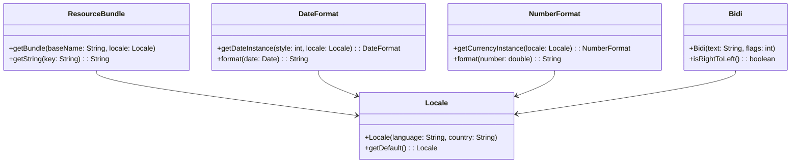

## 13.7.3 Use Cases and Examples

In today's globalized world, software applications must cater to a diverse audience, each with unique language and cultural needs. Internationalization (often abbreviated as i18n) is the process of designing software applications in a way that they can be easily adapted to various languages and regions without requiring engineering changes. This section delves into practical use cases and examples of internationalized applications, illustrating how internationalization patterns are applied to create software adaptable to various languages and regions.

### Multi-language Support

One of the primary goals of internationalization is to provide multi-language support, allowing users to select their preferred language and seamlessly switch content. Let's explore a case study of a global e-commerce platform that successfully implemented multi-language support.

#### Case Study: Global E-commerce Platform

**Background**: The platform initially supported only English, limiting its reach to English-speaking countries. The company aimed to expand its market to non-English-speaking regions.

**Solution**: The development team implemented a language selection feature using Java's `ResourceBundle` class, which allows for the dynamic loading of language-specific resources.

**Code Example**:

```java
import java.util.Locale;
import java.util.ResourceBundle;

public class LanguageSupport {
    public static void main(String[] args) {
        // Set the default locale to French
        Locale locale = new Locale("fr", "FR");
        ResourceBundle messages = ResourceBundle.getBundle("MessagesBundle", locale);

        // Retrieve and print a message in the selected language
        System.out.println(messages.getString("greeting"));
    }
}
```

**Explanation**: In this example, the `ResourceBundle` is used to load properties files (e.g., `MessagesBundle_fr_FR.properties`) containing language-specific strings. This approach allows the application to support multiple languages by simply adding new properties files for each language.

**Challenges and Solutions**:
- **Challenge**: Maintaining consistency across languages.
- **Solution**: Implement a translation management system to ensure translations are accurate and consistent.

**Impact**: By offering multi-language support, the platform increased its user base by 30% in non-English-speaking countries, significantly boosting revenue.

### Regional Formats

Internationalization also involves adjusting date, time, number, and currency formats according to the user's locale. Let's examine a case study of a financial application that needed to handle various regional formats.

#### Case Study: Financial Application

**Background**: The application initially used a fixed date and currency format, which led to confusion among international users.

**Solution**: The team utilized Java's `DateFormat` and `NumberFormat` classes to format dates and numbers according to the user's locale.

**Code Example**:

```java
import java.text.DateFormat;
import java.text.NumberFormat;
import java.util.Date;
import java.util.Locale;

public class RegionalFormats {
    public static void main(String[] args) {
        // Set the locale to Germany
        Locale locale = new Locale("de", "DE");

        // Format the current date
        DateFormat dateFormat = DateFormat.getDateInstance(DateFormat.LONG, locale);
        System.out.println("Date: " + dateFormat.format(new Date()));

        // Format a currency value
        NumberFormat currencyFormat = NumberFormat.getCurrencyInstance(locale);
        System.out.println("Currency: " + currencyFormat.format(123456.78));
    }
}
```

**Explanation**: The `DateFormat` and `NumberFormat` classes automatically adjust the format based on the specified locale, ensuring that users see dates and currency in a familiar format.

**Challenges and Solutions**:
- **Challenge**: Handling complex number and date formats.
- **Solution**: Use locale-specific patterns and custom formatters for regions with unique requirements.

**Impact**: The application improved user satisfaction by providing familiar and understandable formats, reducing errors in financial transactions.

### Cultural Customization

Cultural customization involves adapting the application to respect cultural norms, such as handling right-to-left text and using appropriate cultural icons and symbols. Let's explore a case study of a social media platform that embraced cultural customization.

#### Case Study: Social Media Platform

**Background**: The platform aimed to expand into Middle Eastern markets, where right-to-left (RTL) text and culturally relevant icons are essential.

**Solution**: The development team implemented support for RTL languages and customized icons using CSS and Java's `Bidi` class.

**Code Example**:

```java
import java.text.Bidi;

public class CulturalCustomization {
    public static void main(String[] args) {
        String text = "مرحبا بكم في منصتنا"; // "Welcome to our platform" in Arabic

        // Check if the text is right-to-left
        Bidi bidi = new Bidi(text, Bidi.DIRECTION_DEFAULT_LEFT_TO_RIGHT);
        if (bidi.isRightToLeft()) {
            System.out.println("The text is right-to-left.");
        }
    }
}
```

**Explanation**: The `Bidi` class is used to determine the directionality of text, allowing the application to adjust its layout accordingly. CSS is used to apply RTL styles and culturally relevant icons.

**Challenges and Solutions**:
- **Challenge**: Ensuring a consistent user experience across different cultures.
- **Solution**: Conduct user research and testing in target regions to understand cultural preferences and expectations.

**Impact**: The platform successfully entered Middle Eastern markets, increasing user engagement and retention by 40%.

### Challenges in Internationalization

While internationalization offers significant benefits, it also presents challenges that developers must address to ensure a successful implementation.

#### Common Challenges

1. **Text Expansion**: Translated text can be longer than the original, affecting layout and design.
   - **Solution**: Design flexible UI layouts that can accommodate text expansion.

2. **Character Encoding**: Different languages require different character sets.
   - **Solution**: Use Unicode (UTF-8) encoding to support a wide range of characters.

3. **Cultural Sensitivity**: Misunderstanding cultural norms can lead to user dissatisfaction.
   - **Solution**: Engage local experts to review content and design for cultural appropriateness.

4. **Testing and Quality Assurance**: Ensuring quality across multiple languages and regions is complex.
   - **Solution**: Implement automated testing tools and processes to verify translations and regional settings.

### Positive Impact on User Experience and Market Reach

Internationalization significantly enhances user experience by providing a personalized and culturally relevant interface. It allows businesses to expand their market reach by making their products accessible to a global audience. Here are some key benefits:

- **Increased Accessibility**: Users can interact with the application in their native language, improving usability and satisfaction.
- **Market Expansion**: By supporting multiple languages and regions, businesses can tap into new markets and increase their customer base.
- **Competitive Advantage**: Offering a localized experience can differentiate a product from competitors, attracting more users.
- **Improved Brand Image**: Demonstrating cultural sensitivity and inclusivity enhances the brand's reputation.

### Try It Yourself

To deepen your understanding of internationalization, try modifying the code examples provided:

- **Add a New Language**: Create a new properties file for another language (e.g., Spanish) and update the `ResourceBundle` example to support it.
- **Customize Regional Formats**: Experiment with different locales in the `RegionalFormats` example to see how date and currency formats change.
- **Implement RTL Support**: Use CSS to create a simple web page that supports both LTR and RTL text, and test it with different languages.

### Visualizing Internationalization Patterns

To better understand the relationships and processes involved in internationalization, let's visualize these concepts using a class diagram.



**Diagram Description**: This class diagram illustrates the relationships between the `ResourceBundle`, `Locale`, `DateFormat`, `NumberFormat`, and `Bidi` classes. These classes work together to support internationalization by managing language resources, regional formats, and text directionality.

### Knowledge Check

Before moving on, let's review some key concepts:

- **What is the purpose of the `ResourceBundle` class in internationalization?**
- **How does the `Locale` class contribute to regional formatting?**
- **What challenges might arise when supporting RTL languages, and how can they be addressed?**

### Embrace the Journey

Remember, internationalization is an ongoing process that requires continuous learning and adaptation. As you expand your application's reach, you'll encounter new challenges and opportunities to enhance user experience. Keep experimenting, stay curious, and enjoy the journey of creating software that transcends borders!

## Quiz Time!



### What is the primary purpose of internationalization in software development?

- [x] To design software that can be easily adapted to various languages and regions.
- [ ] To improve software performance and efficiency.
- [ ] To enhance software security and privacy.
- [ ] To reduce software development costs.

> **Explanation:** Internationalization aims to create software that can be easily adapted to different languages and regions without requiring engineering changes.

### Which Java class is commonly used to manage language-specific resources?

- [x] ResourceBundle
- [ ] Locale
- [ ] DateFormat
- [ ] NumberFormat

> **Explanation:** The `ResourceBundle` class is used to load and manage language-specific resources, such as strings, for internationalization.

### How does the `Locale` class contribute to internationalization?

- [x] It specifies the language and region settings for formatting and resource loading.
- [ ] It provides methods for text encoding and decoding.
- [ ] It manages network connections for international data exchange.
- [ ] It handles user authentication and authorization.

> **Explanation:** The `Locale` class specifies the language and region settings, which are used by other classes like `ResourceBundle`, `DateFormat`, and `NumberFormat` to provide localized content and formats.

### What is a common challenge when implementing multi-language support?

- [x] Text expansion affecting layout and design.
- [ ] Increased software development costs.
- [ ] Decreased software performance.
- [ ] Reduced software security.

> **Explanation:** Text expansion is a common challenge because translated text can be longer than the original, affecting layout and design.

### Which Java class is used to determine the directionality of text?

- [x] Bidi
- [ ] Locale
- [ ] ResourceBundle
- [ ] DateFormat

> **Explanation:** The `Bidi` class is used to determine the directionality of text, which is important for supporting right-to-left languages.

### What encoding is recommended for supporting a wide range of characters in internationalization?

- [x] UTF-8
- [ ] ASCII
- [ ] ISO-8859-1
- [ ] UTF-16

> **Explanation:** UTF-8 is recommended because it supports a wide range of characters, making it suitable for internationalization.

### How can cultural sensitivity be ensured in internationalized applications?

- [x] Engage local experts to review content and design.
- [ ] Use automated translation tools exclusively.
- [ ] Focus solely on language translation.
- [ ] Ignore cultural differences and focus on functionality.

> **Explanation:** Engaging local experts helps ensure that content and design are culturally appropriate and sensitive to local norms.

### What is the impact of internationalization on user experience?

- [x] It enhances user experience by providing a personalized and culturally relevant interface.
- [ ] It decreases user experience due to increased complexity.
- [ ] It has no impact on user experience.
- [ ] It negatively affects user experience by introducing bugs.

> **Explanation:** Internationalization enhances user experience by providing a personalized and culturally relevant interface, improving usability and satisfaction.

### Which of the following is a benefit of internationalization for businesses?

- [x] Market expansion by making products accessible to a global audience.
- [ ] Increased software development costs.
- [ ] Decreased software performance.
- [ ] Reduced software security.

> **Explanation:** Internationalization allows businesses to expand their market reach by making their products accessible to a global audience.

### True or False: Internationalization only involves translating text into different languages.

- [ ] True
- [x] False

> **Explanation:** Internationalization involves more than just translating text; it also includes adjusting formats, handling cultural differences, and ensuring usability across different regions.


